# ZETA API v1.3.0

- [ZETA API v1.3.0](#zeta-api-v130)
  - [Dokumenten- und Versionsübersicht](#dokumenten--und-versionsübersicht)
    - [Zuordnung zu API- und Implementierungsversionen](#zuordnung-zu-api--und-implementierungsversionen)
    - [Docker-Image Referenzen](#docker-image-referenzen)
      - [ZETA Guard Images](#zeta-guard-images)
      - [Test Images](#test-images)
  - [1. Einführung](#1-einführung)
  - [2. Voraussetzungen \& Basiswissen (Trust Anchor, VSDM2)](#2-voraussetzungen--basiswissen-trust-anchor-vsdm2)
  - [3. Discovery und Konfiguration](#3-discovery-und-konfiguration)
    - [3.1 Ablauf](#31-ablauf)
    - [3.2 Endpunkt-Spezifikationen](#32-endpunkt-spezifikationen)
      - [3.2.1 GET /.well-known/oauth-protected-resource](#321-get-well-knownoauth-protected-resource)
      - [3.2.2 GET /.well-known/oauth-authorization-server](#322-get-well-knownoauth-authorization-server)
  - [4. Stationäre Clients (Windows, Linux, macOS)](#4-stationäre-clients-windows-linux-macos)
    - [Quick Start: 5-Punkte-Checkliste für Entwickler](#quick-start-5-punkte-checkliste-für-entwickler)
    - [4.1 Windows oder Linux Clients mit TPM Attestation](#41-windows-oder-linux-clients-mit-tpm-attestation)
      - [4.1.1 Client Installation und Schlüsselgenerierung](#411-client-installation-und-schlüsselgenerierung)
      - [4.1.2 Client Start und Baseline-Aktualisierung](#412-client-start-und-baseline-aktualisierung)
      - [4.1.3 Vorbereitung der Client-Registrierung (Key Certification)](#413-vorbereitung-der-client-registrierung-key-certification)
      - [4.1.4 Dynamic Client Registration (DCR)](#414-dynamic-client-registration-dcr)
        - [4.1.4.1 Dynamic Client Registration Request](#4141-dynamic-client-registration-request)
        - [4.1.4.2 Dynamic Client Registration Response](#4142-dynamic-client-registration-response)
        - [4.1.4.3 Registration Verification Request](#4143-registration-verification-request)
        - [4.1.4.4 Registration Verification Response](#4144-registration-verification-response)
      - [4.1.5 Vorbereitung des Token Exchange (Client Assertion \& Subject Token)](#415-vorbereitung-des-token-exchange-client-assertion--subject-token)
      - [4.1.6 Token Exchange (POST /token)](#416-token-exchange-post-token)
        - [4.1.6.1 Token Exchange Request](#4161-token-exchange-request)
        - [4.1.6.2 Token Exchange Response](#4162-token-exchange-response)
    - [4.2 macOS Clients mit Apple App Attest Attestation](#42-macos-clients-mit-apple-app-attest-attestation)
      - [4.2.1 Client Installation und Schlüsselgenerierung](#421-client-installation-und-schlüsselgenerierung)
      - [4.2.2 Dynamic Client Registration (DCR)](#422-dynamic-client-registration-dcr)
        - [4.2.2.1 Dynamic Client Registration Request](#4221-dynamic-client-registration-request)
        - [4.2.2.2 Dynamic Client Registration Response](#4222-dynamic-client-registration-response)
      - [4.2.3 Vorbereitung des Token Exchange (Client Assertion \& Subject Token)](#423-vorbereitung-des-token-exchange-client-assertion--subject-token)
      - [4.2.4 Token Exchange (POST /token)](#424-token-exchange-post-token)
    - [4.3 Stationäre Clients mit rein Software-basierter Attestation](#43-stationäre-clients-mit-rein-software-basierter-attestation)
      - [4.3.1 Client Installation und Schlüsselgenerierung](#431-client-installation-und-schlüsselgenerierung)
      - [4.3.2 Dynamic Client Registration (DCR)](#432-dynamic-client-registration-dcr)
        - [4.3.2.1 Dynamic Client Registration Request](#4321-dynamic-client-registration-request)
        - [4.3.2.2 Dynamic Client Registration Response](#4322-dynamic-client-registration-response)
      - [4.3.3 Vorbereitung des Token Exchange (Client Assertion \& Subject Token)](#433-vorbereitung-des-token-exchange-client-assertion--subject-token)
      - [4.3.4 Token Exchange (POST /token)](#434-token-exchange-post-token)
  - [5. Mobile Clients (Android, iOS, iPadOS)](#5-mobile-clients-android-ios-ipados)
    - [Quick Start: 5-Punkte-Checkliste für Entwickler](#quick-start-5-punkte-checkliste-für-entwickler-1)
    - [5.1 iOS und iPadOS Clients mit Apple App Attest Attestation](#51-ios-und-ipados-clients-mit-apple-app-attest-attestation)
      - [5.1.1 Client Installation und Schlüsselgenerierung](#511-client-installation-und-schlüsselgenerierung)
      - [5.1.2 Dynamic Client Registration (DCR) mit TOFU](#512-dynamic-client-registration-dcr-mit-tofu)
        - [5.1.2.1 Dynamic Client Registration Request](#5121-dynamic-client-registration-request)
        - [5.1.2.2 Dynamic Client Registration Response (202 Accepted — OTP Trigger)](#5122-dynamic-client-registration-response-202-accepted--otp-trigger)
        - [5.1.2.3 Registration Verification Request (TOFU)](#5123-registration-verification-request-tofu)
        - [5.1.2.4 Registration Verification Response](#5124-registration-verification-response)
      - [5.1.3 Authentifizierung \& Autorisierung (OIDC Flow)](#513-authentifizierung--autorisierung-oidc-flow)
    - [5.2 Android Clients mit Android Key Attestation](#52-android-clients-mit-android-key-attestation)
      - [5.2.1 Client Installation und Schlüsselgenerierung](#521-client-installation-und-schlüsselgenerierung)
      - [5.2.2 Dynamic Client Registration (DCR) mit TOFU](#522-dynamic-client-registration-dcr-mit-tofu)
        - [5.2.2.1 Dynamic Client Registration Request](#5221-dynamic-client-registration-request)
        - [5.2.2.2 Dynamic Client Registration Response (202 Accepted — OTP Trigger)](#5222-dynamic-client-registration-response-202-accepted--otp-trigger)
        - [5.2.2.3 Registration Verification Request (TOFU)](#5223-registration-verification-request-tofu)
        - [5.2.2.4 Registration Verification Response](#5224-registration-verification-response)
      - [5.2.3 Authentifizierung \& Autorisierung (OIDC Flow)](#523-authentifizierung--autorisierung-oidc-flow)
    - [5.3 Mobile Clients mit Software Attestation](#53-mobile-clients-mit-software-attestation)
      - [5.3.1 Client Installation und Schlüsselgenerierung](#531-client-installation-und-schlüsselgenerierung)
      - [5.3.2 Dynamic Client Registration (DCR) mit TOFU](#532-dynamic-client-registration-dcr-mit-tofu)
        - [5.3.2.1 Dynamic Client Registration Request](#5321-dynamic-client-registration-request)
        - [5.3.2.2 Dynamic Client Registration Response (202 Accepted — OTP Trigger)](#5322-dynamic-client-registration-response-202-accepted--otp-trigger)
        - [5.3.2.3 Registration Verification Request (TOFU)](#5323-registration-verification-request-tofu)
        - [5.3.2.4 Registration Verification Response](#5324-registration-verification-response)
      - [5.3.3 Authentifizierung \& Autorisierung (OIDC Flow)](#533-authentifizierung--autorisierung-oidc-flow)
  - [6. Dienst-zu-Dienst Kommunikation (Backend-to-Backend)](#6-dienst-zu-dienst-kommunikation-backend-to-backend)
    - [6.1 POST /token (Client Credentials \& Token Exchange)](#61-post-token-client-credentials--token-exchange)
  - [7. Zugriff auf den Resource Server](#7-zugriff-auf-den-resource-server)
    - [7.1. Option A: Zugriff mit ZETA/ASL (Tunnelverschlüsselung)](#71-option-a-zugriff-mit-zetaasl-tunnelverschlüsselung)
    - [7.2. Option B: Direkter Zugriff ohne ZETA/ASL](#72-option-b-direkter-zugriff-ohne-zetaasl)
  - [8. Fehlerbehandlung und Statuscodes (Zentrales Nachschlagewerk)](#8-fehlerbehandlung-und-statuscodes-zentrales-nachschlagewerk)
    - [8.1 JSON Fehler-Schema](#81-json-fehler-schema)
    - [8.2 API Fehler-Tabelle \& Troubleshooting](#82-api-fehler-tabelle--troubleshooting)
  - [9. Schlüsselverwaltung](#9-schlüsselverwaltung)
    - [9.1 ZETA Client Schlüssel (Nutzer-Seite)](#91-zeta-client-schlüssel-nutzer-seite)
    - [9.2 gematik verwaltete Schlüssel (TI)](#92-gematik-verwaltete-schlüssel-ti)
  - [10. Versionierung, Performance \& Verhaltensregeln](#10-versionierung-performance--verhaltensregeln)
    - [10.1 Versionierung](#101-versionierung)
    - [10.2 Performance- und Lastannahmen](#102-performance--und-lastannahmen)
    - [10.3 Client-Verhaltensregeln](#103-client-verhaltensregeln)
  - [11. Support und Kontaktinformationen](#11-support-und-kontaktinformationen)


## Dokumenten- und Versionsübersicht

| Attribut                    | Wert                        |
|-----------------------------|-----------------------------|
| Dokumenttitel               | ZETA API v1.3.0             |
| Dokumentversion             | 1.3.0                       |
| Stand                       | 2026-05-27                  |
| Status                      | Final Draft                 |
| Verantwortlich              | gematik                     |
| Gültigkeitsbereich          | ZETA Guard API              |
| Spezifikationsgrundlage     | gemSpec_ZETA, Version 1.3.1 |

### Zuordnung zu API- und Implementierungsversionen

Dieses Dokument beschreibt die Schnittstellen und Abläufe der **ZETA API Version v1.3.0**. Die beschriebenen Inhalte beziehen sich auf die folgenden Implementierungsversionen:

| Komponente                     | Artefakt / Image                     | Version | Beschreibung                             |
|--------------------------------|--------------------------------------|---------|------------------------------------------|
| ZETA Guard (PEP)               | zeta-guard-pep                       | 1.3.0   | Policy Enforcement Point (HTTP Proxy)    |
| ZETA Guard (PDP)               | zeta-guard-pdp                       | 1.3.0   | Authorization Server / Policy Decision   |
| ZETA Client SDK                | zeta-sdk                             | 1.3.0   | Clientbibliothek zur Integration         |
| Helm Charts                    | zeta-helm-charts                     | 1.3.0   | Helm Charts                              |
| Terraform                      | zeta-guard-terraform                 | 0.3.0   | Terraform                                |
| Provisioning Processor         | zeta-guard-provisioning-processor    | 1.3.0   | Provisioning Processor                   |

---

### Docker-Image Referenzen

Die oben genannten Komponenten werden als OCI-konforme Container Images in der ZETA Artifact Registry bereitgestellt.  

Repository: [europe-west3-docker.pkg.dev/gematik-pt-zeta-prod/zeta-dcr](https://europe-west3-docker.pkg.dev/gematik-pt-zeta-prod/zeta-dcr)

#### ZETA Guard Images

- PEP (europe-west3-docker.pkg.dev/gematik-pt-zeta-prod/zeta-dcr/ngx_pep:1.3.0)
- PDP (europe-west3-docker.pkg.dev/gematik-pt-zeta-prod/zeta-dcr/keycloak-zeta:1.3.0)
- Provisioning Processor (europe-west3-docker.pkg.dev/gematik-pt-zeta-prod/zeta-dcr/provisioning-processor:1.3.0)
- Nginx Ingress (europe-west3-docker.pkg.dev/gematik-pt-zeta-prod/zeta-dcr/nginx-ingress:1.3.0)
- Nginx-Prometheus-Exporter (europe-west3-docker.pkg.dev/gematik-pt-zeta-prod/zeta-dcr/nginx-prometheus-exporter:1.5.1-zeta2)
- Open Policy Agent (europe-west3-docker.pkg.dev/gematik-pt-zeta-prod/zeta-dcr/opa:1.14.1-static)
- Postgres (europe-west3-docker.pkg.dev/gematik-pt-zeta-prod/zeta-dcr/postgres:17.9-standard-trixie)
- Telemetry Gateway (europe-west3-docker.pkg.dev/gematik-pt-zeta-prod/zeta-dcr/zeta-telemetry-gateway:v0.151.0-release.3)

#### Test Images

- Tiger-Testsuite (europe-west3-docker.pkg.dev/gematik-pt-zeta-prod/zeta-dcr/tiger-testsuite:1.3.0)
- Testfachdienst (europe-west3-docker.pkg.dev/gematik-pt-zeta-prod/zeta-dcr/testfachdienst:1.3.0)
- HSM Proxy Simulator (europe-west3-docker.pkg.dev/gematik-pt-zeta-prod/zeta-dcr/hsm_sim:1.3.0)
- Zeta-Tigerproxy (europe-west3-docker.pkg.dev/gematik-pt-zeta-prod/zeta-dcr/testproxy:1.3.0)
- Zeta TLS Test Tool (europe-west3-docker.pkg.dev/gematik-pt-zeta-prod/zeta-dcr/zeta-tls-test-tool-service:1.3.0)
- Cert Validation Mock (europe-west3-docker.pkg.dev/gematik-pt-zeta-prod/zeta-dcr/zeta-cert-validation-mock:1.3.0)
- PoPP Token Generator (europe-west3-docker.pkg.dev/gematik-pt-zeta-prod/zeta-dcr/popp-token-generator:1.3.0)

---

## 1. Einführung

Die ZETA API beschreibt die Interaktion eines ZETA-Clients mit der ZETA Guard-Infrastruktur. Dabei werden stationäre Clients (z. B. Arbeitsplatz- oder Serversysteme), mobile Clients (z. B. mobile Endgeräte mit iOS oder Android Betriebssystemen) sowie die direkte Dienst-zu-Dienst (Backend-to-Backend) Kommunikation abgedeckt.

Unabhängig von der jeweiligen Client-Plattform stellt die ZETA API Mechanismen bereit, um:

- Eine initiale Vertrauensbeziehung zwischen Client und ZETA-Infrastruktur aufzubauen (Trust Establishment via Dynamic Client Registration),
- Den Sicherheits- und Integritätszustand eines Clients kryptografisch zu bewerten (Attestation & Posture-Erhebung unter Verwendung von TPM 2.0, Apple App Attest, Android Key Attestation und Play integrity Token oder Software-Fallback),
- Den Zugriff auf ZETA-geschützte Dienste über Token-basierte Verfahren (OAuth 2.0 Token Exchange mit DPoP-Bindung und optionaler Verschlüsselung über den ZETA/ASL-Kanal) zu authentifizieren und zu autorisieren.

---

## 2. Voraussetzungen & Basiswissen (Trust Anchor, VSDM2)

Bevor ein ZETA-Client erfolgreich mit einem Resource Server kommunizieren kann, müssen folgende Voraussetzungen und informationelle Grundlagen erfüllt sein:

1. **FQDN des Resource Servers**: Der vollqualifizierte Domänenname (Fully Qualified Domain Name, FQDN) der geschützten Schnittstelle wird vom Client benötigt, um den initialen Discovery-Prozess zu starten.
2. **Trust Anchor Informationen (`roots.json`)**: Die Datei [roots.json](https://download.tsl.ti-dienste.de/ECC/ROOT-CA/roots.json) dient dem Client als lokaler Vertrauensanker, um die Vertrauenskette beim Aufbau einer ZETA/ASL-Verbindung zu validieren. Diese Datei muss wöchentlich aktualisiert werden.
3. **Konnektor und SMC-B**: Bei stationären Clients im Leistungserbringer-Umfeld wird zur Authentifizierung der Institution ein SMC-B-Institutionszertifikat sowie die Schnittstelle des Konnektors oder TI-Gateways benötigt.
4. **VSDM2 (Versichertenstammdatenmanagement 2.0)**: Für fachspezifische Anfragen an einen VSDM2-Resource-Server muss ein gültiges **PoPP-Token** (Proof of Patient Presence) im HTTP-Header `PoPP` an den ZETA-Client übergeben und an die PDP übermittelt werden.

---

## 3. Discovery und Konfiguration

In dieser Phase ermittelt der ZETA-Client dynamisch die Endpunkte und Konfigurationen der ZETA Guard-Infrastruktur (PEP HTTP Proxy und PDP Authorization Server).

### 3.1 Ablauf

Der Discovery-Ablauf ist für alle Client-Typen identisch und greift auf standardisierte `.well-known` Endpunkte zu (siehe auch [Abbildung 1: Ablauf Service Discovery](../../../images/zeta-flows/Abb-ZETA-Service-Discovery.svg)):

1. Der Client sendet eine `GET`-Anfrage an den Well-Known-Endpunkt der geschützten Ressource (PEP).
2. PEP antwortet mit Metadaten über unterstützte Token-Methoden und den zuständigen Authorization Server (PDP).
3. Der Client fragt die detaillierten Authorization Server Metadaten (PDP) ab, um Endpunkte für Registrierung, Token-Bezug und Nonce-Generierung zu erhalten.


### 3.2 Endpunkt-Spezifikationen

#### 3.2.1 GET /.well-known/oauth-protected-resource

Gibt die Konfigurationsdetails des PEP für eine geschützte Ressource zurück (gemäß RFC 9728).

**Anfrage-Beispiel:**
*Request-Schema:* *Keines (kein Request-Body)*

```http
GET /.well-known/oauth-protected-resource HTTP/1.1
Host: api.example.com
Accept: application/json
```

**Antwort-Beispiel (200 OK):**
*Response-Schema: [opr-well-known.yaml](../../../src/schemas/opr-well-known.yaml)*

```http
HTTP/1.1 200 OK
Content-Type: application/json
Cache-Control: public, max-age=86400
ETag: "w/37b12-abc12345"

{
  "resource": "https://api.example.com",
  "authorization_servers": [
    "https://auth.example.com"
  ],
  "scopes_supported": [
    "vsdservice.read",
    "vsdservice.write"
  ],
  "bearer_methods_supported": [
    "header"
  ],
  "dpop_signing_alg_values_supported": [
    "ES256"
  ],
  "dpop_bound_access_tokens_required": true,
  "zeta_asl_use": "required",
  "api_versions_supported": [
    {
      "major_version": 1,
      "version": "1.3.0",
      "status": "stable",
      "documentation_uri": "https://gematik.de/docs/api/v1.3"
    }
  ]
}
```

---

#### 3.2.2 GET /.well-known/oauth-authorization-server
Gibt Metadaten und unterstützte Endpunkte des PDP Authorization Servers zurück (gemäß RFC 8414).

**Anfrage-Beispiel:**
*Request-Schema:* *Keines (kein Request-Body)*

```http
GET /.well-known/oauth-authorization-server HTTP/1.1
Host: auth.example.com
Accept: application/json
```

**Antwort-Beispiel (200 OK):**
*Response-Schema: [as-well-known.yaml](../../../src/schemas/as-well-known.yaml)*

```http
HTTP/1.1 200 OK
Content-Type: application/json
Cache-Control: public, max-age=86400
ETag: "w/98d41-xyz98765"

{
  "issuer": "https://auth.example.com",
  "authorization_endpoint": "https://auth.example.com/auth",
  "token_endpoint": "https://auth.example.com/token",
  "registration_endpoint": "https://auth.example.com/register",
  "jwks_uri": "https://auth.example.com/certs",
  "grant_types_supported": [
    "urn:ietf:params:oauth:grant-type:token-exchange",
    "refresh_token",
    "authorization_code"
  ],
  "token_endpoint_auth_methods_supported": [
    "private_key_jwt"
  ],
  "token_endpoint_auth_signing_alg_values_supported": [
    "ES256"
  ],
  "code_challenge_methods_supported": [
    "S256"
  ],
  "api_versions_supported": [
    {
      "major_version": 1,
      "version": "1.3.0",
      "status": "stable",
      "documentation_uri": "https://gematik.de/docs/api/v1.3"
    }
  ]
}
```

---

## 4. Stationäre Clients (Windows, Linux, macOS)

### Quick Start: 5-Punkte-Checkliste für Entwickler

1. **[ ] Zertifikate laden**: Lokale TI-Vertrauensanker CA-Zertifikate (`roots.json`) einbinden und SMC-B-Institutionszertifikat auslesen.
2. **[ ] Keys generieren**: Hardwaregebundene Client Instance Keys (`PrK.Client.Sig` / `PuK.Client.Sig`) erzeugen (TPM 2.0 via ZAS oder Secure Enclave via Native API).
3. **[ ] DCR aufrufen**: Client am ZETA Guard registrieren (`POST /register` und Challenge-Handling bei TPM Attestation).
4. **[ ] Token abholen**: Mit DPoP-Proof und SMC-B Subject Token ein Access Token am `/token`-Endpunkt anfragen.
5. **[ ] RS anfragen**: DPoP-gebundenes Access Token im Authorization-Header mitsenden und die geschützte API des Resource Servers anfragen.

---

### 4.1 Windows oder Linux Clients mit TPM Attestation

Unter Windows und Linux basiert der Vertrauensaufbau auf dem Trusted Platform Module (TPM 2.0) und dem privilegierten Hintergrunddienst ZETA Attestation Service (ZAS).

Stationäre Clients etablieren eine hardwaregestützte Identität, um sich bei der ZETA Guard-Infrastruktur anzumelden. Unter Windows/Linux wird hierfür das TPM 2.0 mittels des ZETA Attestation Services (ZAS) angesprochen.
Die TPM Attestation ermöglicht es dem Client, seine hardwaregebundene Identität nachzuweisen und sich dadurch sicher bei der ZETA Guard-Infrastruktur zu registrieren. Hierzu nutzt der Client das Attestierungs-Schlüsselpaar (`PrK.AK.Sig` / `PuK.AK.Sig`) sowie das Client-Instanz-Schlüsselpaar (`PrK.Client.Sig` / `PuK.Client.Sig`). Beide Schlüsselpaare werden im TPM 2.0 erzeugt.

*Hinweis: eine Übersicht über die bei ZETA verwendeten Schlüssel ist in Kapitel [9. Schlüsselverwaltung](#9-schlüsselverwaltung) zu finden.*

#### 4.1.1 Client Installation und Schlüsselgenerierung

- *(01) Privilegierte ZAS-Installation:* Der ZAS wird mit administrativen Rechten (Root/Admin) installiert. Nur so kann er Messungen in TPM PCR-Register schreiben.
- *(02) Unprivilegierte Client-Installation:* Der ZETA Client wird im Benutzerkontext des Primärsystems installiert.
- *(03)–(04) IPC-Vertrauensbeziehung:* Zwischen ZAS (privilegiert) und ZETA Client (User Space) wird eine gegenseitig authentifizierte IPC-Verbindung aufgebaut, z. B. gesichert durch Prozess- und Code-Signatur-Prüfungen beider Seiten.
- *(05)–(06) Client Instance Key:* Das langlebige Signatur-Schlüsselpaar (`PrK.Client.Sig` / `PuK.Client.Sig`) wird über den OS- oder TPM-Provider erzeugt. Der öffentliche Schlüssel und das Handle werden dem Client übergeben.
- *(07) Systemmessung:* Der ZAS misst die unveränderlichen Teile des Primärsystems.
- *(08) Storage Root Key (SRK):* Im TPM wird ein SRK als lokaler Vertrauensanker erzeugt.
- *(09)–(12) Attestation Key (AK):* Ein hardwaregebundener Attestierungsschlüssel (`PrK.AK.Sig` / `PuK.AK.Sig`) wird im TPM erzeugt und geladen. Das AK-Handle wird an den ZETA Client übergeben.
- *(13) PCR-Erweiterung:* Die Messwerte der unveränderlichen Systemkomponenten werden in ein freies TPM PCR (z.B. PCR 23) geschrieben und bilden die initiale Baseline. Wenn kein freies PCR auf dem Gerät existiert, dann kann die TPM Attestation nicht durchgeführt werden. In diesem Fall muss die [Software basierte Attestation](#43-stationäre-clients-mit-rein-software-basierter-attestation) durchgeführt werden.

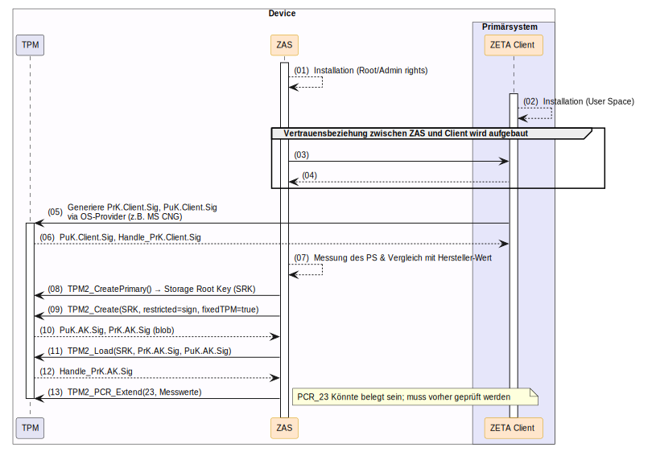

#### 4.1.2 Client Start und Baseline-Aktualisierung

Bei jedem Systemboot und jedem Start des Primärsystems führt der ZAS eine erneute Integritätsmessung durch:

- *(01) ZAS-Bootstart:* Der ZAS wird beim Booten als Systemdienst gestartet.
- *(02)–(03) Initiale Messung:* Der ZAS misst unveränderliche Systemteile und erweitert PCR 23.
- *(04)–(08) Client-Startmessung:* Sobald der ZAS den Start des Primärsystems erkennt, führt er eine zweite Messung durch und erweitert erneut PCR 23, um den aktuellen Systemzustand im TPM zu verankern.


#### 4.1.3 Vorbereitung der Client-Registrierung (Key Certification)

Vor der Registrierung beim ZETA Guard Authorization Server (AuthS) erbringt der Client im Zusammenspiel mit dem ZAS den Nachweis, dass sein Signaturschlüssel (`PuK.Client.Sig`) auf demselben physischen TPM-Chip existiert wie der Attestation Key (`AK`). Zusätzlich werden alle benötigten Daten für die Attestierung des Clients beim AuthS vorbereitet. Die Schritte im Detail:

- *(01)–(03) Client-Key laden:* Der ZETA Client übergibt das Schlüssel-Handle und den SHA-256-Hash von `PuK.Client.Sig` an den ZAS. Der ZAS lädt den Client-Schlüssel in das TPM.
- *(04)–(05) TPM2_Certify:* Das TPM führt eine `TPM2_Certify`-Operation durch: Es signiert mit `PrK.AK.Sig` kryptografisch, dass sich `PuK.Client.Sig` im selben TPM-Sicherheitschip befindet. Ergebnis sind `tpm2b_attest` (Zertifizierungsdaten) und `tpmt_signature` (Signatur).
- *(06)–(14) EK und AK auslesen:* Der ZAS liest den öffentlichen Endorsement Key (`PuK.EK.Enc`), den öffentlichen AK (`PuK.AK.Sig`) und das herstellerseitige EK-Zertifikat (`C.EK.Enc`) aus dem TPM und übergibt alle Daten an den ZETA Client.


#### 4.1.4 Dynamic Client Registration (DCR)

Die Dynamic Client Registration ermöglicht die Registrierung neuer Clients beim ZETA Guard AuthS. Die Registrierung verknüpft den Client Instance Key mit dem TPM Attestation Key (AK) und dem Endorsement Key (EK). Mit dem Client Instance Key wird die Client assertion signiert, mit der sich der Client am /token Endpoint des ZETA Guard authentifiziert.

- **Verwendete Endpunkt-Pfade (Windows/Linux):** `POST /register` und `POST /register/verify`
- *(01) POST /register:* Der ZETA Client sendet die Registrierungsanfrage gemäß Schema [dcr-request.yaml](../../../src/schemas/dcr-request.yaml) an den PDP AuthS. Der Body enthält `attestation_type: "tpm"`, `PuK.Client.Sig`, `PuK.AK.Sig`, `PuK.EK.Enc`, `C.EK.Enc` und `signed_hash_puk_client_sig`.
- *(02)–(03) MakeCredential:* Der AuthS validiert die EK-Zertifikatskette gegen die Hersteller-CA. Zur Verifikation des Schlüsselbesitzes generiert er ein verschlüsseltes `CredentialBlob` per `TPM2_MakeCredential` (verschlüsselt mit `PuK.EK.Enc`, gebunden an `PuK.AK.Sig`) und antwortet mit `202 Accepted {CredentialBlob}`.
- *(04)–(08) ActivateCredential:* Der ZETA Client leitet das `CredentialBlob` an den ZAS weiter. Der ZAS führt im TPM `TPM2_ActivateCredential` aus — dieser Befehl gelingt nur, wenn EK und AK im selben TPM vorhanden sind. Das entschlüsselte Secret wird an den Client zurückgegeben.
- *(09)–(10) POST /register/verify:* Der Client sendet das Secret an den AuthS. Der AuthS verifiziert das Secret und schließt die Registrierung ab: `201 Created {client_id}` mit Status `pending_attestation`.

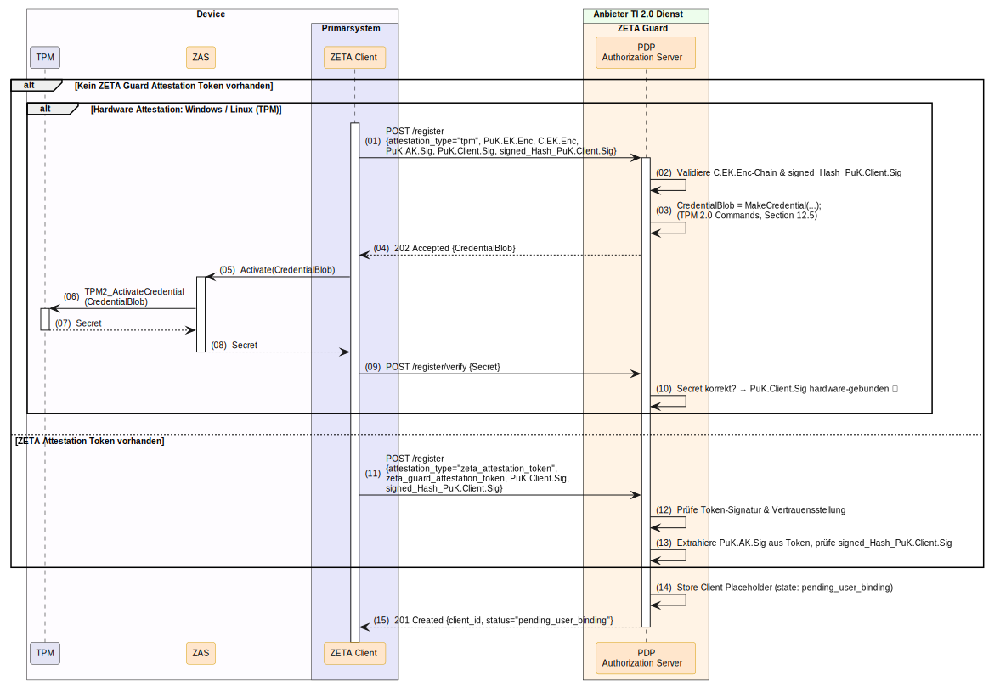

##### 4.1.4.1 Dynamic Client Registration Request

- **Pfad:** gemäß [OAuth-Authorization-Server Well-known](../../../src/schemas/as-well-known.yaml) Discovery (z. B. `/register`)
*Request-Schema:* [dcr-request.yaml](../../../src/schemas/dcr-request.yaml)

```http
POST /register HTTP/1.1
Host: auth.example.com
Content-Type: application/json
```

```json
{
  "attestation_type": "tpm",
  "client_name": "ZETA Secure Desktop Agent v1.2",
  "token_endpoint_auth_method": "private_key_jwt",
  "grant_types": [
    "authorization_code",
    "refresh_token"
  ],
  "jwks": {
    "keys": [
      {
        "kty": "EC",
        "crv": "P-256",
        "x": "usWxHK2PmfnHKwXPS54m0kTcGJ90UiglWiGahtagnv8",
        "y": "IBOL-C3BttVivg-lSreASfpEcgHQ4Bgv_9ZWeA-mBik",
        "use": "sig",
        "kid": "client-key-tpm-001"
      }
    ]
  },
  "puk_ek_enc": "AEIA...<hier Base64 kodierte TPM2B_PUBLIC Struktur des EK>...AABB",
  "c_ek_enc": "MIICzjCCAjagAwIBAgIGAXxP...<hier Base64 kodierte DER X.509 Zertifikat>...z3k=",
  "puk_ak_sig": "AE4A...<hier Base64 kodierte TPM2B_PUBLIC Struktur des AK>...ZZXX",
  "signed_hash_puk_client_sig": "MEQCIFz...<hier Base64url kodierte ECDSA Signatur>...A5Y_"
}
```

##### 4.1.4.2 Dynamic Client Registration Response

**Antwort-Beispiel (202 Accepted):**
*Response-Schema:* [dcr-response-202.yaml](../../../src/schemas/dcr-response-202.yaml)

```http
HTTP/1.1 202 Accepted
Content-Type: application/json
```

```json
{
  "transaction_id": "c2257dd9-835f-4f87-80c6-91b41851c4e2",
  "status": "pending_verification",
  "expires_in": 600,
  "challenge_type": "tpm_activation",
  "tpm_credential_blob": "MIIDEzCCAvugAwIBAgIGAXxPq...",
  "tpm_encrypted_secret": "AwEE..."
}
```

##### 4.1.4.3 Registration Verification Request

- **Pfad:** Der erste Teil des Pfades wird gemäß [OAuth-Authorization-Server Well-known](../../../src/schemas/as-well-known.yaml) Discovery ermittelt (z. B. `/register`). Der zweite Teil ist fest `/verify` (z. B. `/register/verify`).
*Request-Schema:* [verify-request.yaml](../../../src/schemas/verify-request.yaml)

```http
POST /register/verify HTTP/1.1
Host: auth.example.com
Content-Type: application/json
```

```json
{
  "transaction_id": "a43b2c19-1234-4e56-b789-0123456789ab",
  "verify_type": "tpm_activation",
  "tpm_decrypted_secret": "v2OZW+H/tF7W4u5S/Z8E9HlUaX9aC1gL5vXo4p3YQfI="
}
```

##### 4.1.4.4 Registration Verification Response

**Antwort-Beispiel (202 Accepted):**
*Response-Schema:* gemäß OIDC DCR Response

```http
HTTP/1.1 202 Accepted
Content-Type: application/json
```

```json
{
  "transaction_id": "c2257dd9-835f-4f87-80c6-91b41851c4e2",
  "status": "pending_verification",
  "expires_in": 600,
  "challenge_type": "tpm_activation",
  "tpm_credential_blob": "MIIDEzCCAvugAwIBAgIGAXxPq...",
  "tpm_encrypted_secret": "AwEE..."
}
```


#### 4.1.5 Vorbereitung des Token Exchange (Client Assertion & Subject Token)

Nach erfolgreicher Registrierung bereitet der Client die Authentifizierung am Token-Endpunkt vor. Hierbei werden drei wesentliche Artefakte erstellt: das **Subject Token** (signiert durch die SMC-B), die **Attestation Evidence** (TPM Quote) und die **Client Assertion** (signiert mit `PrK.Client.Sig`).

- *(01) Nonce abholen:* Der Client ruft `GET /nonce` am AuthS auf, um eine frische Nonce für Replay-Schutz zu erhalten.
- *(02) DPoP Key Pair:* Der Client generiert ein kurzlebiges DPoP-Schlüsselpaar (`PrK.DPoP.Sig` / `PuK.DPoP.Sig`) für die Token-Session.
- *(03) Subject Token erstellen:* Der Client erstellt das Subject Token (JWT) mit der eingebetteten Nonce. Dieses Token wird mit der SMC-B signiert.
- *(04)–(07) SMC-B Signatur:* Das Subject Token wird über den Konnektor/TI-Gateway an die SM(C)-B weitergeleitet und dort signiert.
- *(08)–(12) TPM Evidence:* Der Client fordert über den ZAS die Attestation Evidence an: `TPM2_Quote` über PCR [7, 23] mit der Nonce, signiert mit `PrK.AK.Sig`, sowie das zugehörige `TPM2_EventLog`.
- *(13) Client-Statement:* Der Client generiert das `client-statement` mit OS- und Primärsystem-Daten sowie der Evidence.
- *(14) Client Assertion:* Abschließend wird die Client Assertion als JWT erstellt und mit `PrK.Client.Sig` signiert.

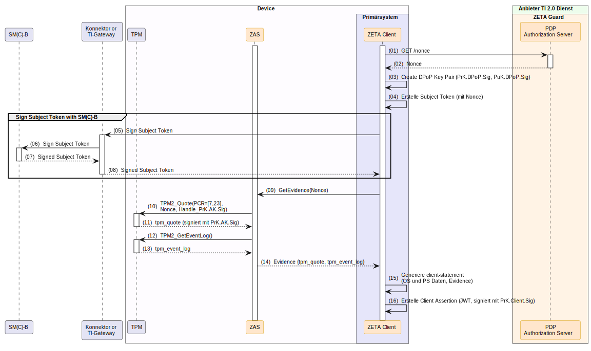

#### 4.1.6 Token Exchange (POST /token)

Der Token Exchange ist der zentrale Schritt zur Erlangung eines DPoP-gebundenen Access Tokens. Der Client sendet die vorbereiteten Artefakte an den `/token`-Endpunkt des Authorization Servers.

- *(01) DPoP Proof:* Der Client erstellt einen DPoP Proof mit der Nonce des AuthS.
- *(02) POST /token:* Der Client sendet die Anfrage mit `client_assertion` (JWT, signiert mit `PrK.Client.Sig`), `subject_token` (SMC-B signiert, inkl. Nonce) und `DPoP`-Header.
- *(03) Validierung:* Der AuthS validiert Client Assertion, DPoP Proof, Subject Token, Nonce, Key-Bindings aus der DCR und den Sperrstatus (OCSP) der SM(C)-B.
- *(04) TPM Attestation Prüfung:* Verifizierung der Hardware-Signatur (Quote) gegen die extrahierte Nonce mit PCR-Replay via Event Log.
- *(05) Policy Engine:* Bei erfolgreicher Validierung wird der Policy Engine Input erstellt und an die OPA Policy Engine übermittelt (`POST /v1/data/authz`).
- *(06) Token-Erstellung:* Bei positiver Policy Decision erstellt der AuthS Access Token, Refresh Token und (bei Hardware Attestation) das `zg_att_token`.

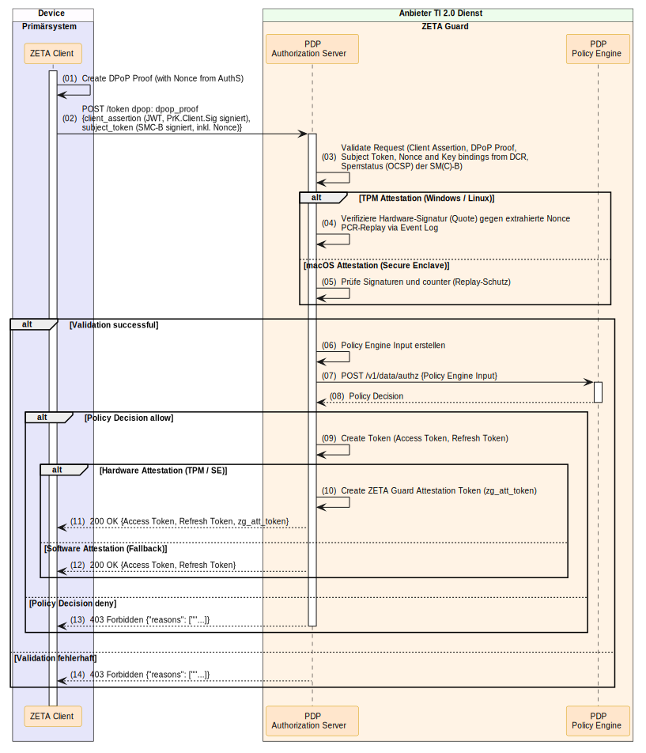

##### 4.1.6.1 Token Exchange Request

- **Pfad:** gemäß [OAuth-Authorization-Server Well-known](../../../src/schemas/as-well-known.yaml) Discovery (z. B. `/token`)

```http
POST /token HTTP/1.1
Host: auth.example.com
Content-Type: application/x-www-form-urlencoded
DPoP: eyJhbGciOiJFUzI1NiIsInR5cCI6ImRwb3Arand0IiwiandrIjp7Imt0eSI6IkVDIiwiY3J2IjoiUC0yNTYiLCJ4IjoiZDN...

grant_type=urn:ietf:params:oauth:grant-type:token-exchange
&subject_token=eyJhbGciOiJFUzI1NiIsInR5cCI6IkpXVCJ9.eyJpc3MiOiIxLTIzNDU2Nzg5MDEyMyIsInN1YiI6...
&subject_token_type=urn:ietf:params:oauth:token-type:jwt
&client_assertion_type=urn:ietf:params:oauth:client-assertion-type:jwt-bearer
&client_assertion=eyJhbGciOiJFUzI1NiIsInR5cCI6IkpXVCIsImtpZCI6ImNsaWVudC1rZXktdHBtLTAwMSJ9.eyJpc3MiOiJ6ZXRhLWNsaWVudC1kZXNrdG9wLTEiLCJzdWIiOiJ6ZXRhLWNsaWVudC1kZXNrdG9wLTEiLCJhdWQiOiJodHRwczovL2F1dGguZXhhbXBsZS5jb20vdG9rZW4iLCJjbGllbnRfc3RhdGVtZW50Ijp7fX0.signature
```

##### 4.1.6.2 Token Exchange Response

**Antwort-Beispiel (200 OK) — Hardware Attestation:**

```http
HTTP/1.1 200 OK
Content-Type: application/json

{
  "access_token": "eyJhbGciOiJFUzI1NiIsInR5cCI6ImF0K2p3dCIsImtpZCI6ImFzLXNpZ25pbmcta2V5LTEifQ...",
  "token_type": "DPoP",
  "expires_in": 3600,
  "refresh_token": "rt-desktop-8a7b6c5d4e3f2a1b",
  "zg_att_token": "eyJhbGciOiJFUzI1NiIsInR5cCI6IkpXVCJ9.eyJpc3MiOiJodHRwczovL2F1dGguZXhhbXBsZS5jb20iLCJhdHRfdHlwZSI6InRwbSJ9.signature"
}
```

**Antwort-Beispiel (403 Forbidden) — Policy Deny:**

```http
HTTP/1.1 403 Forbidden
Content-Type: application/json

{
  "error": "access_denied",
  "error_description": "Policy evaluation denied access",
  "reasons": ["pcr_mismatch", "baseline_outdated"]
}
```

---

### 4.2 macOS Clients mit Apple App Attest Attestation

Unter macOS basiert der Vertrauensaufbau auf der **Secure Enclave** und dem **Apple App Attest Framework** (DeviceCheck). Das ZETA Client Primärsystem nutzt native macOS-APIs, um hardwaregebundene Schlüssel zu erzeugen und kryptografische Nachweise über die Geräteintegrität zu liefern.

#### 4.2.1 Client Installation und Schlüsselgenerierung

- *(01) Installation:* Der ZETA Client wird im User Space installiert.
- *(02)–(04) Client Instance Key:* Das langlebige Signatur-Schlüsselpaar (`PrK.Client.Sig` / `PuK.Client.Sig`) wird über `SecKeyCreateRandomKey` in der Secure Enclave erzeugt. Der private Schlüssel verlässt die Hardware nie; der Client erhält eine Key-Referenz (`keyId`).
- *Fallback:* Ist keine Secure Enclave verfügbar (z. B. in virtualisierten Umgebungen), wird auf softwarebasierte Schlüsselgenerierung zurückgefallen (siehe [4.3 Software-basierte Attestation](#43-stationäre-clients-mit-rein-software-basierter-attestation)).


#### 4.2.2 Dynamic Client Registration (DCR)

Die Registrierung für macOS Clients nutzt das `Apple Attestation Object`, um die Bindung des Client-Schlüssels an die Secure Enclave nachzuweisen.

- **Verwendete Endpunkt-Pfade:** `POST /register`
- *(01) POST /register:* Der Client sendet die Registrierungsanfrage mit `attestation_type: "apple"`, `PuK.AK.Sig`, dem `Apple_Attestation_Object` (CBOR-kodiert), `PuK.Client.Sig` und `signed_Hash_PuK.Client.Sig`.
- *(02) Validierung:* Der AuthS verifiziert das Apple Attestation Object gegen die Apple App Attest Root CA und prüft, dass `PuK.AK.Sig` mit dem Blatt-Zertifikat (`x5c[0]`) des Objekts übereinstimmt.
- *(03) Alternativ — ZETA Attestation Token:* Liegt bereits ein gültiges `zg_att_token` aus einer früheren Attestierung vor, kann dieses anstelle des Apple Attestation Objects vorgelegt werden (Fast-Path).
- *(04) Registrierung:* Der AuthS speichert den Client mit Status `pending_user_binding` und antwortet mit `201 Created {client_id}`.

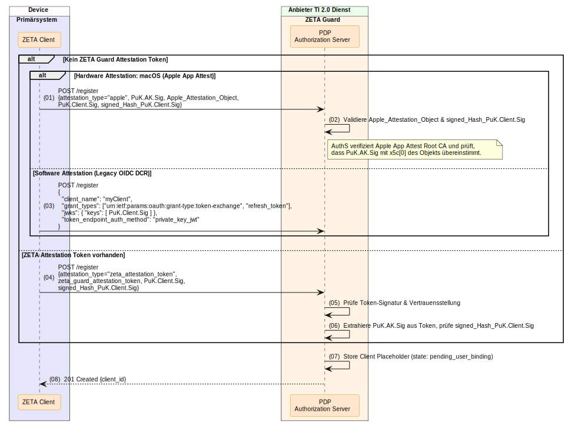

##### 4.2.2.1 Dynamic Client Registration Request

- **Pfad:** gemäß [OAuth-Authorization-Server Well-known](../../../src/schemas/as-well-known.yaml) Discovery (z. B. `/register`)
*Request-Schema:* [dcr-request.yaml](../../../src/schemas/dcr-request.yaml) (Variante: Apple Attestation)

```http
POST /register HTTP/1.1
Host: auth.example.com
Content-Type: application/json
```

```json
{
  "attestation_type": "apple",
  "client_name": "ZETA macOS Praxisclient v2.1",
  "token_endpoint_auth_method": "private_key_jwt",
  "grant_types": [
    "urn:ietf:params:oauth:grant-type:token-exchange",
    "refresh_token"
  ],
  "jwks": {
    "keys": [
      {
        "kty": "EC",
        "crv": "P-256",
        "x": "dGhpcyBpcyBhIHRlc3Qga2V5IGZvciBkb2N1bWVudGF0aW9u",
        "y": "ZXhhbXBsZSBwdWJsaWMga2V5IHkgY29vcmRpbmF0ZQ",
        "use": "sig",
        "kid": "client-key-se-001"
      }
    ]
  },
  "apple_attestation_object": "o2NmbXRxYXBwbGUtYXBwYXR0ZXN0Z2F0dFN0bXS...<Base64-kodiertes CBOR Attestation Object>...=="
}
```

##### 4.2.2.2 Dynamic Client Registration Response

**Antwort-Beispiel (201 Created):**

```http
HTTP/1.1 201 Created
Content-Type: application/json
```

```json
{
  "client_id": "zeta-client-macos-a1b2c3",
  "status": "pending_user_binding",
  "client_id_issued_at": 1748520000
}
```

#### 4.2.3 Vorbereitung des Token Exchange (Client Assertion & Subject Token)

Die Vorbereitung für macOS unterscheidet sich in der Evidence-Erhebung: Statt eines TPM Quotes wird eine **Apple App Attest Assertion** generiert.

- *(01) Nonce abholen:* Der Client ruft `GET /nonce` am AuthS auf.
- *(02) DPoP Key Pair:* Kurzlebiges DPoP-Schlüsselpaar generieren.
- *(03) Subject Token:* Erstellen und über den Konnektor/TI-Gateway mit der SM(C)-B signieren.
- *(04)–(07) SMC-B Signatur:* Wie bei Windows/Linux.
- *(08) Posture-Erhebung:* macOS-spezifische Posture-Daten ermitteln (SIP-Status, Gatekeeper, OS-Version, Secure Boot).
- *(09) clientDataHash:* Berechnung von `Hash(Nonce + Posture-Daten)`.
- *(10)–(12) App Attest Assertion:* Über `DCAppAttest.generateAssertion(keyId: Handle_PrK.AK.Sig, clientDataHash)` wird in der Secure Enclave eine Hardware-Signatur über den `clientDataHash` erstellt. Ergebnis ist die `dc_assertion` (CBOR: Signatur + authenticatorData mit Counter).
- *(13) Client-Statement:* Evidence = `dc_assertion` + Posture-Daten im Klartext.
- *(14) Client Assertion:* JWT signiert mit `PrK.Client.Sig`.

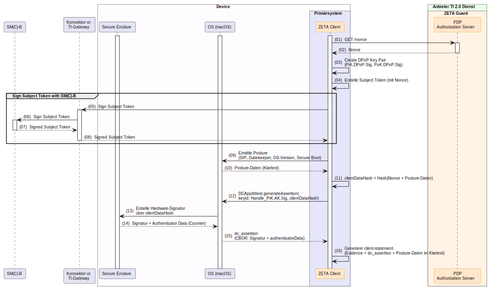

#### 4.2.4 Token Exchange (POST /token)

Der Token Exchange erfolgt analog zu Kapitel [4.1.6 Token Exchange](#416-token-exchange-post-token). Der AuthS unterscheidet anhand des Attestation-Typs die Validierungslogik:

- Bei **Apple Attestation** prüft der AuthS die Signaturen der `dc_assertion` und den Counter (Replay-Schutz) anstelle des TPM Quotes.
- Die Policy Engine Evaluation, Token-Erstellung und Response-Formate sind identisch.

Siehe [Abbildung 7: Token Exchange mit Attestation](#416-token-exchange-post-token) — der Ablauf ist für alle stationären Client-Typen einheitlich.

---

### 4.3 Stationäre Clients mit rein Software-basierter Attestation

Die rein software-basierte Attestation dient als **Fallback**, wenn kein TPM 2.0 (Windows/Linux) und keine Secure Enclave (macOS) verfügbar sind. In diesem Fall erfolgt die Registrierung ohne hardware-gebundenen Nachweis. Der AuthS gewährt entsprechend ein niedrigeres Vertrauensniveau.

#### 4.3.1 Client Installation und Schlüsselgenerierung

- *(01) Installation:* Der ZETA Client wird im User Space installiert.
- *(02) Client Instance Key:* Das Schlüsselpaar (`PrK.Client.Sig` / `PuK.Client.Sig`) wird rein softwarebasiert generiert (z. B. über die OS-Kryptobibliothek). Der private Schlüssel wird im Dateisystem oder Keychain gespeichert — eine Hardware-Bindung besteht nicht.

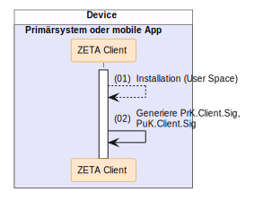

#### 4.3.2 Dynamic Client Registration (DCR)

Die Registrierung bei Software-basierter Attestation erfordert kein Challenge-Response-Verfahren und kein Attestation Object. Der Client übermittelt lediglich seinen öffentlichen Schlüssel.

- **Verwendete Endpunkt-Pfade:** `POST /register`
- *(01) POST /register:* Der Client sendet `client_name`, `grant_types`, `jwks` (mit `PuK.Client.Sig`) und `token_endpoint_auth_method`.
- *(02) Registrierung:* Der AuthS speichert den Client mit Status `pending_user_binding` und antwortet mit `201 Created {client_id}`.

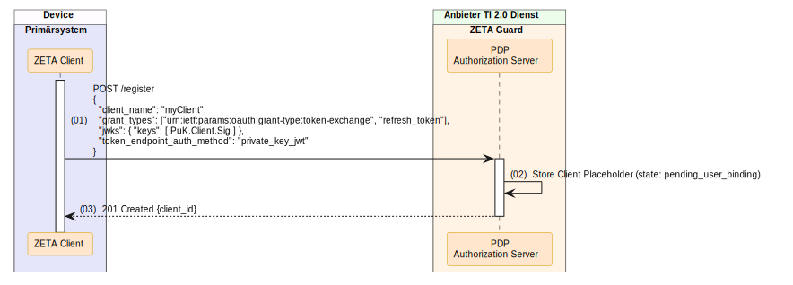

##### 4.3.2.1 Dynamic Client Registration Request

- **Pfad:** gemäß [OAuth-Authorization-Server Well-known](../../../src/schemas/as-well-known.yaml) Discovery (z. B. `/register`)
*Request-Schema:* [dcr-request.yaml](../../../src/schemas/dcr-request.yaml) (Variante: Legacy / Software Attestation)

```http
POST /register HTTP/1.1
Host: auth.example.com
Content-Type: application/json
```

```json
{
  "client_name": "ZETA Fallback Client v1.0",
  "token_endpoint_auth_method": "private_key_jwt",
  "grant_types": [
    "urn:ietf:params:oauth:grant-type:token-exchange",
    "refresh_token"
  ],
  "jwks": {
    "keys": [
      {
        "kty": "EC",
        "crv": "P-256",
        "x": "c29mdHdhcmUgYXR0ZXN0YXRpb24gZXhhbXBsZSBrZXk",
        "y": "ZmFsbGJhY2sgcHVibGljIGtleSB5IGNvb3JkaW5hdGU",
        "use": "sig",
        "kid": "client-key-sw-001"
      }
    ]
  }
}
```

##### 4.3.2.2 Dynamic Client Registration Response

**Antwort-Beispiel (201 Created):**

```http
HTTP/1.1 201 Created
Content-Type: application/json
```

```json
{
  "client_id": "zeta-client-sw-fallback-x9y8z7",
  "status": "pending_user_binding",
  "client_id_issued_at": 1748520000
}
```

#### 4.3.3 Vorbereitung des Token Exchange (Client Assertion & Subject Token)

Die Vorbereitung bei Software-basierter Attestation ist vereinfacht, da keine Hardware-Evidence erhoben wird.

- *(01) Nonce abholen:* Der Client ruft `GET /nonce` am AuthS auf.
- *(02) DPoP Key Pair:* Kurzlebiges DPoP-Schlüsselpaar generieren.
- *(03) Subject Token:* Erstellen und über den Konnektor/TI-Gateway mit der SM(C)-B signieren.
- *(04)–(07) SMC-B Signatur:* Wie bei Windows/Linux und macOS.
- *(08) Client-Statement:* Generierung mit OS- und Primärsystem-Daten (ohne kryptografische Evidence).
- *(09) Client Assertion:* JWT signiert mit `PrK.Client.Sig`.

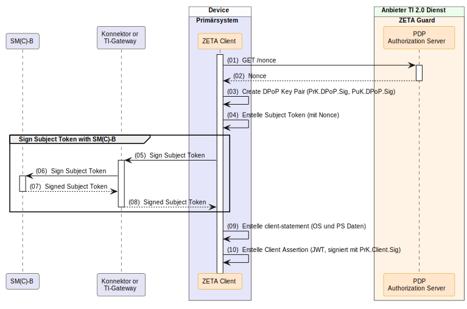

#### 4.3.4 Token Exchange (POST /token)

Der Token Exchange erfolgt analog zu Kapitel [4.1.6 Token Exchange](#416-token-exchange-post-token). Der AuthS erkennt am fehlenden Hardware-Nachweis den Attestation-Typ `software`:

- Es erfolgt **keine** Hardware-Signaturprüfung (kein TPM Quote, keine App Attest Assertion).
- Die Policy Engine wird mit entsprechend niedrigerem Vertrauensniveau aufgerufen.
- Bei positiver Policy Decision antwortet der AuthS mit Access Token und Refresh Token, jedoch **ohne** `zg_att_token`.

Siehe [Abbildung 7: Token Exchange mit Attestation](#416-token-exchange-post-token) — der Ablauf ist für alle stationären Client-Typen einheitlich (Pfad "Software Attestation (Fallback)").

---

## 5. Mobile Clients (Android, iOS, iPadOS)

### Quick Start: 5-Punkte-Checkliste für Entwickler
1. **[ ] Zertifikate laden**: Mobile OS-Vertrauensanker und optionale Client-Zertifikate initialisieren.
2. **[ ] Keys generieren**: Hardwarebasierten Client Instance Key (`PuK.Client.Sig`) im TEE / StrongBox (Android) bzw. in der Secure Enclave (iOS) erstellen.
3. **[ ] DCR aufrufen**: Registrierung absenden (`POST /register`) mit TOFU-OTP-Verifikation, um den Status `pending_attestation` zu erlangen.
4. **[ ] Nutzer authentifizieren**: Authentifizierung per OIDC Authorization Code Flow (wird in einer späteren Version dieses Dokuments ergänzt).
5. **[ ] RS anfragen**: DPoP-gebundenes Token im Header mitsenden und die Ziel-API `/api/resource` aufrufen.

---

### 5.1 iOS und iPadOS Clients mit Apple App Attest Attestation

iOS- und iPadOS-Clients nutzen die **Secure Enclave** und das **Apple App Attest Framework** zur hardwaregebundenen Schlüsselerzeugung und Attestierung. Die Registrierung wird durch ein interaktives **Trust-On-First-Use (TOFU)** OTP-Verfahren abgesichert.

#### 5.1.1 Client Installation und Schlüsselgenerierung

Die Schlüsselgenerierung unter iOS/iPadOS ist identisch mit macOS (siehe [4.2.1 Schlüsselgenerierung macOS](#421-client-installation-und-schlüsselgenerierung)) — das Apple DeviceCheck-Framework nutzt auf allen Apple-Plattformen dieselbe API (`SecKeyCreateRandomKey` für die Secure Enclave).


#### 5.1.2 Dynamic Client Registration (DCR) mit TOFU

Mobile Clients binden den Registrierungsprozess an eine interaktive Benutzeridentifizierung mittels **Trust-On-First-Use (TOFU)**. Der Nutzer bestätigt seine Identität durch Eingabe eines per E-Mail zugestellten OTP-Codes.

- *(01) POST /register:* Der Client sendet die Registrierungsanfrage mit `attestation_type: "apple"`, dem `Apple_Attestation_Object` und `PuK.Client.Sig`.
- *(02) Validierung:* Der AuthS verifiziert das Apple Attestation Object gegen die Apple App Attest Root CA und extrahiert `Hash(PuK.Client.Sig)` aus dem Objekt zum Abgleich mit dem Payload.
- *(03) OTP-Generierung:* Der AuthS generiert ein OTP und eine `transaction_id`, speichert den Request im temporären Cache und sendet den OTP-Bestätigungscode per E-Mail (Out-of-Band) an den Nutzer.
- *(04) 202 Accepted:* Der AuthS antwortet mit `{transaction_id, message="OTP sent"}` — zu diesem Zeitpunkt existiert noch keine `client_id`.
- *(05) OTP-Eingabe:* Der Nutzer gibt den OTP-Code in der App ein.
- *(06) POST /register/verify:* Der Client sendet `{transaction_id, code}` zur Verifikation.
- *(07) 201 Created:* Bei korrektem OTP wird die Registrierung abgeschlossen mit `{client_id, status="pending_attestation"}`.

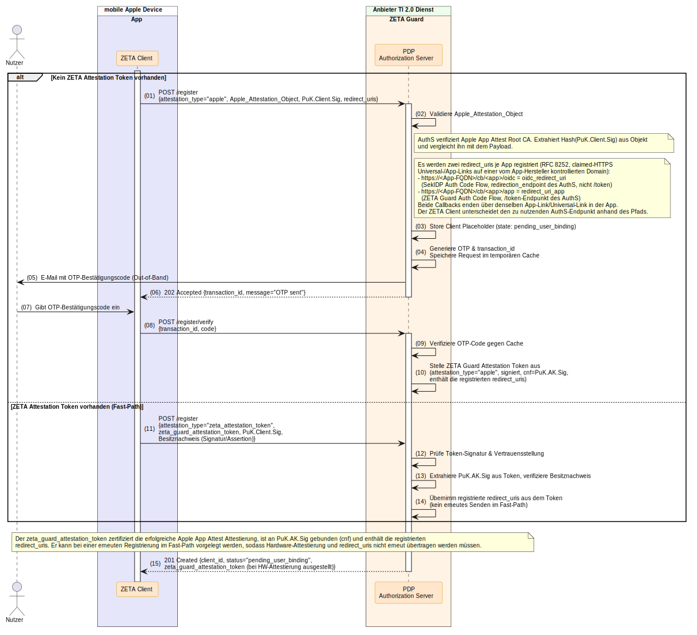

##### 5.1.2.1 Dynamic Client Registration Request

- **Pfad:** gemäß [OAuth-Authorization-Server Well-known](../../../src/schemas/as-well-known.yaml) Discovery (z. B. `/register`)
*Request-Schema:* [dcr-request.yaml](../../../src/schemas/dcr-request.yaml) (Variante: Apple Attestation)

```http
POST /register HTTP/1.1
Host: auth.example.com
Content-Type: application/json
```

```json
{
  "attestation_type": "apple",
  "client_name": "Praxis-App iOS v3.0",
  "token_endpoint_auth_method": "private_key_jwt",
  "grant_types": [
    "urn:ietf:params:oauth:grant-type:token-exchange",
    "refresh_token"
  ],
  "jwks": {
    "keys": [
      {
        "kty": "EC",
        "crv": "P-256",
        "x": "aW9zIHNlY3VyZSBlbmNsYXZlIGV4YW1wbGUga2V5",
        "y": "bW9iaWxlIGNsaWVudCBwdWJsaWMga2V5IGNvb3Jk",
        "use": "sig",
        "kid": "ios-instance-key-1"
      }
    ]
  },
  "apple_attestation_object": "o2NmbXRxYXBwbGUtYXBwYXR0ZXN0Z2F0dFN0bXS...<Base64-kodiertes CBOR>...=="
}
```

##### 5.1.2.2 Dynamic Client Registration Response (202 Accepted — OTP Trigger)

```http
HTTP/1.1 202 Accepted
Content-Type: application/json
```

```json
{
  "transaction_id": "tx-ios-98765",
  "message": "OTP sent",
  "expires_in": 300
}
```

##### 5.1.2.3 Registration Verification Request (TOFU)

- **Pfad:** `/register/verify`

```http
POST /register/verify HTTP/1.1
Host: auth.example.com
Content-Type: application/json
```

```json
{
  "transaction_id": "tx-ios-98765",
  "code": "483921"
}
```

##### 5.1.2.4 Registration Verification Response

```http
HTTP/1.1 201 Created
Content-Type: application/json
```

```json
{
  "client_id": "zeta-client-ios-d4e5f6",
  "status": "pending_attestation",
  "client_id_issued_at": 1748520000
}
```

#### 5.1.3 Authentifizierung & Autorisierung (OIDC Flow)

Der Token-Bezug für mobile Benutzer erfolgt über den standardisierten **OpenID Connect (OIDC) Authorization Code Flow** unter Einbindung von **PKCE** (RFC 7636).

> **Hinweis:** Der detaillierte OIDC-Ablauf für mobile Clients wird in einer späteren Version dieses Dokuments ergänzt.

---

### 5.2 Android Clients mit Android Key Attestation

Android-Clients nutzen den **Android Keystore** mit **TEE (Trusted Execution Environment)** oder **StrongBox** zur hardwaregebundenen Schlüsselerzeugung. Zusätzlich kann die **Google Play Integrity API** zur App-Integritätsprüfung eingesetzt werden.

#### 5.2.1 Client Installation und Schlüsselgenerierung

- *(01) Client Instance Key:* Das Schlüsselpaar (`PrK.Client.Sig` / `PuK.Client.Sig`) wird über `KeyStore.generateKey` im TEE/StrongBox erzeugt.
- *(02) Hash berechnen:* `hash_puk_client_sig = SHA-256(PuK.Client.Sig)`.
- *(03) Attestation Key:* Ein dedizierter Attestation Key (`PrK.AK.Sig` / `PuK.AK.Sig`) wird mit `AttestationChallenge = hash_puk_client_sig` erzeugt. Android liefert dabei automatisch die `android_key_attestation_certificate_chain`.
- *(04) Besitznachweis:* Der Client signiert `hash_puk_client_sig` mit `PrK.AK.Sig` → `signed_hash_puk_client_sig`.
- *(05) Play Integrity (optional):* Über `requestIntegrityToken(nonce = hash_puk_client_sig)` wird ein Geräte- und App-Integritätstoken eingeholt.


#### 5.2.2 Dynamic Client Registration (DCR) mit TOFU

Auch Android-Clients durchlaufen den TOFU-Prozess mit OTP-Verifikation.

- *(01) POST /register:* Der Client sendet `attestation_type: "android"`, `PuK.AK.Sig`, `android_key_attestation_certificate_chain`, `PuK.Client.Sig`, `signed_hash_puk_client_sig` und optional `play_integrity_token`.
- *(02) Validierung:* Der AuthS validiert die Zertifikatskette gegen die Google Hardware Attestation Root CA, prüft `signed_hash_puk_client_sig` und wertet optional die Play Integrity Verdicts aus.
- *(03)–(07) TOFU OTP:* Identischer Ablauf wie bei Apple-Clients (OTP-Generierung, E-Mail-Versand, Nutzer-Eingabe, Verifikation).

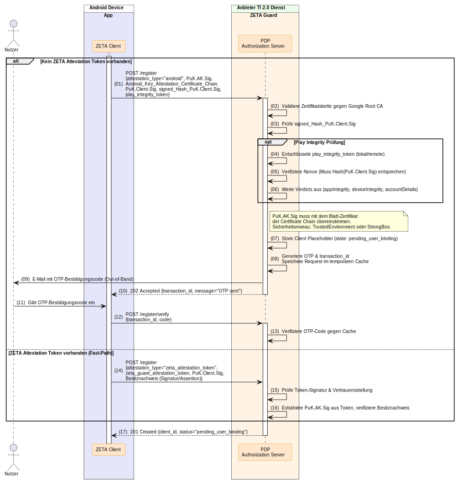

##### 5.2.2.1 Dynamic Client Registration Request

- **Pfad:** gemäß [OAuth-Authorization-Server Well-known](../../../src/schemas/as-well-known.yaml) Discovery (z. B. `/register`)
*Request-Schema:* [dcr-request.yaml](../../../src/schemas/dcr-request.yaml) (Variante: Android Attestation)

```http
POST /register HTTP/1.1
Host: auth.example.com
Content-Type: application/json
```

```json
{
  "attestation_type": "android",
  "client_name": "Tablet-Praxishelfer v2.0",
  "token_endpoint_auth_method": "private_key_jwt",
  "grant_types": [
    "urn:ietf:params:oauth:grant-type:token-exchange",
    "refresh_token"
  ],
  "jwks": {
    "keys": [
      {
        "kty": "EC",
        "crv": "P-256",
        "x": "h82Jdsa8s98JsdK2ls9Djsa82ndS1ksd",
        "y": "d7sJSD9s82JskdP2ksld92JsdkaL3msd",
        "use": "sig",
        "kid": "android-instance-key-1"
      }
    ]
  },
  "android_key_attestation_certificate_chain": [
    "MIIFzDCCA7SgAwIBAgIR...<Blatt-Zertifikat (C.AK.Sig)>...",
    "MIIFvTCCA6WgAwIBAgIT...<Intermediate CA>...",
    "MIIDuzCCAqOgAwIBAgIG...<Google HW Attestation Root CA>..."
  ],
  "signed_hash_puk_client_sig": "MEQCID7sNsjdi9Nskd...<Base64url ECDSA Signatur>...",
  "play_integrity_token": "eyJhbGciOiJFUzI1NiIsInR5cCI6IkpXVCIsImtpZCI6...<Base64 Token>..."
}
```

##### 5.2.2.2 Dynamic Client Registration Response (202 Accepted — OTP Trigger)

```http
HTTP/1.1 202 Accepted
Content-Type: application/json
```

```json
{
  "transaction_id": "tx-android-54321",
  "message": "OTP sent",
  "expires_in": 300
}
```

##### 5.2.2.3 Registration Verification Request (TOFU)

```http
POST /register/verify HTTP/1.1
Host: auth.example.com
Content-Type: application/json
```

```json
{
  "transaction_id": "tx-android-54321",
  "code": "729184"
}
```

##### 5.2.2.4 Registration Verification Response

```http
HTTP/1.1 201 Created
Content-Type: application/json
```

```json
{
  "client_id": "zeta-client-android-g7h8i9",
  "status": "pending_attestation",
  "client_id_issued_at": 1748520000
}
```

#### 5.2.3 Authentifizierung & Autorisierung (OIDC Flow)

Der Token-Bezug für mobile Benutzer erfolgt über den standardisierten **OpenID Connect (OIDC) Authorization Code Flow** unter Einbindung von **PKCE** (RFC 7636).

> **Hinweis:** Der detaillierte OIDC-Ablauf für mobile Clients wird in einer späteren Version dieses Dokuments ergänzt.

---

### 5.3 Mobile Clients mit Software Attestation

Mobile Clients ohne verfügbare Hardware-Sicherheitsmodule (kein TEE/StrongBox auf Android, keine Secure Enclave auf iOS) können den Software-Attestation-Fallback nutzen. Das Vertrauensniveau ist entsprechend niedriger.

#### 5.3.1 Client Installation und Schlüsselgenerierung

Die Schlüsselgenerierung erfolgt rein softwarebasiert, identisch zu stationären Clients (siehe [4.3.1 Schlüsselgenerierung SW-Att](#431-client-installation-und-schlüsselgenerierung)).


#### 5.3.2 Dynamic Client Registration (DCR) mit TOFU

Die Registrierung erfolgt wie bei der stationären Software-Attestation, ergänzt um den TOFU-OTP-Prozess.

- *(01) POST /register:* Der Client sendet `client_name`, `grant_types`, `jwks` (mit `PuK.Client.Sig`) und `token_endpoint_auth_method` — ohne Attestation-spezifische Felder.
- *(02)–(06) TOFU OTP:* Identischer Ablauf wie bei den Hardware-Attestation-Varianten (OTP-Generierung, E-Mail-Versand, Nutzer-Eingabe, Verifikation).

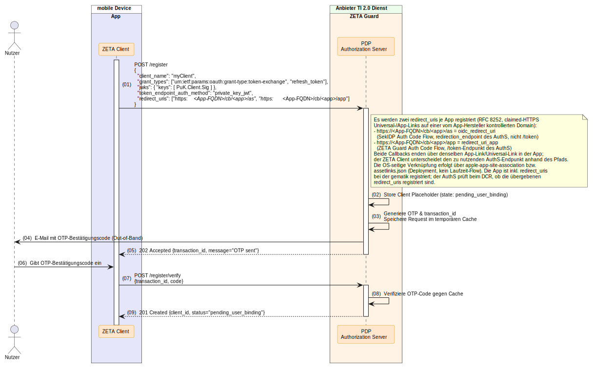

##### 5.3.2.1 Dynamic Client Registration Request

- **Pfad:** gemäß [OAuth-Authorization-Server Well-known](../../../src/schemas/as-well-known.yaml) Discovery (z. B. `/register`)
*Request-Schema:* [dcr-request.yaml](../../../src/schemas/dcr-request.yaml) (Variante: Legacy / Software Attestation)

```http
POST /register HTTP/1.1
Host: auth.example.com
Content-Type: application/json
```

```json
{
  "client_name": "ZETA Mobile Fallback v1.0",
  "token_endpoint_auth_method": "private_key_jwt",
  "grant_types": [
    "urn:ietf:params:oauth:grant-type:token-exchange",
    "refresh_token"
  ],
  "jwks": {
    "keys": [
      {
        "kty": "EC",
        "crv": "P-256",
        "x": "bW9iaWxlIHNvZnR3YXJlIGF0dGVzdGF0aW9uIGtleQ",
        "y": "ZmFsbGJhY2sgbW9iaWxlIGtleSB5IGNvb3JkaW5hdGU",
        "use": "sig",
        "kid": "mobile-sw-key-001"
      }
    ]
  }
}
```

##### 5.3.2.2 Dynamic Client Registration Response (202 Accepted — OTP Trigger)

```http
HTTP/1.1 202 Accepted
Content-Type: application/json
```

```json
{
  "transaction_id": "tx-mobile-sw-11111",
  "message": "OTP sent",
  "expires_in": 300
}
```

##### 5.3.2.3 Registration Verification Request (TOFU)

```http
POST /register/verify HTTP/1.1
Host: auth.example.com
Content-Type: application/json
```

```json
{
  "transaction_id": "tx-mobile-sw-11111",
  "code": "591037"
}
```

##### 5.3.2.4 Registration Verification Response

```http
HTTP/1.1 201 Created
Content-Type: application/json
```

```json
{
  "client_id": "zeta-client-mobile-sw-j0k1l2",
  "status": "pending_attestation",
  "client_id_issued_at": 1748520000
}
```

#### 5.3.3 Authentifizierung & Autorisierung (OIDC Flow)

Der Token-Bezug für mobile Benutzer erfolgt über den standardisierten **OpenID Connect (OIDC) Authorization Code Flow** unter Einbindung von **PKCE** (RFC 7636).

> **Hinweis:** Der detaillierte OIDC-Ablauf für mobile Clients wird in einer späteren Version dieses Dokuments ergänzt.

---

## 6. Dienst-zu-Dienst Kommunikation (Backend-to-Backend)

Für die sichere Maschine-zu-Maschine Interaktion zwischen Backends wird die **Workload Identity Federation** etabliert. Ein Backend-Dienst authentifiziert sich mit einem signierten JWT (ausgestellt durch den eigenen PDP/Kubernetes IDP) am token_endpoint des Ziel-Dienstes.

### 6.1 POST /token (Client Credentials & Token Exchange)
*Siehe auch [Abbildung 16: Dienst-zu-Dienst Kommunikation](../../../images/zeta-flows/Abb-ZETA-Dienst-zu-Dienst-Kommunikation.svg)*

**Anfrage-Beispiel:**
```http
POST /token HTTP/1.1
Host: auth-target.example.com
Content-Type: application/x-www-form-urlencoded

grant_type=urn:ietf:params:oauth:grant-type:token-exchange
&subject_token_type=urn:ietf:params:oauth:token-type:jwt
&subject_token=eyJhbGciOiJFUzI1NiIsInR5cCI6IkpXVCJ9.eyJpc3MiOiJodHRwczovL2F1dGgtc291cmNlLmV4YW1wbGUuY29tIiwic3ViIjoic2VydmljZS1hIiwiYXVkIjoiaHR0cHM6Ly9hdXRoLXRhcmdldC5leGFtcGxlLmNvbS90b2tlbiJ9.signature
&requested_token_type=urn:ietf:params:oauth:token-type:access_token
```

**Antwort-Beispiel (200 OK):**
```http
HTTP/1.1 200 OK
Content-Type: application/json

{
  "access_token": "eyJhbGciOiJFUzI1NiIsInR5cCI6IkpXVC...",
  "token_type": "Bearer",
  "expires_in": 3600
}
```

---

## 7. Zugriff auf den Resource Server

Nach erfolgreichem Erhalt der Access-Token sendet der ZETA-Client Anfragen an den Fachdienst (Resource Server).

### 7.1. Option A: Zugriff mit ZETA/ASL (Tunnelverschlüsselung)
*Siehe auch [Abbildung 14: Zugriff auf RS mit ASL](../../../images/zeta-flows/Abb-ZETA-Zugriff-auf-RS-mit-ASL.svg)*

Erfordert der Fachdienst eine dedizierte Verschlüsselung (ASL), baut der Client einen verschlüsselten Tunnel auf. Der Client sendet die verschlüsselten Fachdaten per HTTP `POST` an den Endpoint `/ASL` des PEP Proxys.

**Anfrage-Beispiel:**
```http
POST /ASL HTTP/1.1
Host: api.example.com
Content-Type: application/jose
Authorization: DPoP eyJhbGciOiJFUzI1NiIsInR5cCI6IkpXVCIsImtpZCI6ImFzLXNpZ25pbmcta2V5LTEifQ...
DPoP: eyJhbGciOiJFUzI1NiIsInR5cCI6ImRwb3Arand0IiwiandrIjp7...

[Verschlüsselte JWE Payload (Fachnachricht)]
```

---

### 7.2. Option B: Direkter Zugriff ohne ZETA/ASL
*Siehe auch [Abbildung 15: Zugriff auf RS ohne ASL](../../../images/zeta-flows/Abb-ZETA-Zugriff-auf-RS-ohne-ASL.svg)*

Der Client sendet den Request direkt an den PEP mit dem Access Token im `Authorization`-Header (DPoP-gebunden) und dem DPoP-Proof im `DPoP`-Header.

**Anfrage-Beispiel:**
```http
GET /api/resource HTTP/1.1
Host: api.example.com
Authorization: DPoP eyJhbGciOiJFUzI1NiIsInR5cCI6IkpXVCIsImtpZCI6ImFzLXNpZ25pbmcta2V5LTEifQ...
DPoP: eyJhbGciOiJFUzI1NiIsInR5cCI6ImRwb3Arand0IiwiandrIjp7...
Accept: application/json
```

**Weiterleitung an den Resource Server:**
Der PEP HTTP Proxy validiert Token und Signaturen und hängt die entschlüsselten/validierten Metadaten als Custom Header an die interne Backend-Anfrage an:
- `zeta-user-info` (Base64URL-kodiertes JSON mapping zu [zeta-user-info.yaml](../../../src/schemas/zeta-user-info.yaml))
- `zeta-client-data` (Base64URL-kodiertes JSON mapping zu [client-data.yaml](../../../src/schemas/client-data.yaml))

**Entschlüsseltes Beispiel für `zeta-user-info`:**
```json
{
  "identifier": "1-234567890123",
  "professionOID": "1.2.276.0.76.4.50",
  "commonName": "Arztpraxis Dr. Meier",
  "organizationName": "Gemeinschaftspraxis Meier & Kollegen"
}
```

---

## 8. Fehlerbehandlung und Statuscodes (Zentrales Nachschlagewerk)

Dieses Kapitel dient Entwicklern als zentrales Nachschlagewerk zur Analyse und schnellen Behebung von Fehlern bei der ZETA API-Integration.

### 8.1 JSON Fehler-Schema
Sämtliche Fehler der ZETA Guard Endpunkte folgen dem JSON-Schema [zeta-error.yaml](../../../src/schemas/zeta-error.yaml):
```json
{
  "error": "Fehler-Identifikationsstring (z.B. invalid_request)",
  "error_description": "Klartextbeschreibung des Fehlers für Entwickler",
  "error_uri": "https://gematik.de/errors/Fehler-Identifikationsstring"
}
```

### 8.2 API Fehler-Tabelle & Troubleshooting

| HTTP Status | Fehler-Code (`error`) | Mögliche Ursache | Troubleshooting-Schritte |
|-------------|-----------------------|------------------|--------------------------|
| **400** | `invalid_request` | Der DPoP-Proof oder das HTTP-Format ist ungültig. | 1. Gültigkeit des `DPoP`-Headers prüfen (z.B. Zeitstempel, URI).<br>2. Parameter im URL-kodierten Request-Body validieren. |
| **401** | `invalid_client` | Die Signatur der Client Assertion ist ungültig oder der Client Instance Key unbekannt. | 1. DCR-Registrierungsstatus des Clients prüfen.<br>2. Verwendeten Signaturalgorithmus und Schlüssel verifizieren. |
| **403** | `access_denied` | Attestierungsprüfung fehlgeschlagen; PCR-Werte weichen von Baseline ab. | 1. TPM PCRs prüfen (Integrität von ZAS/System).<br>2. Sicherstellen, dass keine unerlaubte Kernel-Modifikation vorliegt. |
| **404** | `resource_not_found` | Falscher Well-Known Pfad oder Endpoint. | 1. FQDN des Resource Servers und Pfadstruktur prüfen. |
| **409** | `conflict` | Der Client Instance Key (`PuK.Client.Sig`) existiert bereits im PDP-System. | 1. Verwenden Sie ein neues Schlüsselpaar für eine Neuinstallation.<br>2. Prüfen Sie, ob ein Registrierungs-Reset nötig ist. |
| **429** | `rate_limit_exceeded` | Zu viele Anfragen (z.B. an den `/nonce` Endpoint). | 1. Implementieren Sie Exponential Backoff mit Jitter clientseitig.<br>2. Den Timeout-Wert in `Retry-After` auswerten. |
| **500** | `server_error` | Ein unerwarteter interner Verarbeitungsfehler im ZETA Guard. | 1. Logfiles des PDP / OPA überprüfen.<br>2. Verbindung zur PDP-Datenbank verifizieren. |

---

## 9. Schlüsselverwaltung

Um ein klares Verständnis der kryptografischen Architektur zu vermitteln, verwendet diese API **Schlüssel-IDs** nach folgendem Schema: `[Typ].[Komponente].[Zweck]` (z.B. `PrK.Client.Sig` für den privaten Signaturschlüssel des ZETA Clients).

### 9.1 ZETA Client Schlüssel (Nutzer-Seite)

Diese Schlüssel verbleiben in der Verfügungsgewalt des Endnutzers (Smartphone / Primärsystem) bzw. der Institution.

| Schlüssel-ID | Bezeichnung & Zweck | Speicherung / Verwendung |
|--------------|---------------------|--------------------------|
| **PrK.Client.Sig**<br>**PuK.Client.Sig** | Client Instance Key Pair<br>Langlebiges ECC-Schlüsselpaar zur Identifikation der Client-Installation. | PrK: Zwingend in Hardware (TPM, Secure Enclave, TEE) generiert und gespeichert. Kein Export möglich.<br>PuK: Wird bei der Registrierung (DCR) an den ZETA Guard übertragen. |
| **PrK.DPoP.Sig**<br>**PuK.DPoP.Sig** | DPoP Schlüsselpaar<br>Kurzlebiger (Session-basierter) Schlüssel zum Signieren von Anfragen als Proof of Possession. | PrK: Wird für die Dauer der Session sicher lokal gehalten (RAM). Eine Verschlüsselung durch `PrK.Client.Sig` ist unzulässig.<br>PuK: Wird im HTTP-Header gesendet. |
| **PrK.AK.Sig**<br>**PuK.AK.Sig** | Plattform Attestation Key<br>Zur Signatur des Client-Zustands. | PrK: Hardware-gebunden (TPM / Secure Enclave).<br>PuK: Wird bei der Registrierung (DCR) an den ZETA Guard übertragen. |
| **PrK.EK.Sig**<br>**PuK.EK.Sig**<br>**C.EK.Sig** | TPM 2.0 Endorsement Keys<br>Wird bei der TPM Attestation verwendet. | PrK: Hardware-gebunden (TPM / Secure Enclave).<br>PuK / C: Wird bei der Registrierung (DCR) an den ZETA Guard übertragen. |
| **PrK.SM(C)-B.Sig**<br>**C.SM(C)-B.Sig** | SMC-B Institutionsidentität<br>Zur Signatur des subject_token beim Token Exchange. | PrK: Verbleibt hardwaregebunden auf der Smartcard (SMC-B) oder im HSM-B.<br>C: Wird übermittelt und durch AuthS gegen TSL validiert. |

---

### 9.2 gematik verwaltete Schlüssel (TI)

Diese Zertifikate und Schlüssel spannen den Vertrauensraum der TI 2.0 auf.

| Schlüssel-ID | Bezeichnung & Zweck | Speicherung / Verteilung |
|--------------|---------------------|--------------------------|
| **PrK.TI-RootCA.Sig**<br>**C.TI-RootCA.Sig** | TI Root CA<br>Oberster Vertrauensanker der TI. | C: Lokal in Truststores hinterlegt.<br>PrK: Offline / Hochsicher bei der gematik. |
| **PrK.TI-KompCA.Sig**<br>**C.TI-KompCA.Sig** | Komponenten PKI CA<br>Stellt die Zertifikate für die TI-Dienste aus. | C: Über die TSL als vertrauenswürdig verteilt. |
| **PrK.TI-SMCB-CA.Sig**<br>**C.TI-SMCB-CA.Sig** | SMC-B CA<br>Stellt die Institutionszertifikate aus. | C: Über die TSL als vertrauenswürdig verteilt. |
| **PrK.TI-FedMaster.Sig**<br>**PuK.TI-FedMaster.Sig** | Federation Master Signer<br>Zur Signatur der Entity Statements in der OIDC-Föderation. | PuK: Im ZETA Guard hinterlegt.<br>PrK: Bei der gematik. |

---

## 10. Versionierung, Performance & Verhaltensregeln

### 10.1 Versionierung
Die ZETA API folgt den Regeln von **Semantic Versioning 2.0.0 (SemVer)**. Major-Versionen werden über den URL-Pfad abgebildet (z. B. `/v1/`), während Minor- und Patch-Versionen über den Header `ZETA-API-Version` sowie das Discovery-Dokument ausgegeben werden.

### 10.2 Performance- und Lastannahmen
Die Bearbeitungszeiten müssen unter Last folgende Kriterien erfüllen:
- **PEP HTTP Proxy Latenz**: Mittelwert ≤ 75 ms, 99%-Quantil ≤ 1 s.
- **PDP /nonce Endpoint**: Mittelwert ≤ 33 ms, 99%-Quantil ≤ 500 ms.
- **PDP /register & /token Endpoints**: Mittelwert ≤ 75 ms, 99%-Quantil ≤ 1 s.

### 10.3 Client-Verhaltensregeln
- **Rate Limits**: Clients MÜSSEN die Ratenbegrenzung beachten. Wird ein HTTP-Status `429` empfangen, sind erneute Anfragen mit einem **Exponential Backoff mit Jitter** auszuführen.
- **Zertifikatsvalidierung**: Clients MÜSSEN alle Zertifikate bei jedem Verbindungsaufbau gegen die TSL prüfen. Gültigkeit und Widerrufsprüfung (vorzugsweise via **OCSP Stapling**) sind zwingend erforderlich.

---

## 11. Support und Kontaktinformationen

Bei technischen Supportanfragen, Fehlerberichten oder Fragen zur Zertifizierung von ZETA-Clients kontaktieren Sie bitte den gematik ZETA Service-Desk:
- **E-Mail-Support**: <support.zeta@gematik.de>
- **Developer Forum**: <https://forum.ti-dienste.de/c/zeta-developer>
- **Bugtracker**: <https://github.com/gematik/zeta/issues>
