# ZETA API v2.0.0-draft

## Dokumenten- und Versionsübersicht

|                               |                                   |
| ----------------------------- | --------------------------------- |
| Dokumenttitel                 | ZETA API v2.0.0-draft             |
| Dokumentversion               | 2.0.0-draft                       |
| Stand                         | 01.09.2026                        |
| Status                        | Draft                             |
| Verantwortlich                | gematik                           |
| Gültigkeitsbereich            | ZETA Guard API                    |
| Spezifikationsgrundlage       | gemSpec_ZETA, Version 2.0.0-draft |

---

### Docker-Image Referenzen

Die ZETA Komponenten werden als OCI-konforme Container Images in der ZETA Artifact Registry bereitgestellt.  

<details>
<summary>Details anzeigen</summary>

Repository DCR: [europe-west3-docker.pkg.dev/gematik-pt-zeta-prod/zeta-dcr](https://europe-west3-docker.pkg.dev/gematik-pt-zeta-prod/zeta-dcr)

Repository HELM: [europe-west3-docker.pkg.dev/gematik-pt-zeta-prod/zeta-helm](https://europe-west3-docker.pkg.dev/gematik-pt-zeta-prod/zeta-helm)

#### ZETA Guard Images

- PEP (europe-west3-docker.pkg.dev/gematik-pt-zeta-prod/zeta-dcr/ngx_pep)
- PDP (europe-west3-docker.pkg.dev/gematik-pt-zeta-prod/zeta-dcr/keycloak-zeta)
- Provisioning Processor (europe-west3-docker.pkg.dev/gematik-pt-zeta-prod/zeta-dcr/provisioning-processor)
- Nginx Ingress (europe-west3-docker.pkg.dev/gematik-pt-zeta-prod/zeta-dcr/nginx-ingress)
- Nginx-Prometheus-Exporter (europe-west3-docker.pkg.dev/gematik-pt-zeta-prod/zeta-dcr/nginx-prometheus-exporter)
- Open Policy Agent (europe-west3-docker.pkg.dev/gematik-pt-zeta-prod/zeta-dcr/opa)
- Postgres (europe-west3-docker.pkg.dev/gematik-pt-zeta-prod/zeta-dcr/postgres)
- Telemetry Gateway (europe-west3-docker.pkg.dev/gematik-pt-zeta-prod/zeta-dcr/zeta-telemetry-gateway)

#### Test Images

- Tiger-Testsuite (europe-west3-docker.pkg.dev/gematik-pt-zeta-prod/zeta-dcr/tiger-testsuite)
- Testfachdienst (europe-west3-docker.pkg.dev/gematik-pt-zeta-prod/zeta-dcr/testfachdienst)
- HSM Proxy Simulator (europe-west3-docker.pkg.dev/gematik-pt-zeta-prod/zeta-dcr/hsm_sim)
- Zeta-Tigerproxy (europe-west3-docker.pkg.dev/gematik-pt-zeta-prod/zeta-dcr/testproxy)
- Zeta TLS Test Tool (europe-west3-docker.pkg.dev/gematik-pt-zeta-prod/zeta-dcr/zeta-tls-test-tool-service)
- Cert Validation Mock (europe-west3-docker.pkg.dev/gematik-pt-zeta-prod/zeta-dcr/zeta-cert-validation-mock)
- PoPP Token Generator (europe-west3-docker.pkg.dev/gematik-pt-zeta-prod/zeta-dcr/popp-token-generator)

</details>

---

## 1. Einführung

Die ZETA API beschreibt die Interaktion eines ZETA-Clients mit der ZETA Guard-Infrastruktur. Dabei werden stationäre Clients (z. B. Arbeitsplatz- oder Serversysteme), mobile Clients (z. B. mobile Endgeräte mit iOS oder Android Betriebssystemen) sowie die direkte Dienst-zu-Dienst (Backend-to-Backend) Kommunikation abgedeckt.

Unabhängig von der jeweiligen Client-Plattform stellt die ZETA API Mechanismen bereit, um:

- Eine initiale Vertrauensbeziehung zwischen Client und ZETA-Infrastruktur aufzubauen (Trust Establishment via Dynamic Client Registration),
- Den Sicherheits- und Integritätszustand eines Clients kryptografisch zu bewerten (Attestation & Posture-Erhebung unter Verwendung von TPM 2.0, Apple App Attest, Android Key Attestation und Play integrity Token oder Software-Fallback),
- Den Zugriff auf ZETA-geschützte Dienste über Token-basierte Verfahren (OAuth 2.0 Token Exchange mit DPoP-Bindung und optionaler Verschlüsselung über den ZETA/ASL-Kanal) zu authentifizieren und zu autorisieren.

---

## 2. Voraussetzungen & Basiswissen (Trust Anchor, VSDM2)

Bevor ein ZETA-Client erfolgreich mit einem Resource Server kommunizieren kann, müssen folgende Voraussetzungen und informationelle Grundlagen erfüllt sein:

1. **FQDN des Resource Servers**: Der vollqualifizierte Domänenname (Fully Qualified Domain Name, FQDN) der geschützten Schnittstelle wird vom Client benötigt, um den initialen Discovery-Prozess zu starten.
2. **Trust Anchor Informationen (`roots.json`)**: Die Datei [roots.json](https://download.tsl.ti-dienste.de/ECC/ROOT-CA/roots.json) dient dem Client als lokaler Vertrauensanker, um die Vertrauenskette beim Aufbau einer ZETA/ASL-Verbindung zu validieren. Diese Datei muss wöchentlich aktualisiert werden.
3. **Konnektor und SMC-B**: Bei stationären Clients im Leistungserbringer-Umfeld wird zur Authentifizierung der Institution ein SMC-B-Institutionszertifikat sowie die Schnittstelle des Konnektors oder TI-Gateways benötigt.
4. **VSDM2 (Versichertenstammdatenmanagement 2.0)**: Für fachspezifische Anfragen an einen VSDM2-Resource-Server muss ein gültiges **PoPP-Token** (Proof of Patient Presence) im HTTP-Header `PoPP` an den ZETA-Client übergeben und an die PDP übermittelt werden.
5. **Zeitbezug**: Alle vom Client signierten Artefakte tragen Zeitstempel, die der Authorization Server gegen seine eigene Uhr prüft. Der Client muss die Serverzeit ermitteln und verwenden — siehe [Zeitsynchronisation und Serverzeit-Offset](#zeitsynchronisation-und-serverzeit-offset).

### Zeitsynchronisation und Serverzeit-Offset

Der Authorization Server (AuthS) prüft die Zeitstempel **aller** vom Client signierten Artefakte (`iat`, `exp` und `nbf` in Client Assertion, DPoP-Proof und Subject Token) gegen seine **eigene** Uhr. Die dabei wirksamen Toleranzfenster sind eng und clientseitig nicht konfigurierbar. Eine abweichende lokale Systemuhr — auf nicht domänengebundenen Windows-Arbeitsplätzen keine Seltenheit — führt deshalb zu HTTP `400`/`401`, obwohl Signatur, Schlüsselbindung und Attestierung korrekt sind.

**Regel:** Ein ZETA-Client MUSS alle Zeitstempel in signierten Artefakten aus der **Serverzeit** ableiten und DARF sich dabei NICHT auf die lokale Systemuhr verlassen. Eine NTP-Synchronisation des Betriebssystems ist empfohlen, als alleinige Maßnahme jedoch nicht ausreichend, da sie in der Einsatzumgebung des Leistungserbringers nicht durchsetzbar ist.

**Ermittlung des Offsets**

Jede HTTP-Antwort des ZETA Guard trägt einen `Date`-Header (RFC 9110, Abschnitt 6.6.1). Der Client bildet daraus einen Offset — vorzugsweise aus der Antwort auf `GET /nonce`, die dem `POST /token` ohnehin unmittelbar vorausgeht:

```text
offset      = Date-Header der Antwort (Unix-Zeit) − lokale Unix-Zeit beim Empfang der Antwort
serverNow() = lokale Unix-Zeit + offset
```

Sämtliche `iat`-, `exp`- und `nbf`-Werte werden anschließend aus `serverNow()` gebildet — nicht aus der Systemuhr.

Hinweise zur Umsetzung:

- Für die Zeitspanne zwischen Offset-Ermittlung und Signatur SOLLTE eine monotone Uhr verwendet werden, damit ein NTP-Sprung oder eine Zeitumstellung den Offset nicht verfälscht.
- Der `Date`-Header hat eine Auflösung von einer Sekunde; zusammen mit der halben Round-Trip-Zeit verbleibt eine Restunsicherheit von deutlich unter einer Sekunde. Gegenüber den unten genannten Toleranzfenstern ist das unkritisch.
- Der Offset SOLLTE je Token-Session bei `GET /nonce` neu bestimmt und nicht dauerhaft persistiert werden.
- Empfängt der Client trotz Offset-Korrektur einen zeitbezogenen Fehler (siehe [8.2 API Fehler-Tabelle & Troubleshooting](#82-api-fehler-tabelle--troubleshooting)), SOLLTE er den Offset genau einmal neu bestimmen und die Anfrage wiederholen, bevor er den Fehler an das Primärsystem meldet.

**Wirksame Toleranzen** (nicht normativ; Implementierungsstand des ZETA Guard, Δ = Client-Uhr − Server-Uhr, `L` = gewählte Lebensdauer der Client Assertion):

| Artefakt | Prüfung des AuthS | Client-Uhr darf vorlaufen | Client-Uhr darf nachlaufen |
| ---------- | ------------------- | --------------------------- | ---------------------------- |
| Client Assertion ohne `iat` | `exp − Serverzeit ≤ 60 s` (max. Assertion-Lebensdauer) | Δ ≤ 60 s − `L`, bei `L` = 30 s also **+ 30 s** | Δ > −`L`, bei `L` = 30 s also **− 30 s** |
| Client Assertion mit `iat` | `iat − 15 s ≤ Serverzeit` | **+ 15 s** | Δ > −`L`, bei `L` = 30 s also **− 30 s** |
| DPoP-Proof (`iat` ist Pflicht) | `Serverzeit − 25 s ≤ iat ≤ Serverzeit + 15 s` | **+ 15 s** | **− 25 s** |

Maßgeblich ist immer das engste Fenster, also das des DPoP-Proofs: **+ 15 s / − 25 s**. Ein zusätzliches `iat` in der Client Assertion verbessert die Toleranz **nicht** — es ersetzt lediglich die Prüfung gegen die maximale Lebensdauer durch eine engere Prüfung auf ein in der Zukunft liegendes Ausstellungsdatum. Ein zuverlässiger Betrieb ist deshalb nur über die Offset-Korrektur erreichbar.

### Ablauf Übersicht (alle ZETA Clients)

Unabhängig von Plattform und Attestierungsverfahren durchläuft jeder ZETA-Client dieselben Phasen. Die konkreten Nachrichten und Nachweise unterscheiden sich je nach Client-Typ; die Phasen und ihre Reihenfolge bleiben gleich:

1. **[ ] Discovery**: Ausgehend vom FQDN des Resource Servers lädt der Client die PEP-Metadaten (`GET /.well-known/oauth-protected-resource`) und daraus die PDP-Metadaten mit den Endpunkten des Authorization Servers ([Kapitel 3](#3-discovery-und-konfiguration)).

2. **[ ] Vertrauensanker einbinden**: Die TI-Vertrauensanker-CA-Zertifikate (`roots.json`) werden lokal eingebunden. Stationäre Clients im Leistungserbringer-Umfeld lesen zusätzlich das SMC-B-Institutionszertifikat über den Konnektor bzw. das TI-Gateway aus.

3. **[ ] Keys generieren**: Der Client erzeugt seinen Client Instance Key (`PrK.Client.Sig` / `PuK.Client.Sig`) — je nach Plattform im TPM, in der Secure Enclave, im TEE / StrongBox oder als Software-Schlüssel.

4. **[ ] Dynamic Client Registration (DCR)**: Der Client registriert sich am ZETA Guard (`POST /register`) und weist dabei die Bindung des Client Instance Key an die Plattform nach. Die Registrierung liefert die `client_id`. Der Nachweis hängt vom Attestierungsverfahren ab (TPM-Challenge, Apple Attestation Object, Android Key-Attestation-Kette oder nur JWK bei Software-Attestierung). Mobile Clients erhalten die `client_id` im Status `pending_user_binding`; die Bindung an den Nutzer (TOFU-E-Mail-Bindung) folgt erst in Phase 5 nach der OIDC-Nutzerauthentisierung.

5. **[ ] Token beziehen**: Der Client bezieht am `token_endpoint` (`POST /token`) ein DPoP-gebundenes Access Token samt Refresh Token. Er authentisiert sich dabei mit einer Client Assertion (signiert mit `PrK.Client.Sig`) und einem DPoP-Proof. Der Nachweis der Nutzer- bzw. Institutionsidentität unterscheidet sich:
   - *Stationäre Clients*: Token Exchange mit einem durch die SM(C)-B signierten Subject Token; zuvor wird eine frische Nonce über `GET /nonce` abgerufen ([Kapitel 4](#4-stationäre-clients-windows-linux-macos)).
   - *Mobile Clients*: OIDC Authorization Code Flow mit PAR und PKCE, bei dem der AuthS als Relying Party gegenüber dem sektoralen IDP auftritt ([Kapitel 5](#5-mobile-clients-android-ios-ipados)). Bei der ersten Anmeldung bestätigt der Nutzer dabei zusätzlich eine E-Mail-Adresse per OTP (TOFU), bevor volle Token ausgestellt werden.
   - *Backend-Dienste*: Client Credentials bzw. Token Exchange mit einem vom eigenen IDP ausgestellten JWT ([Kapitel 6](#6-dienst-zu-dienst-kommunikation-backend-to-backend)).

6. **[ ] Resource Server anfragen**: Das DPoP-gebundene Access Token wird im `Authorization`-Header zusammen mit einem neuen DPoP-Proof mitgesendet und die geschützte API des Resource Servers aufgerufen — optional über den verschlüsselten ZETA/ASL-Kanal ([Kapitel 7](#7-zugriff-auf-den-resource-server)).

7. **[ ] Session erneuern**: Läuft das Access Token ab, wird es über den Refresh Token erneuert; erst wenn auch dieser ungültig ist, wird Phase 5 wiederholt. Eine erneute DCR ist nur bei Verlust des Client Instance Key oder einer Neuinstallation erforderlich.

| Phase | Stationär (Kapitel 4) | Mobil (Kapitel 5) | Backend (Kapitel 6) |
| ------- | ----------------------- | ------------------- | --------------------- |
| Schlüsselspeicher | TPM, Secure Enclave oder Software | Secure Enclave, TEE / StrongBox oder Software | Workload-Identität |
| DCR-Nachweis | TPM-Challenge, Apple Attestation Object oder JWK | Apple Attestation Object, Android Key Attestation oder JWK | entfällt |
| Nutzerbindung (TOFU) | entfällt | E-Mail-Bindung per OTP nach der OIDC-Anmeldung | entfällt |
| Identitätsnachweis am `/token` | SM(C)-B-signiertes Subject Token | OIDC Authorization Code (sektoraler IDP) | Signiertes JWT des eigenen IDP |
| Zugriff auf den RS | DPoP-gebundenes Access Token | DPoP-gebundenes Access Token | DPoP-gebundenes Access Token |

Die plattformspezifischen Details zu Schlüsselerzeugung, DCR und Token-Bezug beschreiben die Kapitel 4 (stationäre Clients), 5 (mobile Clients) und 6 (Backend-to-Backend). Zeitstempel in allen signierten Artefakten sind dabei stets aus der Serverzeit abzuleiten (siehe [Zeitsynchronisation und Serverzeit-Offset](#zeitsynchronisation-und-serverzeit-offset)).

*Hinweis: In den Abläufen und Beispielen werden mit dem Ziel der einfacheren Darstellung nur beispielhafte HTTP-Pfade für den Aufruf der ZETA Guard Endpunkte angegeben. Die echten Pfade werden vom ZETA Client per Service Discovery aus den Well-known-JSON-Dokumenten `/.well-known/oauth-protected-resource` und `/.well-known/oauth-authorization-server` ermittelt. Beispiel: `POST /register` wäre korrekt `POST <registration_endpoint>` mit dem Wert `registration_endpoint` aus `GET /.well-known/oauth-authorization-server`.*

*Hinweis: Eine Übersicht der verwendeten Schlüssel ist in [Kapitel 9](#9-schlüsselverwaltung) zu finden.*

---

## 3. Discovery und Konfiguration

In dieser Phase ermittelt der ZETA-Client dynamisch die Endpunkte und Konfigurationen der ZETA Guard-Infrastruktur (PEP HTTP Proxy und PDP Authorization Server).

### 3.1 Ablauf

Der Discovery-Ablauf ist für alle Client-Typen identisch und greift auf standardisierte `.well-known` Endpunkte zu:

1. Der Client sendet eine `GET`-Anfrage an den Well-Known-Endpunkt der geschützten Ressource (PEP).
2. PEP antwortet mit Metadaten über unterstützte Token-Methoden und den zuständigen Authorization Server (PDP).
3. Der Client fragt die detaillierten Authorization Server Metadaten (PDP) ab, um Endpunkte für Registrierung, Token-Bezug und Nonce-Generierung zu erhalten.
4. Der Client cacht beide Dokumente anhand der Header `ETag` und `Cache-Control` und validiert sie bei jedem Session-Start per `If-None-Match` (siehe [3.3](#33-caching-und-validierung-der-well-known-dokumente-etag-cache-control)).

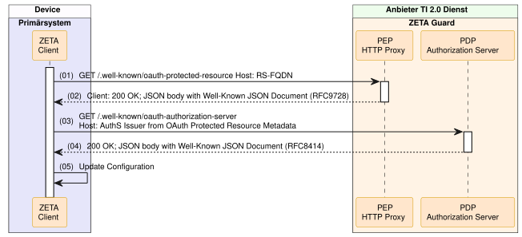

### 3.2 Endpunkt-Spezifikationen

#### 3.2.1 GET /.well-known/oauth-protected-resource

Gibt die Konfigurationsdetails des PEP für eine geschützte Ressource zurück (gemäß RFC 9728).

**Anfrage-Beispiel:**
*Request-Schema:* *Keines (kein Request-Body)*

```http
GET /.well-known/oauth-protected-resource HTTP/1.1
Host: api.example.com
Accept: application/json
```

**Antwort-Beispiel (200 OK):**
*Response-Schema: [opr-well-known.yaml](../../../src/schemas/opr-well-known.yaml)*

```http
HTTP/1.1 200 OK
Content-Type: application/json
Cache-Control: public, max-age=86400
ETag: "w/37b12-abc12345"

{
  "resource": "https://api.example.com",
  "authorization_servers": [
    "https://auth.example.com"
  ],
  "scopes_supported": [
    "vsdservice.read",
    "vsdservice.write"
  ],
  "bearer_methods_supported": [
    "header"
  ],
  "dpop_signing_alg_values_supported": [
    "ES256"
  ],
  "dpop_bound_access_tokens_required": true,
  "zeta_asl_use": "required",
  "api_versions_supported": [
    {
      "major_version": 1,
      "version": "1.3.0",
      "status": "stable",
      "documentation_uri": "https://gematik.de/docs/api/v1.3"
    }
  ]
}
```

---

#### 3.2.2 GET /.well-known/oauth-authorization-server

Gibt Metadaten und unterstützte Endpunkte des PDP Authorization Servers zurück (gemäß RFC 8414).

**Anfrage-Beispiel:**
*Request-Schema:* *Keines (kein Request-Body)*

```http
GET /.well-known/oauth-authorization-server HTTP/1.1
Host: auth.example.com
Accept: application/json
```

**Antwort-Beispiel (200 OK):**
*Response-Schema: [as-well-known.yaml](../../../src/schemas/as-well-known.yaml)*

```http
HTTP/1.1 200 OK
Content-Type: application/json
Cache-Control: public, max-age=86400
ETag: "w/98d41-xyz98765"

{
  "issuer": "https://auth.example.com",
  "authorization_endpoint": "https://auth.example.com/auth",
  "pushed_authorization_request_endpoint": "https://auth.example.com/par",
  "require_pushed_authorization_requests": true,
  "token_endpoint": "https://auth.example.com/token",
  "redirection_endpoint": "https://auth.example.com/redirect",
  "registration_endpoint": "https://auth.example.com/register",
  "jwks_uri": "https://auth.example.com/certs",
  "grant_types_supported": [
    "urn:ietf:params:oauth:grant-type:token-exchange",
    "refresh_token",
    "authorization_code"
  ],
  "token_endpoint_auth_methods_supported": [
    "private_key_jwt"
  ],
  "token_endpoint_auth_signing_alg_values_supported": [
    "ES256"
  ],
  "code_challenge_methods_supported": [
    "S256"
  ],
  "api_versions_supported": [
    {
      "major_version": 1,
      "version": "1.3.0",
      "status": "stable",
      "documentation_uri": "https://gematik.de/docs/api/v1.3"
    }
  ]
}
```

### 3.3 Caching und Validierung der Well-known-Dokumente (ETag, Cache-Control)

Beide Well-known-Dokumente werden vom ZETA Guard mit den HTTP-Headern `ETag` und `Cache-Control` ausgeliefert. Der ZETA Client führt die Service Discovery zu Beginn jeder Session durch, nutzt dabei aber den lokalen Cache, sodass die Dokumente in der Regel nicht erneut übertragen werden müssen.

**Verhalten des ZETA Guard:**

- Der `ETag`-Header ändert sich bei jeder inhaltlichen Änderung des Dokuments.
- Der `Cache-Control`-Header enthält `max-age`; der Wert überschreitet 86400 Sekunden (24 Stunden) nicht.
- Enthält die Anfrage den Header `If-None-Match` mit dem aktuellen `ETag`, antwortet der ZETA Guard mit `304 Not Modified` ohne Body. Die 304-Antwort enthält dieselben `ETag`- und `Cache-Control`-Header wie die zugehörige 200-Antwort.

**Verhalten des ZETA Client zu Beginn jeder Session:**

1. Liegt das Dokument im Cache vor und ist es gemäß `max-age` noch frisch, verwendet der Client das Dokument aus dem Cache ohne Anfrage an den ZETA Guard.
2. Ist das Dokument abgelaufen, wurde kein `Cache-Control`-Header geliefert oder enthält dieser `no-cache`, sendet der Client eine bedingte Anfrage mit `If-None-Match: <zuletzt erhaltener ETag>`.
   - `304 Not Modified`: Der Client verwendet das gecachte Dokument weiter. Die Frische wird anhand der Header der 304-Antwort neu bestimmt, d. h. `max-age` läuft ab dem Zeitpunkt der 304-Antwort erneut.
   - `200 OK`: Der Client ersetzt das gecachte Dokument und übernimmt `ETag` und `Cache-Control` der neuen Antwort.
3. Enthält `Cache-Control` die Direktive `no-store`, cacht der Client das Dokument nicht und lädt es bei jeder Session vollständig.
4. Unabhängig vom `Cache-Control`-Header validiert der Client das Dokument spätestens 24 Stunden nach dem letzten Abruf bzw. der letzten erfolgreichen Validierung erneut. Das gilt auch innerhalb einer laufenden Session.

Eine `404`-Antwort beim Zugriff auf eine geschützte Ressource führt **nicht** zu einer erneuten Service Discovery; sie wird unverändert an den Fach-Client durchgereicht (siehe [Kapitel 7](#7-zugriff-auf-den-resource-server)).

**Anfrage-Beispiel (bedingte Anfrage):**

```http
GET /.well-known/oauth-authorization-server HTTP/1.1
Host: auth.example.com
Accept: application/json
If-None-Match: "w/98d41-xyz98765"
```

**Antwort-Beispiel (304 Not Modified):**

```http
HTTP/1.1 304 Not Modified
Cache-Control: public, max-age=86400
ETag: "w/98d41-xyz98765"
```

Die Header und die 304-Antwort sind in den OpenAPI-Beschreibungen [oauth-protected-resource-well-known.yaml](../../../src/openapi/oauth-protected-resource-well-known.yaml) und [as-well-known.yaml](../../../src/openapi/as-well-known.yaml) spezifiziert.

---

## 4. Stationäre Clients (Windows, Linux, macOS)

Die folgende Abbildung zeigt den Attestierungsablauf im Überblick und die Unterschiede je nach Betriebssystem:

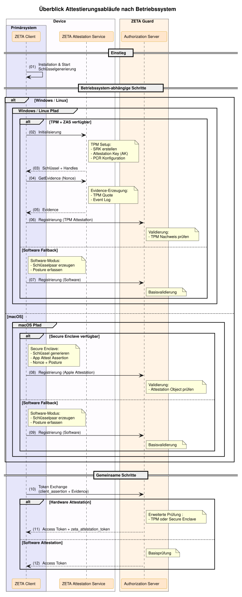

### Quick Start: Welches Kapitel betrifft mich?

| Ihr Client-Szenario | Attestation-Typ | Kapitel | Status |
| --------------------- | ----------------- | --------- | -------- |
| Windows / Linux **mit** TPM 2.0 | TPM Hardware Attestation | [4.1](#41-windows-oder-linux-clients-mit-tpm-attestation) | Preview |
| macOS **mit** Secure Enclave | Apple App Attest | [4.2](#42-macos-clients-mit-apple-app-attest-attestation) | Preview |
| Stationär **ohne** Hardware-Sicherheit | Software Attestation | [4.3](#43-stationäre-clients-mit-rein-software-basierter-attestation) | **Unterstützt** |

#### Endpunkt-Übersicht (Stationäre Clients)

| Endpunkt | Methode | Zweck | Relevant für |
| ---------- | --------- | ------- | -------------- |
| `/.well-known/oauth-protected-resource` | GET | PEP-Metadaten und AuthS-Verweis abrufen | Alle Client-Typen |
| `/.well-known/oauth-authorization-server` | GET | PDP-Endpunkte und Konfiguration abrufen | Alle Client-Typen |
| `/register` | POST | Client-Registrierung starten (DCR) | Alle Client-Typen |
| `/register/verify` | POST | TPM ActivateCredential-Secret übermitteln | Nur TPM (4.1) |
| `/nonce` | GET | Frische Nonce für Token Exchange sowie für die DCR im Fast-Path und bei Software-Attestierung abrufen | Alle Client-Typen |
| `/token` | POST | Access Token per Token Exchange beziehen | Alle Client-Typen |

#### Token-Lebenszyklus

| Token | Typische Gültigkeit | Erneuerung | Bindung |
| ------- | ----------- | ------------ | --------- |
| **Access Token** | 300 s (5 min) | Über Refresh Token oder neuen Token Exchange | DPoP-gebunden (an `PuK.DPoP.Sig`) |
| **Refresh Token** | 86 400 s (24 h) | Einmalig einlösbar (Rotation bei Nutzung) | An `client_id` gebunden |
| **DPoP Proof** | Einmalig verwendbar | Jeder Request benötigt neuen Proof | An HTTP-Methode + URI gebunden |
| **ZETA Guard Attestation Token** (`zeta_attestation_token`) | Unbegrenzt | Neuer Token Exchange mit Hardware Attestation | An `PuK.AK.Sig` gebunden; Einlösung zusätzlich nonce-gebunden (empfohlen) |
| **Nonce** | 300 s (5 min) | Neuer `GET /nonce` Aufruf | Einmalig verwendbar |

#### Bindung der `client_id` an Plattform und Attestierungsverfahren

Die Registrierung stellt eine durchgehende Kette her:

```text
client_id → jwks (PuK.Client.Sig) → signed_hash_puk_client_sig → PuK.AK.Sig → Hersteller-Root
```

Der AuthS prüft bei der DCR die Attestierungs-Evidence (TPM: EK-Kette und `ActivateCredential`; Apple: App-Attest-Objekt gegen die Apple Root; Android: Key-Attestation-Kette gegen die Google Root) und die Bindung `PuK.AK.Sig ↔ PuK.Client.Sig`. Weil die Client Assertion am `/token`-Endpunkt mit `PrK.Client.Sig` signiert ist, authentisiert sie die `client_id` gegen genau diesen attestierten Schlüssel.

Damit diese Kette auch zur Laufzeit trägt, **pinnt** der AuthS bei erfolgreicher Registrierung folgende Attribute im Registrierungsdatensatz:

| Attribut | Bedeutung | Änderbar? |
| --- | --- | --- |
| `attestation_type` | nachgewiesenes Attestierungsverfahren | nein — nur per Neuregistrierung |
| `platform` | Plattform der Client-Instanz | nein |
| `product_id` | gematik-Produktbezeichner (vom Hersteller bei der gematik registriert) | nein |
| `ak_jkt` | RFC-7638-Thumbprint von `PuK.AK.Sig` | nein (entfällt bei `software`) |

Bei jedem Token Exchange gilt: `client_statement.platform` und `client_statement.posture_type` **müssen** den gepinnten Werten entsprechen, und die Posture-Evidence wird ausschließlich gegen `ak_jkt` geprüft — nie gegen einen im Request mitgelieferten Attestation Key. Andernfalls könnte eine software-attestierte Registrierung zur Laufzeit als hardware-attestiert auftreten und ein höheres Vertrauensniveau erlangen, als bei der Registrierung nachgewiesen wurde — oder umgekehrt ein TPM-Client mit manipuliertem Primärsystem als `software` auftreten und so die PCR-Prüfung umgehen, obwohl seine `product_id` in der Allowlist steht.

Die `product_id` wird je Attestierungsverfahren unterschiedlich belegt: Bei Apple/Android gegen die attestierte App-Identität; bei TPM darüber, dass der ZETA Attestation Service die Hersteller-Signatur des Primärsystems prüft und das Ergebnis samt Signer-Identität in PCR 23 misst — die Policy Engine vergleicht den gemessenen Signer mit dem für **diese** `product_id` bei der gematik registrierten Schlüssel. Bei Software-Attestierung bleibt sie eine unveränderliche, aber unbelegte Selbstauskunft.

**Übergangsregelung:** `attestation_type` und `ak_jkt` werden bei **jeder** Registrierung gepinnt — beide ergeben sich aus dem Request selbst (gewählter Schema-Zweig bzw. soeben verifizierter Attestation Key), es ist kein zusätzliches Client-Feld nötig. Nur `platform` und `product_id` sind im DCR-Request optional; fehlen sie, bleiben genau diese beiden ungepinnt und werden wie bisher aus dem `client_statement` übernommen. `binding_status: legacy_unpinned` tragen ausschließlich Clients, die vor Einführung des Pinnings registriert wurden und für die der AuthS keinen `attestation_type` hält; nur für sie entfällt auch der `posture_type`-Abgleich. Der `binding_status` wird an die Policy Engine übergeben, sodass Policies beide Populationen unterscheiden können. Die Migration eines Legacy-Datensatzes nach `pinned` erfolgt für Hardware-Clients über den Fast-Path (`attestation_type: zeta_attestation_token`): Er nutzt den bereits verifizierten Attestation Key und benötigt **keine** erneute Plattform-Attestierung — der `attestation_pop` ist eine einfache AK-Signatur (Android/TPM) bzw. eine App-Attest-Assertion (Apple), die nicht den Rate Limits der Attestierungs-APIs unterliegen. Eine vollständige Neu-Attestierung ist für die Migration bewusst nicht vorgesehen.

---

### 4.1 Windows oder Linux Clients mit TPM Attestation

> **Preview** — Dieses Kapitel beschreibt den geplanten Ablauf für TPM-basierte Hardware Attestation. Die Implementierung ist noch nicht abgeschlossen. Änderungen an Endpunkten, Payloads und Abläufen sind vorbehalten.

Unter Windows und Linux basiert der Vertrauensaufbau auf dem Trusted Platform Module (TPM 2.0) und dem privilegierten Hintergrunddienst ZETA Attestation Service (ZAS).
Die TPM Attestation ermöglicht es dem Client, seine hardwaregebundene Identität nachzuweisen und sich dadurch sicher bei der ZETA Guard-Infrastruktur zu registrieren. Hierzu nutzt der Client das Attestierungs-Schlüsselpaar (`PrK.AK.Sig` / `PuK.AK.Sig`) sowie das Client-Instanz-Schlüsselpaar (`PrK.Client.Sig` / `PuK.Client.Sig`). Beide Schlüsselpaare werden im TPM 2.0 erzeugt.

*Hinweis: eine Übersicht über die bei ZETA verwendeten Schlüssel ist in Kapitel [9. Schlüsselverwaltung](#9-schlüsselverwaltung) zu finden.*

#### 4.1.1 Client Installation und Schlüsselgenerierung

- *(01) Privilegierte ZAS-Installation:* Der ZAS wird mit administrativen Rechten (Root/Admin) installiert. Nur so kann er Messungen in TPM PCR-Register schreiben.
- *(02) Unprivilegierte Client-Installation:* Der ZETA Client wird im Benutzerkontext des Primärsystems installiert.
- *(03)–(04) IPC-Vertrauensbeziehung:* Zwischen ZAS (privilegiert) und ZETA Client (User Space) wird eine gegenseitig authentifizierte IPC-Verbindung aufgebaut, z. B. gesichert durch Prozess- und Code-Signatur-Prüfungen beider Seiten.
- *(05)–(06) Client Instance Key:* Das langlebige Signatur-Schlüsselpaar (`PrK.Client.Sig` / `PuK.Client.Sig`) wird über den OS- oder TPM-Provider erzeugt. Der öffentliche Schlüssel und das Handle werden dem Client übergeben.
- *(07) Systemmessung:* Der ZAS misst die unveränderlichen Teile des Primärsystems.
- *(08) Storage Root Key (SRK):* Im TPM wird ein SRK als lokaler Vertrauensanker erzeugt.
- *(09)–(12) Attestation Key (AK):* Ein hardwaregebundener Attestierungsschlüssel (`PrK.AK.Sig` / `PuK.AK.Sig`) wird im TPM erzeugt und geladen. Das AK-Handle wird an den ZETA Client übergeben.
- *(13) PCR-Erweiterung:* Die Messwerte der unveränderlichen Systemkomponenten werden in ein freies TPM PCR (z.B. PCR 23) geschrieben und bilden die initiale Baseline. Wenn kein freies PCR auf dem Gerät existiert, dann kann die TPM Attestation nicht durchgeführt werden. In diesem Fall muss die [Software basierte Attestation](#43-stationäre-clients-mit-rein-software-basierter-attestation) durchgeführt werden.

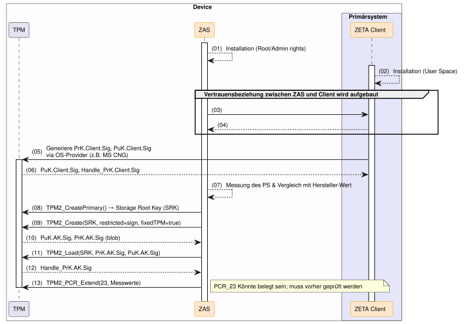

#### 4.1.2 Client Start und Baseline-Aktualisierung

Bei jedem Systemboot und jedem Start des Primärsystems führt der ZAS eine erneute Integritätsmessung durch:

- *(01) ZAS-Bootstart:* Der ZAS wird beim Booten als Systemdienst gestartet.
- *(02)–(03) Initiale Messung:* Der ZAS misst unveränderliche Systemteile und erweitert PCR 23.
- *(04)–(08) Client-Startmessung:* Sobald der ZAS den Start des Primärsystems erkennt, führt er eine zweite Messung durch und erweitert erneut PCR 23, um den aktuellen Systemzustand im TPM zu verankern.

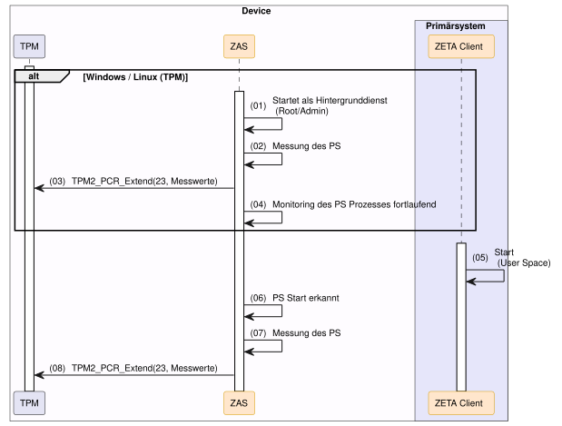

#### 4.1.3 Vorbereitung der Client-Registrierung (Key Certification)

Vor der Registrierung beim ZETA Guard Authorization Server (AuthS) erbringt der Client im Zusammenspiel mit dem ZAS den Nachweis, dass sein Signaturschlüssel (`PuK.Client.Sig`) auf demselben physischen TPM-Chip existiert wie der Attestation Key (`AK`). Zusätzlich werden alle benötigten Daten für die Attestierung des Clients beim AuthS vorbereitet. Die Schritte im Detail:

- *(01)–(03) Client-Key laden:* Der ZETA Client übergibt das Schlüssel-Handle und den SHA-256-Hash von `PuK.Client.Sig` an den ZAS. Der ZAS lädt den Client-Schlüssel in das TPM.
- *(04)–(05) TPM2_Certify:* Das TPM führt eine `TPM2_Certify`-Operation durch: Es signiert mit `PrK.AK.Sig` kryptografisch, dass sich `PuK.Client.Sig` im selben TPM-Sicherheitschip befindet. Ergebnis sind `tpm2b_attest` (Zertifizierungsdaten) und `tpmt_signature` (Signatur).
- *(06)–(14) EK und AK auslesen:* Der ZAS liest den öffentlichen Endorsement Key (`PuK.EK.Enc`), den öffentlichen AK (`PuK.AK.Sig`) und das herstellerseitige EK-Zertifikat (`C.EK.Enc`) aus dem TPM und übergibt alle Daten an den ZETA Client.

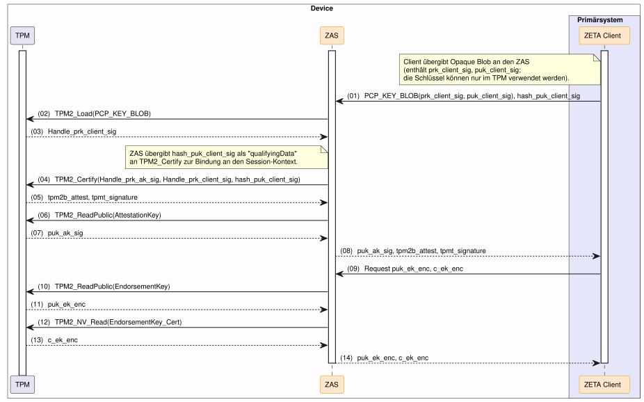

#### 4.1.4 Dynamic Client Registration (DCR)

Die Dynamic Client Registration ermöglicht die Registrierung neuer Clients beim ZETA Guard AuthS. Die Registrierung verknüpft den Client Instance Key mit dem TPM Attestation Key (AK) und dem Endorsement Key (EK). Mit dem Client Instance Key wird die Client assertion signiert, mit der sich der Client am /token Endpoint des ZETA Guard authentifiziert.

- **Verwendete Endpunkt-Pfade (Windows/Linux):** `POST /register` und `POST /register/verify`
- *(01) POST /register:* Der ZETA Client sendet die Registrierungsanfrage gemäß Schema [dcr-request.yaml](../../../src/schemas/dcr-request.yaml) an den PDP AuthS. Der Body enthält `attestation_type: "tpm"`, `PuK.Client.Sig`, `PuK.AK.Sig`, `PuK.EK.Enc`, `C.EK.Enc` und `signed_hash_puk_client_sig`.
- *(02)–(03) MakeCredential:* Der AuthS validiert die EK-Zertifikatskette gegen die Hersteller-CA. Zur Verifikation des Schlüsselbesitzes generiert er ein verschlüsseltes `CredentialBlob` per `TPM2_MakeCredential` (verschlüsselt mit `PuK.EK.Enc`, gebunden an `PuK.AK.Sig`) und antwortet mit `202 Accepted {challenge_type, tpm_credential_blob, tpm_encrypted_secret}`.
- *(04)–(08) ActivateCredential:* Der ZETA Client leitet das `CredentialBlob` an den ZAS weiter. Der ZAS führt im TPM `TPM2_ActivateCredential` aus — dieser Befehl gelingt nur, wenn EK und AK im selben TPM vorhanden sind. Das entschlüsselte Secret wird an den Client zurückgegeben.
- *(09)–(10) POST /register/verify:* Der Client sendet das Secret an den AuthS. Der AuthS verifiziert das Secret und schließt die Registrierung ab: `201 Created {client_id}` mit Status `pending_attestation`.

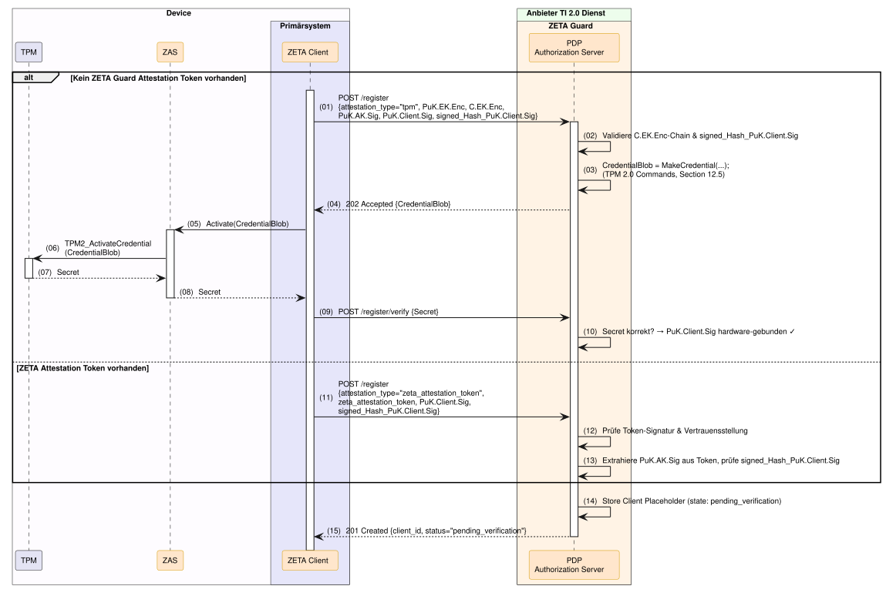

*Bei Fehlern (z. B. `409 Conflict` bei doppeltem Key, `400 Invalid Request`) siehe [8.2 API Fehler-Tabelle & Troubleshooting](#82-api-fehler-tabelle--troubleshooting).*

##### 4.1.4.1 Dynamic Client Registration Request

- **Pfad:** gemäß [OAuth-Authorization-Server Well-known](../../../src/schemas/as-well-known.yaml) Discovery (z. B. `/register`)
*Request-Schema:* [dcr-request.yaml](../../../src/schemas/dcr-request.yaml)

```http
POST /register HTTP/1.1
Host: auth.example.com
Content-Type: application/json
```

```json
{
  "attestation_type": "tpm",
  "client_name": "ZETA Secure Desktop Agent v1.2",
  "token_endpoint_auth_method": "private_key_jwt",
  "grant_types": [
    "urn:ietf:params:oauth:grant-type:token-exchange",
    "refresh_token"
  ],
  "jwks": {
    "keys": [
      {
        "kty": "EC",
        "crv": "P-256",
        "x": "usWxHK2PmfnHKwXPS54m0kTcGJ90UiglWiGahtagnv8",
        "y": "IBOL-C3BttVivg-lSreASfpEcgHQ4Bgv_9ZWeA-mBik",
        "use": "sig",
        "kid": "client-key-tpm-001"
      }
    ]
  },
  "puk_ek_enc": "AEIA...<hier Base64 kodierte TPM2B_PUBLIC Struktur des EK>...AABB",
  "c_ek_enc": "MIICzjCCAjagAwIBAgIGAXxP...<hier Base64 kodierte DER X.509 Zertifikat>...z3k=",
  "puk_ak_sig": "AE4A...<hier Base64 kodierte TPM2B_PUBLIC Struktur des AK>...ZZXX",
  "signed_hash_puk_client_sig": "MEQCIFz...<hier Base64url kodierte ECDSA Signatur>...A5Y_"
}
```

##### 4.1.4.2 Dynamic Client Registration Response

**Antwort-Beispiel (202 Accepted):**
*Response-Schema:* [dcr-response-202.yaml](../../../src/schemas/dcr-response-202.yaml)

```http
HTTP/1.1 202 Accepted
Content-Type: application/json
```

```json
{
  "transaction_id": "c2257dd9-835f-4f87-80c6-91b41851c4e2",
  "status": "pending_verification",
  "expires_in": 600,
  "challenge_type": "tpm_activation",
  "tpm_credential_blob": "MIIDEzCCAvugAwIBAgIGAXxPq...",
  "tpm_encrypted_secret": "AwEE..."
}
```

##### 4.1.4.3 Registration Verification Request

- **Pfad:** Der erste Teil des Pfades wird gemäß [OAuth-Authorization-Server Well-known](../../../src/schemas/as-well-known.yaml) Discovery ermittelt (z. B. `/register`). Der zweite Teil ist fest `/verify` (z. B. `/register/verify`).
*Request-Schema:* [verify-request.yaml](../../../src/schemas/verify-request.yaml)

```http
POST /register/verify HTTP/1.1
Host: auth.example.com
Content-Type: application/json
```

```json
{
  "transaction_id": "c2257dd9-835f-4f87-80c6-91b41851c4e2",
  "verify_type": "tpm_activation",
  "tpm_decrypted_secret": "v2OZW+H/tF7W4u5S/Z8E9HlUaX9aC1gL5vXo4p3YQfI="
}
```

##### 4.1.4.4 Registration Verification Response

**Antwort-Beispiel (201 Created):**
*Response-Schema:* [dcr-response.yaml](../../../src/schemas/dcr-response.yaml) (`ClientInformationResponse`)

```http
HTTP/1.1 201 Created
Content-Type: application/json
```

```json
{
  "client_id": "zeta-client-desktop-tpm-a1b2c3",
  "status": "pending_attestation",
  "client_id_issued_at": 1748520000,
  "token_endpoint_auth_method": "private_key_jwt"
}
```

#### 4.1.5 Vorbereitung des Token Exchange (Client Assertion & Subject Token)

Nach erfolgreicher Registrierung bereitet der Client die Authentifizierung am Token-Endpunkt vor. Hierbei werden drei wesentliche Artefakte erstellt: das **Subject Token** (signiert durch die SMC-B), die **Attestation Evidence** (TPM Quote) und die **Client Assertion** (signiert mit `PrK.Client.Sig`).

- *(01) Nonce abholen:* Der Client ruft `GET /nonce` am AuthS auf, um eine frische Nonce für Replay-Schutz zu erhalten. Aus dem `Date`-Header dieser Antwort bestimmt der Client zugleich den Serverzeit-Offset, aus dem alle folgenden Zeitstempel gebildet werden (siehe [Zeitsynchronisation und Serverzeit-Offset](#zeitsynchronisation-und-serverzeit-offset)).
- *(02) DPoP Key Pair:* Der Client generiert ein kurzlebiges DPoP-Schlüsselpaar (`PrK.DPoP.Sig` / `PuK.DPoP.Sig`) für die Token-Session.
- *(03) Subject Token erstellen:* Der Client erstellt das Subject Token (JWT) mit der eingebetteten Nonce. Dieses Token wird mit der SMC-B signiert.
- *(04)–(07) SMC-B Signatur:* Das Subject Token wird über den Konnektor/TI-Gateway an die SM(C)-B weitergeleitet und dort signiert.
- *(08)–(12) TPM Evidence:* Der Client fordert über den ZAS die Attestation Evidence an: `TPM2_Quote` über PCR [7, 23] mit der Nonce, signiert mit `PrK.AK.Sig`, sowie das zugehörige `TPM2_EventLog`.
- *(13) Client-Statement:* Der Client generiert das `client-statement` mit OS- und Primärsystem-Daten sowie der Evidence.
- *(14) Client Assertion:* Abschließend wird die Client Assertion als JWT erstellt und mit `PrK.Client.Sig` signiert.

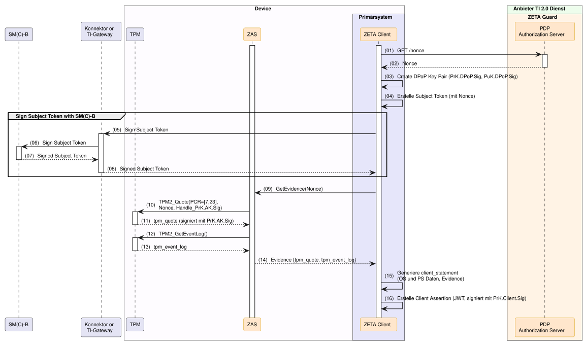

#### 4.1.6 Token Exchange (POST /token)

Der Token Exchange ist der zentrale Schritt zur Erlangung eines DPoP-gebundenen Access Tokens. Der Client sendet die vorbereiteten Artefakte an den `/token`-Endpunkt des Authorization Servers.

- *(01) DPoP Proof:* Der Client erstellt einen DPoP Proof mit der Nonce des AuthS.
- *(02) POST /token:* Der Client sendet die Anfrage mit `client_assertion` (JWT, signiert mit `PrK.Client.Sig`), `subject_token` (SMC-B signiert, inkl. Nonce) und `DPoP`-Header.
- *(03) Validierung:* Der AuthS validiert Client Assertion, DPoP Proof, Subject Token, Nonce und den Sperrstatus (OCSP) der SM(C)-B. Zu den Key-Bindings aus der DCR gehört insbesondere der Abgleich der bei der Registrierung gepinnten Attribute: der Instanzschlüssel gegen `jwks` sowie `client_statement.platform` und `client_statement.posture_type` gegen `platform` bzw. `attestation_type` des Registrierungsdatensatzes. Weicht eines davon ab, wird der Request abgelehnt. Für Clients, die vor Einführung des Pinnings registriert wurden (`binding_status: legacy_unpinned`), entfällt dieser Abgleich und die Werte werden wie bisher aus dem `client_statement` übernommen.
- *(04) TPM Attestation Prüfung:* Verifizierung der Hardware-Signatur (Quote) gegen die extrahierte Nonce mit PCR-Replay via Event Log. Die Quote-Signatur wird gegen den bei der Registrierung gepinnten Attestation Key (`ak_jkt`) geprüft — **nicht** gegen den in `posture.tpm_attestation_key` mitgelieferten Schlüssel; dieser dient nur der Diagnose und muss mit dem gepinnten Schlüssel übereinstimmen.
- *(05) Policy Engine:* Bei erfolgreicher Validierung wird der Policy Engine Input erstellt und an die OPA Policy Engine übermittelt (`POST /v1/data/authz`).
- *(06) Token-Erstellung:* Bei positiver Policy Decision erstellt der AuthS Access Token, Refresh Token und (bei Hardware Attestation) das `zeta_attestation_token`.

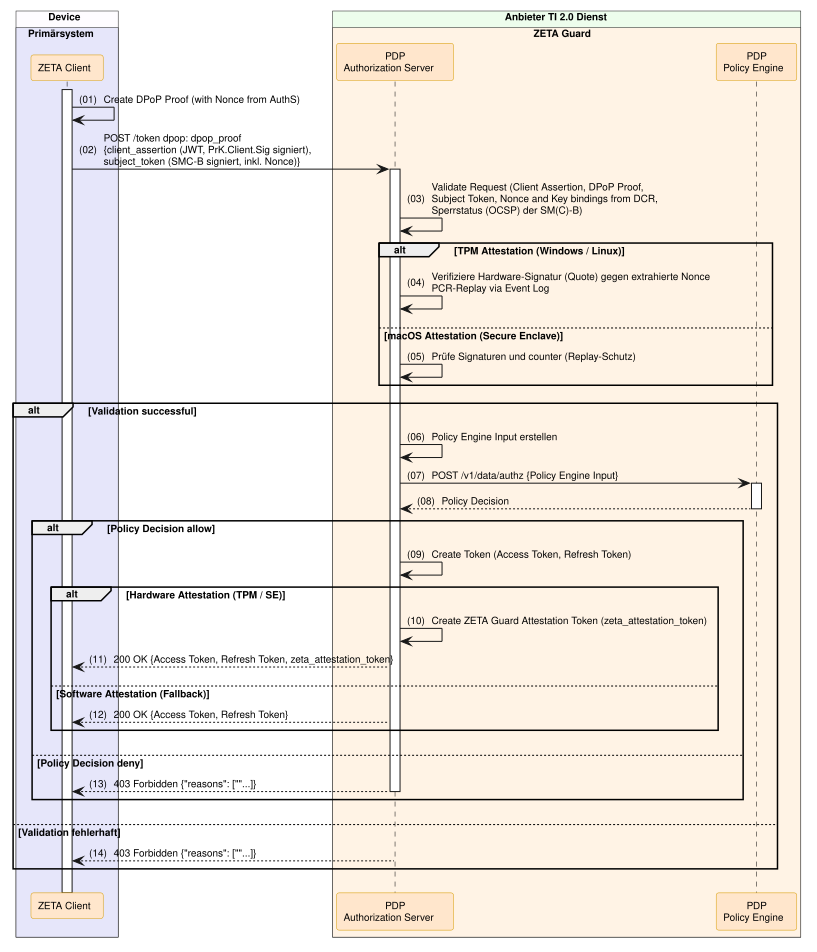

##### 4.1.6.1 Token Exchange Request

- **Pfad:** gemäß [OAuth-Authorization-Server Well-known](../../../src/schemas/as-well-known.yaml) Discovery (z. B. `/token`)

```http
POST /token HTTP/1.1
Host: auth.example.com
Content-Type: application/x-www-form-urlencoded
DPoP: eyJhbGciOiJFUzI1NiIsInR5cCI6ImRwb3Arand0IiwiandrIjp7Imt0eSI6IkVDIiwiY3J2IjoiUC0yNTYiLCJ4IjoiZDN...

grant_type=urn:ietf:params:oauth:grant-type:token-exchange
&subject_token=eyJhbGciOiJFUzI1NiIsInR5cCI6IkpXVCJ9.eyJpc3MiOiIxLTIzNDU2Nzg5MDEyMyIsInN1YiI6...
&subject_token_type=urn:ietf:params:oauth:token-type:jwt
&client_assertion_type=urn:ietf:params:oauth:client-assertion-type:jwt-bearer
&client_assertion=eyJhbGciOiJFUzI1NiIsInR5cCI6IkpXVCIsImtpZCI6ImNsaWVudC1rZXktdHBtLTAwMSJ9.eyJpc3MiOiJ6ZXRhLWNsaWVudC1kZXNrdG9wLTEiLCJzdWIiOiJ6ZXRhLWNsaWVudC1kZXNrdG9wLTEiLCJhdWQiOiJodHRwczovL2F1dGguZXhhbXBsZS5jb20vdG9rZW4iLCJjbGllbnRfc3RhdGVtZW50Ijp7fX0.signature
```

##### 4.1.6.2 Token Exchange Response

**Antwort-Beispiel (200 OK) — Hardware Attestation:**

```http
HTTP/1.1 200 OK
Content-Type: application/json

{
  "access_token": "eyJhbGciOiJFUzI1NiIsInR5cCI6ImF0K2p3dCIsImtpZCI6ImFzLXNpZ25pbmcta2V5LTEifQ...",
  "token_type": "DPoP",
  "expires_in": 3600,
  "refresh_token": "rt-desktop-8a7b6c5d4e3f2a1b",
  "zeta_attestation_token": "eyJhbGciOiJFUzI1NiIsInR5cCI6IkpXVCJ9.eyJpc3MiOiJodHRwczovL2F1dGguZXhhbXBsZS5jb20iLCJhdHRfdHlwZSI6InRwbSJ9.signature"
}
```

**Antwort-Beispiel (403 Forbidden) — Policy Deny:**

```http
HTTP/1.1 403 Forbidden
Content-Type: application/json

{
  "error": "access_denied",
  "error_description": "Policy evaluation denied access",
  "reasons": ["pcr_mismatch", "baseline_outdated"]
}
```

*Bei Fehlern siehe [8.2 API Fehler-Tabelle & Troubleshooting](#82-api-fehler-tabelle--troubleshooting).*

---

### 4.2 macOS Clients mit Apple App Attest Attestation

> **Preview** — Dieses Kapitel beschreibt den geplanten Ablauf für Apple App Attest-basierte Attestation auf macOS. Die Implementierung ist noch nicht abgeschlossen. Änderungen an Endpunkten, Payloads und Abläufen sind vorbehalten.

Unter macOS basiert der Vertrauensaufbau auf der **Secure Enclave** und dem **Apple App Attest Framework** (DeviceCheck). Das ZETA Client Primärsystem nutzt native macOS-APIs, um hardwaregebundene Schlüssel zu erzeugen und kryptografische Nachweise über die Geräteintegrität zu liefern.

#### 4.2.1 Client Installation und Schlüsselgenerierung

- *(01) Installation:* Der ZETA Client wird im User Space installiert.
- *(02)–(04) Client Instance Key:* Das langlebige Signatur-Schlüsselpaar (`PrK.Client.Sig` / `PuK.Client.Sig`) wird über `SecKeyCreateRandomKey` in der Secure Enclave erzeugt. Der private Schlüssel verlässt die Hardware nie; der Client erhält eine Key-Referenz (`keyId`).
- *Fallback:* Ist keine Secure Enclave verfügbar (z. B. in virtualisierten Umgebungen), wird auf softwarebasierte Schlüsselgenerierung zurückgefallen (siehe [4.3 Software-basierte Attestation](#43-stationäre-clients-mit-rein-software-basierter-attestation)).

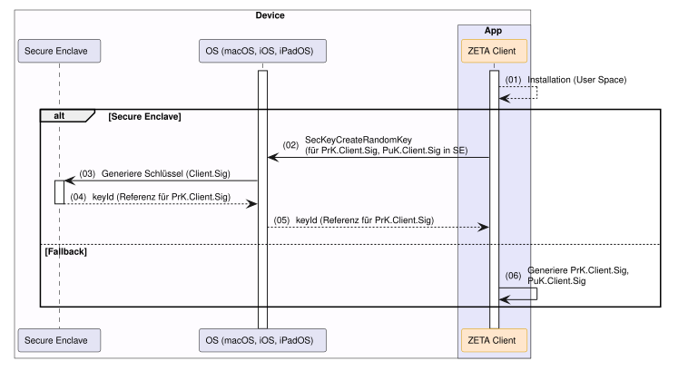

#### 4.2.2 Dynamic Client Registration (DCR)

Die Registrierung für macOS Clients nutzt das `Apple Attestation Object`, um die Bindung des Client-Schlüssels an die Secure Enclave nachzuweisen.

- **Verwendete Endpunkt-Pfade:** `POST /register`
- *(01) POST /register:* Der Client sendet die Registrierungsanfrage mit `attestation_type: "apple"`, `PuK.AK.Sig`, dem `Apple_Attestation_Object` (CBOR-kodiert), `PuK.Client.Sig` und `signed_Hash_PuK.Client.Sig`.
- *(02) Validierung:* Der AuthS verifiziert das Apple Attestation Object gegen die Apple App Attest Root CA und prüft, dass `PuK.AK.Sig` mit dem Blatt-Zertifikat (`x5c[0]`) des Objekts übereinstimmt.
- *(03) Alternativ — ZETA Attestation Token:* Liegt bereits ein gültiges `zeta_attestation_token` aus einer früheren Attestierung vor, kann dieses anstelle des Apple Attestation Objects vorgelegt werden (Fast-Path).
- *(04) Registrierung:* Der AuthS speichert den Client mit Status `pending_verification` und antwortet mit `201 Created {client_id}`.

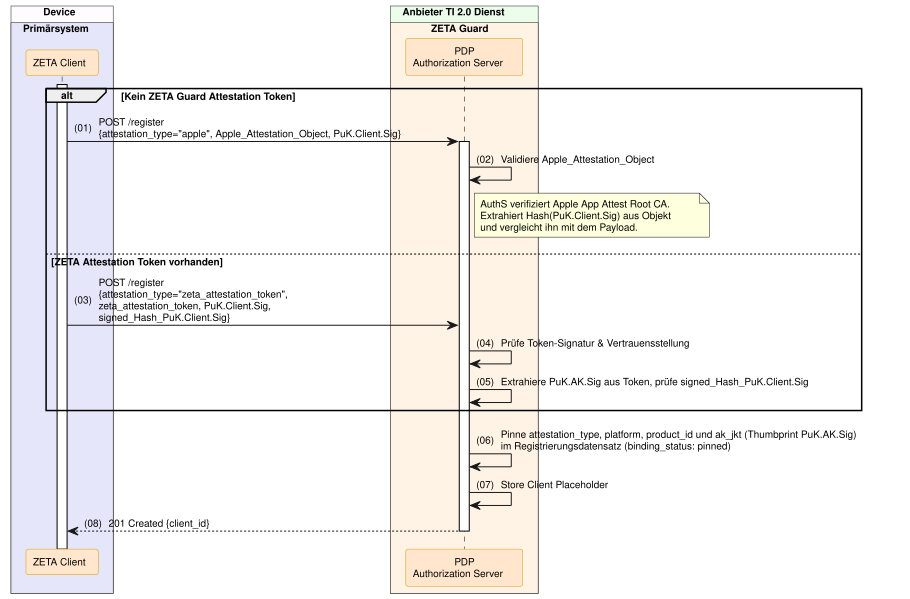

##### 4.2.2.1 Dynamic Client Registration Request

- **Pfad:** gemäß [OAuth-Authorization-Server Well-known](../../../src/schemas/as-well-known.yaml) Discovery (z. B. `/register`)
*Request-Schema:* [dcr-request.yaml](../../../src/schemas/dcr-request.yaml) (Variante: Apple Attestation)

```http
POST /register HTTP/1.1
Host: auth.example.com
Content-Type: application/json
```

```json
{
  "attestation_type": "apple",
  "client_name": "ZETA macOS Praxisclient v2.1",
  "token_endpoint_auth_method": "private_key_jwt",
  "grant_types": [
    "urn:ietf:params:oauth:grant-type:token-exchange",
    "refresh_token"
  ],
  "jwks": {
    "keys": [
      {
        "kty": "EC",
        "crv": "P-256",
        "x": "dGhpcyBpcyBhIHRlc3Qga2V5IGZvciBkb2N1bWVudGF0aW9u",
        "y": "ZXhhbXBsZSBwdWJsaWMga2V5IHkgY29vcmRpbmF0ZQ",
        "use": "sig",
        "kid": "client-key-se-001"
      }
    ]
  },
  "apple_attestation_object": "o2NmbXRxYXBwbGUtYXBwYXR0ZXN0Z2F0dFN0bXS...<Base64-kodiertes CBOR Attestation Object>...=="
}
```

##### 4.2.2.2 Dynamic Client Registration Response

**Antwort-Beispiel (201 Created):**
*Response-Schema:* [dcr-response.yaml](../../../src/schemas/dcr-response.yaml) (`ClientInformationResponse`)

```http
HTTP/1.1 201 Created
Content-Type: application/json
```

```json
{
  "client_id": "zeta-client-macos-a1b2c3",
  "status": "pending_verification",
  "client_id_issued_at": 1748520000
}
```

#### 4.2.3 Vorbereitung des Token Exchange (Client Assertion & Subject Token)

Die Vorbereitung für macOS unterscheidet sich in der Evidence-Erhebung: Statt eines TPM Quotes wird eine **Apple App Attest Assertion** generiert.

- *(01) Nonce abholen:* Der Client ruft `GET /nonce` am AuthS auf.
- *(02) DPoP Key Pair:* Kurzlebiges DPoP-Schlüsselpaar generieren.
- *(03) Subject Token:* Erstellen und über den Konnektor/TI-Gateway mit der SM(C)-B signieren.
- *(04)–(07) SMC-B Signatur:* Wie bei Windows/Linux.
- *(08) Posture-Erhebung:* macOS-spezifische Posture-Daten ermitteln (SIP-Status, Gatekeeper, OS-Version, Secure Boot).
- *(09) clientDataHash:* Berechnung von `Hash(Nonce + Posture-Daten)`.
- *(10)–(12) App Attest Assertion:* Über `DCAppAttest.generateAssertion(keyId: Handle_PrK.AK.Sig, clientDataHash)` wird in der Secure Enclave eine Hardware-Signatur über den `clientDataHash` erstellt. Ergebnis ist die `dc_assertion` (CBOR: Signatur + authenticatorData mit Counter).
- *(13) Client-Statement:* Evidence = `dc_assertion` + Posture-Daten im Klartext.
- *(14) Client Assertion:* JWT signiert mit `PrK.Client.Sig`.

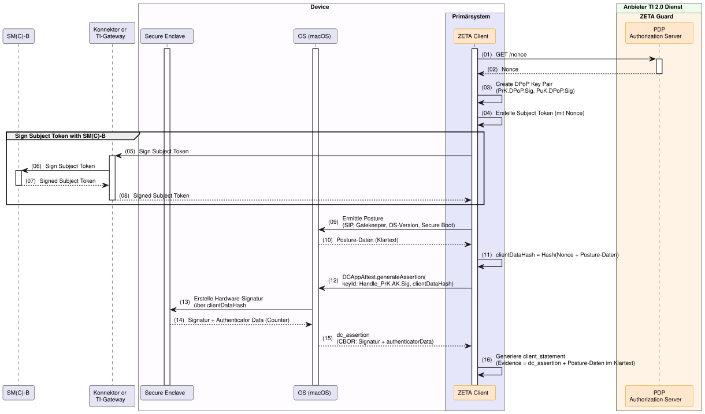

#### 4.2.4 Token Exchange (POST /token)

Der Token Exchange erfolgt analog zu Kapitel [4.1.6 Token Exchange](#416-token-exchange-post-token). Der AuthS unterscheidet anhand des Attestation-Typs die Validierungslogik:

- Bei **Apple Attestation** prüft der AuthS die Signaturen der `dc_assertion` und den Counter (Replay-Schutz) anstelle des TPM Quotes.
- Die Policy Engine Evaluation, Token-Erstellung und Response-Formate sind identisch.

Siehe [Abbildung 7: Token Exchange mit Attestation](#416-token-exchange-post-token) — der Ablauf ist für alle stationären Client-Typen einheitlich.

---

### 4.3 Stationäre Clients mit rein Software-basierter Attestation

Die rein software-basierte Attestation dient als **Fallback**, wenn kein TPM 2.0 (Windows/Linux) und keine Secure Enclave (macOS) verfügbar sind. In diesem Fall erfolgt die Registrierung ohne hardware-gebundenen Nachweis. Der AuthS gewährt entsprechend ein niedrigeres Vertrauensniveau.

#### 4.3.1 Client Installation und Schlüsselgenerierung

- *(01) Installation:* Der ZETA Client wird im User Space installiert.
- *(02) Client Instance Key:* Das Schlüsselpaar (`PrK.Client.Sig` / `PuK.Client.Sig`) wird rein softwarebasiert generiert (z. B. über die OS-Kryptobibliothek). Der private Schlüssel wird im Dateisystem oder Keychain gespeichert — eine Hardware-Bindung besteht nicht.

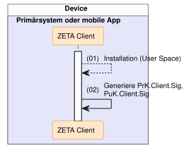

#### 4.3.2 Dynamic Client Registration (DCR)

Die Registrierung bei Software-basierter Attestation erfordert kein Challenge-Response-Verfahren und kein Attestation Object. Der Client übermittelt lediglich seinen öffentlichen Schlüssel.

- **Verwendete Endpunkt-Pfade:** `POST /register`
- *(00) Nonce abholen (empfohlen):* Der Client ruft `GET /nonce` am AuthS auf. Die Nonce wird für den Besitznachweis im nächsten Schritt benötigt.
- *(01) POST /register:* Der Client sendet `client_name`, `grant_types`, `jwks` (mit `PuK.Client.Sig`), `token_endpoint_auth_method` sowie — empfohlen — `platform`, `product_id`, `nonce` und `signed_hash_puk_client_sig` (Selbstsignatur über `SHA-256(PuK.Client.Sig || nonce)`).
- *(02) Registrierung:* Der AuthS prüft den Besitznachweis, sofern vorhanden, und speichert den Client mit Status `pending_verification`; er antwortet mit `201 Created {client_id}`.

> **Hinweis:** `nonce` und `signed_hash_puk_client_sig` sind im Software-Zweig aus Kompatibilitätsgründen optional — eine Registrierung ohne sie bleibt gültig. Ohne Besitznachweis ist die Registrierung allerdings nicht an den Besitz von `PrK.Client.Sig` gebunden; ein Dritter kann dann einen fremden öffentlichen Schlüssel registrieren und dessen spätere Registrierung per `409 registrationConflict` blockieren. Neue Client-Implementierungen sollten beide Felder setzen.

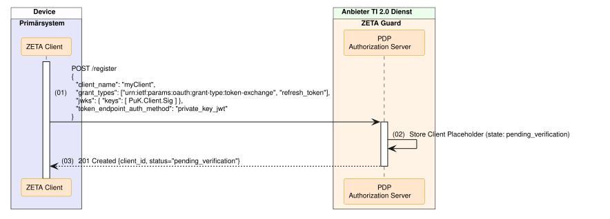

##### 4.3.2.1 Dynamic Client Registration Request

- **Pfad:** gemäß [OAuth-Authorization-Server Well-known](../../../src/schemas/as-well-known.yaml) Discovery (z. B. `/register`)
*Request-Schema:* [dcr-request.yaml](../../../src/schemas/dcr-request.yaml) (Variante: Legacy / Software Attestation)

```http
POST /register HTTP/1.1
Host: auth.example.com
Content-Type: application/json
```

```json
{
  "client_name": "ZETA Fallback Client v1.0",
  "token_endpoint_auth_method": "private_key_jwt",
  "grant_types": [
    "urn:ietf:params:oauth:grant-type:token-exchange",
    "refresh_token"
  ],
  "jwks": {
    "keys": [
      {
        "kty": "EC",
        "crv": "P-256",
        "x": "c29mdHdhcmUgYXR0ZXN0YXRpb24gZXhhbXBsZSBrZXk",
        "y": "ZmFsbGJhY2sgcHVibGljIGtleSB5IGNvb3JkaW5hdGU",
        "use": "sig",
        "kid": "client-key-sw-001"
      }
    ]
  }
}
```

##### 4.3.2.2 Dynamic Client Registration Response

**Antwort-Beispiel (201 Created):**
*Response-Schema:* [dcr-response.yaml](../../../src/schemas/dcr-response.yaml) (`ClientInformationResponse`)

```http
HTTP/1.1 201 Created
Content-Type: application/json
```

```json
{
  "client_id": "zeta-client-sw-fallback-x9y8z7",
  "status": "pending_verification",
  "client_id_issued_at": 1748520000
}
```

#### 4.3.3 Vorbereitung des Token Exchange (Client Assertion & Subject Token)

Die Vorbereitung bei Software-basierter Attestation ist vereinfacht, da keine Hardware-Evidence erhoben wird.

- *(01) Nonce abholen:* Der Client ruft `GET /nonce` am AuthS auf.
- *(02) DPoP Key Pair:* Kurzlebiges DPoP-Schlüsselpaar generieren.
- *(03) Subject Token:* Erstellen und über den Konnektor/TI-Gateway mit der SM(C)-B signieren.
- *(04)–(07) SMC-B Signatur:* Wie bei Windows/Linux und macOS.
- *(08) Client-Statement:* Generierung mit OS- und Primärsystem-Daten (ohne kryptografische Evidence).
- *(09) Client Assertion:* JWT signiert mit `PrK.Client.Sig`.

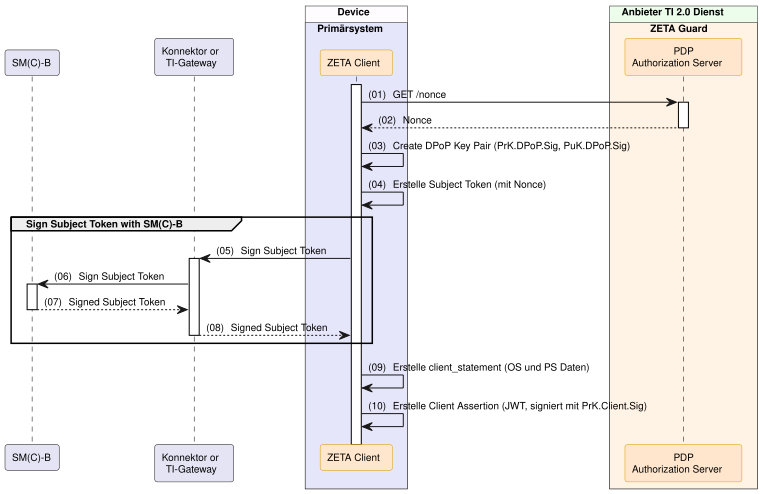

#### 4.3.4 Token Exchange (POST /token)

Der Token Exchange erfolgt analog zu Kapitel [4.1.6 Token Exchange](#416-token-exchange-post-token). Der AuthS erkennt am fehlenden Hardware-Nachweis den Attestation-Typ `software`:

- Es erfolgt **keine** Hardware-Signaturprüfung (kein TPM Quote, keine App Attest Assertion).
- Die Policy Engine wird mit entsprechend niedrigerem Vertrauensniveau aufgerufen.
- Bei positiver Policy Decision antwortet der AuthS mit Access Token und Refresh Token, jedoch **ohne** `zeta_attestation_token`.

Siehe [Abbildung 7: Token Exchange mit Attestation](#416-token-exchange-post-token) — der Ablauf ist für alle stationären Client-Typen einheitlich (Pfad "Software Attestation (Fallback)").

#### 4.3.5 Praxisbeispiel: Vollständiger Flow per cURL (Software Attestation)

Die folgenden cURL-Befehle zeigen den aktuell unterstützten Software-Attestation-Flow Ende-zu-Ende. Ersetzen Sie die Platzhalter (`$AUTH_SERVER`, `$CLIENT_ID`, etc.) durch Ihre konkreten Werte.

**Schritt 1 — Discovery:**

```bash
# PEP-Metadaten abrufen
curl -s https://$RESOURCE_SERVER/.well-known/oauth-protected-resource | jq .

# PDP-Metadaten abrufen
curl -s https://$AUTH_SERVER/.well-known/oauth-authorization-server | jq .
```

**Schritt 2 — Client-Registrierung (DCR):**

```bash
curl -X POST https://$AUTH_SERVER/register \
  -H "Content-Type: application/json" \
  -d '{
    "client_name": "Mein Primärsystem v1.0",
    "token_endpoint_auth_method": "private_key_jwt",
    "grant_types": ["urn:ietf:params:oauth:grant-type:token-exchange", "refresh_token"],
    "jwks": {
      "keys": [{
        "kty": "EC",
        "crv": "P-256",
        "x": "'$PUK_CLIENT_X'",
        "y": "'$PUK_CLIENT_Y'",
        "use": "sig",
        "kid": "'$CLIENT_KEY_ID'"
      }]
    }
  }'
# → 201 Created mit client_id
```

**Schritt 3 — Nonce abrufen:**

```bash
NONCE=$(curl -s https://$AUTH_SERVER/nonce | jq -r '.nonce')
```

**Schritt 4 — Token Exchange:**

```bash
# Voraussetzungen: $CLIENT_ASSERTION_JWT und $SUBJECT_TOKEN_JWT
# müssen zuvor programmatisch erstellt und signiert werden.
# Der DPoP-Proof ($DPOP_PROOF) wird mit dem kurzlebigen DPoP-Key signiert.

curl -X POST https://$AUTH_SERVER/token \
  -H "Content-Type: application/x-www-form-urlencoded" \
  -H "DPoP: $DPOP_PROOF" \
  -d "grant_type=urn:ietf:params:oauth:grant-type:token-exchange\
&subject_token=$SUBJECT_TOKEN_JWT\
&subject_token_type=urn:ietf:params:oauth:token-type:jwt\
&client_assertion_type=urn:ietf:params:oauth:client-assertion-type:jwt-bearer\
&client_assertion=$CLIENT_ASSERTION_JWT"
# → 200 OK mit access_token, refresh_token
```

**Schritt 5 — Resource Server anfragen:**

```bash
curl -X GET https://$RESOURCE_SERVER/api/resource \
  -H "Authorization: DPoP $ACCESS_TOKEN" \
  -H "DPoP: $DPOP_PROOF_FOR_RS"
```

*Bei Fehlern in jedem Schritt siehe [8.2 API Fehler-Tabelle & Troubleshooting](#82-api-fehler-tabelle--troubleshooting).*

---

## 5. Mobile Clients (Android, iOS, iPadOS)

> **Preview** — Dieses Kapitel beschreibt den geplanten Ablauf für mobile Clients. Die Implementierung ist noch nicht abgeschlossen. Änderungen an Endpunkten, Payloads und Abläufen sind vorbehalten. Die hier beschriebenen Abläufe umfassen die Dynamic Client Registration (DCR) sowie die anschließende OIDC-basierte Nutzerauthentifizierung.

### Quick Start: Welches Kapitel betrifft mich?

| Ihr Client-Szenario | Attestation-Typ | Kapitel | Status |
| --------------------- | ----------------- | --------- | -------- |
| iOS / iPadOS **mit** Secure Enclave | Apple App Attest | [5.1](#51-ios-und-ipados-clients-mit-apple-app-attest-attestation) | Preview |
| Android **mit** TEE / StrongBox | Android Key Attestation | [5.2](#52-android-clients-mit-android-key-attestation) | Preview |
| Mobil **ohne** Hardware-Sicherheit | Software Attestation | [5.3](#53-mobile-clients-mit-software-attestation) | Preview |

**Integrations-Checkliste (alle mobilen Clients):**

1. **[ ] Discovery**: FQDN des Resource Servers → PDP-Metadaten laden ([Kapitel 3](#3-discovery-und-konfiguration))
2. **[ ] Keys generieren**: Client Instance Key (`PuK.Client.Sig`) im TEE / StrongBox (Android) bzw. in der Secure Enclave (iOS) erstellen.
3. **[ ] DCR aufrufen**: Registrierung absenden (`POST /register`) → `201 Created` mit `client_id` im Status `pending_user_binding` (Fast-Path mit `zeta_attestation_token`: `bound`).
4. **[ ] Nutzer authentifizieren**: OIDC Authorization Code Flow mit PAR und PKCE (siehe [5.1.3](#513-authentifizierung--autorisierung-oidc-flow)).
5. **[ ] E-Mail binden (TOFU, nur bei `pending_user_binding`)**: E-Mail-Adresse über `POST /zeta/identity/bind-email` hinterlegen → OTP per E-Mail empfangen → `POST /zeta/identity/bind-email/verify` → volle Token per Token Exchange (siehe [5.1.3.3](#5133-teilflow-c-token-bezug-e-mail-bindung-und-ausstellung-der-zeta-token)).
6. **[ ] RS anfragen**: DPoP-gebundenes Token im Header mitsenden und die Ziel-API aufrufen ([Kapitel 7](#7-zugriff-auf-den-resource-server)).

---

### 5.1 iOS und iPadOS Clients mit Apple App Attest Attestation

iOS- und iPadOS-Clients nutzen die **Secure Enclave** und das **Apple App Attest Framework** zur hardwaregebundenen Schlüsselerzeugung und Attestierung. Die Bindung an den Nutzer erfolgt per **Trust-On-First-Use (TOFU)**: Nach der ersten OIDC-Anmeldung bestätigt der Nutzer eine E-Mail-Adresse per OTP (siehe [5.1.3.3](#5133-teilflow-c-token-bezug-e-mail-bindung-und-ausstellung-der-zeta-token)).

#### 5.1.1 Client Installation und Schlüsselgenerierung

Die Schlüsselgenerierung unter iOS/iPadOS ist identisch mit macOS (siehe [4.2.1 Schlüsselgenerierung macOS](#421-client-installation-und-schlüsselgenerierung)) — das Apple DeviceCheck-Framework nutzt auf allen Apple-Plattformen dieselbe API (`SecKeyCreateRandomKey` für die Secure Enclave).


#### 5.1.2 Dynamic Client Registration (DCR)

Die Registrierung etabliert den Client Instance Key und die Apple-Attestierung; sie erfordert **keine** Nutzerinteraktion. Die Bindung an den Nutzer per **Trust-On-First-Use (TOFU)** – Bestätigung einer E-Mail-Adresse per OTP – erfolgt erst **nach** der OIDC-Nutzerauthentisierung im Token-Bezug (siehe [5.1.3.3](#5133-teilflow-c-token-bezug-e-mail-bindung-und-ausstellung-der-zeta-token)). `POST /register/verify` wird von mobilen Clients nicht verwendet.

**Erstregistrierung (kein `zeta_attestation_token` vorhanden):**

- *(01) POST /register:* Der Client sendet die Registrierungsanfrage mit `attestation_type: "apple"`, dem `apple_attestation_object`, `PuK.Client.Sig` (in `jwks`) sowie den beiden `redirect_uris` (`oidc_redirect_uri`, `app_redirect_uri`) und `grant_types` inkl. `authorization_code` (siehe Hinweis unten).
- *(02) Validierung:* Der AuthS verifiziert das Apple Attestation Object gegen die Apple App Attest Root CA und extrahiert `Hash(PuK.Client.Sig)` aus dem Objekt zum Abgleich mit dem Payload. Er prüft die `redirect_uris` gegen die bei der gematik registrierten URIs.
- *(03) Pinning:* Der AuthS pinnt `attestation_type`, `platform`, `product_id` und `ak_jkt` (Thumbprint von `PuK.AK.Sig`) im Registrierungsdatensatz (`binding_status: pinned`, siehe [Bindung der `client_id`](#bindung-der-client_id-an-plattform-und-attestierungsverfahren)).
- *(04) 201 Created:* Der AuthS speichert den Client im Status `pending_user_binding` und antwortet mit `{client_id, status: "pending_user_binding"}`. In diesem Status erhält der Client am `token_endpoint` zunächst nur ein reduziertes E-Mail-Binding-Token, bis die E-Mail-Bindung abgeschlossen ist.

**Fast-Path (`zeta_attestation_token` vorhanden):**

- *(05) POST /register:* Liegt ein gültiger `zeta_attestation_token` aus einer früheren Registrierung vor, sendet der Client `attestation_type: "zeta_attestation_token"`, den Token, `PuK.Client.Sig` und einen Besitznachweis (`attestation_pop`, empfohlen gebunden an eine frische `nonce` aus `GET /nonce`).
- *(06) 201 Created:* Der AuthS prüft Signatur und Vertrauensstellung des Tokens, extrahiert `PuK.AK.Sig` und verifiziert den Besitznachweis. Die `redirect_uris` übernimmt er aus dem Token. Da der Token die bereits verifizierte E-Mail-Bindung trägt, entfällt die erneute TOFU-Bestätigung: Die Antwort lautet `{client_id, status: "bound"}`.

Der `zeta_attestation_token` (signiert, an `PuK.AK.Sig` gebunden über `cnf`, enthält die registrierten `redirect_uris`; siehe [zeta-attestation-token.yaml](../../../src/schemas/zeta-attestation-token.yaml)) wird **nicht** bei `/register` ausgestellt, sondern erst mit den vollen Token nach abgeschlossener E-Mail-Bindung (siehe [5.1.3.3](#5133-teilflow-c-token-bezug-e-mail-bindung-und-ausstellung-der-zeta-token)).

> **Hinweis – DCR-Metadaten für den OIDC-Flow:** Mobile Clients registrieren die Metadaten, die der Authorization Code Flow mit äußerem und innerem PAR ([5.1.3](#513-authentifizierung--autorisierung-oidc-flow)) benötigt:
>
> - `redirect_uris`: genau zwei vorab bei der gematik registrierte claimed-HTTPS-URIs – `oidc_redirect_uri` (`.../oidc`, innerer SekIDP-Flow) und `app_redirect_uri` (`.../app`, äußerer ZETA-Guard-Flow), siehe [5.4](#54-native-mobile-apps-universal-links--app-links-für-mehrere-clients). Der AuthS prüft beim äußeren PAR, dass `redirect_uri` und `oidc_redirect_uri` zu diesen registrierten URIs gehören.
> - `grant_types`: `authorization_code` (äußerer Flow) und `refresh_token` sowie `urn:ietf:params:oauth:grant-type:token-exchange` (Freischaltung der vollen Token nach der E-Mail-Bindung, siehe [5.1.3.3](#5133-teilflow-c-token-bezug-e-mail-bindung-und-ausstellung-der-zeta-token)).
> - `token_endpoint_auth_method: private_key_jwt`: Die Client Assertion mit `PrK.Client.Sig` authentisiert den Client sowohl am `pushed_authorization_request_endpoint` (`POST /par`) als auch am `token_endpoint` (RFC 9126, Abschnitt 2).

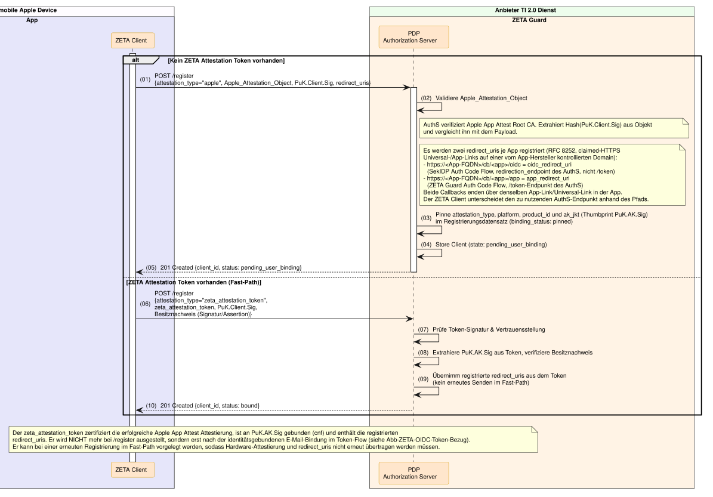

##### 5.1.2.1 Dynamic Client Registration Request

- **Pfad:** gemäß [OAuth-Authorization-Server Well-known](../../../src/schemas/as-well-known.yaml) Discovery (z. B. `/register`)
*Request-Schema:* [dcr-request.yaml](../../../src/schemas/dcr-request.yaml) (Variante: Apple Attestation)

```http
POST /register HTTP/1.1
Host: auth.example.com
Content-Type: application/json
```

```json
{
  "attestation_type": "apple",
  "client_name": "Praxis-App iOS v3.0",
  "token_endpoint_auth_method": "private_key_jwt",
  "grant_types": [
    "authorization_code",
    "urn:ietf:params:oauth:grant-type:token-exchange",
    "refresh_token"
  ],
  "redirect_uris": [
    "https://app.example-hersteller.de/cb/praxis-app-ios/oidc",
    "https://app.example-hersteller.de/cb/praxis-app-ios/app"
  ],
  "jwks": {
    "keys": [
      {
        "kty": "EC",
        "crv": "P-256",
        "x": "aW9zIHNlY3VyZSBlbmNsYXZlIGV4YW1wbGUga2V5",
        "y": "bW9iaWxlIGNsaWVudCBwdWJsaWMga2V5IGNvb3Jk",
        "use": "sig",
        "kid": "ios-instance-key-1"
      }
    ]
  },
  "apple_attestation_object": "o2NmbXRxYXBwbGUtYXBwYXR0ZXN0Z2F0dFN0bXS...<Base64-kodiertes CBOR>...=="
}
```

##### 5.1.2.2 Dynamic Client Registration Response (201 Created)

*Response-Schema:* [dcr-response.yaml](../../../src/schemas/dcr-response.yaml) (`ClientInformationResponse`). Es wird kein Registration Access Token ausgestellt; Folgeoperationen auf die Registrierung autorisiert der Client per Client Assertion. Das Feld `status` ist rein informativ – ob eine E-Mail-Bindung nötig ist, ergibt sich aus dem am Token-Endpunkt gewährten `scope`.

```http
HTTP/1.1 201 Created
Content-Type: application/json
Location: https://auth.example.com/register/zeta-client-ios-d4e5f6
```

```json
{
  "client_id": "zeta-client-ios-d4e5f6",
  "status": "pending_user_binding",
  "client_id_issued_at": 1748520000
}
```

#### 5.1.3 Authentifizierung & Autorisierung (OIDC Flow)

Der Token-Bezug für mobile Benutzer erfolgt über den standardisierten **OpenID Connect (OIDC) Authorization Code Flow** mit **Pushed Authorization Requests (PAR, RFC 9126)** und **PKCE (RFC 7636)**. Der ZETA Guard Authorization Server (AuthS) ist dabei Authorization Server für den ZETA Client (äußerer Flow) und agiert zugleich als **OIDC Relying Party** gegenüber dem sektoralen IDP der TI-Föderation (innerer Flow). Beide Flows beginnen jeweils mit einem PAR. Der nachfolgend beschriebene Ablauf ist für alle mobilen Client-Varianten (Apple, Android, Software) identisch.

**Vorbedingungen:**

- Die Service Discovery ist abgeschlossen; der Client kennt die Endpunkte des AuthS (siehe [Kapitel 3](#3-discovery-und-konfiguration)).
- Der Client wurde per DCR registriert (Status `pending_user_binding` oder `bound`) und besitzt `PrK.Client.Sig` / `PuK.Client.Sig` sowie zwei registrierte `redirect_uris` – `oidc_redirect_uri` (Pfad `.../oidc`, SekIDP-Flow) und `app_redirect_uri` (Pfad `.../app`, ZETA-Guard-Flow) (siehe [5.4](#54-native-mobile-apps-universal-links--app-links-für-mehrere-clients)).
- Der AuthS ist als Relying Party beim Federation Master registriert.
- App-Link / Universal-Link für ZETA Client und Authenticator-Modul sind im Betriebssystem registriert.

Der Gesamtablauf gliedert sich in drei Teilflows (A–C):

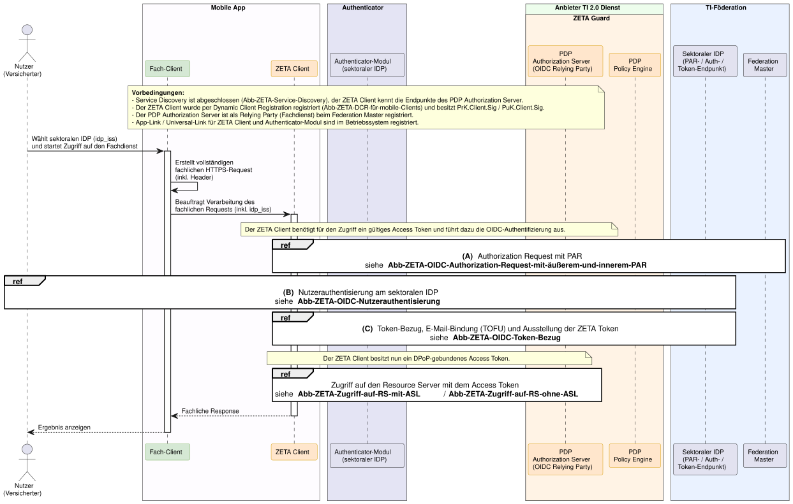

##### 5.1.3.1 Teilflow (A): Authorization Request mit äußerem und innerem PAR

Der ZETA Client startet die Autorisierung. Beide Auth Code Flows verwenden einen Pushed Authorization Request (PAR, RFC 9126):

- **Äußerer PAR (ZETA Guard Auth Code Flow):** Der ZETA Client übergibt seine Autorisierungsparameter per `POST /par` an den `pushed_authorization_request_endpoint` des AuthS und ruft den `authorization_endpoint` anschließend nur noch mit der erhaltenen `request_uri_app` auf.
- **Innerer PAR (SekIDP Auth Code Flow):** Der AuthS reicht als OIDC Relying Party seinerseits einen PAR beim sektoralen IDP ein.

Client und AuthS verwenden jeweils eigenes PKCE-Material (`*_app` bzw. `*_as`).

**Äußerer PAR – ZETA Client → AuthS:**

- *(01) PKCE erzeugen:* Der Client erzeugt `code_verifier_app`, `code_challenge_app = S256(code_verifier_app)` sowie `state_app`.
- *(02) POST /par:* Der Client sendet den Pushed Authorization Request an den `pushed_authorization_request_endpoint` des AuthS (aus `as-well-known`) und authentisiert sich dabei per `private_key_jwt` mit einer Client Assertion (signiert mit `PrK.Client.Sig`, Key Binding aus der DCR). Parameter: `{response_type=code, client_id, redirect_uri=app_redirect_uri, oidc_redirect_uri, code_challenge_app, code_challenge_method=S256, scope, state_app, idp_iss}`. Beide Redirect-URIs müssen zu den bei der DCR registrierten `redirect_uris` des Clients gehören.
- *(03) 201 Created:* Der AuthS validiert die Client Assertion und die Request-Parameter, speichert sie, erzeugt eine `request_uri_app` und antwortet mit `{request_uri_app, expires_in}` (60 s). Die `request_uri_app` ist nur einmal einlösbar; die Gültigkeit deckt den Wechsel in den User Agent ab und liegt unter der des inneren PAR beim IDP (max. 90 s), vgl. RFC 9126, Abschnitt 2.2.
- *(04) GET /authorize:* Der Client ruft den `authorization_endpoint` des AuthS nur mit `?client_id&request_uri=request_uri_app` auf. Die eigentlichen Autorisierungsparameter werden nicht mehr über den User Agent übertragen.

**Innerer PAR – AuthS → sektoraler IDP:**

- *(05) PKCE des AuthS:* Der AuthS erzeugt eigenes PKCE-Material (`code_verifier_as`, `code_challenge_as`), `state_as` und `nonce`.
- *(06) Optional – Entity Statement des IDP:* Ist das Entity Statement des IDP unbekannt, lädt der AuthS es über `GET /.well-known/openid-federation`, validiert die Trust Chain über den Federation Master und importiert Signaturschlüssel sowie OP-Metadaten (PAR-, Authorization-, Token-Endpunkt).
- *(07) POST /PAR:* Der AuthS sendet den inneren PAR (mTLS, `self_signed_tls_client_auth`) mit `{client_id, redirect_uri=oidc_redirect_uri, response_type=code, code_challenge_as, code_challenge_method=S256, scope, claims, acr_values, nonce, state_as}` an den IDP. `oidc_redirect_uri` ist der für den SekIDP-Flow bestimmte Redirection-Endpunkt der OIDC Relying Party (AuthS) und wird im **Entity Statement des AuthS** geführt.
- *(08) Optional – Entity Statement des Fachdienstes:* Bei Bedarf validiert der IDP analog die Trust Chain des Fachdienstes (Automatic Registration) und importiert dessen Schlüssel.
- *(09) 201 Created:* Der IDP validiert den PAR – u. a. prüft er `oidc_redirect_uri` gegen die im **AS-Entity-Statement** geführten `redirect_uris` –, erzeugt eine `request_uri` und antwortet mit `{request_uri, expires_in}` (max. 90 s).
- *(10) 302 Found:* Der AuthS beantwortet den `GET /authorize` des Clients mit einer Weiterleitung an den `authorization_endpoint` des IDP (`?client_id&request_uri`).

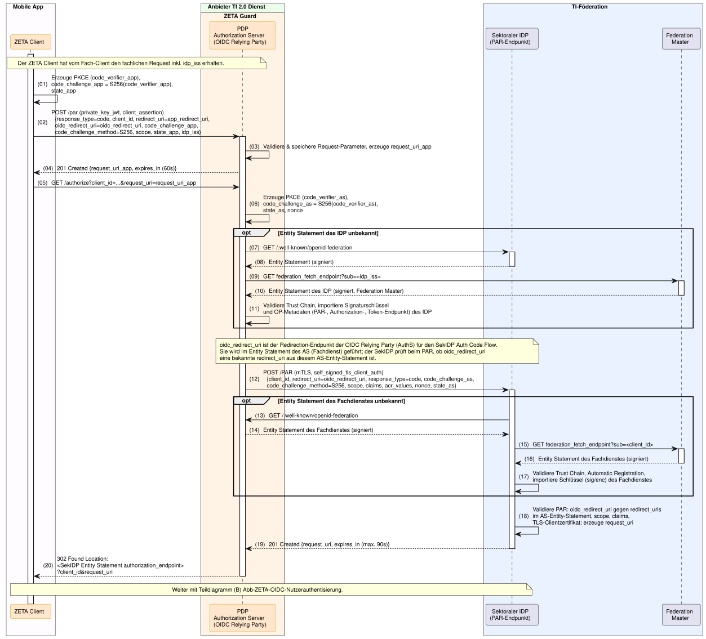

##### 5.1.3.2 Teilflow (B): Nutzerauthentisierung am sektoralen IDP

Die Authentisierung des Nutzers erfolgt über das Authenticator-Modul des sektoralen IDP. Das Ergebnis wird per App-Link / Universal-Link an den ZETA Client zurückgegeben.

- *(01) Authenticator öffnen:* Der Client öffnet das Authenticator-Modul (Deep-Link / Universal-Link) mit `{client_id, request_uri}`.
- *(02) GET /auth:* Das Authenticator-Modul ruft den Authorization-Endpunkt des IDP mit `{client_id, request_uri}` auf.
- *(03) Consent:* Der IDP prüft die `request_uri` (Bezug zum inneren PAR) und stellt die Consent-Abfrage gemäß Claims zusammen.
- *(04) Authentisierung:* Der Nutzer authentisiert sich (eGK+PIN / eID) und gibt den Consent frei.
- *(05) Code-Erzeugung:* Der IDP erzeugt den `AUTHORIZATION_CODE (IDP)` (Gültigkeit max. 90 s).
- *(06) 302 Found:* Der IDP antwortet mit `Location: <oidc_redirect_uri>?code=AUTH_CODE_IDP&state=state_as`.
- *(07) App-Link Rücksprung:* Das Betriebssystem stellt den App-Link / Universal-Link der ZETA Client App zu (`{code=AUTH_CODE_IDP, state=state_as}`). Der Client prüft `state_as` auf Übereinstimmung.

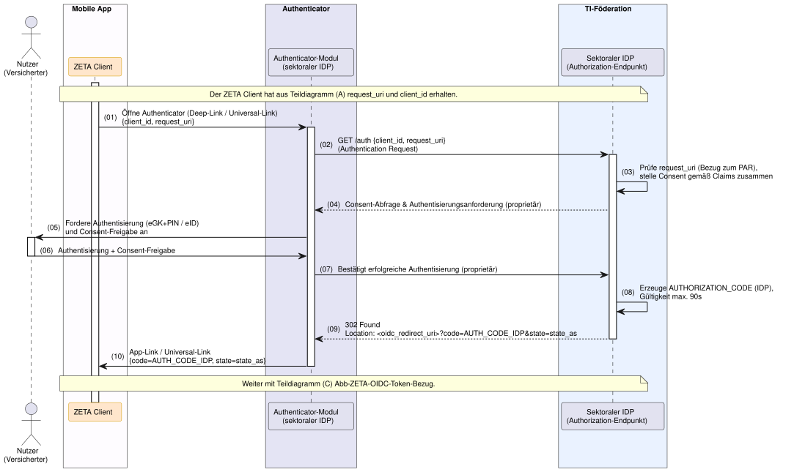

##### 5.1.3.3 Teilflow (C): Token-Bezug, E-Mail-Bindung und Ausstellung der ZETA Token

Im inneren Flow löst der AuthS den IDP-Code ein und gewinnt die Identitäts-Claims. Im äußeren Flow trifft die Policy Engine die Zugriffsentscheidung und der AuthS stellt die DPoP-gebundenen ZETA Token aus. Befindet sich der Client noch im Status `pending_user_binding`, schließt der Nutzer zuvor die TOFU-E-Mail-Bindung ab.

**Innerer Flow – Token-Bezug beim sektoralen IDP:**

> Beide Auth Code Flows enden über denselben App-/Universal-Link in der App. Der ZETA Client erkennt am **Pfad** der eingehenden `redirect_uri`, welcher AuthS-Endpunkt zu verwenden ist: `.../oidc` (`oidc_redirect_uri`) → `redirection_endpoint` (aus `as-well-known`, **nicht** `/token`) für den SekIDP-Flow; `.../app` (`app_redirect_uri`) → `token_endpoint` für den ZETA-Guard-Flow.

- *(01) GET <oidc_redirect_uri>:* Der Client folgt der Redirection an den `redirection_endpoint` des AuthS (nicht `/token`) mit `{code=AUTH_CODE_IDP, state=state_as}`.
- *(02) POST /token:* Der AuthS löst den Code beim IDP ein (mTLS) mit `{grant_type=authorization_code, code=AUTH_CODE_IDP, code_verifier=code_verifier_as, client_id, oidc_redirect_uri}`.
- *(03) 200 OK:* Der IDP prüft das TLS-Clientzertifikat und `code_verifier_as`, invalidiert den `AUTHORIZATION_CODE` und liefert `{id_token (JWE, ECDH-ES/A256GCM, signiert ES256), access_token, token_type=Bearer, expires_in}`.
- *(04) ID Token verarbeiten:* Der AuthS entschlüsselt und verifiziert das ID Token (Signatur via `kid`/`x5c`, `iss`/`aud`/`nonce`/`exp`) und extrahiert die Identitäts-Claims (KVNR, `acr`, `amr`, ...).

**Äußerer Flow – Policy-Entscheidung & ZETA Token:**

- *(05) 302 Found:* Der AuthS erzeugt den `AUTHORIZATION_CODE (AS)` und leitet den Client zurück (`Location: <app_redirect_uri>?code=AUTH_CODE_AS&state=state_app`). Der Client prüft `state_app`.
- *(06) POST /token (DPoP):* Der Client erzeugt ein DPoP-Schlüsselpaar (`PrK.DPoP.Sig` / `PuK.DPoP.Sig`) und einen DPoP Proof und ruft den `token_endpoint` des AuthS mit dem `dpop`-Header sowie `{grant_type=authorization_code, code=AUTH_CODE_AS, code_verifier=code_verifier_app, client_id, app_redirect_uri, client_assertion}` auf.
- *(07) Prüfung:* Der AuthS verifiziert `code_verifier_app` (gegen `code_challenge_app` aus dem äußeren PAR), den DPoP Proof und die Client Assertion (Key Binding aus DCR).
- *(08) POST /v1/data/authz:* Der AuthS erstellt den Policy Engine Input (Identitäts-Claims, Posture, Kontext) und ruft die Policy Engine (OPA) auf. Bei `deny` antwortet der AuthS mit `403 Forbidden` und einer Begründung.
- *(09) Bindungszustand:* Bei `allow` ermittelt der AuthS, ob die Identität (KVNR) an diesem ZETA Guard bereits mit einer verifizierten E-Mail-Adresse verknüpft und der Client gebunden ist. Im Status `bound` (Regelfall bei Folgeanmeldung) folgt direkt Schritt (14); im Status `pending_user_binding` folgt die E-Mail-Bindung.

**E-Mail-Bindung (TOFU) – nur im Status `pending_user_binding`:**

- *(10) Reduziertes Token:* Der AuthS stellt noch **keine** vollen Token aus, sondern ein kurzlebiges, DPoP-gebundenes E-Mail-Binding-Token (`expires_in` 300–900 s, **kein** Refresh Token). Der gewährte `scope` kodiert den nächsten Schritt:
  - Identität neu (Erstnutzung): `scope="zeta:email-binding zeta:email-verify"`.
  - Identität bekannt, E-Mail bereits gebunden: `scope="zeta:email-verify"`; der AuthS sendet das OTP sofort an die **gespeicherte** Adresse und liefert einen maskierten `email_hint` (z. B. `a***@d***.de`).
- *(11) POST /zeta/identity/bind-email (nur Erstnutzung):* Der Nutzer gibt seine E-Mail-Adresse ein; der Client sendet `{email}` mit `Authorization: DPoP <E-Mail-Binding-Token>` und DPoP Proof. Der AuthS sendet ein OTP an diese Adresse (TOFU-Pin) und antwortet mit `202 Accepted {challenge_type: "email_otp"}`. Ist die Mail nicht angekommen, fordert der Client sie über `POST /zeta/identity/bind-email/resend` erneut an (Cooldown ≥ 60 s, `429` bei Überschreitung).
- *(12) POST /zeta/identity/bind-email/verify:* Der Nutzer gibt den OTP-Code ein; der Client sendet `{verify_type: "email_otp", code}` mit dem E-Mail-Binding-Token – ohne `transaction_id`, die Korrelation erfolgt über das Token. Der AuthS prüft das OTP, verknüpft die E-Mail mit der Identität und setzt den Status auf `bound` (`200 OK {status: "bound"}`).
- *(13) Token Exchange:* Der Client tauscht das E-Mail-Binding-Token per Token Exchange (RFC 8693) gegen volle Token: `POST /token` mit `{grant_type=urn:ietf:params:oauth:grant-type:token-exchange, subject_token=<E-Mail-Binding-Token>, subject_token_type=urn:ietf:params:oauth:token-type:access_token, client_assertion}` und demselben DPoP-Schlüssel. Der Token Exchange gelingt nur im Status `bound` (sonst `400 invalid_grant`); läuft das E-Mail-Binding-Token vorher ab, beginnt der Client erneut mit Teilflow (A).

**Ausstellung der ZETA Token:**

- *(14) 200 OK:* Der AuthS stellt `{access_token (DPoP-gebunden), refresh_token, token_type=DPoP, expires_in}` aus. Bei Hardware-Attestation (Apple, Android) enthält die Antwort zusätzlich den `zeta_attestation_token`, den der Client für eine spätere Registrierung im Fast-Path aufbewahrt (siehe [5.1.2](#512-dynamic-client-registration-dcr)).

Der ZETA Client besitzt nun ein DPoP-gebundenes Access Token und kann auf den Resource Server zugreifen (siehe [Kapitel 7](#7-zugriff-auf-den-resource-server)). Die Session-Erneuerung erfolgt über den Refresh Token.

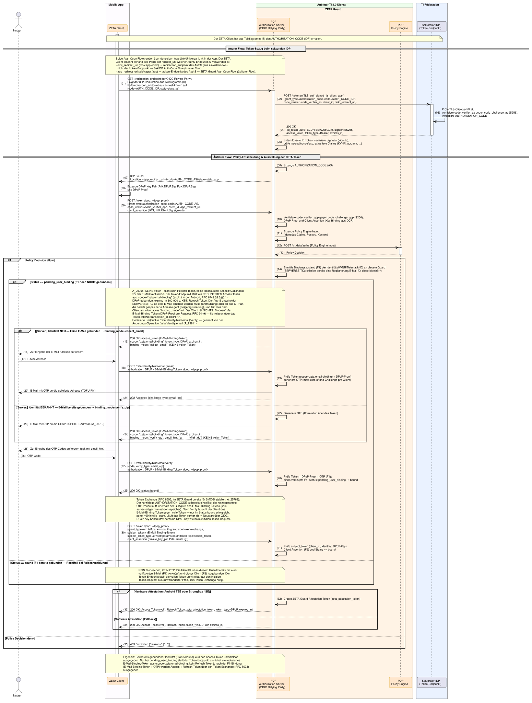

---

### 5.2 Android Clients mit Android Key Attestation

Android-Clients nutzen den **Android Keystore** mit **TEE (Trusted Execution Environment)** oder **StrongBox** zur hardwaregebundenen Schlüsselerzeugung. Zusätzlich kann die **Google Play Integrity API** zur App-Integritätsprüfung eingesetzt werden.

#### 5.2.1 Client Installation und Schlüsselgenerierung

- *(01) Client Instance Key:* Das Schlüsselpaar (`PrK.Client.Sig` / `PuK.Client.Sig`) wird über `KeyStore.generateKey` im TEE/StrongBox erzeugt.
- *(02) Hash berechnen:* `hash_puk_client_sig = SHA-256(PuK.Client.Sig)`.
- *(03) Attestation Key:* Ein dedizierter Attestation Key (`PrK.AK.Sig` / `PuK.AK.Sig`) wird mit `AttestationChallenge = hash_puk_client_sig` erzeugt. Android liefert dabei automatisch die `android_key_attestation_certificate_chain`.
- *(04) Besitznachweis:* Der Client signiert `hash_puk_client_sig` mit `PrK.AK.Sig` → `signed_hash_puk_client_sig`.
- *(05) Play Integrity (optional):* Über `requestIntegrityToken(nonce = hash_puk_client_sig)` wird ein Geräte- und App-Integritätstoken eingeholt.

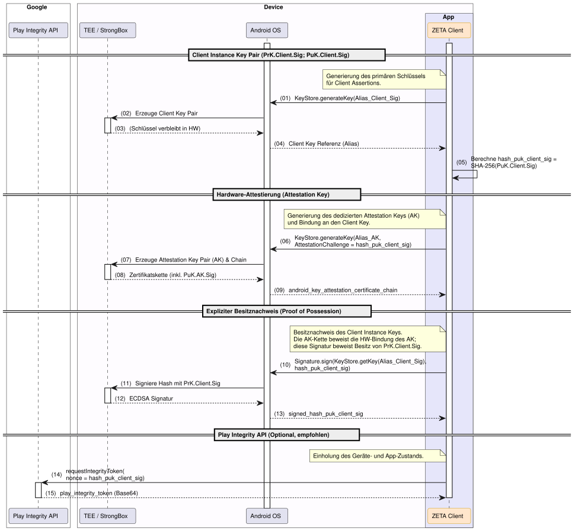

#### 5.2.2 Dynamic Client Registration (DCR)

Der Ablauf entspricht dem der Apple-Clients (siehe [5.1.2](#512-dynamic-client-registration-dcr)): keine Nutzerinteraktion bei der Registrierung, TOFU-E-Mail-Bindung erst nach der OIDC-Nutzerauthentisierung (siehe [5.1.3.3](#5133-teilflow-c-token-bezug-e-mail-bindung-und-ausstellung-der-zeta-token)).

- *(01) POST /register:* Der Client sendet `attestation_type: "android"`, `android_key_attestation_certificate_chain` (deren Blatt-Zertifikat `PuK.AK.Sig` trägt), `PuK.Client.Sig` (in `jwks`), `signed_hash_puk_client_sig`, die beiden `redirect_uris`, `grant_types` inkl. `authorization_code` und optional `play_integrity_token` (siehe Hinweis in [5.1.2](#512-dynamic-client-registration-dcr)).
- *(02) Validierung:* Der AuthS validiert die Zertifikatskette gegen die Google Hardware Attestation Root CA, prüft `signed_hash_puk_client_sig` und wertet optional die Play Integrity Verdicts aus.
- *(03) Pinning:* Der AuthS pinnt `attestation_type`, `platform`, `product_id` und `ak_jkt` im Registrierungsdatensatz (`binding_status: pinned`).
- *(04) 201 Created:* Der AuthS speichert den Client im Status `pending_user_binding` und antwortet mit `{client_id, status: "pending_user_binding"}`.
- *Fast-Path:* Mit einem gültigen `zeta_attestation_token` registriert sich der Client wie in [5.1.2](#512-dynamic-client-registration-dcr) beschrieben ohne erneute Hardware-Attestierung und ohne erneute E-Mail-Bindung (`status: "bound"`).

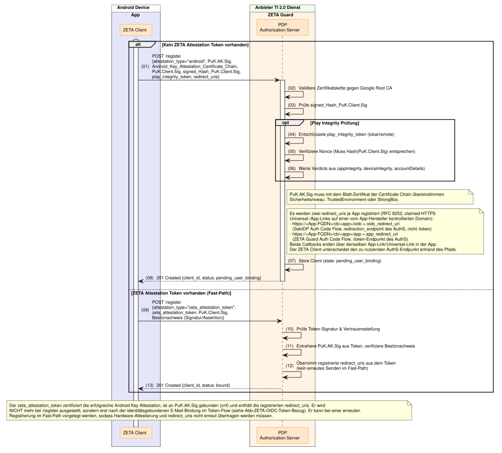

##### 5.2.2.1 Dynamic Client Registration Request

- **Pfad:** gemäß [OAuth-Authorization-Server Well-known](../../../src/schemas/as-well-known.yaml) Discovery (z. B. `/register`)
*Request-Schema:* [dcr-request.yaml](../../../src/schemas/dcr-request.yaml) (Variante: Android Attestation)

```http
POST /register HTTP/1.1
Host: auth.example.com
Content-Type: application/json
```

```json
{
  "attestation_type": "android",
  "client_name": "Tablet-Praxishelfer v2.0",
  "token_endpoint_auth_method": "private_key_jwt",
  "grant_types": [
    "authorization_code",
    "urn:ietf:params:oauth:grant-type:token-exchange",
    "refresh_token"
  ],
  "redirect_uris": [
    "https://app.example-hersteller.de/cb/praxishelfer/oidc",
    "https://app.example-hersteller.de/cb/praxishelfer/app"
  ],
  "jwks": {
    "keys": [
      {
        "kty": "EC",
        "crv": "P-256",
        "x": "h82Jdsa8s98JsdK2ls9Djsa82ndS1ksd",
        "y": "d7sJSD9s82JskdP2ksld92JsdkaL3msd",
        "use": "sig",
        "kid": "android-instance-key-1"
      }
    ]
  },
  "android_key_attestation_certificate_chain": [
    "MIIFzDCCA7SgAwIBAgIR...<Blatt-Zertifikat (C.AK.Sig)>...",
    "MIIFvTCCA6WgAwIBAgIT...<Intermediate CA>...",
    "MIIDuzCCAqOgAwIBAgIG...<Google HW Attestation Root CA>..."
  ],
  "signed_hash_puk_client_sig": "MEQCID7sNsjdi9Nskd...<Base64url ECDSA Signatur>...",
  "play_integrity_token": "eyJhbGciOiJFUzI1NiIsInR5cCI6IkpXVCIsImtpZCI6...<Base64 Token>..."
}
```

##### 5.2.2.2 Dynamic Client Registration Response (201 Created)

*Response-Schema:* [dcr-response.yaml](../../../src/schemas/dcr-response.yaml) (`ClientInformationResponse`). Es wird kein Registration Access Token ausgestellt; Folgeoperationen auf die Registrierung autorisiert der Client per Client Assertion. Das Feld `status` ist rein informativ – ob eine E-Mail-Bindung nötig ist, ergibt sich aus dem am Token-Endpunkt gewährten `scope`.

```http
HTTP/1.1 201 Created
Content-Type: application/json
Location: https://auth.example.com/register/zeta-client-android-g7h8i9
```

```json
{
  "client_id": "zeta-client-android-g7h8i9",
  "status": "pending_user_binding",
  "client_id_issued_at": 1748520000
}
```

#### 5.2.3 Authentifizierung & Autorisierung (OIDC Flow)

Der OIDC-Ablauf (Authorization Request mit äußerem und innerem PAR, Nutzerauthentisierung am sektoralen IDP, Token-Bezug, E-Mail-Bindung und Ausstellung der ZETA Token) ist für alle mobilen Client-Varianten identisch und in [5.1.3](#513-authentifizierung--autorisierung-oidc-flow) vollständig beschrieben.

---

### 5.3 Mobile Clients mit Software Attestation

Mobile Clients ohne verfügbare Hardware-Sicherheitsmodule (kein TEE/StrongBox auf Android, keine Secure Enclave auf iOS) können den Software-Attestation-Fallback nutzen. Das Vertrauensniveau ist entsprechend niedriger.

#### 5.3.1 Client Installation und Schlüsselgenerierung

Die Schlüsselgenerierung erfolgt rein softwarebasiert, identisch zu stationären Clients (siehe [4.3.1 Schlüsselgenerierung SW-Att](#431-client-installation-und-schlüsselgenerierung)).


#### 5.3.2 Dynamic Client Registration (DCR)

Die Registrierung erfolgt wie bei der stationären Software-Attestation, ergänzt um die für den OIDC-Flow benötigten `redirect_uris`. Wie bei den Hardware-Varianten erfolgt die TOFU-E-Mail-Bindung erst nach der OIDC-Nutzerauthentisierung (siehe [5.1.3.3](#5133-teilflow-c-token-bezug-e-mail-bindung-und-ausstellung-der-zeta-token)). Einen Fast-Path gibt es für Software-Attestation nicht, da kein `zeta_attestation_token` ausgestellt wird.

- *(01) GET /nonce:* Der Client ruft eine frische Nonce ab (empfohlen).
- *(02) POST /register:* Der Client sendet `client_name`, `grant_types` (inkl. `authorization_code`), `jwks` (mit `PuK.Client.Sig`), `token_endpoint_auth_method` und die beiden `redirect_uris` — ohne Attestation-spezifische Felder (siehe Hinweis in [5.1.2](#512-dynamic-client-registration-dcr)). Empfohlen werden zusätzlich `platform`, `product_id` sowie `nonce` und `signed_hash_puk_client_sig` über `SHA-256(PuK.Client.Sig || nonce)`; siehe den Hinweis in Kapitel [4.3.2](#432-dynamic-client-registration-dcr).
- *(03) Prüfung und Pinning:* Der AuthS prüft `nonce` und `signed_hash_puk_client_sig` (sofern übermittelt) und pinnt `attestation_type: "software"` sowie – sofern übermittelt – `platform` und `product_id` (kein `ak_jkt`).
- *(04) 201 Created:* Der AuthS speichert den Client im Status `pending_user_binding` und antwortet mit `{client_id, status: "pending_user_binding"}`.

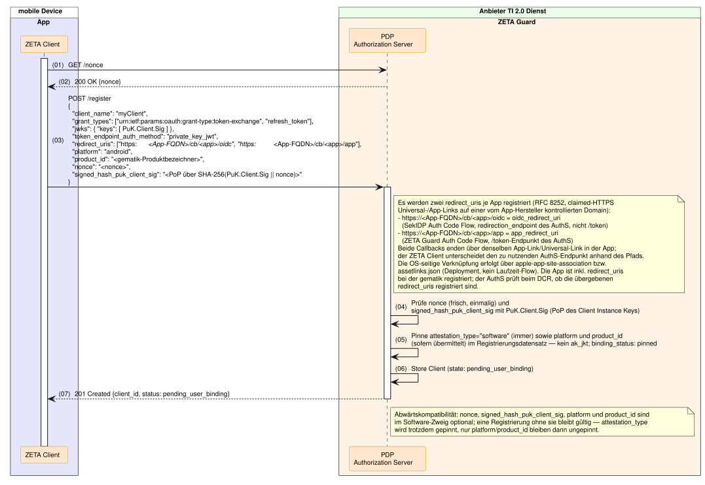

##### 5.3.2.1 Dynamic Client Registration Request

- **Pfad:** gemäß [OAuth-Authorization-Server Well-known](../../../src/schemas/as-well-known.yaml) Discovery (z. B. `/register`)
*Request-Schema:* [dcr-request.yaml](../../../src/schemas/dcr-request.yaml) (Variante: Legacy / Software Attestation)

```http
POST /register HTTP/1.1
Host: auth.example.com
Content-Type: application/json
```

```json
{
  "client_name": "ZETA Mobile Fallback v1.0",
  "token_endpoint_auth_method": "private_key_jwt",
  "grant_types": [
    "authorization_code",
    "urn:ietf:params:oauth:grant-type:token-exchange",
    "refresh_token"
  ],
  "redirect_uris": [
    "https://app.example-hersteller.de/cb/zeta-mobile/oidc",
    "https://app.example-hersteller.de/cb/zeta-mobile/app"
  ],
  "jwks": {
    "keys": [
      {
        "kty": "EC",
        "crv": "P-256",
        "x": "bW9iaWxlIHNvZnR3YXJlIGF0dGVzdGF0aW9uIGtleQ",
        "y": "ZmFsbGJhY2sgbW9iaWxlIGtleSB5IGNvb3JkaW5hdGU",
        "use": "sig",
        "kid": "mobile-sw-key-001"
      }
    ]
  }
}
```

##### 5.3.2.2 Dynamic Client Registration Response (201 Created)

*Response-Schema:* [dcr-response.yaml](../../../src/schemas/dcr-response.yaml) (`ClientInformationResponse`). Es wird kein Registration Access Token ausgestellt; Folgeoperationen auf die Registrierung autorisiert der Client per Client Assertion. Das Feld `status` ist rein informativ – ob eine E-Mail-Bindung nötig ist, ergibt sich aus dem am Token-Endpunkt gewährten `scope`.

```http
HTTP/1.1 201 Created
Content-Type: application/json
Location: https://auth.example.com/register/zeta-client-mobile-sw-j0k1l2
```

```json
{
  "client_id": "zeta-client-mobile-sw-j0k1l2",
  "status": "pending_user_binding",
  "client_id_issued_at": 1748520000
}
```

#### 5.3.3 Authentifizierung & Autorisierung (OIDC Flow)

Der OIDC-Ablauf (Authorization Request mit äußerem und innerem PAR, Nutzerauthentisierung am sektoralen IDP, Token-Bezug, E-Mail-Bindung und Ausstellung der ZETA Token) ist für alle mobilen Client-Varianten identisch und in [5.1.3](#513-authentifizierung--autorisierung-oidc-flow) vollständig beschrieben.

---

### 5.4 Native mobile Apps: Universal Links / App Links für mehrere Clients

Mehrere native Apps auf demselben Endgerät können denselben ZETA Guard Authorization Server und Resource Server nutzen. Jede App ist dabei ein eigener OAuth-Client mit eigener `client_id` und eigener `redirect_uris`-Registrierung (siehe DCR, [`POST /register`](../../../src/schemas/dcr-request.yaml)).

Je App werden **zwei** `redirect_uris` registriert – eine je Auth Code Flow (siehe [5.1.3](#513-authentifizierung--autorisierung-oidc-flow)):

- `oidc_redirect_uri` (Pfad `.../oidc`) für den SekIDP Auth Code Flow,
- `app_redirect_uri` (Pfad `.../app`) für den ZETA Guard Auth Code Flow.

Beide Callbacks enden über denselben App-/Universal-Link in der App. Damit das mobile Betriebssystem die OIDC-Redirection (`302 Found` an die `redirect_uri`) eindeutig der richtigen App zustellt und der ZETA Client den richtigen AuthS-Endpunkt anspricht, gelten folgende Festlegungen gemäß [RFC 8252](https://www.rfc-editor.org/info/rfc8252) (OAuth 2.0 for Native Apps):

- **Claimed HTTPS Redirect-URIs (Universal Links / App Links):** Die `redirect_uris` sind HTTPS-URLs auf einer **vom App-Hersteller kontrollierten Domain** – nicht auf der AuthS-Domain. Die App kennt den AuthS-FQDN zur Entwicklungszeit nicht; er wird erst zur Laufzeit über `opr-well-known`/`as-well-known` aufgelöst. Die `redirect_uris` müssen daher AuthS-unabhängig sein.
- **Vorab-Registrierung bei der gematik:** Der Hersteller registriert die `redirect_uris` vorab bei der gematik. Nur so können sie (a) im AuthS hinterlegt werden – beim DCR (`POST /register`) prüft der AuthS, ob die übergebenen `redirect_uris` registriert sind (exakter String-Vergleich) – und (b) in das **Entity Statement des AuthS** aufgenommen werden, gegen das der sektorale IDP `oidc_redirect_uri` beim inneren PAR prüft. Beim äußeren PAR (`POST /par`) prüft der AuthS, dass `redirect_uri` (= `app_redirect_uri`) und `oidc_redirect_uri` zu den per DCR registrierten `redirect_uris` des Clients gehören.
- **Ein eigener Pfad je App und je Flow:** Jede App registriert ihre `redirect_uris` mit unterschiedlichem Pfad (z. B. `https://<App-FQDN>/cb/app-a/oidc` und `https://<App-FQDN>/cb/app-a/app`). Die App-Zuordnung erfolgt über Host und Pfad – **nicht** über Query-Parameter wie `client_id`. Der **letzte Pfad-Abschnitt** (`oidc` | `app`) bestimmt den Flow: Bei `.../oidc` reicht der ZETA Client den empfangenen Code an den `redirection_endpoint` des AuthS weiter (nicht `/token`), bei `.../app` an den `token_endpoint`.
- **OS-seitige Verknüpfung (Domain-Ownership):** Auf der App-Hersteller-Domain wird je Plattform eine Verknüpfungsdatei bereitgestellt, die App-Identitäten den jeweiligen Pfaden zuordnet:
  - iOS/iPadOS/macOS: `https://<App-FQDN>/.well-known/apple-app-site-association`
  - Android: `https://<App-FQDN>/.well-known/assetlinks.json`

  Beide Dateien können mehrere Apps (App IDs bzw. Package-Namen + Signatur-Fingerprints) enthalten. Dies ist eine **Deployment-Konfiguration** auf der App-Hersteller-Domain und kein Laufzeit-Flow; der App-Hersteller ist für die Bereitstellung und Pflege dieser Dateien verantwortlich.
- **Fallback „App nicht installiert":** Da die `redirect_uris` reguläre HTTPS-URLs sind, werden sie bei nicht installierter App im System-Browser geöffnet und können auf der App-Hersteller-Domain serverseitig verarbeitet werden (z. B. Hinweis-/Installationsseite).

Die `redirect_uris` sind ein Client-Attribut (auf der App-Hersteller-Domain) und werden per DCR beim AuthS registriert. Sie sind zu unterscheiden vom `redirection_endpoint` des AuthS: Dieser ist ein Server-Endpunkt **auf der AuthS-Domain**, an den der ZETA Client den im `.../oidc`-Callback erhaltenen IDP-Code weiterreicht; er wird – wie `authorization_endpoint`, `pushed_authorization_request_endpoint`, `token_endpoint`, `registration_endpoint`, `jwks_uri` – über das AuthS-`.well-known` (RFC 8414) verteilt. Die `redirect_uris` selbst werden **nicht** über das AuthS-`.well-known` verteilt.

---

## 6. Dienst-zu-Dienst Kommunikation (Backend-to-Backend)

Für die sichere Maschine-zu-Maschine Interaktion zwischen Backends wird die **Workload Identity Federation** etabliert. Ein Backend-Dienst authentifiziert sich mit einem signierten JWT (ausgestellt durch den eigenen PDP/Kubernetes IDP) am token_endpoint des Ziel-Dienstes.

### 6.1 POST /token (Client Credentials & Token Exchange)

*Siehe auch [Abbildung 24: Dienst-zu-Dienst Kommunikation](../../../images/zeta-flows/Abb-ZETA-Dienst-zu-Dienst-Kommunikation.svg)*

**Anfrage-Beispiel:**

```http
POST /token HTTP/1.1
Host: auth-target.example.com
Content-Type: application/x-www-form-urlencoded

grant_type=urn:ietf:params:oauth:grant-type:token-exchange
&subject_token_type=urn:ietf:params:oauth:token-type:jwt
&subject_token=eyJhbGciOiJFUzI1NiIsInR5cCI6IkpXVCJ9.eyJpc3MiOiJodHRwczovL2F1dGgtc291cmNlLmV4YW1wbGUuY29tIiwic3ViIjoic2VydmljZS1hIiwiYXVkIjoiaHR0cHM6Ly9hdXRoLXRhcmdldC5leGFtcGxlLmNvbS90b2tlbiJ9.signature
&requested_token_type=urn:ietf:params:oauth:token-type:access_token
```

**Antwort-Beispiel (200 OK):**

```http
HTTP/1.1 200 OK
Content-Type: application/json

{
  "access_token": "eyJhbGciOiJFUzI1NiIsInR5cCI6IkpXVC...",
  "token_type": "Bearer",
  "expires_in": 3600
}
```

---

## 7. Zugriff auf den Resource Server

Nach erfolgreichem Erhalt der Access-Token sendet der ZETA-Client Anfragen an den Fachdienst (Resource Server).

### 7.1. Option A: Zugriff mit ZETA/ASL (Tunnelverschlüsselung)

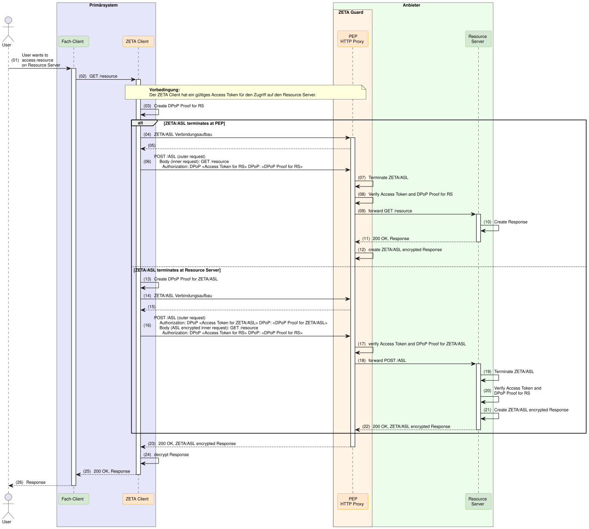*

Erfordert der Fachdienst eine dedizierte Verschlüsselung (ASL), baut der Client einen verschlüsselten Tunnel auf. Der Client sendet die verschlüsselten Fachdaten per HTTP `POST` an den Endpoint `/ASL` des PEP Proxys.

**Anfrage-Beispiel:**

```http
POST /ASL HTTP/1.1
Host: api.example.com
Content-Type: application/jose
Authorization: DPoP eyJhbGciOiJFUzI1NiIsInR5cCI6IkpXVCIsImtpZCI6ImFzLXNpZ25pbmcta2V5LTEifQ...
DPoP: eyJhbGciOiJFUzI1NiIsInR5cCI6ImRwb3Arand0IiwiandrIjp7...

[Verschlüsselte JWE Payload (Fachnachricht)]
```

---

### 7.2. Option B: Direkter Zugriff ohne ZETA/ASL

*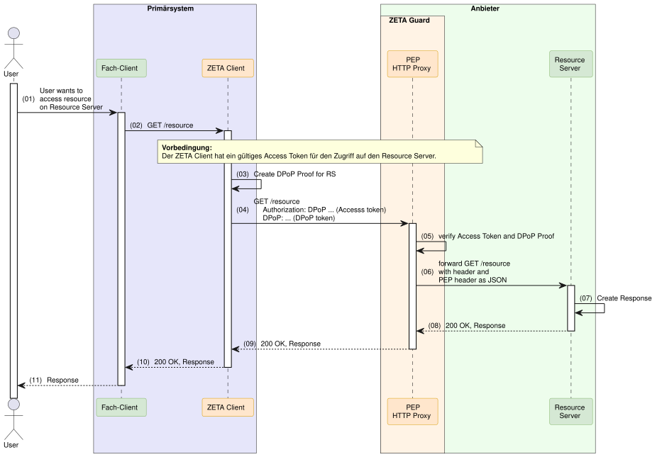*

Der Client sendet den Request direkt an den PEP mit dem Access Token im `Authorization`-Header (DPoP-gebunden) und dem DPoP-Proof im `DPoP`-Header.

**Anfrage-Beispiel:**

```http
GET /api/resource HTTP/1.1
Host: api.example.com
Authorization: DPoP eyJhbGciOiJFUzI1NiIsInR5cCI6IkpXVCIsImtpZCI6ImFzLXNpZ25pbmcta2V5LTEifQ...
DPoP: eyJhbGciOiJFUzI1NiIsInR5cCI6ImRwb3Arand0IiwiandrIjp7...
Accept: application/json
```

**Weiterleitung an den Resource Server:**
Der PEP HTTP Proxy validiert Token und Signaturen und hängt die entschlüsselten/validierten Metadaten als Custom Header an die interne Backend-Anfrage an:

- `zeta-user-info` (Base64URL-kodiertes JSON mapping zu [zeta-user-info.yaml](../../../src/schemas/zeta-user-info.yaml))
- `zeta-client-data` (Base64URL-kodiertes JSON mapping zu [client-data.yaml](../../../src/schemas/client-data.yaml))

**Entschlüsseltes Beispiel für `zeta-user-info`:**

```json
{
  "identifier": "1-234567890123",
  "professionOID": "1.2.276.0.76.4.50",
  "commonName": "Arztpraxis Dr. Meier",
  "organizationName": "Gemeinschaftspraxis Meier & Kollegen"
}
```

---

## 8. Fehlerbehandlung und Statuscodes (Zentrales Nachschlagewerk)

Dieses Kapitel dient Entwicklern als zentrales Nachschlagewerk zur Analyse und schnellen Behebung von Fehlern bei der ZETA API-Integration.

### 8.1 JSON Fehler-Schema

Sämtliche Fehler der ZETA Guard Endpunkte folgen dem JSON-Schema [zeta-error.yaml](../../../src/schemas/zeta-error.yaml):

```json
{
  "error": "Fehler-Identifikationsstring (z.B. invalid_request)",
  "error_description": "Klartextbeschreibung des Fehlers für Entwickler",
  "error_uri": "https://gematik.de/errors/Fehler-Identifikationsstring"
}
```

### 8.2 API Fehler-Tabelle & Troubleshooting

| HTTP Status | Fehler-Code (`error`) | Mögliche Ursache | Troubleshooting-Schritte |
| ------------- | ----------------------- | ------------------ | -------------------------- |
| **400** | `invalid_request` | Der DPoP-Proof oder das HTTP-Format ist ungültig. | 1. Gültigkeit des `DPoP`-Headers prüfen (z.B. Zeitstempel, URI).<br>2. Parameter im URL-kodierten Request-Body validieren. |
| **400** / **401** | `invalid_request` / `invalid_client` | Die Zeitstempel des DPoP-Proofs oder der Client Assertion liegen außerhalb des Toleranzfensters des AuthS — Ursache ist praktisch immer eine abweichende lokale Systemuhr. Typische Meldungen im `error_description`: `DPoP proof is not active`, `Token is not active`, `Token was issued in the future`, `Token expiration is too far in the future and iat claim not present in token`. | 1. Serverzeit-Offset aus dem `Date`-Header der AuthS-Antwort ermitteln und alle `iat`/`exp`/`nbf` daraus ableiten (siehe [Zeitsynchronisation und Serverzeit-Offset](#zeitsynchronisation-und-serverzeit-offset)).<br>2. Anfrage einmalig mit neu bestimmtem Offset wiederholen.<br>3. Abweichung der Systemuhr des Clients gegen eine verlässliche Zeitquelle messen und protokollieren. |
| **401** | `invalid_client` | Die Signatur der Client Assertion ist ungültig oder der Client Instance Key unbekannt. | 1. DCR-Registrierungsstatus des Clients prüfen.<br>2. Verwendeten Signaturalgorithmus und Schlüssel verifizieren. |
| **403** | `access_denied` | Attestierungsprüfung fehlgeschlagen; PCR-Werte weichen von Baseline ab. | 1. TPM PCRs prüfen (Integrität von ZAS/System).<br>2. Sicherstellen, dass keine unerlaubte Kernel-Modifikation vorliegt. |
| **404** | `resource_not_found` | Falscher Well-Known Pfad oder Endpoint. | 1. FQDN des Resource Servers und Pfadstruktur prüfen. |
| **409** | `conflict` | Der Client Instance Key (`PuK.Client.Sig`) existiert bereits im PDP-System. | 1. Verwenden Sie ein neues Schlüsselpaar für eine Neuinstallation.<br>2. Prüfen Sie, ob ein Registrierungs-Reset nötig ist. |
| **429** | `rate_limit_exceeded` | Zu viele Anfragen (z.B. an den `/nonce` Endpoint). | 1. Implementieren Sie Exponential Backoff mit Jitter clientseitig.<br>2. Den Timeout-Wert in `Retry-After` auswerten. |
| **500** | `server_error` | Ein unerwarteter interner Verarbeitungsfehler im ZETA Guard. | 1. Logfiles des PDP / OPA überprüfen.<br>2. Verbindung zur PDP-Datenbank verifizieren. |

---

## 9. Schlüsselverwaltung

Um ein klares Verständnis der kryptografischen Architektur zu vermitteln, verwendet diese API **Schlüssel-IDs** nach folgendem Schema: `[Typ].[Komponente].[Zweck]` (z.B. `PrK.Client.Sig` für den privaten Signaturschlüssel des ZETA Clients).

### 9.1 ZETA Client Schlüssel (Nutzer-Seite)

Diese Schlüssel verbleiben in der Verfügungsgewalt des Endnutzers (Smartphone / Primärsystem) bzw. der Institution.

| Schlüssel-ID | Bezeichnung & Zweck | Speicherung / Verwendung |
| -------------- | --------------------- | -------------------------- |
| **PrK.Client.Sig**<br>**PuK.Client.Sig** | Client Instance Key Pair<br>Langlebiges ECC-Schlüsselpaar zur Identifikation der Client-Installation. | PrK: Zwingend in Hardware (TPM, Secure Enclave, TEE) generiert und gespeichert. Kein Export möglich.<br>PuK: Wird bei der Registrierung (DCR) an den ZETA Guard übertragen. |
| **PrK.DPoP.Sig**<br>**PuK.DPoP.Sig** | DPoP Schlüsselpaar<br>Kurzlebiger (Session-basierter) Schlüssel zum Signieren von Anfragen als Proof of Possession. | PrK: Wird für die Dauer der Session sicher lokal gehalten (RAM). Eine Verschlüsselung durch `PrK.Client.Sig` ist unzulässig.<br>PuK: Wird im HTTP-Header gesendet. |
| **PrK.AK.Sig**<br>**PuK.AK.Sig** | Plattform Attestation Key<br>Zur Signatur des Client-Zustands. | PrK: Hardware-gebunden (TPM / Secure Enclave).<br>PuK: Wird bei der Registrierung (DCR) an den ZETA Guard übertragen. |
| **PrK.EK.Sig**<br>**PuK.EK.Sig**<br>**C.EK.Sig** | TPM 2.0 Endorsement Keys<br>Wird bei der TPM Attestation verwendet. | PrK: Hardware-gebunden (TPM / Secure Enclave).<br>PuK / C: Wird bei der Registrierung (DCR) an den ZETA Guard übertragen. |
| **PrK.SM(C)-B.Sig**<br>**C.SM(C)-B.Sig** | SMC-B Institutionsidentität<br>Zur Signatur des subject_token beim Token Exchange. | PrK: Verbleibt hardwaregebunden auf der Smartcard (SMC-B) oder im HSM-B.<br>C: Wird übermittelt und durch AuthS gegen TSL validiert. |

---

### 9.2 gematik verwaltete Schlüssel (TI)

Diese Zertifikate und Schlüssel werden im ZETA Kontext verwendet. Sie sind Bestandteil der Telematikinfrastruktur (TI).

| Schlüssel-ID | Bezeichnung & Zweck | Speicherung / Verteilung |
| -------------- | --------------------- | -------------------------- |
| **PrK.TI-RootCA.Sig**<br>**C.TI-RootCA.Sig** | TI Root CA<br>Oberster Vertrauensanker der TI. | C: Lokal in Truststores hinterlegt.<br>PrK: Offline / Hochsicher bei der gematik. |
| **PrK.TI-KompCA.Sig**<br>**C.TI-KompCA.Sig** | Komponenten PKI CA<br>Stellt die Zertifikate für die TI-Dienste aus. | C: Über die TSL als vertrauenswürdig verteilt. |
| **PrK.TI-SMCB-CA.Sig**<br>**C.TI-SMCB-CA.Sig** | SMC-B CA<br>Stellt die Institutionszertifikate aus. | C: Über die TSL als vertrauenswürdig verteilt. |
| **PrK.TI-FedMaster.Sig**<br>**PuK.TI-FedMaster.Sig** | Federation Master Signer<br>Zur Signatur der Entity Statements in der OIDC-Föderation. | PuK: Im ZETA Guard hinterlegt.<br>PrK: Bei der gematik. |

---

## 10. Versionierung, Performance & Verhaltensregeln

### 10.1 Versionierung

Die ZETA API folgt den Regeln von **Semantic Versioning 2.0.0 (SemVer)**. Major-Versionen werden über den URL-Pfad abgebildet (z. B. `/v1/`), während Minor- und Patch-Versionen über das Discovery-Dokument ausgegeben werden.

### 10.2 Performance- und Lastannahmen

Die Bearbeitungszeiten müssen unter Last folgende Kriterien erfüllen:

- **PEP HTTP Proxy Latenz**: Mittelwert ≤ 75 ms, 99%-Quantil ≤ 1 s.
- **PDP /nonce Endpoint**: Mittelwert ≤ 33 ms, 99%-Quantil ≤ 500 ms.
- **PDP /register & /token Endpoints**: Mittelwert ≤ 75 ms, 99%-Quantil ≤ 1 s.

### 10.3 Client-Verhaltensregeln

- **Rate Limits**: Clients MÜSSEN die Ratenbegrenzung beachten. Wird ein HTTP-Status `429` empfangen, sind erneute Anfragen mit einem **Exponential Backoff mit Jitter** auszuführen.
- **Zeitstempel**: Clients MÜSSEN `iat`, `exp` und `nbf` aller signierten Artefakte aus der Serverzeit ableiten, die aus dem `Date`-Header einer AuthS-Antwort bestimmt wird, und DÜRFEN sich NICHT auf die lokale Systemuhr verlassen (siehe [Zeitsynchronisation und Serverzeit-Offset](#zeitsynchronisation-und-serverzeit-offset)).

---

## 11. Support und Kontaktinformationen

Bitte beachten Sie das [CONTRIBUTING.md](../../../CONTRIBUTING.md) für Informationen zum Support und zu Kontaktmöglichkeiten.

---

## Glossar

| Abkürzung | Bedeutung | Beschreibung |
| ----------- | ----------- | -------------- |
| **AK** | Attestation Key | Hardwaregebundener Schlüssel zur Signatur von Attestation Evidence (TPM Quote bzw. Apple App Attest Assertion). |
| **ASL** | Application-layer Security Link | Zusätzliche Verschlüsselungsschicht zwischen Client und Resource Server (JWE-basiert). |
| **AuthS** | Authorization Server | Der PDP in seiner Rolle als OAuth 2.0 Authorization Server (Token-Ausstellung, DCR). |
| **DCR** | Dynamic Client Registration | Registrierungsprozess, bei dem ein Client seine Identität beim ZETA Guard etabliert (RFC 7591). |
| **DPoP** | Demonstrating Proof-of-Possession | Mechanismus zur Bindung von Access Tokens an einen kryptografischen Schlüssel (RFC 9449). |
| **EK** | Endorsement Key | Herstellerseitig erzeugter, nicht-exportierbarer TPM-Schlüssel zur Identifikation des Chips. |
| **FQDN** | Fully Qualified Domain Name | Vollqualifizierter Domänenname des geschützten Resource Servers. |
| **IPC** | Inter-Process Communication | Kommunikationskanal zwischen ZAS (privilegiert) und ZETA Client (User Space). |
| **OPA** | Open Policy Agent | Policy Engine im PDP zur Auswertung von Autorisierungsregeln. |
| **OTP** | One-Time Password | Einmal-Passwort zur Bestätigung der E-Mail-Bindung (TOFU) bei mobilen Clients. |
| **PCR** | Platform Configuration Register | TPM-Register, in die Integritätsmessungen geschrieben werden. |
| **PDP** | Policy Decision Point | Zentrale Entscheidungskomponente im ZETA Guard (Authorization Server + Policy Engine). |
| **PEP** | Policy Enforcement Point | HTTP Reverse Proxy, der Zugriffsentscheidungen des PDP durchsetzt. |
| **PKCE** | Proof Key for Code Exchange | Erweiterung des OAuth Authorization Code Flow gegen Code-Interception (RFC 7636). |
| **PoPP** | Proof of Patient Presence | Token zum Nachweis der Anwesenheit eines Versicherten (VSDM2-Kontext). |
| **SE** | Secure Enclave | Apple-Hardware-Sicherheitsmodul zur Schlüsselgenerierung und -speicherung. |
| **SMC-B** | Security Module Card Typ B | Smartcard mit dem Institutionszertifikat des Leistungserbringers. |
| **SRK** | Storage Root Key | Lokaler Vertrauensanker im TPM, unter dem weitere Schlüssel hierarchisch erzeugt werden. |
| **TEE** | Trusted Execution Environment | Hardware-isolierte Ausführungsumgebung auf Android-Geräten. |
| **TOFU** | Trust-On-First-Use | Vertrauensmodell, bei dem bei der ersten Anmeldung einer Identität an einem ZETA Guard eine E-Mail-Adresse gebunden und per OTP bestätigt wird; Folgeanmeldungen stützen sich auf diese Bindung. |
| **TPM** | Trusted Platform Module | Hardware-Sicherheitschip (Version 2.0) zur Schlüsselverwaltung und Integritätsmessung. |
| **TSL** | Trust-service Status List | Liste vertrauenswürdiger CA-Zertifikate in der TI-Infrastruktur. |
| **ZAS** | ZETA Attestation Service | Privilegierter Hintergrunddienst auf Windows/Linux, der das TPM anspricht und Messungen durchführt. |
