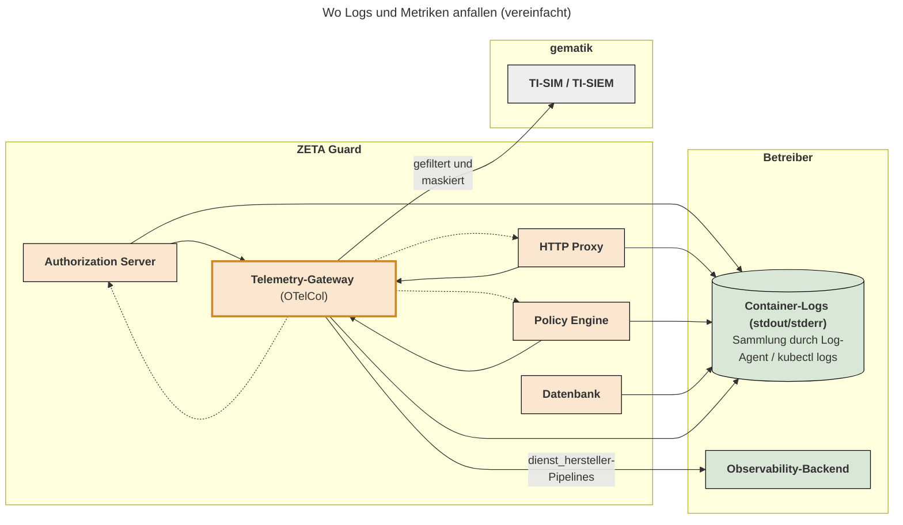

# Troubleshooting & Debugging

Dieses Dokument richtet sich an Betreiber von Fachdiensten, die ZETA Guard
betreiben. Es beschreibt im Sinne eines Betriebshandbuchs, wo sich die Logs und
Metriken der einzelnen ZETA-Guard-Komponenten finden, welche Ereignisse geloggt
werden, wie sich Log-Level für eine Fehleranalyse erhöhen lassen und welche
Hinweise für Aufbewahrung, Rotation und Alarmierung gelten.

Verwandte Dokumente:

* [Wie Sie ein Observability-Backend anschließen](Wie_Sie_ein_Observability-Backend_an_ZETA-Guard_anschließen.md)
* [Wie Sie Telemetrie des Resource Servers an die gematik schicken](Wie_Sie_Telemetrie_des_Resource_Servers_an_die_gematik_schicken.md)
* [Übersicht über alle Security-Events von ZETA-Guard](../Referenzen/Security-Events.md)
* [Telemetrie-Attribute von ZETA-Guard](../Referenzen/Telemetrie-Attribute.md)

## Inhaltsverzeichnis

- [Wo sich Logs und Metriken finden](#wo-sich-logs-und-metriken-finden)
- [Geloggte Ereignisse](#geloggte-ereignisse)
- [Personenbezogene Daten in Logs und Telemetrie](#personenbezogene-daten-in-logs-und-telemetrie)
- [Log-Beispiele](#log-beispiele)
- [Fehlerbehandlung gegenüber Clients](#fehlerbehandlung-gegenüber-clients)
- [Debugging: Log-Level erhöhen](#debugging-log-level-erhöhen)
- [Aufbewahrung und Rotation](#aufbewahrung-und-rotation)
- [Alarmierung bei kritischen Fehlern](#alarmierung-bei-kritischen-fehlern)
- [Doppelte Logdaten vermeiden](#doppelte-logdaten-vermeiden)

## Wo sich Logs und Metriken finden

Alle ZETA-Guard-Komponenten schreiben ihre Logs nach `stdout`/`stderr` des
jeweiligen Containers. ZETA Guard bringt keinen eigenen Log-Collector mit. Sie
können aber Container-Logs über die Kubernetes-üblichen Mechanismen des
Betreibers einsehen: `kubectl logs` für die Ad-hoc-Analyse, ein Log-Agent des
Betreibers für die dauerhafte Sammlung.

Zusätzlich senden Authorization Server (Keycloak), Policy Engine (OPA) und HTTP
Proxy (nginx) Teile ihrer Logs sowie Metriken und Traces direkt an das
Telemetry-Gateway (OpenTelemetry Collector).
Dessen `*/dienst_hersteller`-Pipelines sind für das eigene Observability-Backend
des Betreibers vorgesehen,
siehe [Wie Sie ein Observability-Backend anschließen](Wie_Sie_ein_Observability-Backend_an_ZETA-Guard_anschließen.md).



Alle Container schreiben ihre Logs nach `stdout`/`stderr` (Pfeile zu
„Container-Logs“).
Innerhalb von ZETA Guard senden die Komponenten zusätzlich Logs (teilweise),
Metriken und Traces an das Telemetry-Gateway; die gestrichelten Pfeile stehen
für das Abfragen der Metrik-Endpunkte durch das Gateway. „Container-Logs“ ist
keine Komponente, sondern steht für den Kubernetes-Log-Mechanismus, dessen
Sammlung und Speicherung der Betreiber verantwortet.

| Komponente (Workload)                                            | Logs                                                                                                                                                                                                     | Log-Level-Konfiguration                                                                                                                                               | Metriken                                                                                                                                               |
|------------------------------------------------------------------|----------------------------------------------------------------------------------------------------------------------------------------------------------------------------------------------------------|-----------------------------------------------------------------------------------------------------------------------------------------------------------------------|--------------------------------------------------------------------------------------------------------------------------------------------------------|
| Authorization Server (`authserver`, Keycloak)                    | `stdout`, JSON-Format (Helm-Value `authServerLogConsoleOutput`)                                                                                                                                          | Helm-Value `authserver.log.level` (Default `INFO`), wird als `KC_LOG_LEVEL` gesetzt                                                                                   | Management-Port `9000`, Pfad `/auth-mgmt/metrics` (Prometheus-Format)                                                                                  |
| HTTP Proxy (`pep-proxy`, nginx)                                  | nginx-Access- und -Error-Log auf `stdout`, beide zusätzlich per Syslog an das Telemetry-Gateway; Modul-Logs auf `stdout` und per OTLP an das Telemetry-Gateway                                           | Derzeit kein Helm-Value; Modul-Logs (stdout und OTLP) filtern über die Umgebungsvariable `RUST_LOG` (Default `info`), siehe [Debugging](#debugging-log-level-erhöhen) | Optionaler `nginx-prometheus-exporter`-Sidecar auf Port `9113` (Helm-Value `pepproxyMetricsEnabled`); Modul-Metriken per OTLP an das Telemetry-Gateway |
| Policy Engine (`opa`)                                            | `stdout`/`stderr` (Server-Log); Decision-Logs und Status-Updates an das Telemetry-Gateway, im Konsolen-Log nur je nach `opa.logDecisions` (Default `true`) bzw. `opa.logStatusUpdates` (Default `false`) | Helm-Values `opa.logLevel` (`debug`/`info`/`warn`/`error`), `opa.logDecisions`, `opa.logStatusUpdates`                                                                | OPA-API auf Port `8181` (`/metrics`); Status-/Bundle-Metriken über Helm-Value `opaStatusPrometheus`                                                    |
| Telemetry-Gateway (`telemetry-gateway`, OpenTelemetry Collector) | `stdout`/`stderr`                                                                                                                                                                                        | Über die Collector-Konfiguration (Helm-Values unter `telemetry-gateway`)                                                                                              | Eigenmetriken auf Port `8888`                                                                                                                          |
| Datenbank (`keycloak-db`, CloudNativePG/PostgreSQL)              | `stdout` (vom CloudNativePG-Operator verwaltet)                                                                                                                                                          | PostgreSQL-Parameter über die CloudNativePG-Konfiguration                                                                                                             | Optional PodMonitor über Helm-Value `cloudnativePg.monitoring` (erfordert Prometheus-Operator)                                                         |

Die genannten Metrik-Endpunkte werden bereits vom Telemetry-Gateway intern
abgefragt (Prometheus-Receiver) und stehen dort in den Metrik-Pipelines zur
Verfügung; ein direktes Scraping durch ein Betreiber-Monitoring ist daher
nicht erforderlich, aber möglich.

Wichtige ZETA-spezifische Metriken des HTTP Proxy (per OTLP an das
Telemetry-Gateway):

| Name                           | Instrument Type | Unit (UCUM) | Description                                                                       |
|--------------------------------|-----------------|-------------|-----------------------------------------------------------------------------------|
| `http.server.request.duration` | Histogram       | `s`         | Dauer aller Requests am HTTP Proxy (Attribute: HTTP-Methode, Statuscode)          |
| `zeta.asl.sessions.active`     | Gauge           |             | Einträge (Handshakes + Sessions) im ASL-Session-Cache                             |
| `zeta.jwk_cache.age`           | Gauge           | `s`         | Sekunden seit der letzten erfolgreichen JWKS-Update (Attribut: `target`)          |
| `zeta.jwk_cache.refresh`       | Counter         |             | JWKS-Updatesversuche nach Ziel und Ergebnis (Attribute: `target`, `outcome`)      |
| `zeta.ocsp.response.age`       | Gauge           | `s`         | Sekunden seit dem letzten erfolgreichen OCSP-Abruf                                |
| `zeta.asl.signer_cert.expiry`  | Gauge           | `s`         | Ablaufzeitpunkt (`not_after`) des ASL-Signaturzertifikats in Unix-Epochensekunden |

### Health-Endpunkte

Der Authorization Server stellt auf dem Management-Port `9000` die Endpunkte
`/auth-mgmt/health/live` und `/auth-mgmt/health/ready` bereit; der Port ist
über den Kubernetes-Service `authserver` clusterintern erreichbar,
zusätzliche Container-Ports sind nicht erforderlich. Für die reine
Verfügbarkeitsüberwachung genügt es in der Regel, den Pod-/Containerstatus über
die Kubernetes-API abzufragen — die Liveness-/Readiness-Probes werten diese
Endpunkte bereits aus. Der HTTP Proxy hat keinen eigenen Health-Endpunkt; seine
Kubernetes-Probes nutzen den nginx-`stub_status`-Endpunkt (`GET /status` auf
dem Status-Port `8080`). Die OPA-API (Port `8181`), der Status-Port des HTTP
Proxy sowie die Metrik-Endpunkte sind nur clusterintern erreichbar.

## Geloggte Ereignisse

### Security-Events

ZETA Guard setzt Security-Events als strukturierte Logs um. Die vollständige
Übersicht mit Log-Level, Endpunkten und Properties findet sich in der Referenz
[Übersicht über alle Security-Events von ZETA-Guard](../Referenzen/Security-Events.md).
Derzeit umfasst sie:

* `authn_client_registered:clientId` (INFO) — Client-Registrierung am
  Authorization Server
* `authn_client_registration_fail:clientId` (INFO) — fehlgeschlagene oder
  abgelaufene Client-Registrierung (Grund in `zeta-client.reason`)
* `authn_client_deleted:clientId` (INFO) — Löschung einer Client-Registrierung
  durch den ZETA-Guard, z. B. Verdrängung bei Erreichen des Client-Limits
* `authn_token_created:clientId` (INFO) — Token-Exchange am Authorization Server
* `authn_authorization_code_invalid` (INFO) — ungültiger Authorization Code im
  Anmeldefluss über einen sektoralen IDP (mobiler Client-Flow)
* `authn_email_change:clientId` (INFO) — Ersetzung der an eine Identität
  gebundenen E-Mail-Adresse (mobiler Client-Flow)
* `Possible attack detected` (WARN) — erkannter Angriffsversuch, mit
  `attackDetection.*`-Attributen (CAPEC-Referenz, Client-IP, Detail)

### Authorization Server (Keycloak)

Neben den Security-Events loggt der Authorization Server:

* Keycloak-Events (z. B. Token-Requests, Fehler) über den Standard-Listener
  `jboss-logging` (Keycloak-Standard: erfolgreiche Events auf DEBUG,
  Fehler-Events auf WARN; die Level sind über die Keycloak-SPI-Optionen des
  Listeners konfigurierbar).
* Admin-Events auf INFO; zusätzlich wird für Admin-Events eine
  manipulationsgeschützte Hash-Kette in der Datenbank persistiert.
* Betriebsereignisse der ZETA-Guard-Plugins (Token-Exchange,
  Client-Registrierung, Ablauf/Aufräumen registrierter Clients,
  OPA-Policy-Entscheidungen, HSM-Schlüsselverwaltung) auf INFO/WARN/ERROR.
  Fehler werden inklusive Stacktrace geloggt.

### Policy Engine (OPA)

Jede Policy-Entscheidung erzeugt ein Decision-Log; es enthält die Ein- und
Ausgabe der Policy-Auswertung (u. a. Client-ID und Client-IP in den
Eingabedaten). Decision-Logs und Status-Updates (Bundle-/Plugin-Status) werden
an das Telemetry-Gateway gesendet; im Konsolen-Log der OPA-Pods erscheinen sie
nur abhängig von `opa.logDecisions` (Default `true`) bzw.
`opa.logStatusUpdates` (Default `false`). Auf dem zugehörigen Trace des
Authorization Servers werden dieAttribute `zeta.client.id` und `zeta.client.ip`
gesetzt (siehe [Telemetrie-Attribute](../Referenzen/Telemetrie-Attribute.md)).

### HTTP Proxy

* Access-Log: eine Zeile pro Request (Format `main`, inklusive Client-IP,
  Status, Antwortzeiten). Auch ASL-Subrequests werden geloggt. Die
  nginx-eigenen Logs (Access- und Error-Log) werden unverändert per Syslog an
  das Telemetry-Gateway weitergeleitet.
* Modul-Logs: Ereignisse des Proxy-Moduls (`ngx_pep`), z. B. JWKS- und
  OCSP-Cache-Update (INFO), fehlgeschlagene Updates (WARN, bei Überschreiten der
  Karenzzeit ERROR), ablaufendes ASL-Signaturzertifikat (WARN) sowie interne
  Fehler (ERROR). Modul-Logs und Span-Events entstehen aus derselben Quelle:
  Jedes Ereignis des Moduls erscheint auf `stdout`, nach `RUST_LOG`-Filterung
  als OTLP-Log am Telemetry-Gateway (mehrzeilige Einträge bleiben dort
  zusammenhängend) und zusätzlich als Event im zugehörigen Trace (eigener Filter
  `RUST_TRACE`, Default `info,ngx_pep=debug` — DEBUG-Events sind in Traces also
  bereits enthalten).

## Personenbezogene Daten in Logs und Telemetrie

Auf den Standard-Log-Leveln (INFO und höher) enthalten Logs und Telemetrie (
Traces, Decision-Logs) folgende personenbeziehbare Daten:

* **Client-IP-Adressen**: im Access-Log des HTTP Proxy (`$remote_addr`,
  `X-Forwarded-For`), im Attribut `attackDetection.clientIP` der
  Attack-Detection-Events, in den Eingabedaten der OPA Decision-Logs sowie im
  Trace-Attribut `zeta.client.ip`.
* **Client-IDs**: in den Security-Events und in Plugin-Logs des Authorization
  Servers, in den Eingabedaten der OPA Decision-Logs sowie im Trace-Attribut
  `zeta.client.id`.
* In Fehlerpfaden der Zertifikatsprüfung können Zertifikats-Subjects
  (z. B. der SMC-B) im Log erscheinen.

Die Metriken tragen bewusst keine client-identifizierenden Attribute.

Access Token, Refresh Token und die Telematik-ID werden von den
ZETA-Guard-Komponenten auf INFO/WARN/ERROR nicht geloggt. Auf DEBUG-Level
können jedoch Token-Claims und vollständige OPA-Eingabedaten im Log erscheinen
(siehe [Debugging: Log-Level erhöhen](#debugging-log-level-erhöhen)).

Die an die gematik exportierte Telemetrie (TI-SIM, TI-SIEM) wird im
Telemetry-Gateway durch einen Redaction-Processor von personenbezogenen und
sicherheitskritischen Daten bereinigt (A_25744, A_25745, A_25746). Für die
über `stdout`/`stderr` gesammelten Container-Logs gilt diese Maskierung
**nicht**: Wer Container-Logs einsammelt und speichert, übernimmt die
Verantwortung für deren Zugriffsschutz, datenschutzkonforme Aufbewahrung und
die Einhaltung der Löschfristen (A_25747-01) nach den für ihn geltenden
Vorgaben.

## Log-Beispiele

Die folgenden Beispiele sind repräsentativ, aber schematisch (gekürzt,
Platzhalterwerte). Meldungstexte, Log-Level und die `mdc`-Felder entsprechen
der Implementierung; die JSON-Hülle entspricht Keycloaks
`--log-console-output=json`-Format — reale Einträge enthalten weitere Felder
(u. a. `sequence`, `loggerName`, `threadName`, `hostName`).

Die Beispiele zeigen die Darstellung auf `stdout`/`stderr`. Für den Versand
über OTLP übersetzt Keycloak den Log-Eintrag in ein LogRecord: Der Textkörper
enthält nur die `message`, alle übrigen Felder — insbesondere die
`mdc`-Einträge — werden zu OpenTelemetry-Attributen. Das erleichtert das
Filtern der Log-Meldungen in einem Observability-Backend.

**INFO — Security-Event des Authorization Servers (JSON-Log):**

```json
{
    "timestamp": "2026-07-30T09:15:04.123Z",
    "level": "INFO",
    "message": "authn_token_created:zeta-client-4711",
    "mdc": {
        "event_type": "authn_token_created",
        "auth.client_id": "zeta-client-4711",
        "client_registration.result": "VALID"
    }
}
```

**INFO — Proxy-Modul, JWKS-Update (stdout, gleichlautend als OTLP-Log):**

```text
2026-07-30T09:15:04Z  INFO ngx_pep::jwk_cache: meta="@2026-07-30T09:15:04Z" kids=["puk_idp_sig"] JWKS refreshed
```

**Access-Log des HTTP Proxy (Format `main`):**

```text
203.0.113.10 - - [30/Jul/2026:09:15:04 +0000] "POST /api/resource HTTP/1.1" 200 512 0.042s (0.001,0.020,0.041) "-" "zeta-sdk/1.2" "203.0.113.10"
```

**WARN — Attack-Detection-Event des Authorization Servers:**

```json
{
    "timestamp": "2026-07-30T09:16:11.007Z",
    "level": "WARN",
    "message": "Possible attack detected",
    "mdc": {
        "attackDetection.capecId": "115",
        "attackDetection.capecName": "Authentication Bypass",
        "attackDetection.clientIP": "203.0.113.10",
        "attackDetection.detail": "Expected audience not available in the token"
    }
}
```

**WARN — Proxy-Modul, fehlgeschlagene JWKS-Update (Cache noch gültig):**

```text
2026-07-30T09:17:30Z  WARN ngx_pep::jwk_cache: error=connection refused refresh failed (in grace, cache kept)
```

**ERROR — Authorization Server, interner Fehler inklusive Exception:**

```json
{
    "timestamp": "2026-07-30T09:18:02.541Z",
    "level": "ERROR",
    "message": "💣 Internal server error",
    "exception": {
        "exceptionType": "java.lang.IllegalStateException",
        "message": "...",
        "frames": [
            {
                "class": "de.gematik.zeta...",
                "method": "...",
                "line": 93
            }
        ]
    }
}
```

Die genaue Struktur des `exception`-Felds (Einzelfelder mit `frames` oder ein
formatierter `stackTrace`-String) hängt von der
Keycloak-/Quarkus-Konfiguration `exception-output-type` ab.

## Fehlerbehandlung gegenüber Clients

Der HTTP Proxy beantwortet abgelehnte oder fehlgeschlagene Requests mit einer
Problem-JSON-Antwort (`application/json`) mit den Feldern `error`
(maschinenlesbarer Fehlercode), `error_description` und `error_uri`. Die
`error_uri` verweist auf eine mitgelieferte Dokumentationsseite unter
`/doc/errors/<Fehlercode>.html`, die der HTTP Proxy selbst ausliefert.

| HTTP-Status | Fehlercodes                                                     |
|-------------|-----------------------------------------------------------------|
| 400         | `PoPPMissing`                                                   |
| 401         | `AccessToken`, `AccessTokenInvalid`, `DPoP`, `ImpossibleTravel` |
| 403         | `PoPP`, `PoPPInvalidActor`                                      |
| 500         | `Proxy`, `ProxyHeadersMissing`, `Internal`                      |

Hinweise zur Fehleranalyse:

* Abgelehnte Requests (401/403) erzeugen im HTTP Proxy in der Regel **keinen**
  ERROR-Log-Eintrag — die Ablehnung ist erwartetes Verhalten. Die Korrelation
  erfolgt über den Statuscode im Access-Log und über den Trace-Kontext.
* Signalisiert der Fachdienst dem HTTP Proxy über den Response-Header
  `zeta-cause: proxy` einen Fehler, ersetzt der HTTP Proxy die Antwort durch
  eine generische `Proxy`-Fehlerantwort (500) und loggt den Vorgang auf ERROR.
  Details zum ursprünglichen Fehler finden sich dann im Log des Fachdienstes.
* Fehler des Authorization Servers (Token-Exchange, Client-Registrierung)
  werden als OAuth-Fehlerantworten zurückgegeben und zusätzlich als
  Keycloak-Fehler-Event (WARN) geloggt.

## Debugging: Log-Level erhöhen

Für die Analyse konkreter Fehlersituationen können die Log-Level je Komponente
erhöht werden:

| Komponente           | Einstellung                                                                                                                                                                                                                                                                                                                                                                                                                                                        |
|----------------------|--------------------------------------------------------------------------------------------------------------------------------------------------------------------------------------------------------------------------------------------------------------------------------------------------------------------------------------------------------------------------------------------------------------------------------------------------------------------|
| Authorization Server | Helm-Value `authserver.log.level` (wird als `KC_LOG_LEVEL` durchgereicht); kategoriespezifisch z. B. `"INFO,org.keycloak:debug"`                                                                                                                                                                                                                                                                                                                                   |
| HTTP Proxy           | Derzeit kein Helm-Value. Temporärer Workaround: `RUST_LOG` direkt am Deployment setzen, z. B. `kubectl set env deployment/pep-deployment RUST_LOG=ngx_pep=debug,info` (DEBUG nur für das Proxy-Modul, INFO für alles andere; übliche `RUST_LOG`-Konventionen) — wirkt auf `stdout`- und OTLP-Logs; das nächste `helm upgrade` setzt dies wieder zurück. In den Traces sind DEBUG-Events des Moduls per Default bereits enthalten (`RUST_TRACE=info,ngx_pep=debug`) |
| Policy Engine        | Helm-Value `opa.logLevel: debug`; `opa.logStatusUpdates: true` für Bundle-/Status-Meldungen im Konsolen-Log                                                                                                                                                                                                                                                                                                                                                        |

Bitte beachten Sie: DEBUG-Level sind nur für die zeitlich begrenzte
Fehleranalyse gedacht. Sie erhöhen das Logvolumen erheblich und können
personenbezogene bzw. sicherheitsrelevante Daten (Token-Claims,
OPA-Eingabedaten, Session-Kennungen) in die Logs schreiben. Setzen Sie die
Level nach Abschluss der Analyse zurück und behandeln Sie die dabei
entstandenen Logs entsprechend schutzbedürftig.

## Aufbewahrung und Rotation

ZETA Guard schreibt keine Log-Dateien in den Containern; alle Logs laufen über
`stdout`/`stderr`. Damit gelten für Rotation und Aufbewahrung folgende Hinweise:

* **Rotation** erfolgt durch die Container-Runtime bzw. das Kubelet
  (Log-Rotation der Container-Logs auf den Nodes). ZETA Guard bringt keine
  eigene Rotationskonfiguration mit und benötigt keine.
* **Aufbewahrung (Retention)** liegt in der Verantwortung des Betreibers und
  richtet sich nach den für den jeweiligen Fachdienst geltenden regulatorischen
  und vertraglichen Vorgaben. Es wird empfohlen, die Container-Logs aller
  ZETA-Guard-Komponenten in ein zentrales Log-Backend zu übernehmen, da die
  Node-lokalen Logs bei Pod-Neustarts und Node-Wechseln verloren gehen.
* **Für den Herstellersupport** sollten im Fehlerfall die Logs aller
  ZETA-Guard-Komponenten des betroffenen Zeitraums sowie — falls ein
  Observability-Backend angeschlossen ist — die zugehörigen Traces
  bereitgestellt werden können. Die Trace-IDs erlauben die Korrelation über
  die Komponenten hinweg.

## Alarmierung bei kritischen Fehlern

Fertige Alarmierungsregeln (z. B. Sigma-Rules) werden derzeit nicht
mitgeliefert. Die Security-Events und Telemetrie-Attribute sind jedoch
strukturiert und stabil benannt, sodass sie als Grundlage eigener Regeln im
Betreiber-SIEM dienen können. Als Ausgangspunkt empfehlen sich:

* **Log-basiert:**
    * `Possible attack detected` (WARN) mit den `attackDetection.*`-Attributen
      — Angriffserkennung, primärer SIEM-Kandidat. Diese Events werden für den
      Export an das TI-SIEM ohnehin gezählt und weitergeleitet.
    * ERROR-Einträge des Authorization Servers und des HTTP Proxy — insbesondere
      wiederholte Fehler bei JWKS-/OCSP-Update („refresh failed past grace“) und
      HSM-bezogene Fehler, da diese die Token-Ausstellung bzw. -Prüfung
      beeinträchtigen.
* **Metrik-basiert:**
    * `zeta.asl.signer_cert.expiry` — Alarm rechtzeitig vor Ablauf des
      ASL-Signaturzertifikats (Metrik ist der `not_after`-Zeitpunkt in
      Epochensekunden, d. h. Alarm bei `expiry - now < Schwellwert`).
    * `zeta.jwk_cache.age` und `zeta.ocsp.response.age` — anhaltend steigende
      Werte deuten auf Verbindungsprobleme zu PDP/PoPP bzw. OCSP-Responder hin.
    * 5xx-Rate aus `http.server.request.duration` (Attribut Statuscode) bzw.
      aus dem Access-Log des HTTP Proxy.
    * OPA-Status-Metriken (`opaStatusPrometheus`) — fehlgeschlagene
      Bundle-Updates bedeuten veraltete Policies.
    * Health-Endpunkte des Authorization Servers (`/auth-mgmt/health/ready`).

## Doppelte Logdaten vermeiden

Einige Logdaten fallen konstruktionsbedingt mehrfach an, da Authorization
Server, Policy Engine und HTTP Proxy Teile ihrer Logs zusätzlich zu `stdout`/
`stderr` an das Telemetry-Gateway senden. Wenn Sie sowohl die Container-Logs (
`stdout`/`stderr`) sammeln als auch die `*/dienst_hersteller`-Pipelines des
Telemetry-Gateways an ein eigenes Backend anschließen, erhalten Sie diese
Einträge doppelt.

Hinweise zur Optimierung des Logvolumens:

* Legen Sie fest, welche Quelle für Ihr Log-Backend führend ist: die
  Container-Log-Sammlung oder die `dienst_hersteller`-Pipelines des Gateways.
  Der Export an TI-SIM/TI-SIEM ist davon unabhängig und bleibt in beiden
  Fällen unverändert. Beachten Sie dabei: Das Telemetry-Gateway puffert nur im
  Arbeitsspeicher — bei einem Ausfall des Gateways oder des Backends können
  Telemetriedaten verloren gehen, während die Container-Logs davon unberührt
  bleiben.
* OPA Decision-Logs: Mit `opa.logDecisions: false` entfallen die Decision-Logs
  im Konsolen-Log der OPA-Pods; sie werden weiterhin an das Telemetry-Gateway
  gesendet. Das reduziert das Log-Volumen der OPA-Pods deutlich, da sonst
  jede Policy-Entscheidung doppelt anfällt.
* Access- und Error-Log des HTTP Proxy werden per Syslog an das
  Telemetry-Gateway gespiegelt und erscheinen zusätzlich auf `stdout`; die
  Modul-Logs des HTTP Proxy fallen ebenfalls doppelt an (`stdout` und OTLP).
  Berücksichtigen Sie dies bei der Dimensionierung Ihres Log-Backends und
  filtern Sie ggf. eine der beiden Quellen.
