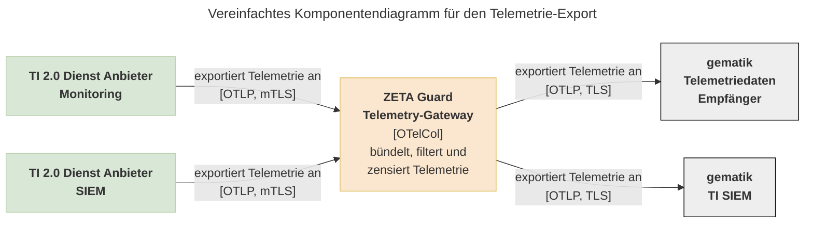

# Wie Sie Telemetrie des Resource Servers an die gematik schicken

Der Telemetrie-Daten Service empfängt die Selbstauskunfts- und Tracing-Daten vom
TI 2.0 Dienst und kann Daten vom SIEM und Monitoring des TI 2.0 Dienst-Anbieters
entgegennehmen und an die gematik Telemetriedaten Schnittstelle sowie das TI
SIEM der gematik weiterleiten. Für den Empfang von Telemetrie muss ein
OpenTelemetry-Receiver im Telemetry-Gateway verwendet werden. Für den Export von
Telemetrie an die gematik ist bereits ein Exporter im Telemetry-Gateway
vorkonfiguriert. Dieser Exporter wird sowohl für Anbieter-Telemetrie als auch
ZETA-Guard-eigene Telemetrie verwendet. Verbindungen zwischen dem
Telemetry-Gateway und ZETA-Guard-externen Diensten müssen über mTLS abgesichert
werden.



Das Telemetry-Gateway ist ein OpenTelemetry-Collector, und Sie können
die [offizielle Dokumentation des Collectors](https://opentelemetry.io/docs/collector/configuration/)
und seiner Module verwenden. Die im Telemetry-Gateway verfügbaren Receiver und
Authenticator-Extensions können Sie
im [Build-Manifest des Collectors](https://github.com/open-telemetry/opentelemetry-collector-releases/blob/v0.145.0/distributions/otelcol-k8s/manifest.yaml)
nachschlagen.

<!-- Future Work Link zum Build-Manifest aktualisieren, sobald eigene Collectoren veröffentlicht wurden. -->

## Wie Sie Telemetrie an das Telemetry-Gateway senden

Wenn Sie ZETA-Guard in einem Cluster mit einem Service-Mesh für mTLS verwenden,
können Sie Telemetrie an den bestehenden OTLP-Receiver des Telemetry-Gateways
exportieren. In diesem Fall ist keine Konfigurationsänderung am
Telemetry-Gateway erforderlich. Sie können den OTLP-gRPC-Exporter in der
ConfigMap des Telemetry-Gateways als Vorlage für ihren eigenen Exporter
verwenden.

Wenn Sie kein Service-Mesh für mTLS verwenden, müssen Sie einen neuen, separaten
OTLP-Receiver für das Telemetry-Gateway konfigurieren. Der Receiver muss separat
sein, da er mTLS-bedingt ausschließlich Telemetrie von Ihrem Exporter empfangen
kann. Das folgende Beispiel beschreibt diesen Fall. Die Konfiguration des
Telemetry-Gateways erfolgt über die Values des `zeta-guard` Helm-Charts, und
kann wie folgt aussehen:

```yaml
telemetry-gateway:
    config:
        receivers:
            otlp/von-anbieter:
                protocols:
                    grpc:
                        endpoint: mysite.local:55690  # hier muss die Adresse Ihres Receivers stehen
                        tls:
                            cert_file: "/etc/tls/server-cert.pem"
                            key_file: "/etc/tls/server-key.pem"
                            client_ca_file: "/etc/tls/ca.pem"
        service:
            pipelines:
                logs:
                    receivers:
                        - otlp/von-anbieter
                metrics:
                    receivers:
                        - otlp/von-anbieter
                traces:
                    receivers:
                        - otlp/von-anbieter
    extraVolumeMounts:
        -   name: tls
            mountPath: "/etc/tls"
            readOnly: true
    extraVolumes:
        -   name: tls
            secret:
                secretName: gematik-telemetrie-mtls  # dieses Secret müssen Sie anlegen
```

Dieses Beispiel verwendet einen
gemeinsamen [OTLP Receiver](https://github.com/open-telemetry/opentelemetry-collector/blob/main/receiver/otlpreceiver/README.md)
mit [mTLS-Konfiguration](https://opentelemetry.io/docs/collector/configuration/#mtls-configuration-mutual-tls)
für Logs, Metriken und Traces. Die Beispielkonfiguration definiert einen neuen
Receiver und fügt ihn in die bestehenden Pipelines des Telemetry-Gateways (
`logs`, `metrics`und `traces`) ein. Achten Sie darauf, außer dem neuen Receiver
auch alle Receiver aus dem `zeta-guard`-Chart zu nennen, um keinen Receiver
versehentlich zu deaktiviren. Das Secret `gematik-telemetrie-mtls` ist ebenfalls
nicht Teil des `zeta-guard`-Helm-Charts, und muss von Ihnen mit den
erforderlichen Dateien angelegt werden.

## Wie Sie das Telemetry-Gateway für den Export an die gematik einrichten

<!-- Future Work Einrichtung von WIF muss beschrieben werden -->

Das Telemetry-Gateway ist mit einem Exporter – `otlp_grpc/gematik` –
vorkonfiguriert, durch den Logs und Traces an die gematik exportiert werden. Der
Exporter verwendet TLS statt mTLS, muss aber einen Bearer-Token an die gematik
senden. Wenn Sie Workload-Identity-Federation zwischen ihrem Cluster und der
gematik eingerichtet haben, wird dieses Token von dem CronJob
`gematik-oidc-token-renewer-cronjob` erzeugt und regelmäßig erneuert, und in dem
Secret `gematik-oidc-token` gespeichert. Das Telematik-Gateway liest dieses
Secret aus, um den Bearer-Token zu erhalten.

Wie Sie Workload-Identity-Federation zwischen ihrem Cluster und der
gematik einrichten,
wird [hier](https://wiki.gematik.de/spaces/TI2AUSTAUSCH/pages/729779095/ZETA+Onboarding)
aus organisatorischer Perspektive beschrieben. Nachdem Sie Ihren ZETA-Cluster
registriert haben, müssen Sie ZETA-Guard für die Authentifizierung gegen die
gematik konfigurieren. Die erforderliche Konfiguration erhalten Sie von der
gematik. Die Values für den ZETA-Guard-Chart sehen so aus:

```yaml
gematik:
    serviceAccountEmailAddress: "ToDo"
    workloadIdentityFederation:
        poolId: "ToDo"
        projectNumber: "ToDo"
        workloadIdentityProvider: "ToDo"
opa:
    workloadIdentityFederation:
        sts:
            sa: "ToDo"
```
