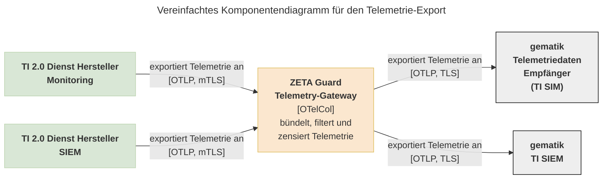

# Wie Sie Telemetrie des Resource Servers an die gematik schicken

Der Telemetrie-Daten Service empfängt die Selbstauskunfts- und Tracing-Daten vom
TI 2.0 Dienst und kann Daten vom SIEM und Monitoring des TI 2.0
Dienst-Herstellers entgegennehmen und an den gematik-Telemetriedaten-Empfänger
sowie das TI SIEM der gematik weiterleiten. Für den Empfang von Telemetrie muss
ein OpenTelemetry-Receiver im Telemetry-Gateway verwendet werden. Für den Export
von Telemetrie an die gematik sind bereits zwei Exporter im Telemetry-Gateway
vorkonfiguriert. Diese Exporter werden sowohl für Hersteller-Telemetrie als auch
ZETA-Guard-eigene Telemetrie verwendet. Verbindungen zwischen dem
Telemetry-Gateway und ZETA-Guard-externen Diensten müssen über mTLS abgesichert
werden.


```mermaid
---
title: Vereinfachtes Komponentendiagramm für den Telemetrie-Export
---
flowchart LR
    DienstAnbieterMonitoring["`**TI 2.0 Dienst Hersteller
     Monitoring**`"]
    DienstAnbieterSiem["`**TI 2.0 Dienst Hersteller
     SIEM**`"]
    Gateway["`**ZETA Guard
     Telemetry-Gateway**
     [OTelCol]
     bündelt, filtert und
     zensiert Telemetrie`"]
    gematikMonitoring["`**gematik
     Telemetriedaten
      Empfänger
      (TI SIM)**`"]
    gematikSiem["`**gematik
     TI SIEM**`"]
    DienstAnbieterMonitoring -->|"`exportiert Telemetrie an
        [OTLP, mTLS]`"| Gateway
    DienstAnbieterSiem -->|"`exportiert Telemetrie an
        [OTLP, mTLS]`"| Gateway
    Gateway -->|"`exportiert Telemetrie an
        [OTLP, TLS]`"| gematikMonitoring
    Gateway -->|"`exportiert Telemetrie an
        [OTLP, TLS]`"| gematikSiem

    %% styling
    classDef KomponenteAnwendung fill: #d9e7d6, stroke:#bdd4b0;
    classDef KomponenteBestehend fill: #eeeeee, stroke: black;
    classDef KomponenteZeta fill: #fbe7cf, stroke:#debc5a;

    class Gateway KomponenteZeta;
    class DienstAnbieterMonitoring,DienstAnbieterSiem KomponenteAnwendung;
    class gematikMonitoring,gematikSiem KomponenteBestehend;
```

Das Telemetry-Gateway ist ein OpenTelemetry-Collector, und Sie können
die [offizielle Dokumentation des Collectors](https://opentelemetry.io/docs/collector/configuration/)
und seiner Module verwenden. Die im Telemetry-Gateway verfügbaren Receiver und
Authenticator-Extensions können Sie
im [Build-Manifest des Collectors](https://github.com/open-telemetry/opentelemetry-collector-releases/blob/v0.145.0/distributions/otelcol-k8s/manifest.yaml)
nachschlagen.

<!-- Future Work Link zum Build-Manifest aktualisieren, sobald eigene Collectoren veröffentlicht wurden. -->

## Inhaltsverzeichnis

- [Wie Sie Telemetrie an das Telemetry-Gateway senden](#wie-sie-telemetrie-an-das-telemetry-gateway-senden)
- [Wie Sie das Telemetry-Gateway für den Export an die gematik einrichten](#wie-sie-das-telemetry-gateway-für-den-export-an-die-gematik-einrichten)

## Wie Sie Telemetrie an das Telemetry-Gateway senden

Wenn Sie ZETA-Guard in einem Cluster mit einem Service-Mesh für mTLS verwenden,
können Sie Telemetrie an den bestehenden OTLP-Receiver des Telemetry-Gateways
exportieren. In diesem Fall ist keine Konfigurationsänderung am
Telemetry-Gateway erforderlich. Sie können den OTLP-gRPC-Exporter in der
ConfigMap des Telemetry-Gateways als Vorlage für ihren eigenen Exporter
verwenden.

Wenn Sie kein Service-Mesh für mTLS verwenden, müssen Sie einen neuen, separaten
OTLP-Receiver für das Telemetry-Gateway konfigurieren. Der Receiver muss separat
sein, da er mTLS-bedingt ausschließlich Telemetrie von Ihrem Exporter empfangen
kann. Das folgende Beispiel beschreibt diesen Fall. Die Konfiguration des
Telemetry-Gateways erfolgt über die Values des `zeta-guard` Helm-Charts, und
kann wie folgt aussehen:

```yaml
telemetry-gateway:
    config:
        receivers:
            otlp/dienst_hersteller:
                protocols:
                    grpc:
                        endpoint: mysite.local:55690  # hier muss die Adresse Ihres Receivers stehen
                        tls:
                            cert_file: "/etc/tls/server-cert.pem"
                            key_file: "/etc/tls/server-key.pem"
                            client_ca_file: "/etc/tls/ca.pem"
        service:
            pipelines:
                logs/dienst_hersteller:
                    receivers:
                        - opa/policy_engine
                        - opa/policy_engine_simulation
                        - otlp
                        - otlp/dienst_hersteller
                        - syslog/http_proxy
                logs/ti_sim:
                    receivers:
                        - opa/policy_engine
                        - opa/policy_engine_simulation
                        - otlp
                        - otlp/dienst_hersteller
                        - syslog/http_proxy
                logs/ti_siem:
                    receivers:
                        - opa/policy_engine
                        - opa/policy_engine_simulation
                        - otlp
                        - otlp/dienst_hersteller
                        - syslog/http_proxy
                metrics/dienst_hersteller:
                    receivers:
                        - otlp
                        - otlp/dienst_hersteller
                        - prometheus
                metrics/ti_sim:
                    receivers:
                        - otlp
                        - otlp/dienst_hersteller
                metrics/ti_siem:
                    receivers:
                        - count/siem
                        - otlp
                        - otlp/dienst_hersteller
                        - prometheus
                traces/dienst_hersteller:
                    receivers:
                        - otlp
                        - otlp/dienst_hersteller
                traces/ti_sim:
                    receivers:
                        - otlp
                        - otlp/dienst_hersteller
                traces/ti_siem:
                    receivers:
                        - otlp
                        - otlp/dienst_hersteller

    extraVolumeMounts:
        -   name: tls
            mountPath: "/etc/tls"
            readOnly: true
    extraVolumes:
        -   name: tls
            secret:
                secretName: gematik-telemetrie-mtls  # dieses Secret müssen Sie anlegen
```

Dieses Beispiel verwendet einen
gemeinsamen [OTLP Receiver](https://github.com/open-telemetry/opentelemetry-collector/blob/main/receiver/otlpreceiver/README.md)
mit [mTLS-Konfiguration](https://opentelemetry.io/docs/collector/configuration/#mtls-configuration-mutual-tls)
für Logs, Metriken und Traces. Die Beispielkonfiguration definiert einen neuen
Receiver und fügt ihn in die bestehenden Pipelines des Telemetry-Gateways ein.
Achten Sie darauf, außer dem neuen Receiver auch alle Receiver aus dem
`zeta-guard`-Chart zu nennen, um keinen Receiver versehentlich zu deaktiviren.
Das Secret `gematik-telemetrie-mtls` ist ebenfalls nicht Teil des `zeta-guard`
-Helm-Charts, und muss von Ihnen mit den erforderlichen Dateien angelegt werden.

Zusätzlich muss ihr Resource-Server
den [OpenTelemetry Service-Name](https://opentelemetry.io/docs/specs/semconv/registry/attributes/service/#service-attributes)
"resource server" verwenden oder das Präfix "rs." besitzen. Die Pipelines
`*/ti_sim` verwenden den Prozessor `filter/ti_sim`, der sich auf bekannte
Service-Namen verlässt und Logs und Spans mit unbekannten Service-Namen
entfernt. Die Pipelines `*/ti_siem` und den Prozessor `filter/ti_siem`
funktionieren analog. Der Service-Name lässt sich über die
Umgebungsvariable [OTEL_SERVICE_NAME](https://opentelemetry.io/docs/specs/otel/configuration/sdk-environment-variables/#general-sdk-configuration)
steuern.

## Wie Sie das Telemetry-Gateway für den Export an die gematik einrichten

Das Telemetry-Gateway ist mit zwei Exportern – `otlp_grpc/ti_siem` und
`otlp_grpc/ti_sim` – vorkonfiguriert, durch die Logs, Metriken und Traces an die
gematik exportiert werden. Die Exporter verwenden TLS statt mTLS, müssen aber
einen Bearer-Token mitsenden. Wenn Sie Workload-Identity-Federation zwischen
ihrem Cluster und der gematik eingerichtet haben, werden diese Tokens von den
CronJobs `ti-siem-token-renewer-cronjob` und `ti-sim-token-renewer-cronjob`
erzeugt und regelmäßig erneuert, und in den Secrets `ti-siem-token`und
`ti-sim-token` gespeichert. Das Telematik-Gateway liest diese Secrets aus, um
die Bearer-Tokens zu erhalten.

Wie Sie Workload-Identity-Federation zwischen ihrem Cluster und der
gematik einrichten,
wird [hier](https://wiki.gematik.de/spaces/TI2AUSTAUSCH/pages/729779095/ZETA+Onboarding)
aus organisatorischer Perspektive beschrieben. Nachdem Sie Ihren ZETA-Cluster
registriert haben, müssen Sie ZETA-Guard für die Authentifizierung gegen die
gematik konfigurieren. Die erforderliche Konfiguration erhalten Sie von der
gematik. Die Values für den ZETA-Guard-Chart sehen so aus:

```yaml
global:
    # Öffentlicher FQDN Ihres Dienstes — wird als server.address in alle
    # TI-SIEM-/TI-SIM-Daten gestempelt (Absender-Kennung bei der gematik)
    clusterFQDN: "zeta.example.com"
gematik:
    tiSiem:
        idTokenAudience: "AUDIENCE_ZUR_TOKENERSTELLUNG_FÜR_TI_SIEM"
        serviceAccountEmailAddress: "SERVICE_ACCOUNT_ZUR_TOKENERSTELLUNG_FÜR_TI_SIEM"
    tiSim:
        idTokenAudience: "AUDIENCE_ZUR_TOKENERSTELLUNG_FÜR_TI_SIM"
        serviceAccountEmailAddress: "SERVICE_ACCOUNT_ZUR_TOKENERSTELLUNG_FÜR_TI_SIM"
    workloadIdentityFederation:
        poolId: "POOL"
        projectNumber: "BETRIEBSUMGEBUNG"
        workloadIdentityProvider: "PROVIDER"
opa:
    workloadIdentityFederation:
        sts:
            sa: "SERVICE_ACCOUNT_ZUR_TOKENERSTELLUNG_FÜR_DIE_PRODUKTSPEZIFISCHE_POLICY"
```

> **`global.clusterFQDN` nicht vergessen.** Das Telemetry-Gateway setzt diesen
> Wert als `server.address`-Attribut auf alle Logs, Metriken und Traces, die an
> TI-SIEM und TI-SIM exportiert werden — er identifiziert Ihren Dienst
> gegenüber der gematik. Der Chart-Standard ist der Platzhalter `"REPLACE ME"`:
> Bleibt er stehen, meldet sich Ihr Dienst bei der gematik mit dieser
> Platzhalter-Kennung.
