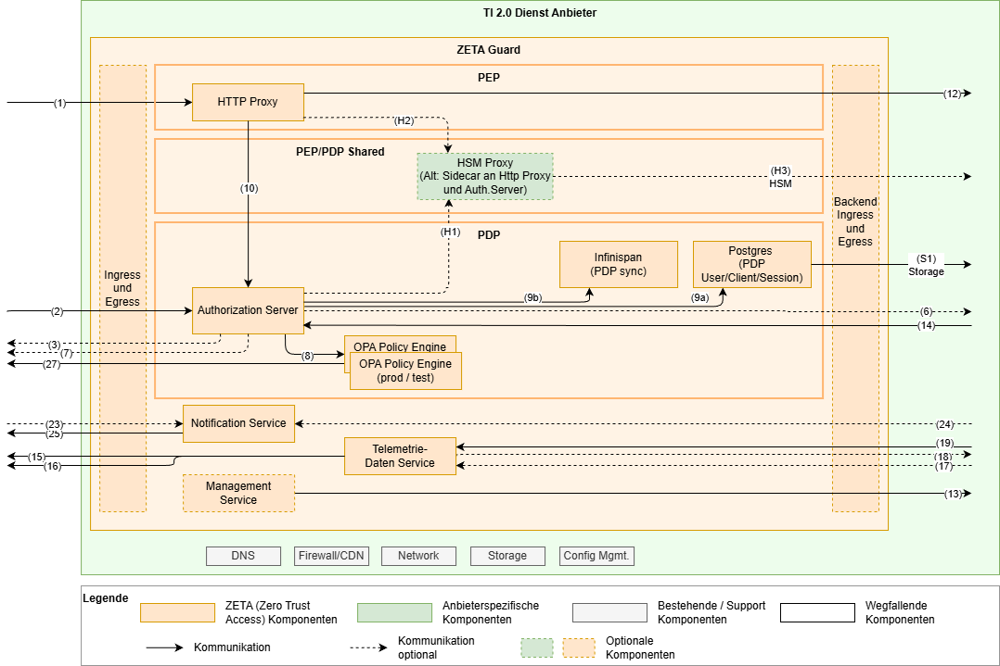

# Wie Sie ZETA-Guard in einem Kubernetes-Cluster installieren und konfigurieren

---

Status: In Arbeit

Zielgruppe: Systemadministratoren der Anbieter

_Inhalt: Beschreibung der erforderlichen Hardware und Software, mögliche
Betriebssysteme und -Versionen, vorausgesetzte Software-Umgebung wie etwa
Standardbibliotheken und Laufzeitsysteme. Erläuterung der Prozeduren zur
Installation, außerdem zur Pflege (Updates) und De-Installation, bei kleinen
Produkten eine Readme-Datei. Zielgruppe sind Administratoren beim Anwender, die
die Software nicht zwangsläufig unmittelbar selbst nutzen müssen._

---

## Inhaltsverzeichnis

- [Überblick](#überblick)
- [Voraussetzungen](#voraussetzungen)
- [Überblick über die Konfiguration des ZETA Guard](#überblick-über-die-konfiguration-des-zeta-guard)
  - [Empfehlungen für das Konfigurationsmanagement](#empfehlungen-für-das-konfigurationsmanagement)
- [Vorgehen bei der Installation](#vorgehen-bei-der-installation)
- [Übersicht zu den wichtigsten Konfigurationsparametern der einzelnen Komponenten](#übersicht-zu-den-wichtigsten-konfigurationsparametern-der-einzelnen-komponenten)
  - [1. Ingress-Controller und Ingress konfigurieren](#1-ingress-controller-und-ingress-konfigurieren)
  - [2. Egress konfigurieren](#2-egress-konfigurieren)
  - [3. Management Service (ArgoCD) installieren und konfigurieren](#3-management-service-argocd-installieren-und-konfigurieren)
  - [4. Telemetriedaten Service (OpenTelemetry Collector) konfigurieren](#4-telemetriedaten-service-opentelemetry-collector-konfigurieren)
  - [5. Notification Service konfigurieren](#5-notification-service-konfigurieren)
  - [6. Policy Decision Point konfigurieren](#6-policy-decision-point-konfigurieren)
    - [6.1 PDP Datenbank (PostgreSQL) installieren und konfigurieren](#61-pdp-datenbank-postgresql-installieren-und-konfigurieren)
    - [6.2 Policy Engine (OPA) konfigurieren](#62-policy-engine-opa-konfigurieren)
    - [6.3 Authorization Server (Keycloak) konfigurieren](#63-authorization-server-keycloak-konfigurieren)
    - [6.4 Provisioning Processor (Image-Vertrauenskette) konfigurieren](#64-provisioning-processor-image-vertrauenskette-konfigurieren)
  - [7. Policy Enforcement Point (nginx) konfigurieren](#7-policy-enforcement-point-nginx-konfigurieren)
  - [8. Servie Mesh konfigurieren](#8-servie-mesh-konfigurieren)
- [Querschnittliche Konzepte](#querschnittliche-konzepte)

## Überblick



## Voraussetzungen

* ein Kubernetes-Cluster
    * mindestens in Version 1.32 (entspr. OpenShift 4.19 oder neuer)
    * TODO Versionen der Operatoren dokumentieren
    * in dem sich _Resource Server_ und _Application Authorization Backend_
      befinden
    * mit einem Ingress-Controller
    * mit Zugang zu einer anbietereigenen Container Registry
        * für den Testbetrieb kann in Absprache mit der gematik direkt die
          Container Registry der gematik verwendet werden
    * Persistent Volumes mit AccessMode `ReadWriteOnce` müssen verfügbar sein
    * Netzwerkzugang zu diversen externen Diensten
      (siehe [Egress konfigurieren](#2-egress-konfigurieren))
    * eine geeignete Imagesignaturprüfung z.B. via Kyverno (signierte Images
      kommen in späterem Meilenstein)
    * mit Gateway API CRDs
* eine lokale, cachende OCI Registry
* alle Dienste aus der Liste
  der [Abhängigkeiten unten](#abhängigkeiten--erforderliche-konfiguration)
* einen [OpenTelemetry-Collector](https://opentelemetry.io/docs/collector/)

Optionale Voraussetzungen:

* Falls der ZETA eigene Ingress Controller nicht verwendet wird: ein geeigneter
  Ingress Controller
* Falls das ZETA eigene Service Mesh nicht verwendet wird: eine alternative
  Lösung die TLS Kommunikation der ZETA Komponenten untereinander sicherstellt

## Überblick über die Konfiguration des ZETA Guard

Zentraler Dreh- und Angelpunkt der Konfiguration und auch Installation des ZETA
Guard ist das [ZETA Guard Helm Chart][ZGchrtHelm]. Zusätzlich relevant sind die
[PDP Terraform Templates][ZGchrtTf], welche für diverse Konfiguration des PDP
relevant sind und in dieser Hinsicht das Helm Chart begleitet. Terraform kann
dabei wahlweise mit Kubernetes-Backend (State im Cluster) oder im lokalen Modus
(State auf der Festplatte, ohne dass Terraform selbst Cluster-Zugang benötigt)
betrieben werden. Diese
beiden Konfigurationswerkzeuge gehören praktisch mit zum ZETA Guard und werden
ebenfalls in Updates des ZETA Guard gepflegt.

Nicht zu verwechseln mit den [PDP Terraform Templates][ZGchrtTf] sind die
optionalen [Terraform Templates][ZGclusterTf] zum beispielhaften Aufsetzen eines
geeigneten Kubernetes Clusters.

### Empfehlungen für das Konfigurationsmanagement

* Bauen Sie ihr eigenes Helm Chart, welches das ZETA Guard Helm Chart als
  Subchart nutzt. So können Sie Anpassungen an Ihre eigenen Bedürfnisse und
  Infrastruktur konsistent managen.
* Setzen Sie einen CD Server in Verbindung mit einem Versionskontrollsystem für
  die Konfigurationsdateien ein (→ GitOps). Der ZETA Guard beinhaltet zukünftig
  als optionale Komponente einen ArgoCD.

## Vorgehen bei der Installation

Letztlich besteht die Installation aus den 2 Schritten `helm upgrade --install`
und `terraform apply`, wie im [Quickstart](ZETA_Guard_Quickstart.md)
beschrieben.
Damit sind dann alle Komponenten des ZETA Guard installiert.

Im Folgenden soll auf die Konfiguration der einzelnen Komponenten etwas mehr
im Detail eingegangen werden. Ergänzend dazu gibt es die
[Referenzdokumente](../Referenzen/Referenz_des_Helm_Charts.md).

## Übersicht zu den wichtigsten Konfigurationsparametern der einzelnen Komponenten

### 1. Ingress-Controller und Ingress konfigurieren

In dem Cluster muss ein [Ingress-Controller][K8s Ingress Controllers]
installiert sein und erlaubter [Ingress][K8s Ingress] definiert werden.
Das ZETA-Guard-Helm-Chart beinhaltet einen optionalen
Ingress-Controller ([F5 nginx-ingress](https://docs.nginx.com/nginx-ingress-controller/)).
Über den Value `nginxIngressEnabled` kann dieser ein- bzw. ausgeschaltet werden.
Die Ingresses selbst können über `ingressEnabled` ein- bzw. ausgeschaltet
werden.

Der eingesetzte Ingress-Controller muss die Kubernetes-APIs
für [Ingresses](https://kubernetes.io/docs/concepts/services-networking/ingress/)
und [Gateways](https://kubernetes.io/docs/concepts/services-networking/gateway/)
unterstützen.

Die Verwaltung der TLS-Zertifikate obliegt dem Anbieter und erfolgt in der Regel
über Kubernetes-Secrets oder eine HSM-Anbindung.

Bei Verwendung von mehreren ZETA-Guards in unterschiedlichen Namespaces ist es
möglich, über Ingress-Classes die Ingress-Controller der jeweiligen
Installationen voneinander zu isolieren. In jedem Namespace müssen die Values
`ingressClassName` und `nginx-ingress.controller.ingressClass.name` auf
denselben, Cluster-weit einzigartigen Namen gesetzt werden. Bei mehreren
Namespace-spezifischen Ingress-Controllern sollte jeder Ingress-Class-Name den
Namespace-Namen enthalten.

Für OpenShift-Umgebungen wird der OpenShift-Ingress-to-Route-Controller
unterstützt. Dabei wird `openshiftIngress.enabled` auf `true` gesetzt, womit
die Ingress-Ressourcen automatisch um TLS-Blöcke ergänzt werden. OpenShift
erzeugt daraus edge-terminated Routes mit TLS-Redirect.
Weitere Details finden sich unter
[OpenShift-Kompatibilität](ZETA_OpenShift_Kompatibilität.md).

#### Rate Limit einrichten

Am Ingress ist es möglich ein Rate Limit einzurichten. Dazu müssen über den
Helm Chart Value `ingressMinionAnnotations` Annotationen an den Ingress
hinzugefügt werden. Die Semantik der Annotationen ist
[hier](https://docs.nginx.com/nginx-ingress-controller/configuration/ingress-resources/advanced-configuration-with-annotations/#rate-limiting)
beschrieben.

Beispielhaft könnte ein Limit auf 20 Anfragen pro Sekunde über 10 Minuten die
anhand der Client IP Adresse gemessen werden, wie folgt aussehen:

```yaml
ingressMinionAnnotations:
    nginx.org/limit-req-rate: "20r/s"
    nginx.org/limit-req-key: "${binary_remote_addr}"
    nginx.org/limit-req-zone-size: "10m"
```

Da dies stark anwendungsabhängig ist, ist standardmäßig kein RateLimit
konfiguriert.

### 2. Egress konfigurieren

Der ausgehende Netzwerkverkehr der ZETA-Guard-Pods kann über optionale Kubernetes
[Network-Policies][K8s Network Policies] auf explizit freigegebene Ziele eingeschränkt
werden. Das ZETA Guard Helm Chart stellt dafür vorkonfigurierte
Egress-NetworkPolicies für alle ZETA-Guard-Pods bereit.

Die Aktivierung und IP-Konfiguration ist beschrieben in:
[Wie Sie Egress-NetworkPolicies konfigurieren](Wie_Sie_Egress_NetworkPolicies_konfigurieren.md)

Bekannte, valide Egress-Ziele außerhalb des Clusters sind insbesondere:

* TI-Dienste
    * OCSP-Responder der TI-TSL (d.h. der Responder im Internet, nicht im TI 1.0 Netz)
    * TI-Monitoring (gematik Telemetriedaten-Empfänger, OTLP)
    * TI-SIEM
    * Federation Master
    * Federated IDP bzw. Sektorale IdPs
* ZETA-spezifische TI-Dienste
    * ZETA Artifact Registry (OPA-Bundles, Container-Images)
    * ZETA PIP & Service
* anbietereigene Dienste
    * Anbieter-interne Artifact Registry
    * Dienstanbieter-Monitoring
    * Dienstanbieter-SIEM
* weitere Dienste
    * PoPP-Dienst
    * Clientsystem Notification Service(s) – Apple Push Notifications, Firebase
    * Email Confirmation-Code – Mailversand

### 3. Management Service (ArgoCD) installieren und konfigurieren

Die Verwendung des Management Service ist optional und das ZETA Guard Helm Chart
beinhaltet einen optionalen Ingress Controller. Über die values kann dieser an-
bzw. abgewählt werden (`management_service.enabled: true`).

* _Kommt mit späterem Meilenstein_
* _Ggf. mit Zugang zur UI für Administratoren einrichten_

#### Verwandte Dokumentation

* [ArgoCD – Installation](https://argo-cd.readthedocs.io/en/stable/operator-manual/installation/)
* [ArgoCD – Declarative Setup](https://argo-cd.readthedocs.io/en/stable/operator-manual/declarative-setup/)
* [ArgoCD – Metrics](https://argo-cd.readthedocs.io/en/stable/operator-manual/metrics/)

### 4. Telemetriedaten Service (OpenTelemetry Collector) konfigurieren

ZETA-Guard umfasst mehrere OpenTelemetry-Collectoren, die Logs, Metriken und
Traces aller ZETA-Guard-Komponenten empfangen bzw. einsammeln. Es gibt einen
zentralen Collector – das Telemetry-Gateway – das die gesammelte Telemetrie von
ZETA-Guard und Resource Server verarbeitet und an die Monitoring- und
SIEM-Dienste der TI weiterleitet.

Sie müssen die Verbindung vom Resource Server zum Telemetry-Gateway, und die
Verbindung vom Telemetry-Gateway zu den Monitoring- und SIEM-Diensten der TI
herstellen. Optional können Sie das Telemetry-Gateway auch an ein eigenes
Observability-Backend anschließen, um Logs, Metriken und Traces einfach einsehen
zu können.

Detaillierte Anleitungen finden Sie hier:

* [Wie Sie Telemetrie des Resource Servers an die gematik schicken.md](Wie_Sie_Telemetrie_des_Resource_Servers_an_die_gematik_schicken.md)
* [Wie Sie ein Observability-Backend an ZETA-Guard anschließen](Wie_Sie_ein_Observability-Backend_an_ZETA-Guard_anschließen.md)

#### Verwandte Dokumentation

* [OpenTelemetry with Kubernetes][OTelK8s]
* [OpenTelemetry Collector Chart][OTelColChrt]
* [OpenTelemetry – Collector – Configuration][OTelColCnfg]

### 5. Notification Service konfigurieren

* _Kommt erst in Umsetzungsstufe 2_

#### Abhängigkeiten / erforderliche Konfiguration

* APN-Konfiguration (Apple Push Notification)
* Firebase-Konfiguration (Android Push Notification)

### 6. Policy Decision Point konfigurieren

#### 6.1 PDP Datenbank (PostgreSQL) installieren und konfigurieren

Keycloak benötigt eine [PostgreSQL-Datenbank][Pstgrs17], die in der Regel über
den
[CloudNativePG‑Operator][PstgrsOp] bereitgestellt wird – idealerweise einmal
clusterweit (z.B. im Namespace `cnpg-system`). Für größere Deploymentszenarien
mit Multicluster ist der Vorgang ggf. abweichend.

Hinweis (Ownership/Conflicts): CloudNativePG installiert clusterweite Ressourcen
(CRDs/Webhooks/ClusterRoles). Vermeiden Sie mehrere Helm‑Releases des Operators
in verschiedenen Namespaces, da dies zu Ownership/Conflicts führt.
Installieren Sie stattdessen genau einen Operator clusterweit.

Die Datenbank wird als Active-Passive eingesetzt. Durch den gut abgestimmten
Einsatz eines verteilten 2nd level Datenbankcaches im PDP skaliert dies trotzdem
gut.

#### 6.2 Policy Engine (OPA) konfigurieren

Jede OPA-Instanz muss Policys vom PIP abfragen und Metriken für das Monitoring
bereitstellen.

Zur Veranschaulichung dienen Deployment- und Service-Definitionen in
folgendem [Helm-Chart][ZGchrtOPA] als Beispiel.

OPA kann horizontal skaliert werden. Die Anzahl der Replikate wird über den Helm
Value
`opa.replicaCount` (Standard: `1`) gesteuert. Für die Simulation-Instanz gilt
entsprechend
`opa.simulation.replicaCount` (Standard: `1`).

Beispiel:

```yaml
zeta-guard:
    opa:
        replicaCount: 2
        simulation:
            replicaCount: 2
```

##### Verwandte Dokumentation

* [How to Deploy OPA][OPAdplymnt]
* [Deploying OPA on Kubernetes][OPAdplymntK8s]
* [OPA – Configuration][OPAcnfg]
    * [OPA – Monitoring – OpenTelemetry][OPAmntrg]
    * [OPA – Security][OPAscrty]
    * [OPA – Privacy][OPAprvcy]

##### Abhängigkeiten / erforderliche Konfiguration

* PIP stellt Policy Bundles und Bundle Signer Zertifikate bereit

#### 6.3 Authorization Server (Keycloak) konfigurieren

Keycloak muss mit seiner Datenbank und seinem OPA verbunden sein und von
außerhalb des Clusters erreichbar sein. Die externe Erreichbarkeit wird über
die Ingress-Konfiguration gesteuert (siehe
[Ingress-Controller und Ingress konfigurieren](#1-ingress-controller-und-ingress-konfigurieren)).
Das Helm Chart erzeugt eine Ingress-Ressource für den Authorization Server,
deren Verhalten über `ingressEnabled`, `ingressClassName` und ggf.
`openshiftIngress` konfiguriert wird.

Die Installation erfolgt über den Helm-Chart. Zusätzlich zur Konfiguration im
Helm Chart erfolgt ein großer Teil der Konfiguration zur Laufzeit des deployten
Keycloak und wird mittels Terraform vorgenommen.

Der Authorization Server kann horizontal skaliert werden. Die Anzahl der
Replikate wird über
den Helm Value `authserver.replicaCount` (Standard: `1`) gesteuert.

```yaml
zeta-guard:
    authserver:
        replicaCount: 2
```

Ab 4 Knoten ist ein Tuning des Keycloak internen Infinispan Caches angeraten.

###### TLS-Konfiguration des Authorization Service

Der Authorization Service unterstützt mehrere Betriebstopologien für TLS, die
über Helm Values gesteuert werden:

| Topologie                | Beschreibung                                                                                           | Helm Values                                                               |
|--------------------------|--------------------------------------------------------------------------------------------------------|---------------------------------------------------------------------------|
| Ingress TLS (Standard)   | TLS wird am Ingress-Controller terminiert. Keycloak läuft intern ohne TLS.                             | Standard — keine zusätzlichen Values erforderlich                         |
| Pod-Level TLS via Secret | Keycloak terminiert TLS selbst. Zertifikat und Schlüssel werden aus einem Kubernetes Secret gemountet. | `authserver.tls.enabled: true`, `authserver.tls.certSecretName: <secret>` |
| Pod-Level TLS via HSM    | Keycloak terminiert TLS selbst. Schlüssel und Zertifikat werden über den HSM-Proxy per gRPC bezogen.   | `authserver.hsm.enabled: true`, `authserver.hsm.tls.enabled: true`        |

Für die HSM-basierte TLS-Konfiguration sind zusätzlich der gRPC-Endpunkt des
HSM-Proxy sowie die Key-ID zu konfigurieren:

```yaml
zeta-guard:
    authserver:
        hsm:
            enabled: true
            endpoint: "hsm-proxy:50051"
            tls:
                enabled: true
                keyId: "zeta-guard-keycloak-tls-es256-v1.p256"
```

Bei aktivierter TLS-Terminierung im Authorization Service (
`authserver.hsm.tls.enabled` oder
`authserver.tls.enabled`) wird dieser auf Port 8443 (HTTPS) erreichbar.

###### HSM-basierte Token-Signierung

Neben der TLS-Konfiguration kann der Authorization Service auch JWT-Token (
Access Tokens, ID Tokens, Refresh Tokens) mit einem HSM-verwalteten Schlüssel
signieren. Der private Schlüssel verlässt dabei niemals das HSM — die
Signatur-Operation wird per gRPC an den HSM-Proxy delegiert.

Die Konfiguration erfolgt in zwei Schritten:

**Schritt 1 — HSM und Token-Signierung in Helm aktivieren:**

```yaml
zeta-guard:
    authserver:
        hsm:
            enabled: true
            endpoint: "hsm-proxy:50051"
            tokenSigning:
                enabled: true
                keyId: "zeta-guard-keycloak-token-es256-v1.p256"
```

Dies setzt die Umgebungsvariablen `HSM_PROXY_ENDPOINT` und
`HSM_PROXY_TOKEN_KEY_ID` auf dem Authorization-Server-Pod.

**Schritt 2 — KeyProvider via Terraform registrieren:**

Nach dem Deployment wird der HSM KeyProvider über Terraform im Realm
registriert. Dazu werden die folgenden Variablen in der Stage-spezifischen
`tfvars`-Datei gesetzt:

```hcl
# <stage>.tfvars
hsm_token_signing_enabled  = true
hsm_token_signing_endpoint = "hsm-sim:50051"
hsm_token_signing_key_id   = "zeta-guard-keycloak-token-es256-v1.p256"
```

Anschließend wird die Terraform-Konfiguration angewendet (siehe
[Quickstart – PDP konfigurieren](ZETA_Guard_Quickstart.md#2-pdp-konfigurieren)
für die vollständige Anleitung zur Backend-Initialisierung und Ausführung):

```bash
terraform -chdir=terraform/authserver apply \
  -var-file=../../<values-dir>/<stage>.tfvars \
  -var "keycloak_password=${TF_VAR_keycloak_password}" \
  -auto-approve
```

**Verifikation:**

```bash
curl -sk https://<hostname>/auth/realms/zeta-guard/protocol/openid-connect/certs \
  | jq '.keys[] | select(.use == "sig") | {kid, alg}'
```

Erwartetes Ergebnis: ein einzelner ES256-Signaturschlüssel vom HSM (
`"alg": "ES256"`, `"use": "sig"`),
keine RSA-Signaturschlüssel (`RS256`). Der HSM-Schlüssel ist am Algorithmus
`ES256`
erkennbar. In der Keycloak Admin-Konsole ist der Provider unter
**Realm Settings** → **Keys** → **Providers** als `hsm-token-signing` sichtbar.

| Terraform-Variable                       | Beschreibung                                                | Standard |
|------------------------------------------|-------------------------------------------------------------|----------|
| `hsm_token_signing_enabled`              | HSM-basierten ES256 KeyProvider registrieren                | `false`  |
| `hsm_token_signing_endpoint`             | gRPC-Endpunkt des HSM-Proxy                                 | `""`     |
| `hsm_token_signing_key_id`               | Schlüssel-ID im HSM                                         | `""`     |
| `hsm_token_signing_priority`             | Provider-Priorität (höher gewinnt)                          | `"200"`  |
| `hsm_token_signing_remove_software_keys` | Software-Signaturschlüssel nach HSM-Registrierung entfernen | `true`   |

##### Abhängigkeiten / erforderliche Konfiguration

* Der externe Hostname muss konfiguriert werden:
    * in Helm via `authserver.hostname=auth.example.com.internal`
    * in Terraform via
        * `keycloak_url = "https://zeta-dev.westeurope.cloudapp.azure.com/auth"`
* Terraform kann im Kubernetes-Modus (`use_kubernetes = true`, Standard) oder im
  lokalen Modus (`use_kubernetes = false`) betrieben werden. Im lokalen Modus
  wird der Kubernetes-Provider nicht benötigt. Details
  siehe [Quickstart – PDP konfigurieren](ZETA_Guard_Quickstart.md#2-pdp-konfigurieren).
* Über die Terraform-Variable `audience_scope_name` (Standard:
  `"zero:audience"`) kann der Name des Audience-Scopes angepasst werden.

##### Admin-API absichern

Die Keycloak Admin REST API (`/auth/admin/*`) muss vor öffentlichem Zugriff
geschützt werden. Das Helm Chart bietet eine integrierte Absicherung über einen
separaten Admin-Hostnamen (`authserver.adminHostname`): Der PEP-Proxy blockiert
`/auth/admin` auf dem Haupthostnamen mit `403`, während ein dedizierter
Admin-Ingress Terraform und CI/CD-Pipelines den Zugang über den Admin-Hostnamen
ermöglicht.

Die Lösung ist ingress-controller-unabhängig und funktioniert mit F5 NIC,
nginx-Ingress, OpenShift Routes und GKE Ingress.

Details und Konfigurationsbeispiele finden sich in der
[Helm-Chart-Referenz – Admin-API-Absicherung](../Referenzen/Referenz_des_Helm_Charts.md#admin-api-absicherung).

###### Datenbankverbindung und Benutzer-Credentials für die PDP Datenbank

Das Helm Chart unterstützt einen Datenbankmodus für Testsetups mit einer
Postgres über ein Legacy Bitnami Helm Chart und einen produktivtauglichen
Modus auf Basis des [CloudNativePG‑Operators][PstgrsOp].

Für die Verwendung des Operators ist `databaseMode: cloudnative` als Helm‑Value
zu
setzen. Das Helm Chart erzeugt eine CNPG `Cluster`‑Ressource im
Release‑Namespace
und der Operator stellt die Datenbank bereit. Die Verbindungsparameter sind
konfigurierbar:

```yaml
zeta-guard:
    databaseMode: cloudnative
    cloudnativeDbUrl: "jdbc:postgresql://keycloak-db-rw:5432/keycloak"
    cloudnativeDbSecretName: "keycloak-db-app"
    cloudnativeDbSchema: "public"
```

Die Standardwerte verweisen auf den vom CloudNativePG-Operator erzeugten Service
und das zugehörige Secret. Passen Sie diese an, wenn Sie eine abweichende
Datenbankinstanz verwenden (z.B. bei eigenem CNPG-Cluster-Namen oder bei
Nutzung eines externen PostgreSQL-Dienstes im CloudNativePG-Modus).

Es ist möglich, eine externe Datenbank für den PDP zu konfigurieren. Dazu ist
einerseits `databaseMode: external` zu setzen. Anderseits werden untenstehende
Helm Values eingerichtet, die entsprechend den Keycloak Umgebungsvariablen für
diesen Zweck verwendet werden. Siehe dazu
[hier](https://www.keycloak.org/server/db#_configuring_a_database).

| Helm Value                    | Keycloak Entsprechung | Bemerkung                                                                                                                                                                                    |
|-------------------------------|-----------------------|----------------------------------------------------------------------------------------------------------------------------------------------------------------------------------------------|
| `authserverDb.kcDb`           | `KC_DB`               |                                                                                                                                                                                              |
| `authserverDb.kcDbUrl`        | `KC_DB_URL`           |                                                                                                                                                                                              |
| `authserverDb.kcDbSecretName` | `KC_DB_USERNAME`      | Hierbei ist im Helm Value der Name eines Secrets zu konfigurieren. Aus dem Secret wir das Feld `username` ausgelesen und dieses in die entsprechende Keycloak Umgebungsvariable geschrieben. |
| `authserverDb.kcDbSecretName` | `KC_DB_PASSWORD`      | Hierbei ist im Helm Value der Name eines Secrets zu konfigurieren. Aus dem Secret wir das Feld `password` ausgelesen und dieses in die entsprechende Keycloak Umgebungsvariable geschrieben. |
| `authserverDb.kcDbSchema`     | `KC_DB_SCHEMA`        |                                                                                                                                                                                              |

##### Verwandte Dokumentation

* [Keycloak – Kubernetes][KyclkK8s]
* [Configuring Keycloak][KyclkCnfg]
* [Keycloak – Configuring the database][KyclkDtbs]
* [Keycloak – Tracking instance status with health checks][KyclkHlth]

#### 6.4 Provisioning Processor (Image-Vertrauenskette) konfigurieren

Der **Provisioning Processor** ist ein Init-Container, der beim Start der Pods
von Authserver, PEP-Proxy, OPA und OPA-Simulation ausgeführt wird. Er lädt das
Provisioning-Daten-Image aus der Registry und prüft dessen cosign-Signatur gegen
die gematik-Zertifikatskette.

Für diese Signaturprüfung muss ein Kubernetes Secret mit dem Namen, der in
`imageTrustCertchainSecretRef` konfiguriert ist, im Deployment-Namespace
vorhanden sein. Das Secret muss den Key `certchain.pem` mit der PEM-kodierten
X.509-Zertifikatskette (CA- und Zwischenzertifikate, kein Leaf-Zertifikat)
enthalten:

```bash
kubectl create secret generic my-image-signer \
  --from-file=certchain.pem=/path/to/gematik-certchain.pem \
  --namespace NAMESPACE
```

```yaml
zeta-guard:
    imageTrustCertchainSecretRef: my-image-signer
```

Das Secret wird in allen vier Deployments als Volume `image-trustchain` unter
`/var/image-trustchain/certchain.pem` eingebunden. Das Helm Chart bricht beim
Rendern mit einem Fehler ab, wenn `imageTrustCertchainSecretRef` nicht gesetzt
ist.

Die Zertifikatskette ist von der gematik zu beziehen. Für Testumgebungen stellt
das Helm Chart unter `templates/gematik-image-signer-test.yaml` ein
vorgefertigtes Secret mit Test-CA-Zertifikaten bereit (`gematik-image-signer-test`).

> **Wichtig:** Das Test-Secret enthält Testzertifikate (GEM.KOMP-CA61 TEST-ONLY
> und GEM.RCA7 TEST-ONLY) und darf **nicht** in Produktivumgebungen verwendet
> werden.

Details zur Konfiguration und zur Spiegelung in eigene Registries finden sich
in:

* [Helm-Chart-Referenz — Cosign-Vertrauenskette](../Referenzen/Referenz_des_Helm_Charts.md#cosign-vertrauenskette-für-image-verifikation)
* [Wie Sie eine eigene OCI Registry verwenden](Wie_Sie_eine_eigene_OCI_Registry_verwenden.md)

### 7. Policy Enforcement Point (nginx) konfigurieren

Zur Veranschaulichung der Installation und Konfiguration des HTTP-Proxys eignet
sich die Deployment-Definition in [diesem Helm-Chart][ZGchrtNGNX].

Für die korrekte Funktion des PEP sind folgende Konfigurationswerte
entscheidend:

* Issuer URL des Authorization Server `pepproxy.nginxConf.pepIssuer`. Diese
  ergibt sich normalerweise aus dem öffentlichen Hostnamen des Authorization
  Server nach dem Muster `https://<authserver_name>/auth/realms/zeta-guard`
* Öffentliche URL des PEP. Diese fließt in das Well-Known Discovery Dokument im
  Value `pepproxy.wellKnownBase` ein nach folgendem Muster: `https://<pep_name>`
* Konfiguration des Fachdienst Resource Server über den Helm Value
  `pepproxy.nginxConf.locations`. Dieser wird
  mit [nginx location Blöcken](https://nginx.org/en/docs/http/ngx_http_core_module.html#location)
  welche `proxy_pass` auf den Fachdienst Resource Server nutzen eingerichtet.
  Wichtig sind hierbei in den Locations folgende 2 Direktiven:
    * `pep on;` damit sich der HTTP Proxy hier wie ein PEP verhält
    * `pep_require_aud https://<pep_name> <other_audiences_here>;` zur
      Validierung der geforderten und mit der gematik abgestimmten Audiences
      (die gematik muss diese in zentrale Policys für den OPA integrieren).
    * Eventuelle Konfiguration für WebSockets findet hier mit nginx
      Standardmethoden statt.
* Für die Verwendung von ASL muss der Value `pepproxy.asl_enabled` auf `true`
  gesetzt werden. Dazu ist Schlüsselmaterial erforderlich, welches über die
  gematik bezogen werden kann. Dieses muss im PEM-Format im Kubernetes-Secret
  `asl-identity` unter folgenden Keys abgelegt werden:
    * `signer-key`: ECC-Private-Key auf Basis der NIST-Kurve P256
    * `signer-cert`: Entsprechendes Signatur-Zertifikat, Profil C.FD.AUT,
      technische Rolle
      `oid_zeta-guard`
    * `issuer-cert`: Zugehöriges KOMP-CA-Zertifikat
    * In einer VAU soll dafür zukünftig auch ein HSM genutzt werden können.
    * Falls der PEP in der TI-Referenzumgebung (RU) betrieben werden soll,
      muss zusätzlich der Value `pepproxy.nginxConf.aslTestmode: true`
      gesetzt werden.

Der PEP kann horizontal skaliert werden. Die Anzahl der Replikate wird über den
Helm Value
`pepproxy.replicaCount` (Standard: `1`) gesteuert.

```yaml
zeta-guard:
    pepproxy:
        replicaCount: 3
```

Hinweis: Bei horizontaler Skalierung des PEP ist eine „Sticky Session" zu
beachten, da die
ASL-Schlüssel nicht über PEP-Instanzen hinweg geteilt werden (siehe
[Deploymentszenarien](../Referenzen/Deploymentszenarien.md)).

### 8. Servie Mesh konfigurieren

Hier sei beschrieben, wie Istio im ambient mode installiert wird um mTLS für
service-zu-service Kommunikation im Kubernetes Cluster für den ZETA Guard, zu
installieren.

Es wird hier davon ausgegangen, dass das ZETA Guard Helm Chart bereits
installiert
ist.

0) falls noch nicht geschehen, istioctl auf dem Admin Rechner Installieren (
   [siehe diese Anweisungen](https://istio.io/latest/docs/setup/additional-setup/download-istio-release/) )

1) installieren der Kubernetes Gateway API CRDs, falls nicht schon vorhanden
   -
   `kubectl get crd gateways.gateway.networking.k8s.io &> /dev/null || kubectl apply --server-side -f https://github.com/kubernetes-sigs/gateway-api/releases/download/v1.4.0/experimental-install.yaml`

2) installieren von Istio Using mit Ambient Profil
    - `istioctl install --set profile=ambient --skip-confirmation`

3) Einschalten des Ambient Mode für den Namespace des ZETA Guard (`zeta-local`
   in diesem Beispiel
    - `kubectl label namespace zeta-local istio.io/dataplane-mode=ambient`

Man kann nun über das Kommando `istioctl ztunnel-config workloads` verifizieren,
dass die workloads korrekt eingerichtet sind. Das erkennt man daran, dass HBONE
in der PROTOCOL Spalte angezeigt wird.

Beispielhaft sieht das dann wie folgt aus:

```
zeta-local         authserver-75899b88f-rvzcr                                   10.244.1.26 zeta-local-worker        None     HBONE
zeta-local         exauthsim-7bbdb8577d-4zbm5                                   10.244.1.14 zeta-local-worker        None     HBONE
zeta-local         frontend-proxy-7d6fd97668-sdbbl                              10.244.1.24 zeta-local-worker        None     HBONE
zeta-local         grafana-7b4994695-d5m2h                                      10.244.1.30 zeta-local-worker        None     HBONE
zeta-local         jaeger-5b7c68bd78-ckvzc                                      10.244.1.16 zeta-local-worker        None     HBONE
zeta-local         keycloak-db-0                                                10.244.1.31 zeta-local-worker        None     HBONE
zeta-local         llm-84df6b4845-cdbmc                                         10.244.1.29 zeta-local-worker        None     HBONE
zeta-local         opa-5459844d9d-b8q2h                                         10.244.1.27 zeta-local-worker        None     HBONE
zeta-local         opensearch-0                                                 10.244.1.20 zeta-local-worker        None     HBONE
zeta-local         pep-deployment-767b676cfd-k9hnb                              10.244.1.13 zeta-local-worker        None     HBONE
zeta-local         popp-mock-55bd588677-fjmjj                                   10.244.1.18 zeta-local-worker        None     HBONE
zeta-local         product-reviews-64998d7fdb-xm5tg                             10.244.1.11 zeta-local-worker        None     HBONE
zeta-local         prometheus-766df54ff-nszqf                                   10.244.1.15 zeta-local-worker        None     HBONE
zeta-local         telemetry-gateway-local-76f8b8b578-x4t7b                     10.244.1.17 zeta-local-worker        None     HBONE
zeta-local         test-monitoring-collector-local-7ff997447f-wjp5w             10.244.1.28 zeta-local-worker        None     HBONE
zeta-local         testdriver-6f8dfcdb98-qlj26                                  10.244.1.25 zeta-local-worker        None     HBONE
zeta-local         testfachdienst-5bd688cdc5-vt2cv                              10.244.1.19 zeta-local-worker        None     HBONE
zeta-local         tiger-proxy-bbf4ccbbf-w292g                                  10.244.1.23 zeta-local-worker        None     HBONE
zeta-local         zeta-testenv-local-nginx-ingress-controller-867757f4d8-wv2db 10.244.1.12 zeta-local-worker        None     HBONE
zeta-local         zeta-testenv-local-tiger-testsuite-79f555b6c8-mcn68          10.244.1.21 zeta-local-worker        None     HBONE
```

## Querschnittliche Konzepte

* [Wie Sie eine eigene OCI Registry verwenden](Wie_Sie_eine_eigene_OCI_Registry_verwenden.md)
* [Wie Sie Ressourcen für ZETA-Guard-Pods verwalten](Wie_Sie_Ressourcen_für_ZETA_Guard_Pods_verwalten.md)
* [Helm-Chart-Referenz](../Referenzen/Referenz_des_Helm_Charts.md) —
  ServiceAccounts, PodDisruptionBudgets, Security Contexts, Probes und weitere
  Values

[K8s Ingress]: https://kubernetes.io/docs/concepts/services-networking/ingress/

[K8s Ingress Controllers]: https://kubernetes.io/docs/concepts/services-networking/ingress-controllers/

[K8s Network Policies]: https://kubernetes.io/docs/concepts/services-networking/network-policies/

[KyclkCnfg]:    https://www.keycloak.org/server/configuration

[KyclkDtbs]:    https://www.keycloak.org/server/db

[KyclkHlth]:    https://www.keycloak.org/observability/health

[KyclkK8s]:     https://www.keycloak.org/getting-started/getting-started-kube

[OPAcnfg]:          https://www.openpolicyagent.org/docs/configuration

[OPAdplymnt]:       https://www.openpolicyagent.org/docs/deploy

[OPAdplymntK8s]:    https://www.openpolicyagent.org/docs/deploy/k8s

[OPAmntrg]:         https://www.openpolicyagent.org/docs/monitoring#opentelemetry

[OPAprvcy]:         https://www.openpolicyagent.org/docs/privacy

[OPAscrty]:         https://www.openpolicyagent.org/docs/security

[OTelColChrt]:  https://opentelemetry.io/docs/platforms/kubernetes/helm/collector/

[OTelColCnfg]:  https://opentelemetry.io/docs/collector/configuration/

[OTelK8s]:      https://opentelemetry.io/docs/platforms/kubernetes/

[OTelO]:        https://opentelemetry.io/docs/platforms/kubernetes/operator/

[OTelOChrt]:    https://opentelemetry.io/docs/platforms/kubernetes/helm/operator/

[Pstgrs17]: https://www.postgresql.org/docs/17/admin.html

[PstgrsOp]: https://cloudnative-pg.io/documentation/

[ZGchrtNGNX]:   https://github.com/gematik/zeta-guard-helm/tree/main/charts/zeta-guard/templates/pep-proxy.yaml

[ZGchrtOPA]:    https://github.com/gematik/zeta-guard-helm/tree/main/charts/zeta-guard/templates/opa-deployment.yaml

[ZGchrtHelm]:   https://github.com/gematik/zeta-guard-helm/tree/main/charts/zeta-guard

[ZGchrtTf]:     https://github.com/gematik/zeta-guard-helm/tree/main/terraform

[ZGclusterTf]:    https://github.com/gematik/zeta-guard-terraform/
