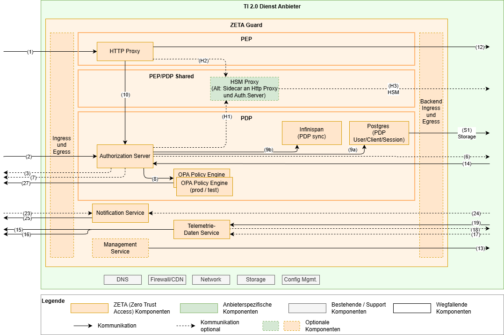

# Wie Sie ZETA-Guard in einem Kubernetes-Cluster installieren und konfigurieren

---

Status: In Arbeit

Zielgruppe: Systemadministratoren der Anbieter

_Inhalt: Beschreibung der erforderlichen Hardware und Software, mögliche
Betriebssysteme und -Versionen, vorausgesetzte Software-Umgebung wie etwa
Standardbibliotheken und Laufzeitsysteme. Erläuterung der Prozeduren zur
Installation, außerdem zur Pflege (Updates) und De-Installation, bei kleinen
Produkten eine Readme-Datei. Zielgruppe sind Administratoren beim Anwender, die
die Software nicht zwangsläufig unmittelbar selbst nutzen müssen._

---

## Inhaltsverzeichnis

- [Überblick](#überblick)
- [Voraussetzungen](#voraussetzungen)
- [Überblick über die Konfiguration des ZETA Guard](#überblick-über-die-konfiguration-des-zeta-guard)
  - [Empfehlungen für das Konfigurationsmanagement](#empfehlungen-für-das-konfigurationsmanagement)
- [Vorgehen bei der Installation](#vorgehen-bei-der-installation)
- [Übersicht zu den wichtigsten Konfigurationsparametern der einzelnen Komponenten](#übersicht-zu-den-wichtigsten-konfigurationsparametern-der-einzelnen-komponenten)
  - [1. Ingress-Controller und Ingress konfigurieren](#1-ingress-controller-und-ingress-konfigurieren)
  - [2. Egress konfigurieren](#2-egress-konfigurieren)
  - [3. Management Service (ArgoCD) installieren und konfigurieren](#3-management-service-argocd-installieren-und-konfigurieren)
  - [4. Telemetriedaten Service (OpenTelemetry Collector) konfigurieren](#4-telemetriedaten-service-opentelemetry-collector-konfigurieren)
  - [5. Notification Service konfigurieren](#5-notification-service-konfigurieren)
  - [6. Policy Decision Point konfigurieren](#6-policy-decision-point-konfigurieren)
    - [6.1 PDP Datenbank (PostgreSQL) installieren und konfigurieren](#61-pdp-datenbank-postgresql-installieren-und-konfigurieren)
    - [6.2 Policy Engine (OPA) konfigurieren](#62-policy-engine-opa-konfigurieren)
    - [6.3 Authorization Server (Keycloak) konfigurieren](#63-authorization-server-keycloak-konfigurieren)
    - [6.4 Provisioning Processor (Image-Vertrauenskette) konfigurieren](#64-provisioning-processor-image-vertrauenskette-konfigurieren)
  - [7. Policy Enforcement Point (nginx) konfigurieren](#7-policy-enforcement-point-nginx-konfigurieren)
  - [8. Service Mesh konfigurieren](#8-service-mesh-konfigurieren)
  - [9. mTLS zum Resource Server ohne Service Mesh](#9-mtls-zum-resource-server-ohne-service-mesh)
  - [10. Besonderheiten VAU und Keycloak-Datenbank](#10-besonderheiten-vau-und-keycloak-datenbank)
  - [11. Externer Infinispan für horizontale Skalierung des Authservers](#11-externer-infinispan-für-horizontale-skalierung-des-authservers)
- [Querschnittliche Konzepte](#querschnittliche-konzepte)

## Überblick



## Voraussetzungen

* ein Kubernetes-Cluster
    * mindestens in Version 1.32 (entspr. OpenShift 4.19 oder neuer)
    * mit Helm in Major Version 4
    * mit den folgenden Operatoren in den empfohlenen Versionen:
      * PostgresSQL Operator: 1.28.x
      * Istio Revision: 1.28.x
      * Istio-CNI: 1.28.x
      * Cert Manager: 1.20.x
    * in dem sich _Resource Server_ und _Application Authorization Backend_
      befinden
    * mit einem Ingress-Controller
    * mit Zugang zu einer anbietereigenen Container Registry
        * für den Testbetrieb kann in Absprache mit der gematik direkt die
          Container Registry der gematik verwendet werden
    * Persistent Volumes mit AccessMode `ReadWriteOnce` müssen verfügbar sein
    * Netzwerkzugang zu diversen externen Diensten
      (siehe [Egress konfigurieren](#2-egress-konfigurieren))
    * eine geeignete Imagesignaturprüfung z.B. via Kyverno (signierte Images
      kommen in späterem Meilenstein)
    * mit Gateway API CRDs
* eine lokale, cachende OCI Registry
* alle Dienste aus der Liste
  der [Abhängigkeiten unten](#abhängigkeiten--erforderliche-konfiguration)
* einen [OpenTelemetry-Collector](https://opentelemetry.io/docs/collector/)

Optionale Voraussetzungen:

* Falls der ZETA eigene Ingress Controller nicht verwendet wird: ein geeigneter
  Ingress Controller
* Falls das ZETA eigene Service Mesh nicht verwendet wird: eine alternative
  Lösung die TLS Kommunikation der ZETA Komponenten untereinander sicherstellt

## Überblick über die Konfiguration des ZETA Guard

Zentraler Dreh- und Angelpunkt der Konfiguration und auch Installation des ZETA
Guard ist das [ZETA Guard Helm Chart][ZGchrtHelm]. Zusätzlich relevant sind die
[PDP Terraform Templates][ZGchrtTf], welche für diverse Konfiguration des PDP
relevant sind und in dieser Hinsicht das Helm Chart begleitet. Terraform kann
dabei wahlweise mit Kubernetes-Backend (State im Cluster) oder im lokalen Modus
(State auf der Festplatte, ohne dass Terraform selbst Cluster-Zugang benötigt)
betrieben werden. Diese
beiden Konfigurationswerkzeuge gehören praktisch mit zum ZETA Guard und werden
ebenfalls in Updates des ZETA Guard gepflegt.

Nicht zu verwechseln mit den [PDP Terraform Templates][ZGchrtTf] sind die
optionalen [Terraform Templates][ZGclusterTf] zum beispielhaften Aufsetzen eines
geeigneten Kubernetes Clusters.

### Empfehlungen für das Konfigurationsmanagement

* Bauen Sie ihr eigenes Helm Chart, welches das ZETA Guard Helm Chart als
  Subchart nutzt. So können Sie Anpassungen an Ihre eigenen Bedürfnisse und
  Infrastruktur konsistent managen.
* Setzen Sie einen CD Server in Verbindung mit einem Versionskontrollsystem für
  die Konfigurationsdateien ein (→ GitOps). Der ZETA Guard beinhaltet zukünftig
  als optionale Komponente einen ArgoCD.

## Vorgehen bei der Installation

Letztlich besteht die Installation aus den 2 Schritten `helm upgrade --install`
und `terraform apply`, wie im [Quickstart](ZETA_Guard_Quickstart.md)
beschrieben.
Damit sind dann alle Komponenten des ZETA Guard installiert.

Im Folgenden soll auf die Konfiguration der einzelnen Komponenten etwas mehr
im Detail eingegangen werden. Ergänzend dazu gibt es die
[Referenzdokumente](../Referenzen/Referenz_des_Helm_Charts.md).

## Übersicht zu den wichtigsten Konfigurationsparametern der einzelnen Komponenten

### 1. Ingress-Controller und Ingress konfigurieren

In dem Cluster muss ein [Ingress-Controller][K8s Ingress Controllers]
installiert sein und erlaubter [Ingress][K8s Ingress] definiert werden.
Das ZETA-Guard-Helm-Chart beinhaltet einen optionalen
Ingress-Controller ([F5 nginx-ingress](https://docs.nginx.com/nginx-ingress-controller/)).
Über den Value `nginxIngressEnabled` kann dieser ein- bzw. ausgeschaltet werden.
Die Ingresses selbst können über `ingressEnabled` ein- bzw. ausgeschaltet
werden.

Der eingesetzte Ingress-Controller muss die Kubernetes-APIs
für [Ingresses](https://kubernetes.io/docs/concepts/services-networking/ingress/)
und [Gateways](https://kubernetes.io/docs/concepts/services-networking/gateway/)
unterstützen.

Die Verwaltung der TLS-Zertifikate obliegt dem Anbieter und erfolgt in der Regel
über Kubernetes-Secrets oder eine HSM-Anbindung.

Bei Verwendung von mehreren ZETA-Guards in unterschiedlichen Namespaces ist es
möglich, über Ingress-Classes die Ingress-Controller der jeweiligen
Installationen voneinander zu isolieren. In jedem Namespace müssen die Values
`ingressClassName` und `nginx-ingress.controller.ingressClass.name` auf
denselben, Cluster-weit einzigartigen Namen gesetzt werden. Bei mehreren
Namespace-spezifischen Ingress-Controllern sollte jeder Ingress-Class-Name den
Namespace-Namen enthalten.

Für OpenShift-Umgebungen wird der OpenShift-Ingress-to-Route-Controller
unterstützt. Dabei wird `openshiftIngress.enabled` auf `true` gesetzt, womit
die Ingress-Ressourcen automatisch um TLS-Blöcke ergänzt werden. OpenShift
erzeugt daraus edge-terminated Routes mit TLS-Redirect.
Weitere Details finden sich unter
[OpenShift-Kompatibilität](ZETA_OpenShift_Kompatibilität.md).

#### Rate Limit einrichten

Am Ingress ist es möglich ein Rate Limit einzurichten. Dazu müssen über den
Helm Chart Value `ingressMinionAnnotations` Annotationen an den Ingress
hinzugefügt werden. Die Semantik der Annotationen ist
[hier](https://docs.nginx.com/nginx-ingress-controller/configuration/ingress-resources/advanced-configuration-with-annotations/#rate-limiting)
beschrieben.

Beispielhaft könnte ein Limit auf 20 Anfragen pro Sekunde über 10 Minuten die
anhand der Client IP Adresse gemessen werden, wie folgt aussehen:

```yaml
ingressMinionAnnotations:
    nginx.org/limit-req-rate: "20r/s"
    nginx.org/limit-req-key: "${binary_remote_addr}"
    nginx.org/limit-req-zone-size: "10m"
```

Da dies stark anwendungsabhängig ist, ist standardmäßig kein RateLimit
konfiguriert.

### 2. Egress konfigurieren

Der ausgehende Netzwerkverkehr der ZETA-Guard-Pods kann über optionale Kubernetes
[Network-Policies][K8s Network Policies] auf explizit freigegebene Ziele eingeschränkt
werden. Das ZETA Guard Helm Chart stellt dafür vorkonfigurierte
Egress-NetworkPolicies für alle ZETA-Guard-Pods bereit.

Die Aktivierung und IP-Konfiguration ist beschrieben in:
[Wie Sie Egress-NetworkPolicies konfigurieren](Wie_Sie_Egress_NetworkPolicies_konfigurieren.md)

Bekannte, valide Egress-Ziele außerhalb des Clusters sind insbesondere:

* TI-Dienste
    * OCSP-Responder der TI-TSL (d.h. der Responder im Internet, nicht im TI 1.0 Netz)
    * TI-Monitoring (gematik Telemetriedaten-Empfänger, OTLP)
    * TI-SIEM
    * Federation Master
    * Federated IDP bzw. Sektorale IdPs
* ZETA-spezifische TI-Dienste
    * ZETA Artifact Registry (OPA-Bundles, Container-Images)
    * ZETA PIP & Service
* anbietereigene Dienste
    * Anbieter-interne Artifact Registry
    * Dienstanbieter-Monitoring
    * Dienstanbieter-SIEM
* weitere Dienste
    * PoPP-Dienst
    * Clientsystem Notification Service(s) – Apple Push Notifications, Firebase
    * Email Confirmation-Code – Mailversand

### 3. Management Service (ArgoCD) installieren und konfigurieren

Die Verwendung des Management Service ist optional und das ZETA Guard Helm Chart
beinhaltet einen optionalen Ingress Controller. Über die values kann dieser an-
bzw. abgewählt werden (`management_service.enabled: true`).

* _Kommt mit späterem Meilenstein_
* _Ggf. mit Zugang zur UI für Administratoren einrichten_

#### Verwandte Dokumentation

* [ArgoCD – Installation](https://argo-cd.readthedocs.io/en/stable/operator-manual/installation/)
* [ArgoCD – Declarative Setup](https://argo-cd.readthedocs.io/en/stable/operator-manual/declarative-setup/)
* [ArgoCD – Metrics](https://argo-cd.readthedocs.io/en/stable/operator-manual/metrics/)

### 4. Telemetriedaten Service (OpenTelemetry Collector) konfigurieren

ZETA-Guard umfasst mehrere OpenTelemetry-Collectoren, die Logs, Metriken und
Traces aller ZETA-Guard-Komponenten empfangen bzw. einsammeln. Es gibt einen
zentralen Collector – das Telemetry-Gateway – das die gesammelte Telemetrie von
ZETA-Guard und Resource Server verarbeitet und an die Monitoring- und
SIEM-Dienste der TI weiterleitet.

Sie müssen die Verbindung vom Resource Server zum Telemetry-Gateway, und die
Verbindung vom Telemetry-Gateway zu den Monitoring- und SIEM-Diensten der TI
herstellen. Optional können Sie das Telemetry-Gateway auch an ein eigenes
Observability-Backend anschließen, um Logs, Metriken und Traces einfach einsehen
zu können.

Setzen Sie dabei `global.clusterFQDN` auf den öffentlichen FQDN Ihres Dienstes:
Der Wert wird als `server.address`-Attribut auf alle an TI-SIEM und TI-SIM
exportierten Daten gestempelt und identifiziert Ihren Dienst gegenüber der
gematik. Der Chart-Standard ist der Platzhalter `"REPLACE ME"` — bleibt er
stehen, meldet sich Ihr Dienst mit dieser Platzhalter-Kennung.

Standardmäßig erreichen die ZETA-Guard-Komponenten das Telemetry-Gateway über
seinen Kurznamen (`<release>-telemetry-gateway`), der über den DNS-Search-Path des
Pods aufgelöst wird. In manchen Clustern lässt sich dieser Kurzname nicht auflösen
(das Cluster-DNS wendet den Search-Path nicht auf den Resolver des Exporters an, das
Gateway liegt in einem anderen Namespace, oder die Cluster-Domain ist nicht
`cluster.local`) – dann erreicht die Telemetrie das Gateway nicht. Setzen Sie in
diesem Fall den Helm-Wert `telemetryGatewayHost` auf den voll qualifizierten
Hostnamen des Telemetry-Gateways, z. B.
`zeta-guard-telemetry-gateway.<namespace>.svc.cluster.local`. Dieser eine Wert lenkt
alle Telemetrie-Ziele gemeinsam um (PEP-OTLP und -Syslog, OPA-OTLP,
Authserver-OTLP). Da es ein Helm-Wert ist, bleibt die Einstellung über Chart-Updates
hinweg erhalten – ein manuelles Anpassen der gerenderten Manifeste (ConfigMaps)
entfällt, was im Produktionsbetrieb ohnehin nicht zulässig ist. Es wird nur der
Hostname gesetzt; die Ports sind fest.

Der Wert ändert ausschließlich die **Adresse**, unter der das Telemetry-Gateway
erreicht wird, niemals das Ziel: Telemetrie muss immer an das Telemetry-Gateway
gehen, da dessen `redaction`-Prozessor sowie die Filter `filter/ti_sim` und
`filter/ti_siem` in seinen Pipelines liegen und nicht umgangen werden dürfen. Ein
eigenes Observability-Backend binden Sie über einen zusätzlichen Exporter
**innerhalb** des Telemetry-Gateways an (siehe unten verlinkte Anleitung), nicht
durch Umbiegen der sendenden Komponenten. Betreiben Sie das Telemetry-Gateway
außerhalb dieses Charts, müssen Sie den ausgehenden Netzwerkverkehr dorthin
zusätzlich freigeben: die Egress-NetworkPolicies von PEP, OPA, OPA-Simulation und
Authserver erlauben als Ziel nur einen `opentelemetry-collector`-Pod im selben
Namespace.

Die In-Cluster-Verbindungen zum Telemetry-Gateway sind unverschlüsselt; ihre
Absicherung übernimmt das Service Mesh (siehe
[8. Service Mesh konfigurieren](#8-service-mesh-konfigurieren)). Ohne Service Mesh
sichern Sie sie wie in
[Wie Sie Telemetrie des Resource Servers an die gematik schicken](Wie_Sie_Telemetrie_des_Resource_Servers_an_die_gematik_schicken.md)
beschrieben ab; die mTLS-Pflicht gilt dort für Verbindungen zu
ZETA-Guard-**externen** Diensten.

Detaillierte Anleitungen finden Sie hier:

* [Wie Sie Telemetrie des Resource Servers an die gematik schicken.md](Wie_Sie_Telemetrie_des_Resource_Servers_an_die_gematik_schicken.md)
* [Wie Sie ein Observability-Backend an ZETA-Guard anschließen](Wie_Sie_ein_Observability-Backend_an_ZETA-Guard_anschließen.md)

#### Verwandte Dokumentation

* [OpenTelemetry with Kubernetes][OTelK8s]
* [OpenTelemetry Collector Chart][OTelColChrt]
* [OpenTelemetry – Collector – Configuration][OTelColCnfg]

### 5. Notification Service konfigurieren

Der Notification Service (Umsetzungsstufe 2) ist eine **Vorschau-Komponente**
und im Helm Chart standardmäßig deaktiviert. Er wird über
`notificationService.enabled: true` eingeschaltet und dann als
Split-Deployment ausgerollt: eine `-rs`-Variante für die
Resource-Server-API (clusterintern vom Fachdienst aufgerufen) und eine
`-fdv`-Variante für die Client-API hinter dem PEP (`/push/v1/…`). Beide
Varianten teilen sich eine eigene CNPG-Datenbank (`notification-db`),
getrennt von der PDP-Datenbank.

Zwei Werte sind Pflicht — ohne sie startet der Dienst nicht:

```yaml
zeta-guard:
    notificationService:
        enabled: true
        env:
            pushGatewayAllowedBaseUrls:
                - "https://push-gateway.example/push/v1/"
            channelsAllowed: "epa.documents.new,epa.consent.changed"
```

* `env.pushGatewayAllowedBaseUrls` — Allowlist der Push-Gateway-Basis-URLs;
  die `data.url` registrierter Pusher muss exakt einem Eintrag entsprechen.
* `env.channelsAllowed` — statische Allowlist der Benachrichtigungskanäle.

Die optionale Nachrichten-Historie (`notificationService.historyEnabled`)
erfordert zusätzlich die Terraform-Variable `notification_history_enabled` —
die beiden Schalter sind nicht gekoppelt (siehe
[Konfiguration des Notification Service](../Referenzen/Konfiguration_des_Notification_Service.md#nachrichten-historie-historyenabled)).

Alle weiteren Werte (Datenbankmodus, mTLS und Truststore zum Push Gateway,
Well-Known-Dokument, Ressourcen, Einschränkungen des aktuellen Stands) sind
beschrieben in:

* [Konfiguration des Notification Service](../Referenzen/Konfiguration_des_Notification_Service.md)
* [Wie der Notification Service funktioniert](Wie_der_Notification_Service_funktioniert.md)

#### Abhängigkeiten / erforderliche Konfiguration

* Ein erreichbares Push Gateway des App-Anbieters (die Anbindung an
  APNs/Firebase erfolgt im Push Gateway, nicht im ZETA Guard)
* Bei `db.mode: cloudnative` (Standard): der CloudNativePG-Operator
* Bei aktivierten Egress-NetworkPolicies: Freigabe des Wegs zum Push Gateway

### 6. Policy Decision Point konfigurieren

#### 6.1 PDP Datenbank (PostgreSQL) installieren und konfigurieren

Keycloak benötigt eine [PostgreSQL-Datenbank][Pstgrs17], die in der Regel über
den
[CloudNativePG‑Operator][PstgrsOp] bereitgestellt wird – idealerweise einmal
clusterweit (z.B. im Namespace `cnpg-system`). Für größere Deploymentszenarien
mit Multicluster ist der Vorgang ggf. abweichend.

Hinweis (Ownership/Conflicts): CloudNativePG installiert clusterweite Ressourcen
(CRDs/Webhooks/ClusterRoles). Vermeiden Sie mehrere Helm‑Releases des Operators
in verschiedenen Namespaces, da dies zu Ownership/Conflicts führt.
Installieren Sie stattdessen genau einen Operator clusterweit.

Die Datenbank wird als Active-Passive eingesetzt. Durch den gut abgestimmten
Einsatz eines verteilten 2nd level Datenbankcaches im PDP skaliert dies trotzdem
gut.

#### 6.2 Policy Engine (OPA) konfigurieren

Jede OPA-Instanz muss Policys vom PIP abfragen und Metriken für das Monitoring
bereitstellen.

Zur Veranschaulichung dienen Deployment- und Service-Definitionen in
folgendem [Helm-Chart][ZGchrtOPA] als Beispiel.

OPA kann horizontal skaliert werden. Die Anzahl der Replikate wird über den Helm
Value
`opa.replicaCount` (Standard: `1`) gesteuert. Für die Simulation-Instanz gilt
entsprechend
`opa.simulation.replicaCount` (Standard: `1`).

Beispiel:

```yaml
zeta-guard:
    opa:
        replicaCount: 2
        simulation:
            replicaCount: 2
```

##### Verwandte Dokumentation

* [How to Deploy OPA][OPAdplymnt]
* [Deploying OPA on Kubernetes][OPAdplymntK8s]
* [OPA – Configuration][OPAcnfg]
    * [OPA – Monitoring – OpenTelemetry][OPAmntrg]
    * [OPA – Security][OPAscrty]
    * [OPA – Privacy][OPAprvcy]

##### Abhängigkeiten / erforderliche Konfiguration

* PIP stellt Policy Bundles und Bundle Signer Zertifikate bereit

#### 6.3 Authorization Server (Keycloak) konfigurieren

Keycloak muss mit seiner Datenbank und seinem OPA verbunden sein und von
außerhalb des Clusters erreichbar sein. Die externe Erreichbarkeit wird über
die Ingress-Konfiguration gesteuert (siehe
[Ingress-Controller und Ingress konfigurieren](#1-ingress-controller-und-ingress-konfigurieren)).
Das Helm Chart erzeugt eine Ingress-Ressource für den Authorization Server,
deren Verhalten über `ingressEnabled`, `ingressClassName` und ggf.
`openshiftIngress` konfiguriert wird.

Die Installation erfolgt über den Helm-Chart. Zusätzlich zur Konfiguration im
Helm Chart erfolgt ein großer Teil der Konfiguration zur Laufzeit des deployten
Keycloak und wird mittels Terraform vorgenommen.

Der Authorization Server kann horizontal skaliert werden. Die Anzahl der
Replikate wird über
den Helm Value `authserver.replicaCount` (Standard: `1`) gesteuert.

```yaml
zeta-guard:
    authserver:
        replicaCount: 2
```

Ab 4 Knoten ist ein Tuning des Keycloak internen Infinispan Caches angeraten.

###### TLS-Konfiguration des Authorization Service

Der Authorization Service unterstützt mehrere Betriebstopologien für TLS, die
über Helm Values gesteuert werden:

| Topologie                | Beschreibung                                                                                           | Helm Values                                                               |
|--------------------------|--------------------------------------------------------------------------------------------------------|---------------------------------------------------------------------------|
| Ingress TLS (Standard)   | TLS wird am Ingress-Controller terminiert. Keycloak läuft intern ohne TLS.                             | Standard — keine zusätzlichen Values erforderlich                         |
| Pod-Level TLS via Secret | Keycloak terminiert TLS selbst. Zertifikat und Schlüssel werden aus einem Kubernetes Secret gemountet. | `authserver.tls.enabled: true`, `authserver.tls.certSecretName: <secret>` |
| Pod-Level TLS via HSM    | Keycloak terminiert TLS selbst. Schlüssel und Zertifikat werden über den HSM-Proxy per gRPC bezogen.   | `authserver.hsm.enabled: true`, `authserver.hsm.tls.enabled: true`        |

Für die HSM-basierte TLS-Konfiguration sind zusätzlich der gRPC-Endpunkt des
HSM-Proxy sowie die Key-ID zu konfigurieren:

```yaml
zeta-guard:
    authserver:
        hsm:
            enabled: true
            endpoint: "hsm-proxy:50051"
            tls:
                enabled: true
                keyId: "zeta-guard-keycloak-tls-es256-v1.p256"
```

Bei aktivierter TLS-Terminierung im Authorization Service (
`authserver.hsm.tls.enabled` oder
`authserver.tls.enabled`) wird dieser auf Port 8443 (HTTPS) erreichbar.

###### ECC-exklusives JWKS

Die JWKS-Endpunkte der Realms
(`/auth/realms/<realm>/protocol/openid-connect/certs`) dürfen ausschließlich
ECC-Schlüssel (ES256 / P-256) enthalten — RSA-Schlüssel sind nicht zulässig.

Keycloak legt beim Initialisieren eines Realms automatisch Default-Key-Provider
an, darunter `rsa-generated` (RS256-Signatur) und `rsa-enc-generated`
(RSA-OAEP-Verschlüsselung). Diese erscheinen im JWKS-Endpunkt. Betroffen sind
sowohl der `zeta-guard`-Realm als auch der `master`-Realm.

Die Terraform-Konfiguration (`make config` bzw. `terraform apply`) stellt daher
nach jeder Ausführung für **beide** Realms sicher:

1. ein ES256-Schlüsselprovider (ECDSA, P-256) ist vorhanden,
2. `defaultSignatureAlgorithm` ist auf `ES256` gesetzt (im `master`-Realm wird
   dabei von `RS256` umgestellt — dies betrifft auch die Token der
   Admin-Console / Admin-API),
3. anschließend werden alle RSA-Key-Provider entfernt.

Diese Bereinigung läuft unabhängig davon, ob HSM-Token-Signierung
aktiviert ist.

> Hinweis: Da der Admin-Token vom `master`-Realm signiert wird, authentisiert
> sich das Konfigurationsskript nach der Umstellung des `master`-Realms neu,
> bevor es dessen RSA-Schlüssel löscht.

**Verifikation (je Realm):**

```bash
curl -sk https://<hostname>/auth/realms/zeta-guard/protocol/openid-connect/certs \
  | jq '.keys[].kty'
curl -sk https://<hostname>/auth/realms/master/protocol/openid-connect/certs \
  | jq '.keys[].kty'
```

Erwartetes Ergebnis: ausschließlich `"EC"`-Einträge, kein `"RSA"`.

###### HSM-basierte Token-Signierung

Neben der TLS-Konfiguration kann der Authorization Service auch JWT-Token (
Access Tokens, ID Tokens, Refresh Tokens) mit einem HSM-verwalteten Schlüssel
signieren. Der private Schlüssel verlässt dabei niemals das HSM — die
Signatur-Operation wird per gRPC an den HSM-Proxy delegiert.

Die Konfiguration erfolgt in zwei Schritten:

**Schritt 1 — HSM und Token-Signierung in Helm aktivieren:**

```yaml
zeta-guard:
    authserver:
        hsm:
            enabled: true
            endpoint: "hsm-proxy:50051"
            tokenSigning:
                enabled: true
                keyId: "zeta-guard-keycloak-token-es256-v1.p256"
```

Dies setzt die Umgebungsvariablen `HSM_PROXY_ENDPOINT` und
`HSM_PROXY_TOKEN_KEY_ID` auf dem Authorization-Server-Pod.

**Schritt 2 — KeyProvider via Terraform registrieren:**

Nach dem Deployment wird der HSM KeyProvider über Terraform im Realm
registriert. Dazu werden die folgenden Variablen in der Stage-spezifischen
`tfvars`-Datei gesetzt:

```hcl
# <stage>.tfvars
hsm_token_signing_enabled  = true
hsm_token_signing_endpoint = "hsm-sim:50051"
hsm_token_signing_key_id   = "zeta-guard-keycloak-token-es256-v1.p256"
```

Anschließend wird die Terraform-Konfiguration angewendet (siehe
[Quickstart – PDP konfigurieren](ZETA_Guard_Quickstart.md#2-pdp-konfigurieren)
für die vollständige Anleitung zur Backend-Initialisierung und Ausführung):

```bash
terraform -chdir=terraform/authserver apply \
  -var-file=../../<values-dir>/<stage>.tfvars \
  -var "keycloak_password=${TF_VAR_keycloak_password}" \
  -auto-approve
```

**Verifikation:**

```bash
curl -sk https://<hostname>/auth/realms/zeta-guard/protocol/openid-connect/certs \
  | jq '.keys[] | select(.use == "sig") | {kid, alg}'
```

Erwartetes Ergebnis: ein einzelner ES256-Signaturschlüssel vom HSM (
`"alg": "ES256"`, `"use": "sig"`),
keine RSA-Signaturschlüssel (`RS256`). Der HSM-Schlüssel ist am Algorithmus
`ES256`
erkennbar. In der Keycloak Admin-Konsole ist der Provider unter
**Realm Settings** → **Keys** → **Providers** als `hsm-token-signing` sichtbar.

| Terraform-Variable                       | Beschreibung                                                | Standard |
|------------------------------------------|-------------------------------------------------------------|----------|
| `hsm_token_signing_enabled`              | HSM-basierten ES256 KeyProvider registrieren                | `false`  |
| `hsm_token_signing_endpoint`             | gRPC-Endpunkt des HSM-Proxy                                 | `""`     |
| `hsm_token_signing_key_id`               | Schlüssel-ID im HSM                                         | `""`     |
| `hsm_token_signing_priority`             | Provider-Priorität (höher gewinnt)                          | `"200"`  |
| `hsm_token_signing_remove_software_keys` | Software-Signaturschlüssel nach HSM-Registrierung entfernen | `true`   |

##### Abhängigkeiten / erforderliche Konfiguration

* Der externe Hostname muss konfiguriert werden:
    * in Helm via `authserver.hostname=auth.example.com.internal`
    * in Terraform via
        * `keycloak_url = "https://zeta-dev.westeurope.cloudapp.azure.com/auth"`
* Terraform kann im Kubernetes-Modus (`use_kubernetes = true`, Standard) oder im
  lokalen Modus (`use_kubernetes = false`) betrieben werden. Im lokalen Modus
  wird der Kubernetes-Provider nicht konfiguriert und kein Cluster-Zugang
  benötigt; das Provider-Plugin selbst wird von `terraform init` dennoch geladen.
  Details
  siehe [Quickstart – PDP konfigurieren](ZETA_Guard_Quickstart.md#2-pdp-konfigurieren).
* Über die Terraform-Variable `audience_scope_name` (Standard:
  `"zero:audience"`) kann der Name des Audience-Scopes angepasst werden.
    * **Wichtig:** Der Audience-Scope trägt die Protocol-Mapper, die die vom PEP
      geforderten Access-Token-Claims setzen (`aud`, `profession_oid`, `client_id`,
      `ip_address`, `product_id`, `product_version`, `common_name`, `organization_name`).
      Der Client **muss** diesen Scope anfragen. Gibt ein Fachdienst einen bestimmten
      Scope-Namen vor — z. B. verlangt das VSDM `scope=vsdservice` (A_26744) — muss
      `audience_scope_name` auf diesen Wert gesetzt werden, und der Scope darf **nicht**
      zusätzlich in `pdp_scopes` stehen (doppelter Scope-Name → Fehler beim Apply).
      Andernfalls enthält das ausgestellte Token diese Claims nicht und der PEP weist die
      Anfrage **vor** der Policy-Auswertung ab (z. B. `missing field 'aud'`). Das Setzen
      ersetzt den Standard-Scope `zero:audience`.

##### Admin-API absichern

Die Keycloak Admin REST API (`/auth/admin/*`) muss vor öffentlichem Zugriff
geschützt werden. Das Helm Chart bietet eine integrierte Absicherung über einen
separaten Admin-Hostnamen (`authserver.adminHostname`): Nur der Pfad
`/auth/admin` wird auf dem Haupthostnamen an den PEP-Proxy geroutet und dort mit
`403` gesperrt — alle übrigen `/auth/*`-Pfade gehen unverändert direkt an den
Authserver. Ein dedizierter Admin-Ingress ermöglicht Terraform und
CI/CD-Pipelines den Zugang über den Admin-Hostnamen.

Die Lösung ist ingress-controller-unabhängig und funktioniert mit F5 NIC,
nginx-Ingress, OpenShift Routes und GKE Ingress, da sie nur
Standard-Ingress-Pfad-Routing voraussetzt.

Details und Konfigurationsbeispiele finden sich in der
[Helm-Chart-Referenz – Admin-API-Absicherung](../Referenzen/Referenz_des_Helm_Charts.md#admin-api-absicherung).

###### Datenbankverbindung und Benutzer-Credentials für die PDP Datenbank

Das Helm Chart unterstützt einen Datenbankmodus für Testsetups mit einer
Postgres über ein Legacy Bitnami Helm Chart und einen produktivtauglichen
Modus auf Basis des [CloudNativePG‑Operators][PstgrsOp].

Für die Verwendung des Operators ist `databaseMode: cloudnative` als Helm‑Value
zu
setzen. Das Helm Chart erzeugt eine CNPG `Cluster`‑Ressource im
Release‑Namespace
und der Operator stellt die Datenbank bereit. Die Verbindungsparameter sind
konfigurierbar:

```yaml
zeta-guard:
    databaseMode: cloudnative
    cloudnativeDbUrl: "jdbc:postgresql://keycloak-db-rw:5432/keycloak"
    cloudnativeDbSecretName: "keycloak-db-app"
    cloudnativeDbSchema: "public"
```

Die Standardwerte verweisen auf den vom CloudNativePG-Operator erzeugten Service
und das zugehörige Secret. Passen Sie diese an, wenn Sie eine abweichende
Datenbankinstanz verwenden (z.B. bei eigenem CNPG-Cluster-Namen oder bei
Nutzung eines externen PostgreSQL-Dienstes im CloudNativePG-Modus).

Es ist möglich, eine externe Datenbank für den PDP zu konfigurieren. Dazu ist
einerseits `databaseMode: external` zu setzen. Anderseits werden untenstehende
Helm Values eingerichtet, die entsprechend den Keycloak Umgebungsvariablen für
diesen Zweck verwendet werden. Siehe dazu
[hier](https://www.keycloak.org/server/db#_configuring_a_database).

| Helm Value                    | Keycloak Entsprechung | Bemerkung                                                                                                                                                                                    |
|-------------------------------|-----------------------|----------------------------------------------------------------------------------------------------------------------------------------------------------------------------------------------|
| `authserverDb.kcDb`           | `KC_DB`               |                                                                                                                                                                                              |
| `authserverDb.kcDbUrl`        | `KC_DB_URL`           |                                                                                                                                                                                              |
| `authserverDb.kcDbSecretName` | `KC_DB_USERNAME`      | Hierbei ist im Helm Value der Name eines Secrets zu konfigurieren. Aus dem Secret wir das Feld `username` ausgelesen und dieses in die entsprechende Keycloak Umgebungsvariable geschrieben. |
| `authserverDb.kcDbSecretName` | `KC_DB_PASSWORD`      | Hierbei ist im Helm Value der Name eines Secrets zu konfigurieren. Aus dem Secret wir das Feld `password` ausgelesen und dieses in die entsprechende Keycloak Umgebungsvariable geschrieben. |
| `authserverDb.kcDbSchema`     | `KC_DB_SCHEMA`        |                                                                                                                                                                                              |

##### Verwandte Dokumentation

* [Keycloak – Kubernetes][KyclkK8s]
* [Configuring Keycloak][KyclkCnfg]
* [Keycloak – Configuring the database][KyclkDtbs]
* [Keycloak – Tracking instance status with health checks][KyclkHlth]

#### 6.4 Provisioning Processor (Image-Vertrauenskette) konfigurieren

Der **Provisioning Processor** ist ein Init-Container, der beim Start der Pods
von Authserver, PEP-Proxy, OPA und OPA-Simulation ausgeführt wird. Er lädt das
Provisioning-Daten-Image aus der Registry und prüft dessen cosign-Signatur gegen
die gematik-Zertifikatskette.

**Das Provisioning-Daten-Image ist umgebungsspezifisch und muss von Betreibern
gesetzt werden.** Das Chart ist mit dem Image der RU/RUDEV-Umgebung vorbelegt
(Registry `gematik-pt-zeta-test`). Für TU und PU ist
`provisioningProcessor.provisioningContainer` auf das Image der jeweiligen
Umgebung zu setzen — zusammen mit der dazu passenden Vertrauenskette für die
Signaturprüfung (`imageTrustCertchainSecretRef`, siehe unten):

| Umgebung   | Provisioning Container (`provisioningProcessor.provisioningContainer`)                                 | Vertrauensanker (CA Trustchain)                                                                               |
|------------|--------------------------------------------------------------------------------------------------------|---------------------------------------------------------------------------------------------------------------|
| RU / RUDEV | `europe-west3-docker.pkg.dev/gematik-pt-zeta-test/zeta-provisioning/zeta-guard-provisioning:latest`    | [`test/ca-chain.pem`](https://github.com/gematik/zeta/blob/main/zeta-guard-prv-signing-key/test/ca-chain.pem) |
| TU         | `europe-west3-docker.pkg.dev/gematik-pt-zeta-test/zeta-provisioning-tu/zeta-guard-provisioning:latest` | [`test/ca-chain.pem`](https://github.com/gematik/zeta/blob/main/zeta-guard-prv-signing-key/test/ca-chain.pem) |
| PU         | `europe-west3-docker.pkg.dev/gematik-pt-zeta-prod/zeta-provisioning/zeta-guard-provisioning:latest`    | [`prod/ca-chain.pem`](https://github.com/gematik/zeta/blob/main/zeta-guard-prv-signing-key/prod/ca-chain.pem) |

(Stand der Tabelle: 14.07.2026)

```yaml
zeta-guard:
    provisioningProcessor:
        # Beispiel: Produktivumgebung (PU)
        provisioningContainer: "europe-west3-docker.pkg.dev/gematik-pt-zeta-prod/zeta-provisioning/zeta-guard-provisioning:latest"
```

Anstelle des Tags `:latest` kann das Image auch auf einen Digest festgelegt
werden (`…/zeta-guard-provisioning@sha256:…`).

Für diese Signaturprüfung muss ein Kubernetes Secret mit dem Namen, der in
`imageTrustCertchainSecretRef` konfiguriert ist, im Deployment-Namespace
vorhanden sein. Das Secret muss den Key `certchain.pem` mit der PEM-kodierten
X.509-Zertifikatskette (CA- und Zwischenzertifikate, kein Leaf-Zertifikat)
enthalten:

```bash
kubectl create secret generic my-image-signer \
  --from-file=certchain.pem=/path/to/gematik-certchain.pem \
  --namespace NAMESPACE
```

```yaml
zeta-guard:
    imageTrustCertchainSecretRef: my-image-signer
```

Das Secret wird in allen vier Deployments als Volume `image-trustchain` unter
`/var/image-trustchain/certchain.pem` eingebunden. Das Helm Chart bricht beim
Rendern mit einem Fehler ab, wenn `imageTrustCertchainSecretRef` nicht gesetzt
ist.

Die Zertifikatskette ist von der gematik zu beziehen; die Bezugsquelle je
Umgebung steht in der Tabelle oben. Für Testumgebungen stellt das Helm Chart
unter `templates/gematik-image-signer-test.yaml` ein vorgefertigtes Secret mit
Test-CA-Zertifikaten bereit (`gematik-image-signer-test`) und verwendet dieses
auch als Vorbelegung von `imageTrustCertchainSecretRef`.

> **Wichtig:** Das Test-Secret enthält Testzertifikate (GEM.KOMP-CA61 TEST-ONLY
> und GEM.RCA7 TEST-ONLY) und darf **nicht** in Produktivumgebungen verwendet
> werden. Es passt zur Test-Vertrauenskette (RU/RUDEV und TU); für die PU ist
> ein eigenes Secret mit der Produktiv-Kette anzulegen und zu referenzieren.

Details zur Konfiguration und zur Spiegelung in eigene Registries finden sich
in:

* [Helm-Chart-Referenz — Cosign-Vertrauenskette](../Referenzen/Referenz_des_Helm_Charts.md#cosign-vertrauenskette-für-image-verifikation)
* [Wie Sie eine eigene OCI Registry verwenden](Wie_Sie_eine_eigene_OCI_Registry_verwenden.md)

### 7. Policy Enforcement Point (nginx) konfigurieren

Zur Veranschaulichung der Installation und Konfiguration des HTTP-Proxys eignet
sich die Deployment-Definition in [diesem Helm-Chart][ZGchrtNGNX].

Für die korrekte Funktion des PEP sind folgende Konfigurationswerte
entscheidend:

* Issuer URL des Authorization Server `pepproxy.nginxConf.pepIssuer`. Diese
  ergibt sich normalerweise aus dem öffentlichen Hostnamen des Authorization
  Server nach dem Muster `https://<authserver_name>/auth/realms/zeta-guard`
* Öffentliche URL des PEP. Diese fließt in das Well-Known Discovery Dokument
  (`/.well-known/oauth-protected-resource`) ein. Die Basis-URL wird über
  `pepproxy.wellKnownBase` gesetzt (Muster: `https://<pep_name>`). Der
  Pfad-Suffix für das `resource`-Feld ist über
  `pepproxy.wellKnownResourceSuffix` konfigurierbar (Standard: `/pep/`). Der
  Pfad-Suffix für das `authorization_servers`-Feld wird über
  `authserver.wellKnownAuthServerPath` gesetzt (Standard: `/`). Bei
  Deployments mit Keycloak unter einem Unterpfad (z. B. `/auth`) ist
  `authserver.wellKnownAuthServerPath: /auth` zu verwenden.
* Konfiguration des Fachdienst Resource Server über den Helm Value
  `pepproxy.nginxConf.proxyLocations`. Jeder Eintrag beschreibt einen
  öffentlichen Pfad und den zugehörigen Upstream; das Chart generiert daraus
  die nginx-Konfiguration (Upstream-Block mit Connection Keepalive,
  Location-Paar, Header-Behandlung, WebSocket-Plumbing und SNI für
  `https`-Upstreams):

  ```yaml
  zeta-guard:
      pepproxy:
          nginxConf:
              proxyLocations:
                  - path: /pep                      # öffentlicher Pfad, ohne abschließenden /
                    upstream: https://fachdienst    # scheme://host[:port] — ohne Pfad
                    upstreamPath: /                 # optionales URI-Präfix am Upstream (Standard /)
                    websocket: false                # WebSocket-Upgrade-Behandlung inkl. Ingress-Routing
                    keepalive: 32                   # optional: Idle-Verbindungen zum Upstream pro Worker
                    extraConfig: |                  # optional: zusätzliche nginx-Direktiven
                        proxy_ssl_verify on;
  ```

    * `pep on;` und `pep_require_aud` setzt das Chart global; die geforderten
      und mit der gematik abgestimmten Audiences (die gematik muss diese in
      zentrale Policys für den OPA integrieren) werden über
      `pepproxy.nginxConf.requiredAudience` konfiguriert, geforderte Scopes über
      `pepproxy.nginxConf.requiredScopes`.
    * Für WebSocket-Pfade genügt `websocket: true` — das Chart generiert die
      Upgrade-Header und das zugehörige Ingress-Routing.
    * Über `extraConfig` lassen sich beliebige weitere nginx-Direktiven je
      Location ergänzen (z.B. `proxy_ssl_*` für mTLS zum Resource Server,
      siehe [Abschnitt 9](#9-mtls-zum-resource-server-ohne-service-mesh)).
      Details siehe
      [Konfiguration des PEP Http Proxy](../Referenzen/Konfiguration_des_PEP_Http_Proxy.md#header-behandlung-und-proxy_headersconf).
* Für die Verwendung von ASL muss der Value `pepproxy.asl_enabled` auf `true`
  gesetzt werden. Dazu ist Schlüsselmaterial erforderlich, welches über die
  gematik bezogen werden kann. Dieses muss im PEM-Format im Kubernetes-Secret
  `asl-identity` unter folgenden Keys abgelegt werden:
    * `signer-key`: ECC-Private-Key auf Basis der NIST-Kurve P256
    * `signer-cert`: Entsprechendes Signatur-Zertifikat, Profil C.FD.AUT,
      technische Rolle
      `oid_zeta-guard`
    * `issuer-cert`: Zugehöriges KOMP-CA-Zertifikat
    * Wenn Sie für ASL ein HSM nutzen möchten, verwenden Sie statt des
      Signer-Keys im Secret den Value `pepproxy.asl_hsm_key`. Geben Sie im
      Value `pepproxy.asl_hsm_key` die zum Signaturzertifikat passende
      HSM-Schlüssel-Id an, im Format `store:hsm:<key-id>`. Dies setzt
      `pepproxy.hsmProxyAddr` voraus; der Key `signer-key` im Secret
      `asl-identity` entfällt dann (`signer-cert` und `issuer-cert` werden
      weiterhin benötigt).
    * Falls der PEP in der TI-Referenzumgebung (RU) betrieben werden soll,
      muss zusätzlich der Value `pepproxy.nginxConf.aslTestmode: true`
      gesetzt werden.

Der PEP kann horizontal skaliert werden. Die Anzahl der Replikate wird über den
Helm Value `pepproxy.replicaCount` (Standard: `1`) gesteuert.

```yaml
zeta-guard:
    pepproxy:
        replicaCount: 3
```

Hinweis: Bei horizontaler Skalierung des PEP ist eine „Sticky Session" zu
beachten, da die
ASL-Schlüssel nicht über PEP-Instanzen hinweg geteilt werden (siehe
[Deploymentszenarien](../Referenzen/Deploymentszenarien.md)). Das Chart setzt
hierfür auf Ingress-Ebene (F5 NIC) automatisch ein `zeta_route`-Cookie, das den
Client an die zuvor genutzte PEP-Instanz bindet; eine manuelle ip-hash-Konfiguration
ist damit nicht mehr nötig. Wird ein anderer Ingress-Controller als F5 NIC
eingesetzt, muss der Betreiber eine äquivalente Session-Affinität selbst
sicherstellen.

Das mitgelieferte ZETA-Guard Helm Chart implementiert die Sticky Session
automatisch über den NGINX Ingress Controller (NIC): Beim ersten Request setzt
NIC einen opaken `zeta_route`-Cookie mit einem zufälligen Routing-Token, und
verteilt alle Folgerequests desselben Clients (Cookie unverändert) via
Consistent Hashing (Ketama) konsistent an denselben PEP-Pod. Voraussetzung: der
Client unterstützt HTTP-Cookies (zeta-sdk erfüllt dies). Es ist keine
zusätzliche Konfiguration notwendig.

Wird ein anderer Ingress Controller anstelle des mitgelieferten NIC verwendet
(`nginxIngressEnabled: false`), muss der Betreiber Sticky Sessions selbst
sicherstellen (z. B. Cookie- oder Header-basiertes Routing am eigenen
Ingress-/Load-Balancer-Layer).

### 8. Service Mesh konfigurieren

Hier sei beschrieben, wie Istio im ambient mode installiert wird um mTLS für
service-zu-service Kommunikation im Kubernetes Cluster für den ZETA Guard, zu
installieren.

Es wird hier davon ausgegangen, dass das ZETA Guard Helm Chart bereits
installiert
ist.

0) falls noch nicht geschehen, istioctl auf dem Admin Rechner Installieren (
   [siehe diese Anweisungen](https://istio.io/latest/docs/setup/additional-setup/download-istio-release/) )

1) installieren der Kubernetes Gateway API CRDs, falls nicht schon vorhanden
   -
   `kubectl get crd gateways.gateway.networking.k8s.io &> /dev/null || kubectl apply --server-side -f https://github.com/kubernetes-sigs/gateway-api/releases/download/v1.4.0/experimental-install.yaml`

2) installieren von Istio Using mit Ambient Profil
    - `istioctl install --set profile=ambient --skip-confirmation`

3) Einschalten des Ambient Mode für den Namespace des ZETA Guard (`zeta-local`
   in diesem Beispiel
    - `kubectl label namespace zeta-local istio.io/dataplane-mode=ambient`

Man kann nun über das Kommando `istioctl ztunnel-config workloads` verifizieren,
dass die workloads korrekt eingerichtet sind. Das erkennt man daran, dass HBONE
in der PROTOCOL Spalte angezeigt wird.

Beispielhaft sieht das dann wie folgt aus:

```
zeta-local         authserver-75899b88f-rvzcr                                   10.244.1.26 zeta-local-worker        None     HBONE
zeta-local         exauthsim-7bbdb8577d-4zbm5                                   10.244.1.14 zeta-local-worker        None     HBONE
zeta-local         frontend-proxy-7d6fd97668-sdbbl                              10.244.1.24 zeta-local-worker        None     HBONE
zeta-local         grafana-7b4994695-d5m2h                                      10.244.1.30 zeta-local-worker        None     HBONE
zeta-local         jaeger-5b7c68bd78-ckvzc                                      10.244.1.16 zeta-local-worker        None     HBONE
zeta-local         keycloak-db-0                                                10.244.1.31 zeta-local-worker        None     HBONE
zeta-local         llm-84df6b4845-cdbmc                                         10.244.1.29 zeta-local-worker        None     HBONE
zeta-local         opa-5459844d9d-b8q2h                                         10.244.1.27 zeta-local-worker        None     HBONE
zeta-local         opensearch-0                                                 10.244.1.20 zeta-local-worker        None     HBONE
zeta-local         pep-deployment-767b676cfd-k9hnb                              10.244.1.13 zeta-local-worker        None     HBONE
zeta-local         popp-mock-55bd588677-fjmjj                                   10.244.1.18 zeta-local-worker        None     HBONE
zeta-local         product-reviews-64998d7fdb-xm5tg                             10.244.1.11 zeta-local-worker        None     HBONE
zeta-local         prometheus-766df54ff-nszqf                                   10.244.1.15 zeta-local-worker        None     HBONE
zeta-local         telemetry-gateway-local-76f8b8b578-x4t7b                     10.244.1.17 zeta-local-worker        None     HBONE
zeta-local         test-monitoring-collector-local-7ff997447f-wjp5w             10.244.1.28 zeta-local-worker        None     HBONE
zeta-local         testdriver-6f8dfcdb98-qlj26                                  10.244.1.25 zeta-local-worker        None     HBONE
zeta-local         testfachdienst-5bd688cdc5-vt2cv                              10.244.1.19 zeta-local-worker        None     HBONE
zeta-local         tiger-proxy-bbf4ccbbf-w292g                                  10.244.1.23 zeta-local-worker        None     HBONE
zeta-local         zeta-testenv-local-nginx-ingress-controller-867757f4d8-wv2db 10.244.1.12 zeta-local-worker        None     HBONE
zeta-local         zeta-testenv-local-tiger-testsuite-79f555b6c8-mcn68          10.244.1.21 zeta-local-worker        None     HBONE
```

#### mTLS-Durchsetzung über PeerAuthentication

Der Ambient Mode allein sorgt zunächst nur dafür, dass mTLS zwischen den Pods
_verwendet_ wird, wo es möglich ist. Damit mTLS auch _erzwungen_ wird, stellt
das ZETA Guard Helm Chart über den Value `global.istio.enabled`
(Standard: `false`) drei [Istio-PeerAuthentication-Ressourcen][IstioPeerAuth]
bereit:

```yaml
global:
    istio:
        enabled: true
```

| Ressource                  | Geltungsbereich                                                            | mTLS-Modus                                            |
|----------------------------|----------------------------------------------------------------------------|-------------------------------------------------------|
| `strict`                   | gesamter Namespace                                                         | `STRICT`                                              |
| `keycloak-db`              | keycloak-db (Selektor `cnpg.io/cluster: keycloak-db`)                      | `STRICT`, Ports `5432` und `8000` jedoch `PERMISSIVE` |
| `nginx-ingress-permissive` | Ingress-Controller-Pods (Selektor `app.kubernetes.io/name: nginx-ingress`) | `PERMISSIVE`                                          |

Die drei Ressourcen erfüllen folgende Zwecke:

* `strict` erzwingt mTLS für die gesamte Service-zu-Service-Kommunikation der
  ZETA-Guard-Komponenten im Namespace.
* `keycloak-db` lockert diese Vorgabe gezielt für die Pods der Datenbank:
  Auf Port `5432` ist Nicht-mTLS-Kommunikation für die Datenbank-Replikation
  zwischen den PostgreSQL-Instanzen erlaubt, auf Port `8000` für die
  Kommunikation des CloudNativePG-Operators mit den Datenbank-Pods (der
  Operator läuft außerhalb des Namespace und damit außerhalb des Mesh). Diese
  Ressource wird nur bei `databaseMode: cloudnative` erzeugt.
* `nginx-ingress-permissive` erlaubt dem mitgelieferten Ingress-Controller,
  Nicht-mTLS-Verbindungen von außerhalb des Mesh anzunehmen. Die
  TLS-Verbindungen der Clients bzw. Browser, die kein Istio-mTLS sprechen.
  Diese Ressource wird nur bei aktiviertem `nginxIngressEnabled` erzeugt.

Wird ein eigener Ingress-Controller oder eine externe Datenbank verwendet,
müssen entsprechende PeerAuthentication-Ausnahmen selbst bereitgestellt werden.

### 9. mTLS zum Resource Server ohne Service Mesh

Wird ein Service Mesh eingesetzt
(siehe [Abschnitt 8](#8-service-mesh-konfigurieren)), sichert dieses die
Verbindung vom PEP zum Resource Server transparent per mTLS ab. Ohne Service
Mesh kann der PEP (nginx) die mTLS-Verbindung selbst aufbauen:
Er präsentiert dem Resource Server ein Client-Zertifikat und prüft dessen
Server-Zertifikat gegen einen vom Betreiber bereitgestellten Truststore.

Dafür sind zwei Schritte erforderlich:

1. **Schlüsselmaterial in den PEP-Pod mounten** — über die Values
   `pepproxy.extraVolumes` und `pepproxy.extraVolumeMounts`. Legen Sie zunächst
   ein Kubernetes-Secret mit dem Client-Zertifikat, dem privaten Schlüssel und
   der CA an, gegen die das Server-Zertifikat des Resource Servers geprüft wird
   (alle im PEM-Format):

   ```sh
   kubectl create secret generic pep-fachdienst-mtls \
       --from-file=tls.crt=client.crt \
       --from-file=tls.key=client.key \
       --from-file=ca.crt=fachdienst-ca.crt
   ```

2. **`proxy_ssl_*`-Direktiven je Location ergänzen** — über das Feld
   `extraConfig` der betroffenen `proxyLocations`-Einträge (siehe
   [Abschnitt 7](#7-policy-enforcement-point-nginx-konfigurieren)). Für
   `https`-Upstreams setzt das Chart `proxy_ssl_server_name` und
   `proxy_ssl_name` bereits automatisch.

Vollständiges Beispiel:

```yaml
zeta-guard:
    pepproxy:
        nginxConf:
            proxyLocations:
                -   path: /pep
                    upstream: https://fachdienst
                    extraConfig: |
                        proxy_ssl_certificate /etc/nginx/fachdienst-client/tls.crt;
                        proxy_ssl_certificate_key /etc/nginx/fachdienst-client/tls.key;
                        proxy_ssl_trusted_certificate /etc/nginx/fachdienst-client/ca.crt;
                        proxy_ssl_verify on;
        extraVolumes:
            -   name: fachdienst-mtls
                secret:
                    secretName: pep-fachdienst-mtls
        extraVolumeMounts:
            -   name: fachdienst-mtls
                mountPath: /etc/nginx/fachdienst-client
                readOnly: true
```

Das Client-Zertifikat des PEP muss von einer CA signiert sein, der der Resource
Server vertraut; umgekehrt muss `ca.crt` die CA des Server-Zertifikats enthalten
(`proxy_ssl_verify on;` lehnt sonst jede Verbindung ab). Nutzen mehrere
`proxyLocations`-Einträge denselben Upstream, kann der `extraConfig`-Block per
YAML-Anchor wiederverwendet werden.

Zur Verifikation: Nach dem Deployment muss ein Request über den PEP beim
Resource Server ankommen, während direkte Requests ohne Client-Zertifikat vom
Resource Server abgelehnt werden. Fehler beim TLS-Handshake zum Upstream
erscheinen im Error-Log des PEP-Pods (`kubectl logs <pep-pod>`).

### 10. Besonderheiten VAU und Keycloak-Datenbank

Für den Betrieb des Authservers innerhalb einer VAU gelten besondere
Sicherheitsanforderungen für den Betrieb der zugehörigen Datenbank, sofern diese
NICHT innerhalb der VAU betrieben wird. Alle sicherheitsrelevanten Daten, die der
Authserver in der Datenbank persistiert, dürfen die VAU nur verschlüsselt
verlassen. Zusätzlich findet eine Integritätsprüfung auf dem Datenbestand statt,
um Manipulationen zu erkennen und zu melden.

Die Verschlüsselung und Integritätsprüfung ist über mehrere Properties
feingranular einstellbar:

```yaml
zeta-guard:
  ...
  authserver:
    dbEnc:
      enabled: true
      columnEncryptionEnabled: true
      integrityChecksEnabled: true
      integrityRowChecksEnabled: true
      integrityTableChecksEnabled: true
      periodicRowChecksEnabled: false
      lockdownOnError: false
      shutdownOnError: false
      bootstrapInterval: "PT30S"
      bootstrapAttempts: 15
      keychainFileName: "/keychainData/keychain"
      keychainGenerator:
        extraVolumeMounts:
          - name: spree-keychain
            mountPath: /keychainData
    extraVolumes:
      - name: spree-keychain
        secret:
          secretName: "zeta-authserver-dbenc"
          items:
            - key: keychainFile
              path: keychain
  ...
```

| Property                                               | Bedeutung                                                                                                                                                                  | Standard |
|--------------------------------------------------------|----------------------------------------------------------------------------------------------------------------------------------------------------------------------------|----------|
| `authserver.dbEnc.enabled`                             | Generelles Aktivieren der Verschlüsselung und Integritätsprüfung                                                                                                           | `false`  |
| `authserver.dbEnc.columnEncryptionEnabled`             | Spaltenweise Verschlüsselung aktivieren                                                                                                                                    | `false`  |
| `authserver.dbEnc.integrityChecksEnabled`              | Generelle Aktivierung der Integritätsprüfungen                                                                                                                             | `false`  |
| `authserver.dbEnc.integrityRowChecksEnabled`           | Aktivierung Integritätsprüfung auf Datenbank-Zeilenebene                                                                                                                   | `false`  |
| `authserver.dbEnc.integrityTableChecksEnabled`         | Aktivierung Integritätsprüfung auf Tabellenebene                                                                                                                           | `false`  |
| `authserver.dbEnc.periodicRowChecksEnabled`            | Aktivierung der periodischen Integritätsprüfung auf Datenbank-Zeilenebene. Bei Deaktivierung findet die Integritätsprüfung immer noch beim direkten Zugriff statt.         | `false`  |
| `authserver.dbEnc.lockdownOnError`                     | Aktivierung des internen Fehlerstates innerhalb des Authservers, der weitere Anfragen abweist. <br> Bei Deaktivierung werden alle Anfragen weiterhin versucht zu bedienen. | `false`  |
| `authserver.dbEnc.shutdownOnError`                     | Aktivieren des automatischen Herunterfahrens des Authservers, wenn Integritätsprüfungen fehlschlagen.                                                                      | `false`  |
| `authserver.dbEnc.bootstrapInterval`                   | Intervall in dem der Authserver prüft, ob eine Initialisierung der Datenbank notwendig ist oder nicht und gegebenenfalls die Initialisierung startet                       | `PT30S`  |
| `authserver.dbEnc.bootstrapAttempts`                   | Anzahl der Versuche die Initialisierung der Datenbank zu starten                                                                                                           | `15`     |
| `authserver.dbEnc.keychainFileName`                    | Pfad zur Keychain-Datei im Container                                                                                                                                       | `""`     |
| `authserver.dbEnc.keychainGenerator.extraVolumeMounts` | Zusätzliche Volume-Mounts für den Keychain-Generator (Einhängen der Keychain-Datei)                                                                                        | `[]`     |
| `authserver.extraVolumes`                              | Zusätzliche `volumes`-Einträge des Authserver-Pods (Kubernetes-Syntax, z. B. Secret-Volumes); hier für die Bereitstellung der Keychain-Datei                               | `[]`     |

#### Keychain-Secret bereitstellen

Das im Beispiel referenzierte Secret muss vor der Installation im
Deployment-Namespace vorhanden sein und den Key `keychainFile` mit der
Keychain-Datei enthalten:

```bash
kubectl create secret generic zeta-authserver-dbenc \
  --from-file=keychainFile=/path/to/keychain \
  --namespace NAMESPACE
```

Drei Values müssen dabei zusammenpassen:

1. `authserver.extraVolumes` bindet das Secret als Volume ein und bildet über
   `items` den Secret-Key `keychainFile` auf den Dateinamen `keychain` ab.
2. `authserver.dbEnc.keychainGenerator.extraVolumeMounts` hängt dasselbe Volume
   unter `mountPath` ein — im Beispiel `/keychainData`.
3. `authserver.dbEnc.keychainFileName` verweist auf den daraus resultierenden
   Pfad, im Beispiel also `/keychainData/keychain`.

Weichen Mount-Pfad, Dateiname und `keychainFileName` voneinander ab, findet der
Authserver die Keychain nicht und die Initialisierung der Datenbank schlägt
fehl.

Der Keychain-Generator-Init-Container mountet dasselbe Volume und verarbeitet
die Keychain-Datei mit dem HSM-KEK aus `authserver.hsm.dbEnc.keyId`. Er legt das
Secret **nicht** an: das Volume ist ein Secret-Volume und damit read-only. Es
gibt also nur diesen einen Ablauf — Secret vorab anlegen, Init-Container
verwendet es. Auch in einer HSM-gestützten Umgebung (VAU, Lasttest) entsteht das
Secret nicht automatisch.

> **KEK-Stabilität:** Keychain-Secret und HSM-KEK gehören zusammen. Wird der KEK
> ausgetauscht oder verloren, ist die bestehende verschlüsselte Datenbank mit dem
> vorhandenen Keychain-Secret nicht mehr lesbar und der Authserver bricht mit
> `ERROR_DECRYPTION` ab. KEK und Secret gemeinsam stabil halten oder die
> Datenbank neu aufsetzen.

#### Verwandte Dokumentation

* [Helm-Chart-Referenz – Spree integrity provider (VAU)](../Referenzen/Referenz_des_Helm_Charts.md#spree-integrity-provider-vau)
* [Sicherheitsanforderungen an den Betreiber des ZETA-Guard – Betrieb des Authservers in einer VAU-basierten Umgebung](../SicherheitsanforderungenZETAGuardBetreiber.md#betrieb-des-authservers-in-einer-vau-basierten-umgebung)
* [Wie Sie eine VAU-Umgebung für Last- und Performance-Tests aufsetzen](Wie_Sie_eine_VAU_Umgebung_für_Lasttests_aufsetzen.md) — vollständige HSM-gestützte Beispielumgebung, in der dieses Secret zusammen mit dem KEK `vau-db-kek-v1` verwendet wird

### 11. Externer Infinispan für horizontale Skalierung des Authservers

In der Defaultkonfiguration synchronisieren sich die Authserver-/Keycloak-Instanzen
über eingebettete Infinispan-Instanzen.
Für Clusterszenarien mit einer hohen Anzahl von Keycloak-Instanzen (z. B. im Kontext von PoPP)
ist für die Synchronisierung der Keycloaks ein externer Infinispan
vorgesehen. Dieser lässt sich wie folgt konfigurativ aktivieren:

> **Herkunft der Komponente:** Der Infinispan-Pod selbst wird nicht vom
> `zeta-guard`-Chart erzeugt, sondern vom eigenständigen Subchart
> `infinispan-external`. Dieses Subchart ist eine Dependency des
> Umbrella-Charts (Testumgebung `zeta-testenv`, aktivierbar über den Helm-Tag
> `infinispan-external`) und **nicht** des `zeta-guard`-Charts. Wenn Sie
> ausschließlich das `zeta-guard`-Chart installieren, bewirkt
> `global.infinispanExternal.enabled: true` daher nur, dass die
> Keycloak-Instanzen auf den „clusterless“ Modus umgestellt und auf einen
> Remote-Cache verwiesen werden — es wird kein Infinispan deployt. In diesem
> Fall müssen Sie über `global.infinispanExternal.remote.host` und
> `global.infinispanExternal.remote.port` auf eine selbst betriebene
> Infinispan-Instanz zeigen (siehe unten), sonst laufen die Keycloaks ins Leere.

```yaml
global:
...
  infinispanExternal:
    enabled: true
    replicaCount: 3
    admin:
      username: admin
      password: password
    hsm:
      enabled: true
      endpoint: "hsm-sim:50051"
      keyId: "infinispan.p256"
      caCert: |
        -----BEGIN CERTIFICATE-----
        <YOUR HSM CA CERTIFICATE HERE>
        -----END CERTIFICATE-----
```

Damit wird — sofern das Subchart `infinispan-external` Teil des Deployments ist —
sowohl ein eigener Infinispan-Pod gestartet als auch die Keycloak-Instanzen
für den „clusterless“ Modus konfiguriert, der den externen Infinispan verwendet.

| Property                                     | Bedeutung                                                                                                                      | Standard        |
|----------------------------------------------|--------------------------------------------------------------------------------------------------------------------------------|-----------------|
| `global.infinispanExternal.enabled`          | Externen Infinispan aktivieren und die Keycloak-Instanzen auf den „clusterless“ Modus umstellen                                | `false`         |
| `global.infinispanExternal.replicaCount`     | Anzahl der Infinispan-Pods (nur wirksam, wenn das Subchart `infinispan-external` den Infinispan selbst deployt)                | `3`             |
| `global.infinispanExternal.remote.host`      | Hostname/Service einer selbst betriebenen Infinispan-Instanz, zu der sich die Keycloaks verbinden                              | leer            |
| `global.infinispanExternal.remote.port`      | Port dieser Instanz (Infinispan-Hotrod/REST-Port, üblicherweise `11222`)                                                       | leer            |
| `global.infinispanExternal.admin.username`   | Benutzername des Infinispan-Administrators                                                                                     | `please set me` |
| `global.infinispanExternal.admin.password`   | Passwort des Infinispan-Administrators                                                                                         | `please set me` |
| `global.infinispanExternal.admin.secretName` | Name eines bereits vorhandenen Secrets mit den Schlüsseln `username`/`password`; ist er gesetzt, legt das Chart kein Secret an | leer            |

#### Betriebsmodi: mitgeliefertes oder eigenständig betriebenes Infinispan

Die Werte `remote.host` und `remote.port` entscheiden, welcher der beiden Modi greift:

* **Beide Werte leer (Default):** Das Subchart `infinispan-external` deployt
  Infinispan im Cluster, und die Keycloak-Instanzen verbinden sich gegen den
  chart-internen Service `infinispan:11222`. Voraussetzung ist, dass das Subchart
  Teil der Installation ist (siehe Hinweis zur Herkunft der Komponente oben).
* **Beide Werte gesetzt:** Es wird kein Infinispan-Deployment erzeugt. Die
  Keycloak-Instanzen verbinden sich stattdessen gegen die angegebene Adresse; für
  Deployment, Skalierung und Betrieb dieser Instanz sind Sie selbst verantwortlich.
  Dies ist der Modus, den Sie bei einer reinen `zeta-guard`-Installation verwenden.

```yaml
global:
  infinispanExternal:
    enabled: true
    remote:
      host: infinispan.infinispan.svc.cluster.local
      port: 11222
    admin:
      secretName: infinispan-admin
```

> **Hinweis:** `remote.host` und `remote.port` wirken nur gemeinsam. Ist nur einer
> der beiden Werte gesetzt, fällt das Chart auf `infinispan:11222` zurück — und
> damit auf einen Service, der ohne mitgeliefertes Subchart nicht existiert.

Die Values unter `global.infinispanExternal.hsm.*` binden das TLS-Schlüsselmaterial
von Infinispan an den HSM-Proxy an. Sie sind mit Standardwerten im Unterabschnitt
„HSM-Konfiguration“ der
[Helm-Chart-Referenz – Infinispan](../Referenzen/Referenz_des_Helm_Charts.md#infinispan)
beschrieben, ebenso die übrigen Values des Infinispan-Deployments (Image,
ServiceAccount, PodDisruptionBudget, Security Contexts, JVM-Optionen).

> **Wichtig:** Die Werte unter `admin` sind im Beispiel Platzhalter
> (`password: password`). Legen Sie für Produktivumgebungen eigene Zugangsdaten
> fest und halten Sie diese nicht im Klartext in der Values-Datei, sondern
> verwalten Sie sie über ein Kubernetes-Secret bzw. das Secret-Management Ihres
> Konfigurationsmanagements (siehe [Empfehlungen für das
> Konfigurationsmanagement](#empfehlungen-für-das-konfigurationsmanagement)).

#### Verwandte Dokumentation

* [Helm-Chart-Referenz – Infinispan](../Referenzen/Referenz_des_Helm_Charts.md#infinispan)
* [Wie Sie externen Infinispan konfigurieren](https://github.com/gematik/zeta-guard-helm/blob/main/docs/how-to_guides/How_to_use_external_infinispan.md)
* [Wie Sie Ressourcen für ZETA-Guard-Pods verwalten – Infinispan](Wie_Sie_Ressourcen_für_ZETA_Guard_Pods_verwalten.md#infinispan)

## Querschnittliche Konzepte

* [Wie Sie eine eigene OCI Registry verwenden](Wie_Sie_eine_eigene_OCI_Registry_verwenden.md)
* [Wie Sie Ressourcen für ZETA-Guard-Pods verwalten](Wie_Sie_Ressourcen_für_ZETA_Guard_Pods_verwalten.md)
* [Helm-Chart-Referenz](../Referenzen/Referenz_des_Helm_Charts.md) —
  ServiceAccounts, PodDisruptionBudgets, Security Contexts, Probes und weitere
  Values

[K8s Ingress]: https://kubernetes.io/docs/concepts/services-networking/ingress/

[K8s Ingress Controllers]: https://kubernetes.io/docs/concepts/services-networking/ingress-controllers/

[K8s Network Policies]: https://kubernetes.io/docs/concepts/services-networking/network-policies/

[IstioPeerAuth]: https://istio.io/latest/docs/reference/config/security/peer_authentication/

[KyclkCnfg]:    https://www.keycloak.org/server/configuration

[KyclkDtbs]:    https://www.keycloak.org/server/db

[KyclkHlth]:    https://www.keycloak.org/observability/health

[KyclkK8s]:     https://www.keycloak.org/getting-started/getting-started-kube

[OPAcnfg]:          https://www.openpolicyagent.org/docs/configuration

[OPAdplymnt]:       https://www.openpolicyagent.org/docs/deploy

[OPAdplymntK8s]:    https://www.openpolicyagent.org/docs/deploy/k8s

[OPAmntrg]:         https://www.openpolicyagent.org/docs/monitoring#opentelemetry

[OPAprvcy]:         https://www.openpolicyagent.org/docs/privacy

[OPAscrty]:         https://www.openpolicyagent.org/docs/security

[OTelColChrt]:  https://opentelemetry.io/docs/platforms/kubernetes/helm/collector/

[OTelColCnfg]:  https://opentelemetry.io/docs/collector/configuration/

[OTelK8s]:      https://opentelemetry.io/docs/platforms/kubernetes/

[OTelO]:        https://opentelemetry.io/docs/platforms/kubernetes/operator/

[OTelOChrt]:    https://opentelemetry.io/docs/platforms/kubernetes/helm/operator/

[Pstgrs17]: https://www.postgresql.org/docs/17/admin.html

[PstgrsOp]: https://cloudnative-pg.io/documentation/

[ZGchrtNGNX]:   https://github.com/gematik/zeta-guard-helm/tree/main/charts/zeta-guard/templates/pep-proxy.yaml

[ZGchrtOPA]:    https://github.com/gematik/zeta-guard-helm/tree/main/charts/zeta-guard/templates/opa-deployment.yaml

[ZGchrtHelm]:   https://github.com/gematik/zeta-guard-helm/tree/main/charts/zeta-guard

[ZGchrtTf]:     https://github.com/gematik/zeta-guard-helm/tree/main/terraform

[ZGclusterTf]:    https://github.com/gematik/zeta-guard-terraform/
