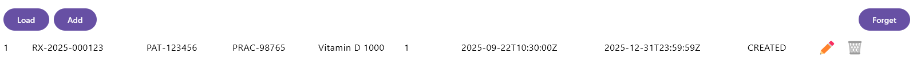
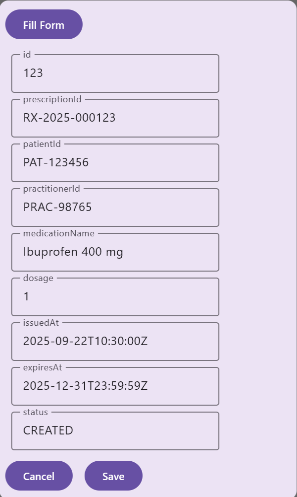

# Wie Sie den ZETA-Demo-Client bauen und ausführen

Diese Anleitung unterstützt Tester dabei, den ZETA-Demo-Client zu bauen und
auszuführen. Der Demo-Client nutzt die API des Test-Fachdienstes und bietet eine
Benutzerschnittstelle dafür.

Basierend auf dem Demo-Client kann ein eigener Testclient für andere Fachdienste
entwickelt werden. Siehe dazu auch die
[Struktur des SDK-Repositorys](../Referenzen/SDK-Uebersicht.md).

---

Status: Entwurf

Zielgruppe: Tester und Entwickler

---

## Inhaltsverzeichnis

- [Überblick](#überblick)
- [Voraussetzungen](#voraussetzungen)
- [Vorgehen](#vorgehen)
  - [Abhängigkeiten / Erforderliche Konfiguration](#abhängigkeiten--erforderliche-konfiguration)
  - [Kurzanleitung](#kurzanleitung)
  - [Anleitung in Schritten](#anleitung-in-schritten)
- [Bedienung](#bedienung)

## Überblick

Dieses Dokument zeigt, wie Sie das SDK und den Client mit dem Build-Werkzeug
Gradle bauen.

## Voraussetzungen

* Ein PC mit Windows, Linux oder Mac
* Installiertes Java Development Kit (JDK)
* Git-Client zum Herunterladen des SDK-Repositorys oder der heruntergeladene
  Inhalt des Repositorys
* Installiertes Android Software Development Kit (SDK) mit gesetzter
  `ANDROID_HOME`-Umgebungsvariable (optional)

Hinweis: Das SDK und der Test-Client können grundsätzlich ohne Android-SDK
gebaut werden. Im Hinblick auf die spätere Verwendung in mobilen Anwendungen
wird hier aber schon der Build für Android (und iOS auf Macs) berücksichtigt.

## Vorgehen

### Abhängigkeiten / Erforderliche Konfiguration

Der Testclient braucht im Wesentlichen zwei Angaben: die Adresse des
Fachdienstes und die Informationen für ein SM(C)-B-Zertifikat (als Datei oder
über den Konnektor).

Diese werden durch eine Konfigurationsdatei bzw. Umgebungsvariablen bereitgestellt.

Hier sind die Konfigurationswerte:

| Wert                      | Beschreibung                                                                                     | Beispiel                                                   |
|---------------------------|--------------------------------------------------------------------------------------------------|------------------------------------------------------------|
| FACHDIENST_URL            | URL of the resource server as reachable via the PEP                                              | https://fachdienst.host.example.com/pep/fachdienst_url/api |
| SMB_KEYSTORE_FILE         | Path to the SM-B Certificate-File (in .p12 format)                                               | /smcb-certificates.p12                                     |
| SMB_KEYSTORE_ALIAS        | Alias of the key in the SM-B Certificate file                                                    |                                                            |
| SMB_KEYSTORE_PASSWORD     | Password for the private key                                                                     |                                                            |
| SMCB_BASE_URL             | base url of the konnektor webservice interface (needs to include the "/ws")                      |                                                            |
| SMCB_MANDANT_ID           | <mandanten-ID>  für den Konnektor-Aufruf                                                         |                                                            |
| SMCB_CLIENT_SYSTEM_ID     | <client_system_id>  für den Konnektor-Aufruf                                                     |                                                            |
| SMCB_WORKSPACE_ID         | <workspace_id>  für den Konnektor-Aufruf                                                         |                                                            |
| SMCB_USER_ID              | <user-id> - diese wird nach Konnektor-Spezifikation für SMC-B Signaturen benötigt aber ignoriert |                                                            |
| SMCB_CARD_HANDLE          | <smcb-card-handle>  für den Konnektor-Aufruf                                                     |                                                            |
| POPP_TOKEN                | Wert eines PoPP-Tokens, welches an den PEP mitgegeben wird (optional)                            | eyJhbGciOiJFUzI1NiI......                                  |
| DISABLE_SERVER_VALIDATION | Falls auf `true` gesetzt, wird die TLS-Zertifikatsprüfung des Servers ausgesetzt (für Tests)     |                                                            |

Hierbei muss nur ein Set – entweder `SMB_*` oder `SMCB_*` – angegeben werden.

Die `SMB_*`-Variablen definieren, wo die SM-B-Zertifikatsdatei liegt, mit der
sich der Client gegenüber dem ZETA-Guard authentifiziert.

Die `SMCB_*`-Variablen definieren, wie der Konnektor erreicht werden kann,
um ein SMC-B-Zertifikat zu erzeugen.

Die Parameter-Datei sieht dabei – für ein Testszenario(!) – beispielsweise wie
folgt aus:

````
ENVIRONMENTS=<resource_server_1_api_endpoint> <resource_server_2_api_endpoint> ...

SMB_KEYSTORE_FILE=<sm-b-keystore-file>.p12
SMB_KEYSTORE_ALIAS=<key-alias-im-keystore-file>
SMB_KEYSTORE_PASSWORD=<keystore-password>

SMCB_BASE_URL=<basis_url_des_konnektor_webservice_interface>
SMCB_MANDANT_ID=<mandanten-ID>
SMCB_CLIENT_SYSTEM_ID=<client_system_id>
SMCB_WORKSPACE_ID=<workspace_id>
SMCB_USER_ID=<user-id>
SMCB_CARD_HANDLE=<smcb-card-handle>

DISABLE_SERVER_VALIDATION=true
POPP_TOKEN=eyJhbGciOiJFUzI1N......
````

Hinweis: Die Fachdienst-URLs werden hier „ENVIRONMENTS“ genannt, da mehrere
durch Leerzeichen getrennte `FACHDIENST_URL`-Werte möglich sind. Die
verschiedenen URLs können im Client ausgewählt werden.

### Kurzanleitung

Nach der Konfiguration kann der Client mit dieser Kommandozeile gebaut sowie ausgeführt werden:

````
./gradlew :zeta-client:jvmRun -DmainClass="de.gematik.zeta.client.ZetaClientAppKt" --args='--ZETA_ENV_FILE=<Name-der-Parameter-Datei>
````

### Anleitung in Schritten

#### Bauen des SDK und Deployment in ein lokales Maven-Repository

Dieser Schritt benötigt _kein_ Android SDK.

````
./gradlew publishJvmPublicationToMavenLocal
./gradlew publishKotlinMultiplatformToMavenLocal
````

#### Remote-Maven-Repository

Hinweis: Sollten Sie das ZETA-SDK in ein eigenes Remote-Repository übertragen
wollen, so müssen Sie die folgende Konfiguration in der build-logic anpassen:

| Verzeichnis                                                            | Datei               | Zeile/Variable                     | Beschreibung                      | Beispiel                                                     |
|------------------------------------------------------------------------|---------------------|------------------------------------|-----------------------------------|--------------------------------------------------------------|
| build-logic/build-logic/src/main/kotlin/de/gematik/zeta/sdk/buildlogic | BuildLogicPlugin.kt | 242<br/>URL des Maven Repositories | URL des remote Maven Repositories | "https://<repository-host>/api/v4/projects/3/packages/maven" |

#### Vollständige Setups

Die vollständigen Tests und Setups benötigen ein installiertes Android SDK:

##### Vollständiger Build

````
./gradlew build
````

##### Ausführen der Tests

````
./gradlew testAll
````

## Bedienung

Dieser Abschnitt zeigt, wie Sie den Demo-Client bedienen. Die Bedienung ist
weitgehend selbsterklärend; einige Besonderheiten sind aber zu beachten.

Beim Start öffnet sich ein Fenster mit der aktuellen Liste von Rezepten. Sie ist
zunächst leer, etwa wenn auch der Test-Fachdienst neu gestartet wurde.

Hier ein Bild mit einem Rezept in der Liste:



Hinweis: Das ist selbstverständlich kein echter E-Rezept-Fachdienst, sondern nur
eine Anmutung dessen, um dem Testfachdienst eine fachliche Bedeutung zu geben
und damit die CRUD-Operationen testen bzw. vorstellen zu können.

Mit dem Klick auf den „Add“-Button bzw. den „Bleistift“ in der Rezept-Zeile
kann ein neuer Eintrag erstellt bzw. geändert werden.



Bei der Erstellung eines neuen Eintrags kann mit dem „Fill Form“-Button
das Formular mit Testdaten gefüllt werden.

Hinweis: Vor dem Speichern muss allerdings das Feld `id` geleert werden.
Außerdem muss die `prescriptionId` in der Datenbank eindeutig sein.

Bei der Änderung können nur `medicationName`, `dosage`, `expiresAt` und `status`
geändert werden. Alle anderen Werte werden nicht geändert bzw. automatisch
gesetzt.
