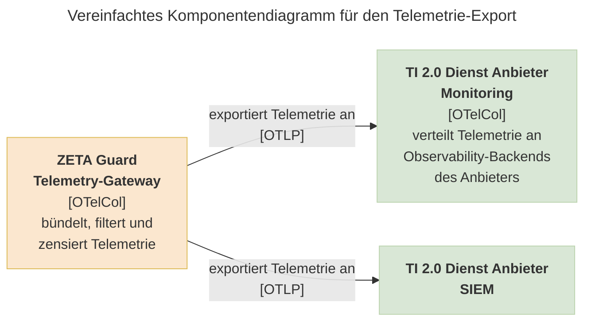

# Wie Sie ein Observability-Backend an ZETA-Guard anschließen

Der Telemetrie-Daten Service kann Monitoring-Daten der ZETA Guard-Komponenten an das Monitoring des TI 2.0 Dienst-Anbieters senden. D.h. TI-2.0-Dienst-Anbieter und -Hersteller dürfen eigene Observability-Backends
(w.z. B. Prometheus) an ZETA-Guard anschließen. Für jedes Observability-Backend
muss ein neuer OpenTelemetry-Exporter im Telemetry-Gateway konfiguriert werden.
Verbindungen zwischen dem Telemetry-Gateway und ZETA-Guard-externen Diensten
müssen über mTLS abgesichert werden. Wenn Ihr Cluster kein Service-Mesh für mTLS
verwendet, müssen ihr Receiver und der Exporter im Telemetry-Gateway für mTLS
konfiguriert werden.

Das Telemetry-Gateway ist ein OpenTelemetry-Collector, und Sie können
die [offizielle Dokumentation des Collectors](https://opentelemetry.io/docs/collector/configuration/)
und seiner Module verwenden. Die im Telemetry-Gateway verfügbaren Exporter und
Authenticator-Extensions können Sie
im [Build-Manifest des Collectors](https://github.com/open-telemetry/opentelemetry-collector-releases/blob/v0.145.0/distributions/otelcol-k8s/manifest.yaml)
nachschlagen.

<!-- Future Work Link zum Build-Manifest aktualisieren, sobald eigene Collectoren veröffentlicht wurden. -->



Die Konfiguration des Telemetry-Gateways erfolgt über die Values des
`zeta-guard` Helm-Charts, und kann wie folgt aussehen:

```yaml
telemetry-gateway:
    config:
        exporters:
            otlp_grpc/an-anbieter:
                endpoint: otelcol2:4317 # Zieladresse muss angepasst werden
                tls:
                    ca_file: "/etc/tls/ca.pem"
                    cert_file: "/etc/tls/client-cert.pem"
                    key_file: "/etc/tls/client-key.pem"
        service:
            pipelines:
                logs/an-anbieter:
                    receivers:
                        # Receiver aus Pipeline "logs" hinzufügen
                    processors:
                        # Prozessoren aus Pipeline "logs" hinzufügen
                        - redaction/betreiber
                    exporters:
                        - otlp_grpc/an-anbieter
                metrics/an-anbieter:
                    receivers:
                        # Receiver aus Pipeline "metrics" hinzufügen
                    processors:
                        # Prozessoren aus Pipeline "metrics" hinzufügen
                        - redaction/betreiber
                    exporters:
                        - otlp_grpc/an-anbieter
                traces/an-anbieter:
                    receivers:
                        # Receiver aus Pipeline "traces" hinzufügen
                    processors:
                        # Prozessoren aus Pipeline "traces" hinzufügen
                        - redaction/betreiber
                    exporters:
                        - otlp_grpc/an-anbieter
    extraVolumeMounts:
        -   name: tls
            mountPath: "/etc/tls"
            readOnly: true
    extraVolumes:
        -   name: tls
            secret:
                secretName: telemetry-gateway-mtls  # dieses Secret müssen Sie anlegen
```

Dieses Beispiel erwartet einen einzigen Zielpunkt für Logs, Metriken und Traces,
der als Verteiler an die eigentlichen Backends (z.B. Prometheus, OpenSearch und
Jaeger) dient. Das Beispiel verwendet
einen [OTLP gRPC Exporter](https://github.com/open-telemetry/opentelemetry-collector/blob/main/exporter/otlpexporter/README.md)
mit [mTLS-Konfiguration](https://opentelemetry.io/docs/collector/configuration/#mtls-configuration-mutual-tls)
und
einen [Redaction-Processor](https://github.com/open-telemetry/opentelemetry-collector-contrib/tree/main/processor/redactionprocessor),
und zeigt keine vorkonfigurierten Exporter, Pipelines usw. aus dem
"zeta-guard"-Chart.

Die Beispielkonfiguration definiert drei neue Pipelines (`logs/an-anbieter`,
`metrics/an-anbieter`und `traces/an-anbieter`) mit einem neuen Exporter
(`otlp_grpc/an-anbieter`). Der Prozessor `redaction/betreiber`ist im Chart
definiert und zensiert Telemetrie mit einem Katalog regulärer Ausdrücke für
personenbezogene Daten und Tokens. Achten Sie darauf, alle Receiver und
Prozessoren aus dem `zeta-guard`-Chart zu nennen. Das Secret
`telemetry-gateway-mtls` ist ebenfalls nicht Teil des `zeta-guard`-Helm-Charts,
und muss vom Anbieter erzeugt und verwaltet werden.
