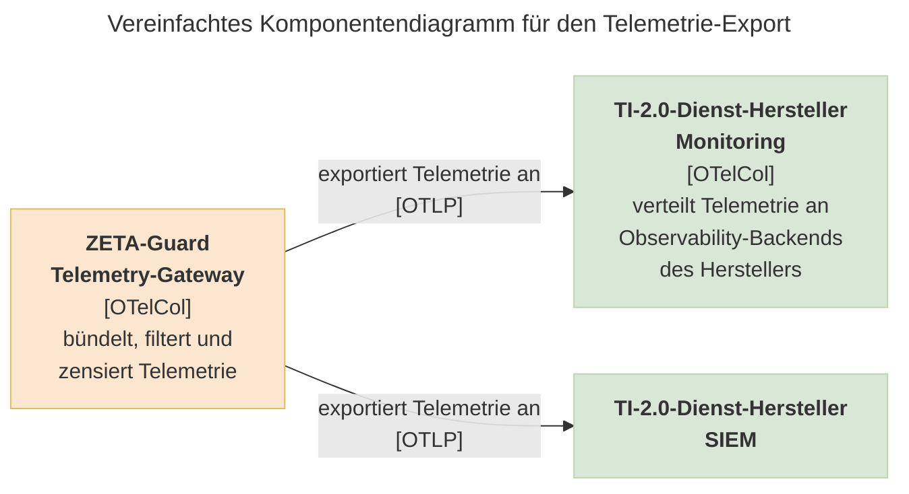

# Wie Sie ein Observability-Backend an ZETA-Guard anschließen

Der Telemetriedaten-Service kann Monitoring-Daten der ZETA-Guard-Komponenten an
das Monitoring des TI-2.0-Dienst-Herstellers senden. D. h.
TI-2.0-Dienst-Hersteller dürfen eigene Observability-Backends (wie z. B.
Prometheus) an ZETA-Guard anschließen. Für jedes Observability-Backend muss ein
neuer OpenTelemetry-Exporter im Telemetry-Gateway konfiguriert werden.
Verbindungen zwischen dem Telemetry-Gateway und ZETA-Guard-externen Diensten
müssen über mTLS abgesichert werden. Wenn Ihr Cluster kein Service-Mesh für mTLS
verwendet, müssen Ihr Receiver und der Exporter im Telemetry-Gateway für mTLS
konfiguriert werden.

Das Telemetry-Gateway ist ein OpenTelemetry-Collector, und Sie können
die [offizielle Dokumentation des Collectors](https://opentelemetry.io/docs/collector/configuration/)
und seiner Module verwenden. Die im Telemetry-Gateway verfügbaren Exporter und
Authenticator-Extensions können Sie
im [Build-Manifest des Collectors](https://github.com/open-telemetry/opentelemetry-collector-releases/blob/v0.156.0/distributions/otelcol-k8s/manifest.yaml)
nachschlagen.

<!-- Future Work Link zum Build-Manifest aktualisieren, sobald eigene Collectoren veröffentlicht wurden. -->


```mermaid
---
title: Vereinfachtes Komponentendiagramm für den Telemetrie-Export
---
flowchart LR
    DienstAnbieterMonitoring["`**TI-2.0-Dienst-Hersteller
     Monitoring**
     [OTelCol]
     verteilt Telemetrie an
      Observability-Backends
       des Herstellers`"]
    DienstAnbieterSiem["`**TI-2.0-Dienst-Hersteller
     SIEM**`"]
    Gateway["`**ZETA-Guard
     Telemetry-Gateway**
                    [OTelCol]
                    bündelt, filtert und
                    zensiert Telemetrie`"]
    Gateway -->|"`exportiert Telemetrie an
        [OTLP]`"| DienstAnbieterMonitoring
    Gateway -->|"`exportiert Telemetrie an
        [OTLP]`"| DienstAnbieterSiem
%% styling
    classDef KomponenteAnwendung fill: #d9e7d6, stroke:#bdd4b0;
    classDef KomponenteBestehend fill: #eeeeee, stroke: black;
    classDef KomponenteZeta fill: #fbe7cf, stroke:#debc5a;

    class AuthServer,Gateway,HttpProxy,LogCollector,PolicyEngine KomponenteZeta;
    class DienstAnbieterMonitoring,DienstAnbieterSiem KomponenteAnwendung;
```

Das Telemetry-Gateway konfigurieren Sie über die Values des
`zeta-guard`-Helm-Charts, zum Beispiel so:

```yaml
telemetry-gateway:
    config:
        exporters:
            otlp_grpc/dienst_hersteller:
                endpoint: otelcol2:4317 # Zieladresse muss angepasst werden
                sending_queue:
                    storage: file_storage
                tls:
                    ca_file: "/etc/tls/ca.pem"
                    cert_file: "/etc/tls/client-cert.pem"
                    key_file: "/etc/tls/client-key.pem"
        service:
            pipelines:
                logs/dienst_hersteller:
                    exporters:
                        - otlp_grpc/dienst_hersteller
                metrics/dienst_hersteller:
                    exporters:
                        - otlp_grpc/dienst_hersteller
                traces/dienst_hersteller:
                    exporters:
                        - otlp_grpc/dienst_hersteller
                        - spanmetrics   # Connector aus dem zeta-guard-Chart, muss erhalten bleiben
    extraVolumeMounts:
        # die ersten drei Einträge stammen aus dem zeta-guard-Chart, siehe Hinweis unten
        -   name: ti-siem-token
            mountPath: /etc/ti-siem
            readOnly: true
        -   name: ti-sim-token
            mountPath: /etc/ti-sim
            readOnly: true
        -   name: file-storage
            mountPath: /var/lib/storage/otc
        -   name: tls
            mountPath: "/etc/tls"
            readOnly: true
    extraVolumes:
        -   name: ti-siem-token
            secret:
                secretName: ti-siem-token
        -   name: ti-sim-token
            secret:
                secretName: ti-sim-token
        -   name: file-storage
            persistentVolumeClaim:
                claimName: '{{ include "opentelemetry-collector.fullname" . }}-file-storage'
        -   name: tls
            secret:
                secretName: telemetry-gateway-mtls  # dieses Secret müssen Sie anlegen
```

Dieses Beispiel erwartet einen einzigen Zielpunkt für Logs, Metriken und Traces,
der als Verteiler an die eigentlichen Backends (z. B. Prometheus, OpenSearch und
Jaeger) dient. Das Beispiel verwendet
einen [OTLP-gRPC-Exporter](https://github.com/open-telemetry/opentelemetry-collector/blob/main/exporter/otlpexporter/README.md)
mit [mTLS-Konfiguration](https://opentelemetry.io/docs/collector/configuration/#mtls-configuration-mutual-tls)
und fügt ihn zu den im Helm-Chart vorkonfigurierten Pipelines
`logs/dienst_hersteller`, `metrics/dienst_hersteller` und
`traces/dienst_hersteller` hinzu. Achten Sie bei `extraVolumeMounts` und
`extraVolumes` darauf, neben Ihrem neuen Volume auch die Volumes aus dem
`zeta-guard`-Chart zu nennen (`ti-siem-token`, `ti-sim-token`, `file-storage`) —
Helm ersetzt Listen vollständig, statt sie zusammenzuführen. Ohne sie brechen
der Bearer-Token-Export an die gematik und die persistente Sending-Queue, die
auch dieses Beispiel über `sending_queue.storage: file_storage` verwendet.
Das Secret `telemetry-gateway-mtls` ist
ebenfalls nicht Teil des `zeta-guard`-Helm-Charts und muss von Ihnen erzeugt
und verwaltet werden.
