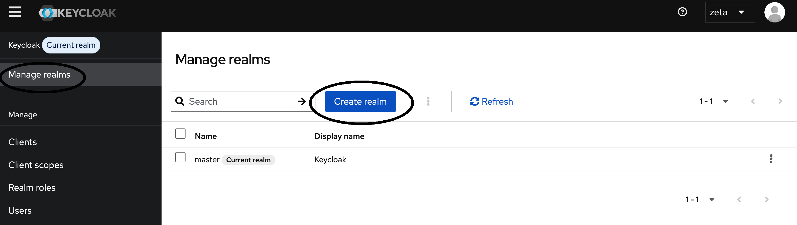
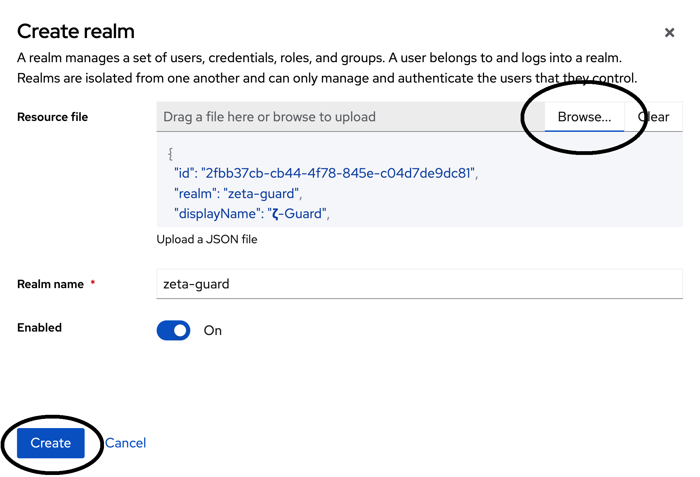

# ZETA-Guard-Quickstart

[TOC]

## Installation

### Benötigte Werkzeuge

* Helm und kubectl
* ein Kubernetes-Cluster
    * mit über Stateful Sets provisionierbarem Storage
    * mit eingerichtetem Ingress-Controller _(zukünftig optionaler Bestandteil
      des ZETA Guard)_
    * lokal den passenden Kontext in kubectl eingerichtet
* Einen Fachdienst – in diesem Dokument wird dieser als verfügbar
  unter https://testfachdienst angenommen.

### Installationsschritte

Die Installation gliedert sich grob in folgende Schritte

1. Helm aufsetzen
2. PDP konfigurieren
3. PEP konfigurieren

#### 1. Helm aufsetzen

Zunächst müssen Sie das ZETA-Helm-Chart-Repository hinzufügen:

```shell
    helm repo add zeta <TODO-REPO-URL>
```

Für einen Demo-Use-Case müssen Sie nun die
Datei [values-demo.yaml](values-demo.yaml) ins Arbeitsverzeichnis kopieren und
anpassen.
Sie können diese Datei als Konfigurationsvorlage für den Produktivbetrieb
verwenden und anpassen.

Mit dieser [values-demo.yaml](values-demo.yaml) können Sie ZETA Guard über
folgendes Kommando installieren:

```shell
    helm upgrade --install zeta-guard zeta/zeta-guard -f values-demo.yaml --wait --atomic
```

#### 2. PDP konfigurieren

##### Zugriff einrichten

Über den Ingress ist auf den Namen `zeta-guard` eine Reihe von HTTP-Diensten
verfügbar.
Auf dem PDP müssen Sie im Prototyp zunächst einen Administrator anlegen.
Dies geht nur mit direktem Zugriff auf den PDP.
Diesen Zugriff richten Sie ein via

```shell
    kubectl port-forward svc/authserver 8080:80
```

Solange das Kommando läuft, ist
unter [http://localhost:8080/auth/](http://localhost:8080/auth/) der Zugriff auf
die Admin-Konsole möglich.
Besuchen Sie diese Adresse in einem Browser, und folgen Sie den Anweisungen in
der Admin-Konsole, um einen Administrator einzurichten.

##### Realm importieren

Nach dem Login (ggf. über den Port-Forward) als Administrator befinden Sie sich
im initialen Realm "master".
Zur Keycloak-Installation müssen nun den vorkonfigurierten Realm "zeta-guard"
hinzufügen.

Die Definition dieses Realms befindet sich in der
Datei [zeta-guard-realm.json](zeta-guard-realm.json)
und kann über die Web-Oberfläche importiert werden:



Wählen Sie die Datei [zeta-guard-realm.json](zeta-guard-realm.json) aus und
klicken auf den Knopf "Create".



#### 3. PEP konfigurieren

Die values-demo.yaml enthält eine PEP-Beispielkonfiguration, welche eine
nginx-Welcome-Seite ausliefert.
Für den Demo-Use-Case können Sie diesen Abschnitt überspringen.

Falls der PEP an einen Fachdienst angeschlossen werden soll, geht dies wie
folgt:

Der PEP ist auf Basis von nginx umgesetzt. In
der [values-demo.yaml](values-demo.yaml) ist im Feld
`pepproxy.nginxConf.fileContent` der Dateiinhalt einer nginx-Konfiguration
(.../nginx.conf) anzugeben.
Dort sind in der [values-demo.yaml](values-demo.yaml) die folgenden Direktiven
auf die Konfiguration des PDP abzustimmen:

* `pep_issuer`

  Die Realm URL des PDP. Sollte z.B. wie folgt aussehen:
  `https://public-name-of-keycloak-here/auth/realms/zeta-guard`

* `proxy_pass`

  Das abzusichernde Ziel.
  In der values-demo.yaml ist das Ausliefern des http-Verzeichnisses via
  `root ...` eingerichtet.
  Der Fachdienst ist in der Regel über die nginx-Standarddirektive `proxy_pass`
  anzubinden.
  In der values-demo.yaml wäre dann die `root`-Direktive zu ersetzen, z.B. durch
  `proxy_pass https://testfachdienst/`

Anmerkung: Die nginx-Direktive `pep on;` schaltet das PEP-spezifische Verhalten
auf dem entsprechenden Pfad ein. Eine genauere Referenz zur PEP-Konfiguration
findet sich [hier](../Referenzen/Konfiguration_des_PEP_Http_Proxy.md).

Nachdem Sie die values-demo.yaml entsprechend angepasst haben, können Sie Ihre
Änderungen über folgendes Helm-Kommando ausrollen:

```shell
    helm upgrade --install zeta-guard zeta/zeta-guard -f values-demo.yaml --wait --atomic
```

Nun haben Sie den ZETA-Guard eingerichtet und ein Zugriff über den
ZETA-Testclient und das ZETA-Client-SDK ist möglich.

## Testweiser Zugriff auf einen per ZETA Guard abgesicherten Fachdienstendpunkt

Bei diesem Prototyp können Sie sich über die Kommandozeile ein Access-Token
beschaffen und damit auf den Fachdienst zuzugreifen.
In späteren Versionen wird dies wegen komplexerer Interaktion (u.a.
Clientregistrierung, Attestation, etc.) nicht mehr ohne Weiteres möglich sein.

Im Folgenden ist beschrieben, wie der Kommandozeilenzugriff erfolgt:

0. Finden Sie den Hostnamen des Ingressservers des Kubernetesclusters und
   schreiben Sie ihn für die folgenden Kommandos in eine Variable:
    ```shell
    export INGRESS_HOST=ingress.server.name
    ```

1. Beschaffen Sie einen Access-Token

   _Die Validierung von SMC-B-Tokens wird noch implementiert_.
   Sie können das folgende Access-Token verwenden:

    ```shell
    export SMCB_TOKEN=eyJhbGciOiJSUzI1NiIsInR5cCIgOiAiSldUIiwia2lkIiA6ICJXdVo4bFJodHZvb1lxeHExU3A3SHM5ZmU4b2FFSFV6RGNFckRYOUJ2OWhNIn0.eyJleHAiOjE3NTg2MTExNjgsImlhdCI6MTc1ODYxMDg2OCwianRpIjoib25ydHJvOjU5OWNmYjAyLTI0YTktNDViZi0xNDRlLTZjNDg5YTYxMzI2NSIsImlzcyI6Imh0dHA6Ly9sb2NhbGhvc3Q6MTgwODAvcmVhbG1zL3NtYy1iIiwiYXVkIjpbInJlcXVlc3Rlci1jbGllbnQiLCJhY2NvdW50Il0sInN1YiI6ImQwYWFjYzljLTJkOTMtNDM4YS1hNzAzLWI4Nzc4OTIxODNmOCIsInR5cCI6IkJlYXJlciIsImF6cCI6InNtYy1iLWNsaWVudCIsInNpZCI6IjY5ZDgxODA4LTY2ZTYtNDlmMi04OWRiLTdiODBlOGU4OTlmYiIsImFjciI6IjEiLCJyZWFsbV9hY2Nlc3MiOnsicm9sZXMiOlsiZGVmYXVsdC1yb2xlcy1zbWMtYiIsIm9mZmxpbmVfYWNjZXNzIiwidW1hX2F1dGhvcml6YXRpb24iXX0sInJlc291cmNlX2FjY2VzcyI6eyJhY2NvdW50Ijp7InJvbGVzIjpbIm1hbmFnZS1hY2NvdW50IiwibWFuYWdlLWFjY291bnQtbGlua3MiLCJ2aWV3LXByb2ZpbGUiXX19LCJzY29wZSI6ImVtYWlsIHByb2ZpbGUiLCJlbWFpbF92ZXJpZmllZCI6dHJ1ZSwibmFtZSI6IlVzZXIgRXh0ZXJuYWwiLCJwcmVmZXJyZWRfdXNlcm5hbWUiOiJ1c2VyIiwiZ2l2ZW5fbmFtZSI6IlVzZXIiLCJmYW1pbHlfbmFtZSI6IkV4dGVybmFsIiwiZW1haWwiOiJ1c2VyQGJhci5mb28uY29tIn0.sHewe6f5zk_EslSVtectqb_91U_6YpYhQoQhWNFwLINJd3ryrKNaLOeB196x5fbAfFGSk-Exa9D24K64xzETnoKrXQRrRKi4sSJGxDqtXbkmbxr-fJvyB3Ay_0_lCZAUPNEYH2Sx5caClRnJy60eeKt3pm4JmV5nLFXh-DOYEDc5r1NGcl1bwCt70pQJ1aKlMaiUDuC5N8CXSAuUdRc1IWzB324QNBglW4qpUY2anp-j23bnJBhLmYgVeKa_RBksJ1-jSgwODeuO1gIR96qqc7SqjzQVgteGumr5zfR3qc5GAGGBIxYX3Jndr4lqcW2-mYffDwp7fWf4a5FJ5wgUuw
    ```

2. Mit dem Access-Token rufen Sie ein ZETA-Guard-Access-Token ab:

    ```shell
    export ZETA_GUARD_ACCESS_TOKEN=$(curl -X POST \
        --location "http://$INGRESS_HOST/auth/realms/zeta-guard/protocol/openid-connect/token" \
        -H "Host: authserver" \
        -H "Content-Type: application/x-www-form-urlencoded" \
        --data-urlencode "grant_type=urn:ietf:params:oauth:grant-type:token-exchange" \
        --data-urlencode "client_id=zeta-client" \
        --data-urlencode "subject_token=$SMCB_TOKEN" \
        --data-urlencode "subject_token_type=urn:ietf:params:oauth:token-type:jwt" \
        --data-urlencode "requested_token_type=urn:ietf:params:oauth:token-type:access_token" \
        --data-urlencode "client_assertion_type=urn:ietf:params:oauth:client-assertion-type:jwt-bearer" \
        --data-urlencode "client_assertion=client-jwt" \
        | jq -r .access_token)
    ```

Anmerkung: Der Host-Header muss der `pep_issuer`-Direktive im nginx entsprechen.
Für ein produktives Setup konfigurieren Sie den PEP passend zum Cluster-externen
Namen. `authserver` ist auf das Beispiel `values-demo.yaml` abgestimmt.

3. Mit diesem ZETA-Guard-Access-Token können Sie durch den PEP auf den
   Fachdienst zugreifen.
   Hier ein einfacher GET-Request als Beispiel:

    ```shell
    curl -X GET --location "http://$INGRESS_HOST/" \
        -H "Authorization: Bearer $ZETA_GUARD_ACCESS_TOKEN"
    ```

Das Beispiel geht davon auf, dass auf den zugegriffenen Pfad (hier `/`) die
nginx-Direktive `pep on;` aktiv ist.
Wenn der `Authorization`-Header fehlt oder ein invalides Token enthält, lehnt
der PEP den Zugriff ab.
Wenn der PEP wie in der initialen values-demo.yaml konfiguriert belassen wurde,
wird der o.g. curl-Befehl das HTML der nginx-Welcome-Seite zurückgeben.

Wenn das alles funktioniert, haben Sie den ZETA-Guard-Prototyp erfolgreich
eingerichtet.
