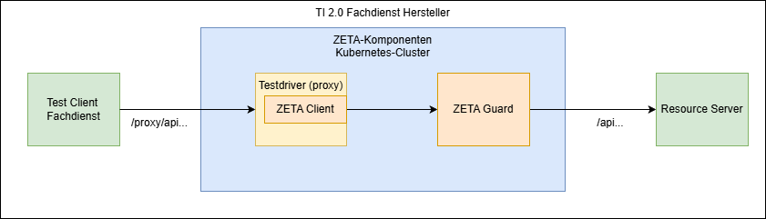
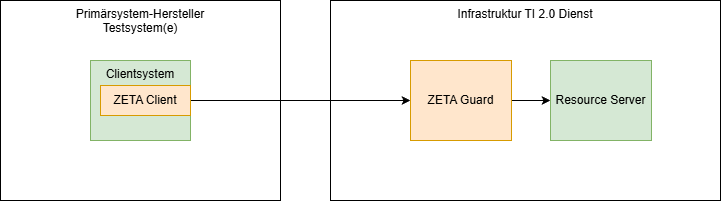

# ZETA Produkthandbuch

## Einführung und Übersicht

Der ZETA-Guard und der ZETA-Client bzw. das ZETA-SDK sind essenzielle
Bestandteile der Telematikinfrastruktur 2.0. Sie schützen die fachlichen
Ressourcen gegen unautorisierte Zugriffe.

In diesem Produkthandbuch werden die einzelnen Komponenten beschrieben,
sowie dargelegt, wie die Komponenten integriert, betrieben, und fachlich
genutzt werden können.

### Dokumenteninformation

| Version | Stand    | Zusammenfassung der Änderungen |
|---------|----------|--------------------------------|
| 0.2.x   | 29.12.25 | Einarbeitung Kommentare        |

### Hinweise

Die hier beschriebenen Komponenten sind zum Zeitpunkt der
Erstellung der Dokumentation nicht für einen Produktivbetrieb geeignet.

Sollten serverseitige Komponenten vom Internet aus erreichbar sein, so
sollten – aktuell – zusätzliche Sicherungsmaßnahmen wie Firewalls, VPN,
oder Filterungen nach Quell-IPs umgesetzt werden.

## Inhaltsverzeichnis

[[_TOC_]]

## Über dieses Dokument: Zielgruppe, Scope, und verwendete Versionen

In diesem Dokument werden unterschiedliche Zielgruppen berücksichtigt:

### Fachdienst-Hersteller

Dieser Bereich ist für Hersteller von Fachdiensten, die mit ZETA-Guard
betrieben werden müssen. Hier wird beschrieben, wie der ZETA-Guard
mit einem Fachdienst integriert werden kann. Hier wird insbesondere
auf Test-Setups eingegangen, mit denen die Funktion des Fachdienstes vom
Client über ZETA-SDK und ZETA-Guard hinweg, und damit die Interaktion
des Fachdienstes mit dem ZETA-Guard getestet werden kann.

### Fachdienst-Betreiber

Dieser Bereich ist für Betreiber von Fachdiensten, die den ZETA-Guard integrieren.
Hier werden verschiedene Produktionssetups dargestellt, sowie gezeigt, der wie ZETA-Guard
konfiguriert und betrieben werden kann.

### Primärsystem-Hersteller

Dieser Bereich ist für Hersteller von Primärsystemen (also Praxisverwaltungssysteme,
Krankenhausinformationssysteme, oder Apothekenmanagementsysteme), die einen ZETA-Client
integrieren müssen, um auf die TI 2.0 Dienste mit ZETA zugreifen zu können.
Hier wird insbesondere die Integration des ZETA-SDK in einen existierenden
Fachdienst-Client beschrieben, und wie Testsetups aufgesetzt und genutzt
werden können.

## Architektur-Übersicht

Die ZETA Komponenten sitzen grundsätzlich zwischen
den fachlichen Clients und den Fachdiensten. Sie ermöglichen
den sicheren Zugriff auf geschützte Ressourcen über
ein ungeschütztes Netzwerk (Internet).

Der verfolgte Ansatz ist hier, dass sich die ZETA-Komponenten möglichst
transparent zwischen Client und Fachdienst einfügen – dabei aber die notwendigen
Sicherheitsniveaus für die Kommunikation mit geschützten Ressourcen
bereitstellen.

Das folgende Diagram zeigt die interne ZETA-Architekturübersicht mit einem stärkeren
Fokus auf die zu betreibenden Komponenten.

Die wesentlichen Anpassungen zu gemspec_ZETA 1.2.0 bestehen in:

* Nutzung eines lokalen PIP/PAP Repositories des Herstellers, welches vom
gematik PIP/PAP Repository gespeist wird
* Aufteilung der PDP Datenbanken in eine Infinispan und eine relationale
  (Postgres) Datenbank
* PEP Datenbank wurde durch eine API am Authorization Server ersetzt

Die folgenden Bereiche betrachten die Spezifika fokussiert
auf die Interessen der einzelnen, wie oben identifizierten
Zielgruppen des Produkthandbuchs.

## Fachdienst-Hersteller

Fachdienst-Hersteller stellen die Software her, die zur Bereitstellung und Betrieb
eines Fachdienstes nötig ist. Dies können zum Beispiel Hersteller von
VSDM 2.0 Diensten, oder des PoPP Dienstes sein. In späteren Ausbaustufen der
TI 2.0 können weitere Fachdienste hinzukommen.

### Betrachtete Nutzungsszenarien

Für den Fachdienst-Hersteller werden im Wesentlichen Szenarien betrachtet,
in denen die ZETA-Komponenten zum Test der Interaktion mit dem Fachdienst
genutzt werden.

Dazu wird angenommen, dass die ZETA-Komponenten als "Black Box" betrachtet
werden wollen, die, einmal installiert, den Zugriff absichern und ggf. nur
in unterschiedlichen Konfigurationen bzgl. Fachdienst-Endpunkten o.ä. betrieben
werden.

Das folgende Diagram zeigt ein solches angenommenes Szenario:

Hierbei wird Folgendes angenommen:

* Es existiert ein Fachdienst-Test-Client, der den Fachdienst via HTTPS aufrufen
  kann, um Funktionalität fachlich zu testen.
* Dieser Fachdienst-Test-Client ist konfigurierbar und insbesondere kann ein
  veränderter Basis-Pfad für die Aufrufe der Fachdienst-API genutzt werden.

Die ZETA-Komponenten – inklusive des ZETA-Testdriver-Clients – werden als
Container-Images geliefert, und in einem Kubernetes-Cluster betrieben.

Der ZETA-Testdriver wirkt damit mit der Ausnahme des Pfades als transparenter Proxy
zwischen Fachdienst-Test-Client und Fachdienst. Der am ZETA-Testdriver-Proxy
aufzurufende Pfad erhält dabei das Präfix `/proxy`, nur die Pfadsegmente hinter
`proxy` werden an den Fachdienst weitergereicht. Dies erlaubt weitere API
Funktionen am Testdriver, mehr Details dazu siehe dazu in
der [Anleitung zum Testdriver](Anleitungen/Wie_Sie_den_Testdriver_nutzen.md).

### Systemvoraussetzungen

Als Systemvoraussetzungen werden hier nur die notwendigen Voraussetzungen
genannt, die für die ZETA-Komponenten – und nicht für die
Fachdienst-Komponenten – benötigt werden.

#### Zugänge

* Container images

* TI Dienste
  * MUSS:
      * OCSP Responder der TI TSL (! d.h. der Responder im Internet nicht der im
        TI 1.0 Netz)
      * Federation Master
  * Abhängig von Fachdienst, ab Umsetzungsstufe 2:
      * Federated IDP bzw. Sektorale IdPs
  * Optional:
      * TI-Monitoring
      * TI-SIEM
      * PIP/PAP Repository

#### Eigene Dienste

* eigenes container repository (MUSS)
    * für die Bereitstellung der PIP/PAP images

* anbietereigene Dienste (Abhängig vom Fachdienst, ab Umsetzungsstufe 2)
    * Clientsystem Notification Service(s) – Apple Push Notifications, Firebase
    * Email Confirmation-Code – Mailversand

    * Optional:
        * Dienstanbieter-Monitoring (Opentelemtry Collector)
        * Dienstanbieter-SIEM

#### Infrastruktur

Die Infrastrukturanforderungen sind im Detail beschrieben
in der [Anleitung einen ZETA-Guard im Kubernetes zu konfigurieren](Anleitungen/Wie_Sie_ZETA_Guard_in_Kubernetes_konfigurieren.md).

#### Tooling

* Kubernetes - kubectl
* Terraform
* Helm 3+

#### Konfiguration, Keys

* Das ZETA-SDK benötigt zum Testen eine valide SM-B Datei aus dem verwendeten
  Vertrauensraum im p12 Format, wie sie
  von der gematik bezogen werden kann. Diese kann im Testdriver (proxy) Client
  konfiguriert werden, um SM-B-basierte Authentifizierung vornehmen
  zu können, und wird dann im PDP gegen den TI Vertrauensanker (Federation Master, TSL)
  geprüft.

Die genaue Art der Zertifikateprüfung - z.B. über Federation Master und/oder
Vertrauensanker-Container ist noch in Ausarbeitung der Spezifikation.

### Relevante Anleitungen und Referenzen

Die relevanten Anleitungen und Referenzen sind hier verlinkt:

* Für ein testweises Installieren eines ZETA-Guard in einer sehr reduzierten Form
auf einem unspezifizierten Kubernetes-Cluster
  [ZETA-Guard Quickstart für lokales Deployment.md](Anleitungen/ZETA_Guard_Quickstart_fuer_lokales_deployment.md)
* Wie Sie den ZETA-Guard Cluster lokal in einem `KIND` Setup ausführen
  [Wie Sie den Cluster lokal mit KIND aufsetzen](Anleitungen/Wie_Sie_den_Cluster_lokal_mit_KIND_aufsetzen.md)
* Für die Konfiguration und das Ausführen des ZETA-Testdrivers
  [Wie Sie den Testdriver nutzen](Anleitungen/Wie_Sie_den_Testdriver_nutzen.md)

Für den produktiven Betrieb des ZETA-Guard empfehlen sich zusätzlich folgende
Dokumente:

* Konfiguration des ZETA-Guard mit Details zu allen relevanten Komponenten
  [Wie Sie ZETA-Guard in Kubernetes konfigurieren](Anleitungen/Wie_Sie_ZETA_Guard_in_Kubernetes_konfigurieren.md)

Optionale Informationen:

* Für das Bauen des ZETA-Testdrivers (ein ZETA-Client, der als Proxy dient). Dies
sollte bei Nutzung des Testdriver container images nicht nötig sein, ist aber
bei eigenen Anpassungen nötig.
  [Wie Sie den Testdriver bauen](Anleitungen/Wie_Sie_den_Testdriver_bauen.md)
* Wie Sie einen Ende-zu-Ende-Integrationstest ausführen – hier werden der
  Test-Fachdienst und die ZETA-Komponenten mit der Tiger-Testsuite getestet.
  Dies kann – bei Bedarf
  vom Fachdienst-Hersteller an den eigenen Fachdienst angepasst werden.
  [Wie Sie einen Ende-zu-Ende-Integrationstest ausführen](Anleitungen/Wie_Sie_einen_Ende_zu_Ende_Integrationstest_ausführen.md)
* Leitszenarien des Deployments des ZETA-Guard für unterschiedliche Fachdienste:
  [Deploymentszenarien](Referenzen/Deploymentszenarien.md)

### Known Issues und Fehleranalysen

#### Besonderer Fehlersituationen

* Server-Fehler mit HTTP-Response-Code 500 (Internal Server Error) müssen
  mithilfe der Logs aus Kubernetes analysiert werden. Dazu kann`kubectl logs`
  genutzt werden.

#### Weitere Hinweise

* Die URL des Testdriver-Proxys enthält für alle Anfragen an den Fachdienst das
Präfix `/proxy`. Dies ist zu berücksichtigen.
* Ein Service-Mesh wird aktuell nicht mitgeliefert.
* Die Art der gegenseitigen
Authentifizierung des ZETA-Guard mit dem Fachdienst ist noch nicht spezifiziert.

### Wartung

Ein definierter Wartungsprozess ist vor Meilenstein 4 aktuell nicht umgesetzt.
Updates werden über die Image- bzw. git-Repositories verbreitet.

## Fachdienst-Betreiber

Fachdienst-Betreiber nutzen die Software der Fachdienst-Hersteller, ebenso
wie die verpflichtend zu nutzenden ZETA-Guard-Komponenten, um einen fachlichen
Dienst bereitzustellen.

### Betrachtete Nutzungsszenarien

Die ZETA-Nutzungsszenarien für Fachdienst-Betreiber beziehen sich im Wesentlichen
auf die Betriebsaspekte und die jeweils umzusetzenden, nichtfunktionalen Aspekte
wie Verfügbarkeit und Skalierung.

Dazu werden die ZETA-Guard Komponenten ergänzt um betriebliche Aspekte wie
Firewalls, Load Balancer, oder Application Firewalls.

Das folgende Diagram zeigt zwei solcher angenommenen Szenarien:

Hierbei wird Folgendes angenommen:

* Web Application Firewalls _vor_ dem ZETA-Guard können bei Nutzung von ASL
  nur die Kommunikation zwischen ZETA-Client und PDP prüfen. Die
  Kommunikation über den PEP erfolgt über ASL und ist damit nicht für
  diese Firewall sichtbar
* Eine Web Application Firewall _hinter_ dem ZETA-Guard kann den Datentransfer
  zwischen ZETA-Guard und insbesondere direkt vor dem Fachdienst prüfen.
  Dazu ist es aber erforderlich, dass der Datenverkehr zwischen ZETA-Guard und Fachdienst
  aufgebrochen werden muss und daher in einer sicheren Umgebung stattfinden muss.
  Dies ist vom jeweiligen Betreiber bei der Zulassung nachzuweisen.
* Es existiert ein Fachdienst-Test-Client, der ein ZETA-SDK enthält und
  durch den Betreiber für Tests genutzt wird. Alternativ kann für Testumgebungen
  das Setup analog für Fachdienst-Hersteller mit Test-Client und Testdriver im
  Container genutzt werden
* Für produktive Nutzung bzw. manuelle Tests existiert ein Client, der das
  ZETA-SDK bereits enthält.

Die ZETA-Komponenten werden als
Container-Images geliefert, und in einem Kubernetes-Cluster betrieben.

Der ZETA-Testdriver wirkt damit mit der Ausnahme des Pfades als transparenter Proxy
zwischen Fachdienst-Test-Client und Fachdienst. Der am ZETA-Testdriver-Proxy
aufzurufende Pfad erhält dabei das Präfix `/proxy`, nur der Teil hinter dem
Proxy wird an den Fachdienst weitergereicht. Dies erlaubt weitere API Funktionen
am Testdriver, mehr Details dazu siehe dazu in
der [Anleitung zum Testdriver](Anleitungen/Wie_Sie_den_Testdriver_nutzen.md).

Die Skalierung der einzelnen Komponenten kann unabhängig erfolgen und ist in der
jeweiligen Betreiberarchitektur nachzuweisen. In diesem Produkthandbuch
wird nur die Skalierung der ZETA-Guard Komponenten betrachtet.

Das folgende Diagram zeigt ein einfaches (Mittel) Deployment-Szenario,
wobei statt zwei auch mehr Instanzen zusammengeschaltet werden können.

Hier wird angenommen, dass die Infrastruktur redundant aufgebaut wird.
So kann ein Content-Delivery-Network als Vorschaltsystem verwendet werden,
um z.B. Denial-of-Service-Attacks abzuwehren, und auch die Requests auf
die redundanten Instanzen zu verteilen.

Die Datenbanken der einzelnen ZETA-Guard Instanzen müssen dann
zwischen den Instanzen synchronisiert werden,

Auch innerhalb des ZETA-Guard können unterschiedliche Skalierungen z.B.
zwischen PEP und PDP verwendet werden. Dies wird durch die Nutzung der
Skalierungsfunktionalität des Kubernetes-Clusters ermöglicht.
Dadurch können einzelne Workloads transparent unterschiedlich und sogar
automatisch skaliert werden.

Das folgende Diagram zeigt als Skalierungsdomainen,
welche Komponenten unabhängig
voneinander skaliert werden können (unter Berücksichtigung
der Lastabhängigkeiten z.B. vom PDP zur Datenbank).

Die beiden Domainen für Infinispan und die PDP Datenbank
erfordern hierbei besondere Berücksichtigung, da sie Zustandsinformationen
zwischen den Instanzen replizieren müssen, während die anderen
Komponenten stateless, und damit unabhängig betreibbar/skalierbar sind.

Details dazu finden sich in der Dokumentation der [Deployment-Szenarien](Referenzen/Deploymentszenarien.md).

Hinweis: die Datenbanken (infinispan, postgres) werden aktuell mit den Helm-Charts
installiert. Die Nutzung externer Datenbanken befindet sich in Prüfung.

Die genauen Bedingungen für bestimmte Skalierungen der Datenbanken
(Infinispan und PDP Datenbank) befinden sich noch in der Entwicklung.

### Systemvoraussetzungen

Als Systemvoraussetzungen werden hier die notwendigen Voraussetzungen genannt,
die nur für die ZETA-Komponenten (also ohne die eigentlichen Fachdienst-Komponenten)
benötigt werden.

#### Zugänge

* Container images

* TI Dienste (MUSS)
    * OCSP Responder der TI TSL (! d.h. der Responder im Internet nicht der im
      TI 1.0 Netz)
    * Federation Master
    * TI-Monitoring
    * TI-SIEM
    * PIP/PAP Repository

* TI Dienste (Abhängig von Fachdienst, ab Umsetzungsstufe 2)
    * Federated IDP bzw. Sektorale IdPs

#### Eigene Dienste

* eigenes container repository (MUSS)
    * für die Bereitstellung der PIP/PAP images
    * Dienstanbieter-Monitoring (Opentelemtry Collector)
    * Dienstanbieter-SIEM

* anbietereigene Dienste (Abhängig vom Fachdienst, ab Umsetzungsstufe 2)
    * Clientsystem Notification Service(s) – Apple Push Notifications, Firebase
    * Email Confirmation-Code – Mailversand

#### Infrastruktur

Die Infrastrukturanforderungen sind im Detail beschrieben
in der [Anleitung einen ZETA-Guard im Kubernetes zu konfigurieren](Anleitungen/Wie_Sie_ZETA_Guard_in_Kubernetes_konfigurieren.md).

#### Tooling

* Kubernetes - kubectl
* Terraform
* Helm 3+

#### Konfiguration, Keys

* Das ZETA-SDK benötigt zum Testen eine valide SM-B Datei aus dem verwendeten
  Vertrauensraum im p12 Format, wie sie
  von der gematik bezogen werden kann. Diese kann im Testdriver (proxy) Client
  konfiguriert werden, um SM-B-basierte Authentifizierung vornehmen
  zu können, und wird dann im PDP gegen den TI Vertrauensanker (Federation Master, TSL)
  geprüft.

Die genaue Art der Zertifikateprüfung - z.B. über Federation Master und/oder
Vertrauensanker-Container ist noch in Ausarbeitung der Spezifikation.

### Relevante Anleitungen und Referenzen

Die relevanten Anleitungen und Referenzen sind hier verlinkt:

* Leitszenarien des Deployments des ZETA-Guard für unterschiedliche Fachdienste. Einstiegsdokument,
  um die verschiedenen Deployment-Szenarien zu verstehen und für den eigenen Fachdienst auszuwählen.
  [Deployment-Szenarien](Referenzen/Deploymentszenarien.md)

Als Einstieg eignen sich folgende Dokumente besonders gut:

* Für ein testweises Installieren eines ZETA-Guard in einem unspezifizierten Kubernetes-Cluster:
  [ZETA-Guard Quickstart für lokales deployment.md](Anleitungen/ZETA_Guard_Quickstart_fuer_lokales_deployment.md)
* Wie Sie den ZETA-Guard Cluster lokal in einem `KIND` Setup ausführen
  [Wie Sie den Cluster lokal mit KIND aufsetzen](Anleitungen/Wie_Sie_den_Cluster_lokal_mit_KIND_aufsetzen.md)

Für den produktiven Betrieb des ZETA-Guard empfehlen sich zusätzlich folgende
Dokumente:

* Konfiguration des ZETA-Guard mit Details zu allen relevanten Komponenten
  [Wie Sie ZETA-Guard in Kubernetes konfigurieren](Anleitungen/Wie_Sie_ZETA_Guard_in_Kubernetes_konfigurieren.md)

* Administrative Aufgaben - diese Punkte werden noch weiter ausgeführt. Beispiele sind dafür:
  * Festlegung der Skalierung
  * Handhabung von Failover-Szenarien
  * Auswertung von Logs
  * ...

### Known Issues und Fehleranalysen

Hier werden nach Informationen nach Rückmeldungen aus der Nutzung eingetragen.

#### Besonderer Fehlersituationen

Hier werden nach Informationen nach Rückmeldungen aus der Nutzung eingetragen.

#### Weitere Hinweise

Hier werden nach Informationen nach Rückmeldungen aus der Nutzung eingetragen.

### Wartung

Ein definierter Wartungsprozess ist vor Meilenstein 4 aktuell nicht umgesetzt.
Updates werden über die Image- bzw. git-Repositories verbreitet.

## Primärsystem-Hersteller

Primärsystem-Hersteller binden das ZETA-SDK in ihre Primärsystemanwendungen
ein, um Dienste der TI 2.0 aufzurufen.

### Betrachtete Nutzungsszenarien

Die ZETA-Komponenten bilden im Prinzip einen transparenten Tunnel
zwischen Client und Fachdienst. Es wird hier daher davon ausgegangen,
dass Primärsystemhersteller mindestens über
einen Fachdienst-Simulator – ohne ZETA-Guard – verfügen. Alternativ können
eigene oder existierende 3rd Party Test-Fachdienste mit bereits vorhandenem ZETA-Guard
genutzt werden.

Es wird daher betrachtet:

1. Integration des ZETA-SDK in ein existierendes Primärsystem
2. Optionaler Aufbau eines ZETA-Guard vor einem Test-Fachdienst

Da der Aufbau des ZETA-Guard vor einem existierenden Test-Fachdienst
dem Setup für Fachdienst-Hersteller entspricht, und hier auch optional
ist, wird hier dafür nur auf den Abschnitt für Fachdienst-Hersteller oben
verwiesen.

Im Folgenden wird daher nur auf die Voraussetzungen und Informationen
für die Integration des SDK in Fachdienst-Clients hingewiesen.

### Systemvoraussetzungen

#### Zugänge

##### Build-Time

* Maven repository für die Nutzung der dort abgelegten Module (Java, kotlin)

##### Test und Betrieb

* Test-Fachdienst mit ZETA-Guard (mit oder ohne ASL, abhängig vom Fachdienst)

* TI Dienste (MUSS)
    * OCSP Responder der TI TSL (! d.h. der Responder im Internet nicht der im
      TI 1.0 Netz)
    * Federation Master

* TI Dienste (Abhängig von Fachdienst, ab Umsetzungsstufe 2)
    * Federated IDP bzw. Sektorale IdPs

#### Eigene Dienste

* Eigene Build- und Deployment-Pipeline, in der die Komponenten
  eingebunden werden können

* anbietereigene Dienste (Abhängig vom Fachdienst, ab Umsetzungsstufe 2)
    * Clientsystem Notification Service(s) – Apple Push Notifications, Firebase
    * Email Confirmation-Code – Mail-Empfang

#### Infrastruktur

Eigene Infrastruktur ist einmal für Builds und einmal für Tests nötig.
Beides wird im Rahmen einer existierenden Build- und Testinfrastruktur für
das Primärsystem vorausgesetzt.

#### Tooling

Beim Tooling ergeben sich unterschiedliche Anforderungen pro Plattform.
Hierbei wird aber immer von gradle und damit Java als Build-Tool ausgegangen.

##### Java, kotlin

Bei beiden Zielplattformen wird Java als build-tool sowie Laufzeitumgebung
verwendet.

* Java
* gradle als build-Tool

##### C++ auf Windows

* Java (für gradle als build-Tool)
* gradle als build-Tool
* Mingw

##### C++ auf Apple

* Java (für gradle als build-Tool)
* gradle als build-Tool
* Apple XCode

##### C++ auf Linux

* Java (für gradle als build-Tool)
* gradle als build-Tool
* gcc/g++ oder clang/clang++

### Relevante Anleitungen und Referenzen

Die relevanten Anleitungen und Referenzen sind hier verlinkt:

* Für das Integrieren des ZETA-Client-SDK:
  [Wie Sie das ZETA-SDK integrieren.md](Anleitungen/Wie_Sie_das_ZETA_SDK_integrieren.md)

* Wie Sie einen Ende-zu-Ende-Integrationstest ausführen – dies kann als Beispiel
  für die Nutzung des Tiger-Frameworks zum Aufsetzen von Ende-zu-Ende tests dienen.
  [Wie Sie einen Ende-zu-Ende-Integrationstest ausführen](Anleitungen/Wie_Sie_einen_Ende_zu_Ende_Integrationstest_ausführen.md)

Falls ein cloudbasiertes Primärsystem den ZETA-Client ggf. als eigenen Container
betreiben möchte (abhängig von Sicherheitsbetrachtungen und Zulassung), können
diese Anleitungen als Basis für Eigenentwicklungen hilfreich sein:

* Für das Bauen des ZETA-Testdrivers (ein ZETA-Client, der als Proxy dient)
  [Wie Sie den Testdriver bauen](Anleitungen/Wie_Sie_den_Testdriver_bauen.md)
* Für das Ausführen des ZETA-Testdrivers
  [Wie Sie den Testdriver nutzen](Anleitungen/Wie_Sie_den_Testdriver_nutzen.md)

### Known Issues und Fehleranalysen

Hier werden nach Informationen nach Rückmeldungen aus der Nutzung eingetragen.

#### Besonderer Fehlersituationen

Hier werden nach Informationen nach Rückmeldungen aus der Nutzung eingetragen.

#### Weitere Hinweise

* Wie in der Dokumentation zur Integration beschrieben, ist das SDK darauf ausgelegt,
  bestehende Infrastruktur des existierenden Clients wiederzuverwenden. D.h.
  es kann Überschneidungen in der Funktionalität das Clients mit dem Primärsystem geben.
  In solchen Fällen ist die existierende Funktionalität des Clients vorzuziehen.
  Die Nutzung existierender Funktionen ist über die Injection der
  Funktionalität bei der Laufzeitkonfiguration des SDK möglich. Dies
  betrifft insbesondere:
  * sichere Speicherung von Daten wie Access Tokens
  * Zugriff auf SubjectToken (SM-B als Datei bzw. SMC-B via Konnektor)
  * Nutzerinteraktionen (ab Umsetzungsstufe 2)

### Wartung

Ein definierter Wartungsprozess ist vor Meilenstein 4 aktuell nicht umgesetzt.
Updates werden über die Image- bzw. git-Repositories verbreitet.

## Index / Schnellzugriff

Dieses Produkthandbuch beinhaltet einerseits Anleitungsdokumente unter
[Anleitungen](Anleitungen/Anleitungen.md). Anderseits beinhaltet es Referenzen unter
[Referenzen](Referenzen/Referenzen.md), welche die einzelnen Komponenten des ZETA-Guard,
ZETA-SDK und ZETA-Testclients im Detail erklären. Die Referenzen werden ggf.
in Zukunft in die jeweiligen Repositories der Subkomponenten verschoben.

Als Einstieg eignen sich folgende Dokumente besonders gut:

* Für ein testweises Installieren eines ZETA-Guard:
   [ZETA-Guard Quickstart für lokales deployment.md](Anleitungen/ZETA_Guard_Quickstart_fuer_lokales_deployment.md)
* Für das Einrichten des ZETA-Demo-Clients:
   [Wie Sie den ZETA-Demo-Client ausführen.md](Anleitungen/Wie_Sie_den_ZETA_Demo_client_ausf%C3%BChren.md)
* Für das Integrieren des ZETA-Client-SDK:
   [Wie Sie das ZETA-SDK integrieren.md](Anleitungen/Wie_Sie_das_ZETA_SDK_integrieren.md)
* Für das Bauen des ZETA-Testdrivers (ein ZETA-Client, der als Proxy dient)
   [Wie Sie den Testdriver bauen](Anleitungen/Wie_Sie_den_Testdriver_bauen.md)
* Für das Ausführen des ZETA-Testdrivers
  [Wie Sie den Testdriver nutzen](Anleitungen/Wie_Sie_den_Testdriver_nutzen.md)
* Wie Sie einen Ende-zu-Ende-Integrationstest ausführen
  [Wie Sie einen Ende-zu-Ende-Integrationstest ausführen](Anleitungen/Wie_Sie_einen_Ende_zu_Ende_Integrationstest_ausführen.md)
* Wie Sie den ZETA-Guard Cluster lokal in einem `KIND` Setup ausführen
  [Wie Sie den Cluster lokal mit KIND aufsetzen](Anleitungen/Wie_Sie_den_Cluster_lokal_mit_KIND_aufsetzen.md)

Für den produktiven Betrieb des ZETA-Guard empfehlen sich zusätzlich folgende
Dokumente:

* Leitszenarien des Deployments des ZETA-Guard für unterschiedliche Fachdienste:
  [Deploymentszenarien](Referenzen/Deploymentszenarien.md)
* Konfiguration des ZETA-Guard mit Details zu allen relevanten Komponenten
  [Wie Sie ZETA-Guard in Kubernetes konfigurieren](Anleitungen/Wie_Sie_ZETA_Guard_in_Kubernetes_konfigurieren.md)

## License

(C) EY Strategy and Transactions GmbH, 2025, licensed for gematik GmbH

Apache License, Version 2.0

See the [LICENSE](../LICENSE) for the specific language governing permissions and limitations under the License

### Additional Notes and Disclaimer from gematik GmbH

1. Copyright notice: Each published work result is accompanied by an explicit statement of the license conditions for use. These are regularly typical conditions in connection with open source or free software. Programs described/provided/linked here are free software, unless otherwise stated.
2. Permission notice: Permission is hereby granted, free of charge, to any person obtaining a copy of this software and associated documentation files (the "Software"), to deal in the Software without restriction, including without limitation the rights to use, copy, modify, merge, publish, distribute, sublicense, and/or sell copies of the Software, and to permit persons to whom the Software is furnished to do so, subject to the following conditions:
    1. The copyright notice (Item 1) and the permission notice (Item 2) shall be included in all copies or substantial portions of the Software.
    2. The software is provided "as is" without warranty of any kind, either express or implied, including, but not limited to, the warranties of fitness for a particular purpose, merchantability, and/or non-infringement. The authors or copyright holders shall not be liable in any manner whatsoever for any damages or other claims arising from, out of or in connection with the software or the use or other dealings with the software, whether in an action of contract, tort, or otherwise.
    3. We take open source license compliance very seriously. We are always striving to achieve compliance at all times and to improve our processes. If you find any issues or have any suggestions or comments, or if you see any other ways in which we can improve, please reach out to: ospo@gematik.de
3. Please note: Parts of this code may have been generated using AI-supported technology. Please take this into account, especially when troubleshooting, for security analyses and possible adjustments.

