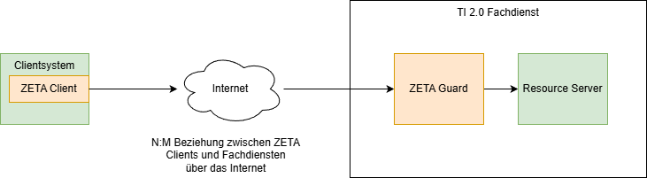

  

# ZETA Produkthandbuch

## Einführung und Übersicht

Der ZETA-Guard und der ZETA-Client bzw. das ZETA-SDK sind essenzielle
Bestandteile der Telematikinfrastruktur 2.0. Sie schützen die fachlichen
Ressourcen gegen unautorisierte Zugriffe.

In diesem Produkthandbuch werden die einzelnen Komponenten beschrieben
sowie dargelegt, wie die Komponenten integriert, betrieben, und fachlich
genutzt werden können.

### Dokumenteninformation

| Version | Stand    | Zusammenfassung der Änderungen                                                                                                                                                                         |
|---------|----------|--------------------------------------------------------------------------------------------------------------------------------------------------------------------------------------------------------|
| 0.2.x   | 29.12.25 | Einarbeitung Kommentare                                                                                                                                                                                |
| 0.3.0   | 11.02.26 | Update auf ZETA release 0.3.0                                                                                                                                                                          |
| 0.3.1   | 20.02.26 | Update auf ZETA release 0.3.1 Dokumentation zum Service Mesh                                                                                                                                           |
| 0.4.0   | 19.03.26 | Update auf ZETA release 0.4.0 OpenShift-Kompatibilität, Observability-Backends, ASL-Schlüssel, Ressourcenverwaltung, horizontale Skalierung, Helm 4-Quickstart, CloudNativePG-Datenbankdokumentation   |
| 0.4.2   | 24.03.26 | Update auf ZETA release 0.4.2 C++ native client with cross-platform Makefile, extended HTTP CRUD and WebSocket STOMP API                                                                               |
| 0.5.0   | 02.04.26 | Update auf ZETA release 0.5.0 OpenShift-Ingress-to-Route (ersetzt OpenShift-Route), Terraform mit optionalem K8s-Backend, No-Travel-Option des PEP, ASL- und Telemetrie-TLS-Konfiguration aktualisiert |
| 1.0.0   | 04.05.26 | Update auf ZETA release 1.0.0 Sicherheitsleistungen Guard-Betreiber, Client-Hersteller, Egress-NetworkPolicies, Client Build-Beschreibungen                                                            |
| 1.0.1   | 13.05.26 | Überschrift für Releases 1.0.0 und 1.0.1 in Release Notes ergänzt.                                                                                                                                     |

Detaillierte Informationen finden sich in den [Release Notes des Produkhandbuchs](ReleaseNotes.md).

## Inhaltsverzeichnis

- [Einführung und Übersicht](#einführung-und-übersicht)
- [Über dieses Dokument: Zielgruppe, Scope, und verwendete Versionen](#über-dieses-dokument-zielgruppe-scope-und-verwendete-versionen)
- [Architektur-Übersicht](#architektur-übersicht)
- [Fachdienst-Hersteller](#fachdienst-hersteller-1)
- [Fachdienst-Betreiber](#fachdienst-betreiber-1)
- [Primärsystem-Hersteller](#primärsystem-hersteller-1)
- [Index / Schnellzugriff](#index--schnellzugriff)
- [License](#license)

## Über dieses Dokument: Zielgruppe, Scope, und verwendete Versionen

In diesem Dokument werden unterschiedliche Zielgruppen berücksichtigt:

### Fachdienst-Hersteller

Dieser Bereich ist für Hersteller von Fachdiensten, die mit ZETA-Guard
betrieben werden müssen. Hier wird beschrieben, wie der ZETA-Guard
mit einem Fachdienst integriert werden kann. Hier wird insbesondere
auf Test-Setups eingegangen, mit denen die Funktion des Fachdienstes vom
Client über ZETA-SDK und ZETA-Guard hinweg, und damit die Interaktion
des Fachdienstes mit dem ZETA-Guard getestet werden kann.

### Fachdienst-Betreiber

Dieser Bereich ist für Betreiber von Fachdiensten, die den ZETA-Guard
integrieren. Hier werden verschiedene Produktionssetups dargestellt sowie
gezeigt, wie ZETA-Guard konfiguriert und betrieben werden kann.

### Primärsystem-Hersteller

Dieser Bereich ist für Hersteller von Primärsystemen (also
Praxisverwaltungssysteme,
Krankenhausinformationssysteme, oder Apothekenmanagementsysteme), die einen
ZETA-Client integrieren müssen, um auf die TI 2.0 Dienste mit ZETA zugreifen zu
können. Hier wird insbesondere die Integration des ZETA-SDK in einen
existierenden Fachdienst-Client beschrieben, und wie Testsetups aufgesetzt und
genutzt werden können.

## Architektur-Übersicht

Die ZETA Komponenten sitzen grundsätzlich zwischen
den fachlichen Clients und den Fachdiensten. Sie ermöglichen
den sicheren Zugriff auf geschützte Ressourcen über
ein ungeschütztes Netzwerk (Internet).

Der verfolgte Ansatz ist hier, dass sich die ZETA-Komponenten möglichst
transparent zwischen Client und Fachdienst einfügen – dabei aber die notwendigen
Sicherheitsniveaus für die Kommunikation mit geschützten Ressourcen
bereitstellen.

Das folgende Diagram zeigt die interne ZETA-Architekturübersicht mit einem Fokus
auf die zu betreibenden Komponenten.

Die folgenden Bereiche betrachten die Spezifika fokussiert
auf die Interessen der einzelnen, wie oben identifizierten
Zielgruppen des Produkthandbuchs.

## Fachdienst-Hersteller

Fachdienst-Hersteller stellen die Software her, die zur Bereitstellung und
Betrieb eines Fachdienstes nötig ist. Dies können zum Beispiel Hersteller von
VSDM 2.0 Diensten, oder des PoPP-Dienstes sein. In späteren Ausbaustufen der
TI 2.0 können weitere Fachdienste hinzukommen.

Informationen spezifisch für Fachdienst-Hersteller finden sich in
[Readme für Fachdienst-Hersteller](ReadMeFachdienstHersteller.md).

## Fachdienst-Betreiber

Fachdienst-Betreiber nutzen die Software der Fachdienst-Hersteller, ebenso
wie die verpflichtend zu nutzenden ZETA-Guard-Komponenten, um einen fachlichen
Dienst bereitzustellen.

Informationen spezifisch für Fachdienst-Betreiber finden sich in
[Readme für Fachdienst-Betreiber](ReadMeFachdienstBetreiber.md).

## Primärsystem-Hersteller

Primärsystem-Hersteller binden das ZETA-SDK in ihre Primärsystemanwendungen
ein, um Dienste der TI 2.0 aufzurufen.

Informationen spezifisch für Fachdienst-Betreiber finden sich in
[Readme für Primärsystem-Hersteller](ReadMePrimaersystemHersteller.md).

## Index / Schnellzugriff

Dieses Produkthandbuch beinhaltet einerseits Anleitungsdokumente unter
[Anleitungen](Anleitungen/). Anderseits beinhaltet es Referenzen unter
[Referenzen](Referenzen/), welche die einzelnen Komponenten des ZETA-Guard,
ZETA-SDK und ZETA-Testclients im Detail erklären. Die Referenzen werden ggf.
in Zukunft in die jeweiligen Repositories der Subkomponenten verschoben.

Als Einstieg eignen sich folgende Dokumente besonders gut:

* Für ein testweises Installieren eines ZETA-Guard:
  [ZETA-Guard Quickstart für lokales deployment.md](Anleitungen/ZETA_Guard_Quickstart.md)
* Für das Einrichten des ZETA-Demo-Clients:
  [Wie Sie den ZETA-Demo-Client ausführen.md](Anleitungen/Wie_Sie_den_ZETA_Demo_client_ausführen.md)
* Für das Integrieren des ZETA-Client-SDK:
  [Wie Sie das ZETA-SDK integrieren.md](Anleitungen/Wie_Sie_das_ZETA_SDK_integrieren.md)
* Für das Bauen des ZETA-Testdrivers (ein ZETA-Client, der als Proxy dient)
  [Wie Sie den Testdriver bauen](Anleitungen/Wie_Sie_den_Testdriver_bauen.md)
* Für das Ausführen des ZETA-Testdrivers
  [Wie Sie den Testdriver nutzen](Anleitungen/Wie_Sie_den_Testdriver_nutzen.md)
* Wie Sie einen Ende-zu-Ende-Integrationstest ausführen
  [Wie Sie einen Ende-zu-Ende-Integrationstest ausführen](Anleitungen/Wie_Sie_einen_Ende_zu_Ende_Integrationstest_ausführen.md)
* Wie Sie den ZETA-Guard Cluster lokal in einem `KIND` Setup ausführen
  [Wie Sie den Cluster lokal mit KIND aufsetzen](Anleitungen/Wie_Sie_den_Cluster_lokal_mit_KIND_aufsetzen.md)
* Konfigurationshinweise für den ZETA-Guard
  [Konfigurationshinweise](Referenzen/Konfigurationshinweise.md)

Für den produktiven Betrieb des ZETA-Guard empfehlen sich zusätzlich folgende
Dokumente:

* Leitszenarien des Deployments des ZETA-Guard für unterschiedliche Fachdienste:
  [Deploymentszenarien](Referenzen/Deploymentszenarien.md)
* Konfiguration des ZETA-Guard mit Details zu allen relevanten Komponenten
  [Wie Sie ZETA-Guard in Kubernetes konfigurieren](Anleitungen/Wie_Sie_ZETA_Guard_in_Kubernetes_konfigurieren.md)
* [Wie Sie Telemetrie des Resource Servers an die gematik schicken](Anleitungen/Wie_Sie_Telemetrie_des_Resource_Servers_an_die_gematik_schicken.md)
* [Wie Sie ein Observability-Backend anschließen](Anleitungen/Wie_Sie_ein_Observability-Backend_an_ZETA-Guard_anschließen.md)

## License

(C) EY Strategy and Transactions GmbH, 2025, licensed for gematik GmbH

Apache License, Version 2.0

See the [LICENSE](LICENSE) for the specific language governing permissions and limitations under the License

### Additional Notes and Disclaimer from gematik GmbH

1. Copyright notice: Each published work result is accompanied by an explicit statement of the license conditions for use. These are regularly typical conditions in connection with open source or free software. Programs described/provided/linked here are free software, unless otherwise stated.
2. Permission notice: Permission is hereby granted, free of charge, to any person obtaining a copy of this software and associated documentation files (the "Software"), to deal in the Software without restriction, including without limitation the rights to use, copy, modify, merge, publish, distribute, sublicense, and/or sell copies of the Software, and to permit persons to whom the Software is furnished to do so, subject to the following conditions:
    1. The copyright notice (Item 1) and the permission notice (Item 2) shall be included in all copies or substantial portions of the Software.
    2. The software is provided "as is" without warranty of any kind, either express or implied, including, but not limited to, the warranties of fitness for a particular purpose, merchantability, and/or non-infringement. The authors or copyright holders shall not be liable in any manner whatsoever for any damages or other claims arising from, out of or in connection with the software or the use or other dealings with the software, whether in an action of contract, tort, or otherwise.
    3. We take open source license compliance very seriously. We are always striving to achieve compliance at all times and to improve our processes. If you find any issues or have any suggestions or comments, or if you see any other ways in which we can improve, please reach out to: ospo@gematik.de
3. Please note: Parts of this code may have been generated using AI-supported technology. Please take this into account, especially when troubleshooting, for security analyses and possible adjustments.

