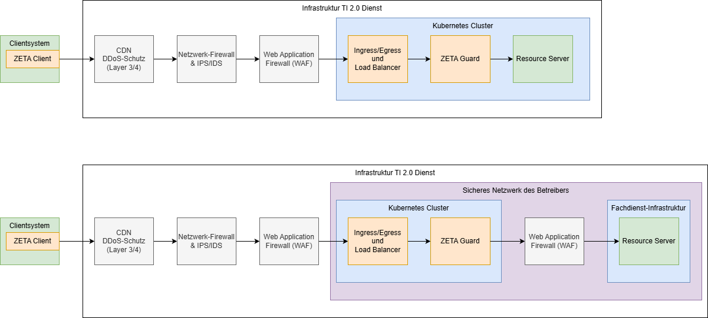
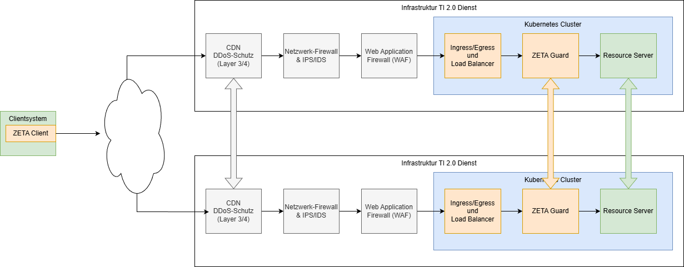
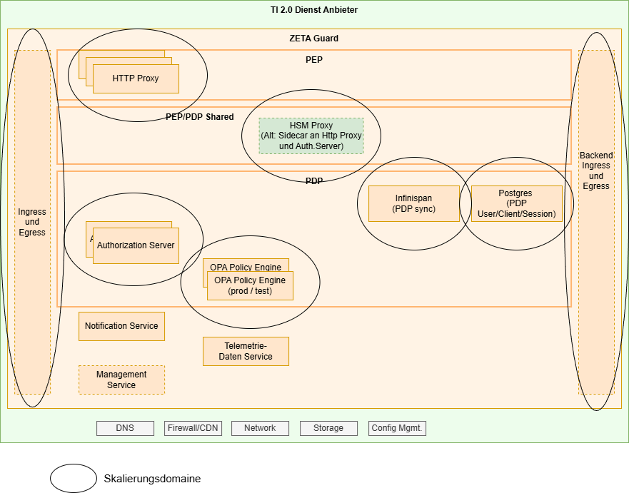

# Informationen für Fachdienst-Betreiber

Fachdienst-Betreiber nutzen die Software der Fachdienst-Hersteller, ebenso
wie die verpflichtend zu nutzenden ZETA-Guard-Komponenten, um einen fachlichen
Dienst bereitzustellen.

## Betrachtete Nutzungsszenarien

Die ZETA-Nutzungsszenarien für Fachdienst-Betreiber beziehen sich im Wesentlichen
auf die Betriebsaspekte und die jeweils umzusetzenden, nichtfunktionalen Aspekte
wie Verfügbarkeit und Skalierung.

Dazu werden die ZETA-Guard Komponenten ergänzt um betriebliche Aspekte wie
Firewalls, Load Balancer, oder Application Firewalls.

Das folgende Diagram zeigt zwei solcher angenommenen Szenarien:

Hierbei wird Folgendes angenommen:

* Web Application Firewalls _vor_ dem ZETA-Guard können bei Nutzung von ASL
  nur die Kommunikation zwischen ZETA-Client und PDP prüfen. Die
  Kommunikation über den PEP erfolgt über ASL und ist damit nicht für
  diese Firewall sichtbar
* Eine Web Application Firewall _hinter_ dem ZETA-Guard kann den Datentransfer
  zwischen ZETA-Guard und insbesondere direkt vor dem Fachdienst prüfen.
  Dazu ist es aber erforderlich, dass der Datenverkehr zwischen ZETA-Guard und Fachdienst
  aufgebrochen werden muss und daher in einer sicheren Umgebung stattfinden muss.
  Dies ist vom jeweiligen Betreiber bei der Zulassung nachzuweisen.
* Es existiert ein Fachdienst-Test-Client, der ein ZETA-SDK enthält und
  durch den Betreiber für Tests genutzt wird. Alternativ kann für Testumgebungen
  das Setup analog für Fachdienst-Hersteller mit Test-Client und Testdriver im
  Container genutzt werden
* Für produktive Nutzung bzw. manuelle Tests existiert ein Client, der das
  ZETA-SDK bereits enthält.

Die ZETA-Komponenten werden als
Container-Images geliefert, und in einem Kubernetes-Cluster betrieben.

Der ZETA-Testdriver wirkt damit mit der Ausnahme des Pfades als transparenter Proxy
zwischen Fachdienst-Test-Client und Fachdienst. Der am ZETA-Testdriver-Proxy
aufzurufende Pfad erhält dabei das Präfix `/proxy`, nur der Teil hinter dem
Proxy wird an den Fachdienst weitergereicht. Dies erlaubt weitere API Funktionen
am Testdriver, mehr Details dazu in
der [Anleitung zum Testdriver](Anleitungen/Wie_Sie_den_Testdriver_nutzen.md).

Die Skalierung der einzelnen Komponenten kann unabhängig erfolgen und ist in der
jeweiligen Betreiberarchitektur nachzuweisen. In diesem Produkthandbuch
wird nur die Skalierung der ZETA-Guard Komponenten betrachtet.

Das folgende Diagram zeigt ein einfaches (Mittel) Deployment-Szenario,
wobei statt zwei auch mehr Instanzen zusammengeschaltet werden können.

Hier wird angenommen, dass die Infrastruktur redundant aufgebaut wird.
So kann ein Content-Delivery-Network als Vorschaltsystem verwendet werden,
um z.B. Denial-of-Service-Attacks abzuwehren, und auch die Requests auf
die redundanten Instanzen zu verteilen.

Die Datenbanken der einzelnen ZETA-Guard Instanzen müssen dann
zwischen den Instanzen synchronisiert werden.

Auch innerhalb des ZETA-Guard können unterschiedliche Skalierungen z.B.
zwischen PEP und PDP verwendet werden. Dies wird durch die Nutzung der
Skalierungsfunktionalität des Kubernetes-Clusters ermöglicht.
Dadurch können einzelne Workloads transparent unterschiedlich und sogar
automatisch skaliert werden.

Das folgende Diagram zeigt als Skalierungsdomainen,
welche Komponenten unabhängig
voneinander skaliert werden können (unter Berücksichtigung
der Lastabhängigkeiten z.B. vom PDP zur Datenbank).

Die beiden Domainen für Infinispan und die PDP Datenbank
erfordern hierbei besondere Berücksichtigung, da sie Zustandsinformationen
zwischen den Instanzen replizieren müssen, während die anderen
Komponenten stateless, und damit unabhängig betreibbar/skalierbar sind.

Details dazu finden sich in der Dokumentation der [Deployment-Szenarien](Referenzen/Deploymentszenarien.md).

Hinweis: die Datenbanken (infinispan, postgres) werden aktuell mit den Helm-Charts
installiert. Die Nutzung externer Datenbanken ist
in [Wie Sie ZETA Guard in Kubernetes konfigurieren](Anleitungen/Wie_Sie_ZETA_Guard_in_Kubernetes_konfigurieren.md)
beschrieben.

Die genauen Bedingungen für bestimmte Skalierungen der Datenbanken
(Infinispan und PDP Datenbank) befinden sich noch in der Entwicklung.

## Systemvoraussetzungen

Als Systemvoraussetzungen werden hier die notwendigen Voraussetzungen genannt,
die nur für die ZETA-Komponenten (also ohne die eigentlichen Fachdienst-Komponenten)
benötigt werden.

### Zugänge

* Container images

* TI Dienste (MUSS)
    * OCSP Responder der TI TSL (! d.h. der Responder im Internet nicht der im
      TI 1.0 Netz)
    * Federation Master (ab Stufe 2)
    * TI-Monitoring
    * TI-SIEM
    * PIP/PAP Repository

* TI Dienste (Abhängig von Fachdienst, ab Umsetzungsstufe 2)
    * Federated IDP bzw. Sektorale IdPs

### Eigene Dienste

* eigenes container repository (MUSS)
    * für die Bereitstellung der PIP/PAP images
    * Dienstanbieter-Monitoring (Opentelemtry Collector)
    * Dienstanbieter-SIEM

* anbietereigene Dienste (Abhängig vom Fachdienst, ab Umsetzungsstufe 2)
    * Clientsystem Notification Service(s) – Apple Push Notifications, Firebase
    * Email Confirmation-Code – Mailversand

### Infrastruktur

Die Infrastrukturanforderungen sind im Detail beschrieben
in der [Anleitung, einen ZETA-Guard im Kubernetes zu konfigurieren](Anleitungen/Wie_Sie_ZETA_Guard_in_Kubernetes_konfigurieren.md).

### Tooling

* Kubernetes - kubectl
* Terraform
* Helm 4

### Konfiguration, Keys

* Das ZETA-SDK benötigt zum Testen eine valide SM-B Datei aus dem verwendeten
  Vertrauensraum im p12 Format, wie sie
  von der gematik bezogen werden kann. Diese kann im Testdriver (proxy) Client
  konfiguriert werden, um SM-B-basierte Authentifizierung vornehmen
  zu können, und wird dann im PDP gegen den TI Vertrauensanker (Federation Master, TSL)
  geprüft.
* Für ASL-Betrieb des PEP muss ein ECC-Schlüssel (Kurve P256) erstellt und ein
  entsprechendes Signatur-Zertifikat (Profil C.FD.AUT, technische Rolle
  oid_zeta-guard) von der gematik bestellt werden. Ferner wird das
  zugehörige KOMP-CA-Zertifikat benötigt, es wird normalerweise zusammen mit
  dem Signatur-Zertifikat ausgeliefert.

Die genaue Art der Zertifikatsprüfung – z.B. über Federation Master und/oder
Vertrauensanker-Container ist noch in Ausarbeitung der Spezifikation.

## Sicherheitsleistungen

Der ZETA-Guard wird als Softwarepaket geliefert, welches durch den Fachdienst-Hersteller
in den Fachdienst integriert und durch den Fachdienst-Betreiber betrieben werden muss.

Aus den gematik-Anforderungen ergeben sich (u.a.) Sicherheitsleistungen, die, je nach
vertraglichem Verhältnis zwischen Fachdienst-Hersteller und -Betreiber von diesen
zu leisten sind.

Diese Sicherheitsleistungen sind in [Sicherheitsleistungen Betreiber](SicherheitsanforderungenZETAGuardBetreiber.md)
dargelegt.

## Relevante Anleitungen und Referenzen

Die relevanten Anleitungen und Referenzen sind hier verlinkt:

* Leitszenarien des Deployments des ZETA-Guard für unterschiedliche Fachdienste. Einstiegsdokument,
  um die verschiedenen Deployment-Szenarien zu verstehen und für den eigenen Fachdienst auszuwählen.
  [Deployment-Szenarien](Referenzen/Deploymentszenarien.md)

Als Einstieg eignen sich folgende Dokumente besonders gut:

* Für ein testweises Installieren eines ZETA-Guard in einem unspezifizierten Kubernetes-Cluster:
  [ZETA-Guard Quickstart für lokales deployment.md](Anleitungen/ZETA_Guard_Quickstart.md)
* Wie Sie den ZETA-Guard Cluster lokal in einem `KIND` Setup ausführen
  [Wie Sie den Cluster lokal mit KIND aufsetzen](Anleitungen/Wie_Sie_den_Cluster_lokal_mit_KIND_aufsetzen.md)
* Konfigurationshinweise für den ZETA-Guard
  [Konfigurationshinweise](Referenzen/Konfigurationshinweise.md)

Für den produktiven Betrieb des ZETA-Guard empfehlen sich zusätzlich folgende
Dokumente:

* Konfiguration des ZETA-Guard mit Details zu allen relevanten Komponenten
  [Wie Sie ZETA-Guard in Kubernetes konfigurieren](Anleitungen/Wie_Sie_ZETA_Guard_in_Kubernetes_konfigurieren.md)
* [Wie Sie Telemetrie des Resource Servers an die gematik schicken](Anleitungen/Wie_Sie_Telemetrie_des_Resource_Servers_an_die_gematik_schicken.md)
* [Wie Sie ein Observability-Backend anschließen](Anleitungen/Wie_Sie_ein_Observability-Backend_an_ZETA-Guard_anschließen.md)

* Administrative Aufgaben - diese Punkte werden noch weiter ausgeführt. Beispiele sind dafür:
    * Festlegung der Skalierung
    * Handhabung von Failover-Szenarien
    * Auswertung von Logs
    * ...

## Known Issues und Fehleranalysen

Hier werden noch Informationen zu Rückmeldungen aus der Nutzung eingetragen.

### Besonderer Fehlersituationen

Hier werden noch Informationen zu Rückmeldungen aus der Nutzung eingetragen.

### Weitere Hinweise

Hier werden noch Informationen zu Rückmeldungen aus der Nutzung eingetragen.

## Wartung

Ein definierter Wartungsprozess ist vor Meilenstein 4 aktuell nicht umgesetzt.
Updates werden über die Image- bzw. git-Repositories verbreitet.
