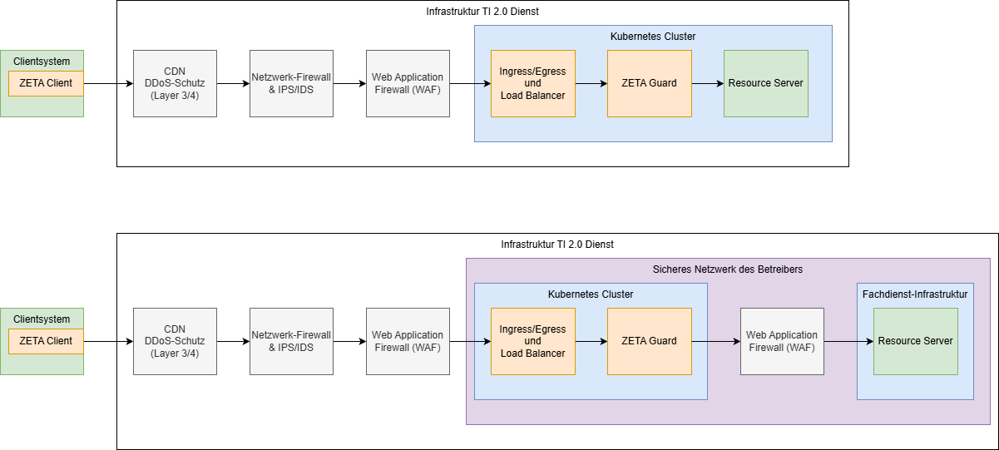
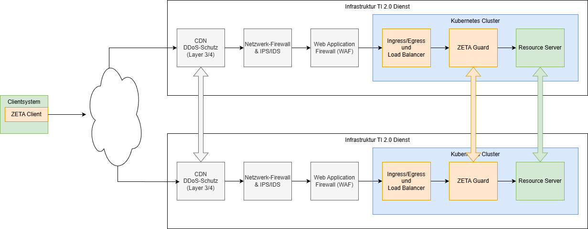
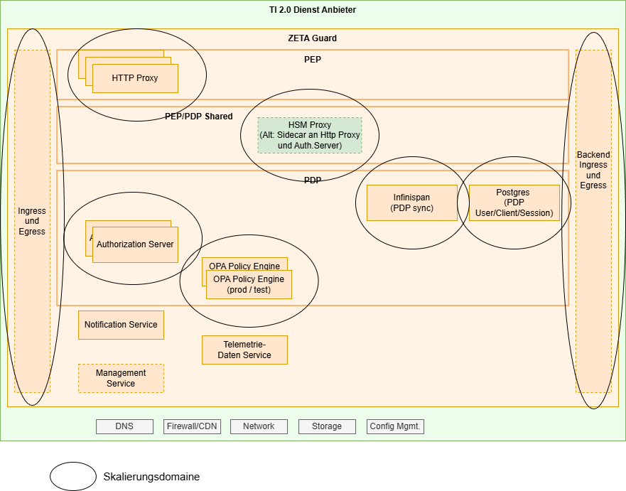

# Informationen für Fachdienst-Betreiber

Fachdienst-Betreiber nutzen die Software der Fachdienst-Hersteller, ebenso
wie die verpflichtend zu nutzenden ZETA-Guard-Komponenten, um einen fachlichen
Dienst bereitzustellen.

## Betrachtete Nutzungsszenarien

Für Fachdienst-Betreiber stehen die Betriebsaspekte im Vordergrund sowie die
nichtfunktionalen Anforderungen wie Verfügbarkeit und Skalierung.

Zu den ZETA-Guard-Komponenten kommen daher betriebliche Bausteine wie Firewalls,
Load Balancer oder Application Firewalls hinzu.

Das folgende Diagramm zeigt zwei solcher angenommenen Szenarien:

Hierbei wird Folgendes angenommen:

* Web Application Firewalls _vor_ dem ZETA-Guard können bei Nutzung von ASL
  nur die Kommunikation zwischen ZETA-Client und PDP prüfen. Die
  Kommunikation über den PEP erfolgt über ASL und ist damit nicht für
  diese Firewall sichtbar.
* Eine Web Application Firewall _hinter_ dem ZETA-Guard kann den Datenverkehr
  zwischen ZETA-Guard und Fachdienst prüfen, insbesondere direkt vor dem
  Fachdienst. Dazu muss dieser Verkehr allerdings aufgebrochen werden und damit
  in einer sicheren Umgebung stattfinden. Das weist der Betreiber bei der
  Zulassung nach.
* Es existiert ein Fachdienst-Test-Client, der ein ZETA-SDK enthält und
  durch den Betreiber für Tests genutzt wird. Alternativ kann für Testumgebungen
  das Setup analog für Fachdienst-Hersteller mit Test-Client und Testdriver im
  Container genutzt werden.
* Für produktive Nutzung bzw. manuelle Tests existiert ein Client, der das
  ZETA-SDK bereits enthält.

Die ZETA-Komponenten werden als Container-Images geliefert und in einem
Kubernetes-Cluster betrieben.

Der ZETA-Testdriver wirkt damit — bis auf den Pfad — als transparenter Proxy
zwischen Fachdienst-Test-Client und Fachdienst: Der aufzurufende Pfad erhält das
Präfix `/proxy`, und nur der Teil dahinter geht an den Fachdienst. Das schafft
Raum für weitere API-Funktionen am Testdriver; mehr dazu in der
[Anleitung zum Testdriver](Anleitungen/Wie_Sie_den_Testdriver_nutzen.md).

Die Komponenten lassen sich unabhängig voneinander skalieren; den Nachweis dafür
führt der Betreiber in seiner Architektur. Dieses Produkthandbuch betrachtet nur
die Skalierung der ZETA-Guard-Komponenten.

Das folgende Diagramm zeigt ein einfaches Deployment-Szenario der Größe
„Mittel“; statt zwei Instanzen lassen sich auch mehr zusammenschalten.

Angenommen ist hier eine redundant aufgebaute Infrastruktur. Ein
Content-Delivery-Network kann als Vorschaltsystem dienen, um etwa
Denial-of-Service-Attacken abzuwehren und die Requests auf die redundanten
Instanzen zu verteilen.

Die Datenbanken der einzelnen ZETA-Guard-Instanzen müssen sich dann
untereinander synchronisieren.

Auch innerhalb des ZETA-Guard lassen sich PEP und PDP unterschiedlich skalieren.
Möglich macht das die Skalierung des Kubernetes-Clusters: Einzelne Workloads
skalieren damit unabhängig voneinander und auf Wunsch automatisch.

Das folgende Diagramm zeigt als Skalierungsdomänen, welche Komponenten sich
unabhängig voneinander skalieren lassen — unter Berücksichtigung der
Lastabhängigkeiten, etwa vom PDP zur Datenbank.

Besondere Aufmerksamkeit verlangen die Domänen für Infinispan und die
PDP-Datenbank: Sie müssen Zustandsinformationen zwischen den Instanzen
replizieren. Zwei weitere Komponenten halten
instanzlokalen, nicht replizierten Zustand und benötigen bei mehr als einer
Replica daher Session-Affinität (siehe unten): der PEP (ASL-Sitzungen) und der
Authorization Server (Nonce-Cache). Die übrigen Komponenten sind stateless und
damit unabhängig betreibbar/skalierbar.

Details dazu finden sich in der Dokumentation der [Deployment-Szenarien](Referenzen/Deploymentszenarien.md).

Hinweis: Die Datenbanken (Infinispan, PostgreSQL) werden aktuell mit den
Helm-Charts installiert. Die Nutzung externer Datenbanken ist
in [Wie Sie ZETA-Guard in Kubernetes konfigurieren](Anleitungen/Wie_Sie_ZETA_Guard_in_Kubernetes_konfigurieren.md)
beschrieben.

Die Bedingungen für die Skalierung der zustandsbehafteten Komponenten sind in
den jeweiligen Referenzen beschrieben:

* **PDP-Datenbank (PostgreSQL/CloudNativePG):** Instanzen, Ressourcen und das
  Zusammenspiel von Authserver-Replicas und Connection-Pool — siehe
  [Helm-Chart-Referenz](Referenzen/Referenz_des_Helm_Charts.md)
  (Abschnitte „CloudNativePG-Datenbankverbindung“ und „Connection Pooling“).
* **Infinispan:** Anbindung eines externen, replizierten Infinispan — siehe
  [Helm-Chart-Referenz](Referenzen/Referenz_des_Helm_Charts.md) (Abschnitt
  „Infinispan“).
* **PEP:** Bei mehr als einer PEP-Replica ist Session-Affinität (Sticky
  Sessions) zwingend erforderlich, da ASL-Sitzungen nur im lokalen Speicher der
  jeweiligen Instanz liegen — siehe
  [Wie Sie ZETA-Guard in Kubernetes konfigurieren](Anleitungen/Wie_Sie_ZETA_Guard_in_Kubernetes_konfigurieren.md).
* **Authorization Server:** Nonce-Werte liegen im lokalen Cache der jeweiligen
  Instanz. Bei mehr als einer Replica ist daher auch für die `/auth`-Pfade
  Session-Affinität erforderlich; mit dem mitgelieferten F5 NIC konfiguriert
  das Chart dies automatisch (consistent-hash über das `zeta_route`-Cookie),
  bei anderen Ingress-Controllern muss eine äquivalente Affinität eingerichtet
  werden — siehe
  [Wie Sie einen eigenen Ingress-Controller verwenden](Anleitungen/Wie_Sie_einen_eigenen_Ingress_Controller_verwenden.md).

## Systemvoraussetzungen

Dieser Abschnitt nennt nur die Voraussetzungen der ZETA-Komponenten; die
Anforderungen der eigentlichen Fachdienst-Komponenten bleiben außen vor.

### Zugänge

> **Begriffe:** „(ab) Umsetzungsstufe 2“ bzw. „Stufe 2“ bezeichnet die zweite
> Ausbaustufe der ZETA-Spezifikation (u. a. Anmeldung von Versicherten über
> sektorale IDPs); so markierte Punkte sind für den aktuellen Funktionsumfang
> (Stufe 1) noch nicht erforderlich. „PIP/PAP“ steht für Policy Information
> Point / Policy Administration Point — die Bezugsquelle der signierten
> OPA-Policy-Bundles.

* Container-Images

* TI-Dienste (MUSS)
    * OCSP-Responder der TI-TSL (d. h. der Responder im Internet, nicht der im
      TI-1.0-Netz)
    * Federation Master (ab Stufe 2)
    * TI-Monitoring
    * TI-SIEM
    * PIP/PAP-Repository

* TI-Dienste (abhängig vom Fachdienst, ab Umsetzungsstufe 2)
    * Federated IDP bzw. sektorale IDPs

### Eigene Dienste

* eigenes Container-Repository (MUSS)
    * für die Bereitstellung der PIP/PAP-Images
    * Dienstanbieter-Monitoring (OpenTelemetry Collector)
    * Dienstanbieter-SIEM

* anbietereigene Dienste (abhängig vom Fachdienst, ab Umsetzungsstufe 2)
    * Clientsystem-Notification-Service(s) – Apple Push Notifications, Firebase;
      als Vorschau verfügbar, siehe
      [Wie der Notification Service funktioniert](Anleitungen/Wie_der_Notification_Service_funktioniert.md)
    * E-Mail-Confirmation-Code – Mailversand

### Infrastruktur

Die Infrastrukturanforderungen sind im Detail beschrieben
in der [Anleitung, einen ZETA-Guard im Kubernetes zu konfigurieren](Anleitungen/Wie_Sie_ZETA_Guard_in_Kubernetes_konfigurieren.md).

### Tooling

* Kubernetes – kubectl
* Terraform, **Version 1.11 oder neuer** (siehe
  [Quickstart – Voraussetzungen](Anleitungen/ZETA_Guard_Quickstart.md#voraussetzungen))
* Helm 4
* `bash`, `curl` und `jq` — von den Skripten der PDP-Konfiguration benötigt

### Konfiguration, Keys

* Das ZETA-SDK benötigt zum Testen eine valide SM-B-Datei aus dem verwendeten
  Vertrauensraum im p12-Format, wie sie von der gematik bezogen werden kann.
  Diese kann im Testdriver-Client (Proxy) konfiguriert werden, um SM-B-basierte
  Authentifizierung vornehmen zu können, und wird dann im PDP gegen den
  TI-Vertrauensanker (Federation Master, TSL) geprüft.
* Für ASL-Betrieb des PEP muss ein ECC-Schlüssel (Kurve P256) erstellt und ein
  entsprechendes Signatur-Zertifikat (Profil C.FD.AUT, technische Rolle
  oid_zeta-guard) von der gematik bestellt werden. Ferner wird das
  zugehörige KOMP-CA-Zertifikat benötigt, es wird normalerweise zusammen mit
  dem Signatur-Zertifikat ausgeliefert.

Die genaue Art der Zertifikatsprüfung – z. B. über Federation Master und/oder
Vertrauensanker-Container – ist noch in Ausarbeitung der Spezifikation.

## Sicherheitsleistungen

Der ZETA-Guard wird als Softwarepaket geliefert: Der Fachdienst-Hersteller
integriert es in den Fachdienst, der Fachdienst-Betreiber betreibt es.

Aus den gematik-Anforderungen ergeben sich unter anderem Sicherheitsleistungen.
Wer sie erbringt, hängt vom vertraglichen Verhältnis zwischen
Fachdienst-Hersteller und -Betreiber ab.

Diese Sicherheitsleistungen sind in [Sicherheitsleistungen Betreiber](SicherheitsanforderungenZETAGuardBetreiber.md)
dargelegt.

## Inbetriebnahme-Checkliste

Die folgende Checkliste führt in der empfohlenen Reihenfolge von den
Voraussetzungen bis zum betriebsbereiten ZETA-Guard. Die Spalte
**Pflicht/Optional** zeigt, ob der Schritt für einen produktiven Betrieb
zwingend ist.

| #  | Schritt                                                                                                 | Pflicht/Optional       | Anleitung/Referenz                                                                                                                                                                                                                                                                                                                                                                                                       |
|----|---------------------------------------------------------------------------------------------------------|------------------------|--------------------------------------------------------------------------------------------------------------------------------------------------------------------------------------------------------------------------------------------------------------------------------------------------------------------------------------------------------------------------------------------------------------------------|
| 1  | Deployment-Szenario für den eigenen Fachdienst wählen (Größe, Redundanz, Skalierung)                    | Pflicht                | [Deployment-Szenarien](Referenzen/Deploymentszenarien.md)                                                                                                                                                                                                                                                                                                                                                                |
| 2  | Zugänge und Material beschaffen: Container-Registry, TI-Dienste, SM-B (p12), ASL-Signatur-Zertifikat    | Pflicht                | dieses Dokument, [Systemvoraussetzungen](#systemvoraussetzungen)                                                                                                                                                                                                                                                                                                                                                         |
| 3  | Kubernetes-Infrastruktur vorbereiten (Cluster ≥ 1.32, Ingress-Controller, cert-manager/TLS, Operatoren) | Pflicht                | [Wie Sie ZETA-Guard in Kubernetes konfigurieren](Anleitungen/Wie_Sie_ZETA_Guard_in_Kubernetes_konfigurieren.md), bei eigenem Ingress-Controller zusätzlich [Wie Sie einen eigenen Ingress-Controller verwenden](Anleitungen/Wie_Sie_einen_eigenen_Ingress_Controller_verwenden.md)                                                                                                                                       |
| 4  | Helm-Chart installieren                                                                                 | Pflicht                | testweise: [ZETA-Guard-Quickstart](Anleitungen/ZETA_Guard_Quickstart.md); produktiv: [Wie Sie ZETA-Guard in Kubernetes konfigurieren](Anleitungen/Wie_Sie_ZETA_Guard_in_Kubernetes_konfigurieren.md) + [Helm-Chart-Referenz](Referenzen/Referenz_des_Helm_Charts.md)                                                                                                                                                     |
| 5  | PDP konfigurieren (Terraform: Realm, Scopes, Policies)                                                  | Pflicht                | [Quickstart – PDP konfigurieren](Anleitungen/ZETA_Guard_Quickstart.md), [Konfiguration des PDP Services](Referenzen/Konfiguration_des_PDP_Services.md)                                                                                                                                                                                                                                                                   |
| 6  | PEP an den Fachdienst anbinden (Proxy-Locations, Audience, Well-Known-Pfade)                            | Pflicht                | [Wie Sie ZETA-Guard in Kubernetes konfigurieren](Anleitungen/Wie_Sie_ZETA_Guard_in_Kubernetes_konfigurieren.md), [Konfiguration des PEP HTTP Proxy](Referenzen/Konfiguration_des_PEP_Http_Proxy.md), [Konfiguration der Well-Known-Endpunkte](Referenzen/Konfiguration_der_Well-Known_Endpunkte.md)                                                                                                                      |
| 7  | OPA-Policy-Bezug aus dem PIP konfigurieren (WIF oder eigene Registry, Signaturprüfung)                  | Pflicht                | [Wie Sie OPA in ZETA-Guard konfigurieren](Anleitungen/Wie_Sie_OPA_in_ZETA_Guard_konfigurieren.md); bei eigener Registry: [Wie Sie eine eigene OCI-Registry verwenden](Anleitungen/Wie_Sie_eine_eigene_OCI_Registry_verwenden.md)                                                                                                                                                                                         |
| 8  | Telemetrie-Export an die gematik einrichten (TI-SIEM ist verpflichtend)                                 | Pflicht                | [Wie Sie Telemetrie des Resource Servers an die gematik schicken](Anleitungen/Wie_Sie_Telemetrie_des_Resource_Servers_an_die_gematik_schicken.md)                                                                                                                                                                                                                                                                        |
| 9  | Skalierung festlegen; bei mehr als einer PEP-Replica Session-Affinität aktivieren                       | Pflicht bei Skalierung | [Deployment-Szenarien](Referenzen/Deploymentszenarien.md), [Wie Sie ZETA-Guard in Kubernetes konfigurieren](Anleitungen/Wie_Sie_ZETA_Guard_in_Kubernetes_konfigurieren.md), [Wie Sie Ressourcen für ZETA-Guard-Pods verwalten](Anleitungen/Wie_Sie_Ressourcen_für_ZETA_Guard_Pods_verwalten.md), [Wie Sie einen eigenen Ingress-Controller verwenden](Anleitungen/Wie_Sie_einen_eigenen_Ingress_Controller_verwenden.md) |
| 10 | Betriebsüberwachung einrichten: Logs, Metriken, Security-Events, Alarmierung                            | Pflicht                | [Troubleshooting & Debugging](Anleitungen/Troubleshooting_und_Debugging.md), [Security-Events](Referenzen/Security-Events.md)                                                                                                                                                                                                                                                                                            |
| 11 | Egress-NetworkPolicies aktivieren                                                                       | Optional (empfohlen)   | [Wie Sie Egress-NetworkPolicies konfigurieren](Anleitungen/Wie_Sie_Egress_NetworkPolicies_konfigurieren.md)                                                                                                                                                                                                                                                                                                              |
| 12 | Forward Proxy für ausgehende Verbindungen konfigurieren                                                 | Optional               | [Wie Sie einen Forward Proxy konfigurieren](Anleitungen/Wie_Sie_einen_Forward_Proxy_konfigurieren.md)                                                                                                                                                                                                                                                                                                                    |
| 13 | Eigenes Observability-Backend anschließen                                                               | Optional               | [Wie Sie ein Observability-Backend anschließen](Anleitungen/Wie_Sie_ein_Observability-Backend_an_ZETA-Guard_anschließen.md)                                                                                                                                                                                                                                                                                              |
| 14 | Ende-zu-Ende-Test gegen den eigenen Fachdienst                                                          | Optional (empfohlen)   | [Wie Sie einen Ende-zu-Ende-Integrationstest ausführen](Anleitungen/Wie_Sie_einen_Ende_zu_Ende_Integrationstest_ausführen.md)                                                                                                                                                                                                                                                                                            |
| 15 | Notification Service aktivieren (Vorschau, abhängig vom Fachdienst)                                     | Optional               | [Wie der Notification Service funktioniert](Anleitungen/Wie_der_Notification_Service_funktioniert.md), [Konfiguration des Notification Service](Referenzen/Konfiguration_des_Notification_Service.md)                                                                                                                                                                                                                    |
| 16 | ZETA-Guard auf ein neues Release aktualisieren (Terraform-State sichern; Pflichtschritt beim Update von 1.3.0/1.3.1 auf 1.3.2) | Pflicht bei Update     | [Wie Sie ZETA-Guard aktualisieren](Anleitungen/Wie_Sie_ZETA_Guard_aktualisieren.md), [Release Notes](ReleaseNotes.md)                                                                                                                                                                                                                                                                                                  |

## Relevante Anleitungen und Referenzen

Die relevanten Anleitungen und Referenzen sind hier verlinkt:

* Leitszenarien des Deployments des ZETA-Guard für unterschiedliche Fachdienste.
  Einstiegsdokument, um die verschiedenen Deployment-Szenarien zu verstehen und
  für den eigenen Fachdienst auszuwählen.
  [Deployment-Szenarien](Referenzen/Deploymentszenarien.md)

Als Einstieg eignen sich folgende Dokumente besonders gut:

* Für ein testweises Installieren eines ZETA-Guard in einem unspezifizierten Kubernetes-Cluster:
  [ZETA-Guard-Quickstart für lokales Deployment](Anleitungen/ZETA_Guard_Quickstart.md)
* Wie Sie den ZETA-Guard-Cluster lokal in einem `KIND`-Setup ausführen:
  [Wie Sie den Cluster lokal mit KIND aufsetzen](Anleitungen/Wie_Sie_den_Cluster_lokal_mit_KIND_aufsetzen.md)
* Konfigurationshinweise für den ZETA-Guard:
  [Konfigurationshinweise](Referenzen/Konfigurationshinweise.md)
* Wann und warum die Well-Known-Pfade angepasst werden müssen und wie doppelte
  Well-Knowns vermieden werden:
  [Konfiguration der Well-Known-Endpunkte](Referenzen/Konfiguration_der_Well-Known_Endpunkte.md)

Für den produktiven Betrieb des ZETA-Guard empfehlen sich zusätzlich folgende
Dokumente:

* Konfiguration des ZETA-Guard mit Details zu allen relevanten Komponenten:
  [Wie Sie ZETA-Guard in Kubernetes konfigurieren](Anleitungen/Wie_Sie_ZETA_Guard_in_Kubernetes_konfigurieren.md)
* Welche Funktionen des ZETA-Guard am mitgelieferten Ingress-Controller hängen
  und was beim Einsatz eines eigenen Controllers nachzubilden ist
  [Wie Sie einen eigenen Ingress-Controller verwenden](Anleitungen/Wie_Sie_einen_eigenen_Ingress_Controller_verwenden.md)
* Welche Komponenten optional sind, welche Funktion sie erfüllen und was bei
  Verzicht entfällt
  [Komponentenübersicht](Referenzen/Komponentenuebersicht.md)
* [Wie Sie Telemetrie des Resource Servers an die gematik schicken](Anleitungen/Wie_Sie_Telemetrie_des_Resource_Servers_an_die_gematik_schicken.md)
* [Wie Sie ein Observability-Backend anschließen](Anleitungen/Wie_Sie_ein_Observability-Backend_an_ZETA-Guard_anschließen.md)
* Wo sich Logs und Metriken finden, Log-Beispiele sowie Hinweise zu
  Aufbewahrung, Rotation und Alarmierung:
  [Troubleshooting & Debugging](Anleitungen/Troubleshooting_und_Debugging.md)
* Aufbau und Konfiguration des Notification Service (Vorschau, abhängig vom
  Fachdienst):
  [Wie der Notification Service funktioniert](Anleitungen/Wie_der_Notification_Service_funktioniert.md) und
  [Konfiguration des Notification Service](Referenzen/Konfiguration_des_Notification_Service.md)

* Administrative Aufgaben im laufenden Betrieb:
    * Festlegung und Anpassung der Skalierung:
      [Deployment-Szenarien](Referenzen/Deploymentszenarien.md) und
      [Wie Sie Ressourcen für ZETA-Guard-Pods verwalten](Anleitungen/Wie_Sie_Ressourcen_für_ZETA_Guard_Pods_verwalten.md)
    * Auswertung von Logs, Metriken und Security-Events sowie Alarmierung:
      [Troubleshooting & Debugging](Anleitungen/Troubleshooting_und_Debugging.md) und
      [Security-Events](Referenzen/Security-Events.md)
    * Verwaltung von Client-Registrierungen (Limits, Ablauf, Widerruf von
      Sitzungen):
      [Wie der Client-Lebenszyklus verwaltet wird](Anleitungen/Wie_der_Client-Lebenszyklus_verwaltet_wird.md)
    * Failover-Verhalten und Redundanz:
      [Deployment-Szenarien](Referenzen/Deploymentszenarien.md) (Active-Active,
      Skalierungsdomänen)

## Known Issues und Fehleranalysen

Bekannte Einschränkungen werden versioniert im Abschnitt „Known Issues“ der
[Release Notes des Helm-Chart-Repositories](https://github.com/gematik/zeta-guard-helm/blob/main/ReleaseNotes.md#known-issues)
geführt — dort steht der jeweils für die eingesetzte Chart-Version gültige
Stand. Prüfen Sie diesen Abschnitt vor jeder Installation und jedem Upgrade.

Für die Analyse konkreter Fehlersituationen (typische Fehlerbilder,
Diagnosepfade, Fundorte und Interpretation von Logs) siehe
[Troubleshooting & Debugging](Anleitungen/Troubleshooting_und_Debugging.md).

## Wartung

Updates und Sicherheitspatches werden als neue Chart- und Image-Releases über
die Release-Repositories bereitgestellt; die Änderungen je Version sind in den
[Release Notes des Helm-Chart-Repositories](https://github.com/gematik/zeta-guard-helm/blob/main/ReleaseNotes.md)
dokumentiert. Ein Upgrade erfolgt über `helm upgrade` auf die neue
Chart-Version; ob zusätzlich die PDP-Konfiguration (Terraform) erneut
angewendet werden muss, weisen die Release Notes aus. Die Melde- und
Kommunikationswege für Schwachstellen, Fehler und Aktualisierungsbedarfe
zwischen Hersteller/Betreiber und gematik sind über die etablierten
ITSM-Prozesse abgestimmt.
