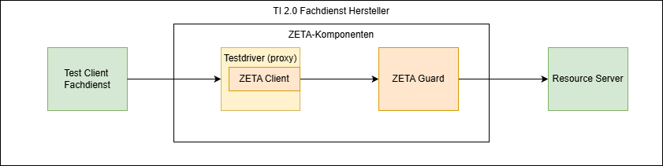
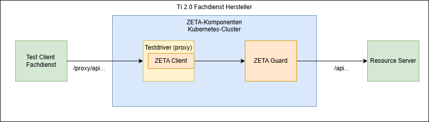

# Informationen für Fachdienst-Hersteller

Fachdienst-Hersteller stellen die Software her, die zur Bereitstellung und Betrieb
eines Fachdienstes nötig ist. Dies können zum Beispiel Hersteller von
VSDM 2.0 Diensten, oder des PoPP-Dienstes sein. In späteren Ausbaustufen der
TI 2.0 können weitere Fachdienste hinzukommen.

## Betrachtete Nutzungsszenarien

Für den Fachdienst-Hersteller werden im Wesentlichen Szenarien betrachtet,
in denen die ZETA-Komponenten zum Test der Interaktion mit dem Fachdienst
genutzt werden.

Dazu wird angenommen, dass die ZETA-Komponenten als "Black Box" betrachtet
werden wollen, die, einmal installiert, den Zugriff absichern und ggf. nur
in unterschiedlichen Konfigurationen bzgl. Fachdienst-Endpunkten o.ä. betrieben
werden.

Das folgende Diagram zeigt ein solches angenommenes Szenario:

Hierbei wird Folgendes angenommen:

* Es existiert ein Fachdienst-Test-Client, der den Fachdienst via HTTPS aufrufen
  kann, um Funktionalität fachlich zu testen.
* Dieser Fachdienst-Test-Client ist konfigurierbar und insbesondere kann ein
  veränderter Basis-Pfad für die Aufrufe der Fachdienst-API genutzt werden.

Die ZETA-Komponenten – inklusive des ZETA-Testdriver-Clients – werden als
Container-Images geliefert und in einem Kubernetes-Cluster betrieben.

Der ZETA-Testdriver wirkt damit mit der Ausnahme des Pfades als transparenter Proxy
zwischen Fachdienst-Test-Client und Fachdienst. Der am ZETA-Testdriver-Proxy
aufzurufende Pfad erhält dabei das Präfix `/proxy`, nur die Pfadsegmente hinter
`proxy` werden an den Fachdienst weitergereicht. Dies erlaubt weitere API
Funktionen am Testdriver, mehr Details dazu in
der [Anleitung zum Testdriver](Anleitungen/Wie_Sie_den_Testdriver_nutzen.md).

## Systemvoraussetzungen

Als Systemvoraussetzungen werden hier nur die notwendigen Voraussetzungen
genannt, die für die ZETA-Komponenten – und nicht für die
Fachdienst-Komponenten – benötigt werden.

### Zugänge

* Container images

* TI Dienste (für Testsysteme)
    * MUSS:
        * OCSP Responder der TI TSL (! d.h. der Responder im Internet nicht der im
          TI 1.0 Netz)
        * Federation Master (ab Stufe 2)
        * TI-Monitoring
        * TI-SIEM
        * PIP/PAP Repository
    * Abhängig vom Fachdienst, ab Umsetzungsstufe 2:
        * Federated IDP bzw. Sektorale IdPs

### Eigene Dienste

* eigenes container repository (MUSS)
    * für die Bereitstellung der PIP/PAP images

* anbietereigene Dienste (Abhängig vom Fachdienst, ab Umsetzungsstufe 2)
    * Clientsystem Notification Service(s) – Apple Push Notifications, Firebase
    * Email Confirmation-Code – Mailversand

    * Optional:
        * Dienstanbieter-Monitoring (OpenTelemetry Collector)
        * Dienstanbieter-SIEM

### Infrastruktur

Die Infrastrukturanforderungen sind im Detail beschrieben
in der [Anleitung, einen ZETA-Guard im Kubernetes zu konfigurieren](Anleitungen/Wie_Sie_ZETA_Guard_in_Kubernetes_konfigurieren.md).

### Tooling

* Kubernetes - kubectl
* Terraform
* Helm 4

### Konfiguration, Keys

* Das ZETA-SDK benötigt zum Testen eine valide SM-B Datei aus dem verwendeten
  Vertrauensraum im p12 Format, wie sie
  von der gematik bezogen werden kann. Diese kann im Testdriver (proxy) Client
  konfiguriert werden, um SM-B-basierte Authentifizierung vornehmen
  zu können, und wird dann im PDP gegen den TI Vertrauensanker (Federation Master, TSL)
  geprüft.
* Für ASL-Betrieb des PEP muss ein ECC-Schlüssel (Kurve P256) erstellt und ein
  entsprechendes Signatur-Zertifikat (Profil C.FD.AUT, technische Rolle
  oid_zeta-guard) von der gematik bestellt werden. Ferner wird das
  zugehörige KOMP-CA-Zertifikat benötigt, es wird normalerweise zusammen mit
  dem Signatur-Zertifikat ausgeliefert.

Die genaue Art der Zertifikatsprüfung – z.B. über Federation Master und/oder
Vertrauensanker-Container ist noch in Ausarbeitung der Spezifikation.

## Sicherheitsleistungen

Der ZETA-Guard wird als Softwarepaket geliefert, welches durch den Fachdienst-Hersteller
in den Fachdienst integriert und durch den Fachdienst-Betreiber betrieben werden muss.

Aus den gematik-Anforderungen ergeben sich (u.a.) Sicherheitsleistungen, die, je nach
vertraglichem Verhältnis zwischen Fachdienst-Hersteller und -Betreiber von diesen
zu leisten sind.

Diese Sicherheitsleistungen sind in [Sicherheitsleistungen Betreiber](SicherheitsanforderungenZETAGuardBetreiber.md)
dargelegt.

## Relevante Anleitungen und Referenzen

Die relevanten Anleitungen und Referenzen sind hier verlinkt:

* Für ein testweises Installieren eines ZETA-Guard in einer sehr reduzierten Form
  auf einem unspezifizierten Kubernetes-Cluster
  [ZETA-Guard Quickstart für lokales Deployment.md](Anleitungen/ZETA_Guard_Quickstart.md)
* Wie Sie den ZETA-Guard Cluster lokal in einem `KIND` Setup ausführen
  [Wie Sie den Cluster lokal mit KIND aufsetzen](Anleitungen/Wie_Sie_den_Cluster_lokal_mit_KIND_aufsetzen.md)
* Für die Konfiguration und das Ausführen des ZETA-Testdrivers
  [Wie Sie den Testdriver nutzen](Anleitungen/Wie_Sie_den_Testdriver_nutzen.md)
* Konfigurationshinweise für den ZETA-Guard
  [Konfigurationshinweise](Referenzen/Konfigurationshinweise.md)

Für den produktiven Betrieb des ZETA-Guard empfehlen sich zusätzlich folgende
Dokumente:

* Konfiguration des ZETA-Guard mit Details zu allen relevanten Komponenten
  [Wie Sie ZETA-Guard in Kubernetes konfigurieren](Anleitungen/Wie_Sie_ZETA_Guard_in_Kubernetes_konfigurieren.md)
* [Wie Sie Telemetrie des Resource Servers an die gematik schicken](Anleitungen/Wie_Sie_Telemetrie_des_Resource_Servers_an_die_gematik_schicken.md)
* [Wie Sie ein Observability-Backend anschließen](Anleitungen/Wie_Sie_ein_Observability-Backend_an_ZETA-Guard_anschließen.md)

Optionale Informationen:

* Für das Bauen des ZETA-Testdrivers (ein ZETA-Client, der als Proxy dient). Dies
  sollte bei Nutzung des Testdriver container images nicht nötig sein, ist aber
  bei eigenen Anpassungen nötig.
  [Wie Sie den Testdriver bauen](Anleitungen/Wie_Sie_den_Testdriver_bauen.md)
* Wie Sie einen Ende-zu-Ende-Integrationstest ausführen – hier werden der
  Test-Fachdienst und die ZETA-Komponenten mit der Tiger-Testsuite getestet.
  Dies kann – bei Bedarf
  vom Fachdienst-Hersteller an den eigenen Fachdienst angepasst werden.
  [Wie Sie einen Ende-zu-Ende-Integrationstest ausführen](Anleitungen/Wie_Sie_einen_Ende_zu_Ende_Integrationstest_ausführen.md)
* Leitszenarien des Deployments des ZETA-Guard für unterschiedliche Fachdienste:
  [Deploymentszenarien](Referenzen/Deploymentszenarien.md)

## Known Issues und Fehleranalysen

### Besonderer Fehlersituationen

* Server-Fehler mit HTTP-Response-Code 500 (Internal Server Error) müssen
  mithilfe der Logs aus Kubernetes analysiert werden. Dazu kann`kubectl logs`
  genutzt werden.
* Bei der Nutzung des testdriver als Test-Client für den Fachdienst ist zu beachten, dass
  der testdriver die `Host`, die er im Request an sich bekommt eins zu eins weiterleitet.
  Diese Funktionalität wird für den Betrieb mit dem Tiger-Proxy verwendet, kann aber in Infrastrukturen,
  in denen ein `Host` Header automatisch gesetzt wird zu Problemen führen. Der Fehler zeigt sich dann
  erst beim ersten eigentlichen Aufruf des Fachdienstes (ohne wie auch mit ASL), typischerweise
  durch einen 404 Not Found Fehler. Analog die X-Forwarded Header, insb. auch X-Forwarded-Host.
  Dieser wird im PEP für die Ermittlung des Ziel-Hosts (PEP Endpunkt) verwendet, mit dem
  die Audience und HTU DPoP claims verifiziert werden.
  Ein Fix dafür könnte sein, beim selbst-gebautem testdriver container, in der Klasse
  `zeta-testdriver/src/main/kotlin/de.gematik.zeta.driver/DriverUtils.kt`, in der statischen
  Variable `notForwardedHeaders` die entsprechenden Header einzufügen wie `HttpHeaders.Host`.

### Weitere Hinweise

* Die URL des Testdriver-Proxys enthält für alle Anfragen an den Fachdienst das
  Präfix `/proxy`. Dies ist zu berücksichtigen.
* Die Art der gegenseitigen
  Authentifizierung des ZETA-Guard mit dem Fachdienst ist noch nicht spezifiziert.

## Wartung

Ein definierter Wartungsprozess ist vor Meilenstein 4 aktuell nicht umgesetzt.
Updates werden über die Image- bzw. git-Repositories verbreitet.
