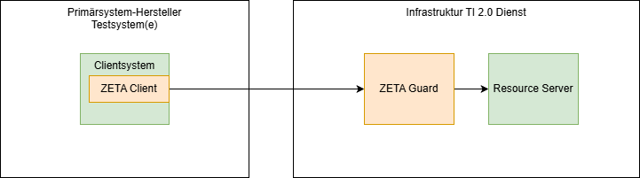

# Informationen für Primärsystem-Betreiber

Primärsystem-Hersteller binden das ZETA-SDK in ihre Primärsystemanwendungen
ein, um Dienste der TI 2.0 aufzurufen.

## Betrachtete Nutzungsszenarien

Die ZETA-Komponenten bilden im Prinzip einen transparenten Tunnel
zwischen Client und Fachdienst. Es wird hier daher davon ausgegangen,
dass Primärsystemhersteller für Tests mindestens über
einen Fachdienst-Simulator – ohne ZETA-Guard – verfügen. Alternativ können
eigene oder existierende 3rd Party Test-Fachdienste mit bereits vorhandenem ZETA-Guard
genutzt werden. Eine weitere Alternative ist dann die Nutzung des
[gematik Test-Hubs](https://github.com/gematik/ti2.0-testhub).

Es wird daher betrachtet:

1. Integration des ZETA-SDK in ein existierendes Primärsystem
2. Optionaler Aufbau eines ZETA-Guard vor einem Test-Fachdienst

Da der Aufbau des ZETA-Guard vor einem existierenden Test-Fachdienst
dem Setup für Fachdienst-Hersteller entspricht, und hier auch optional
ist, wird hier dafür nur auf den [Abschnitt für Fachdienst-Hersteller](ReadMeFachdienstHersteller.md)
verwiesen.

Im Folgenden wird daher nur auf die Voraussetzungen und Informationen
für die Integration des SDK in Fachdienst-Clients hingewiesen.

## Systemvoraussetzungen

### Registrierung

* Ein Hersteller registriert sein Produkt bei der gematik über das
  Fachportal https://fachportal.gematik.de/formulare-product-id/neuanlage und
  erhält eine von der gematik generierte Product_ID. Existierende Product_IDs
  können wiederverwendet werden und mittels eines Änderungsantrags für die
  Nutzung von TI2.0 Fachdienste freigeschaltet werden.
* Registrierung der Produktversion des Clients. Diese Version wird ebenso in die
  Regeln eingetragen.
* Falls das Primärsystem die TPM-Attestierung verwendet, müssen die entsprechenden
  Informationen (wie Liste der unveränderlichen Dateien, Hashwerte) an die gematik
  gemeldet werden, damit diese auch in die OPA-Regeln aufgenommen werden können.
  (Hinweis: Hardware-basierte Attestierung ist noch nicht vollständig spezifiziert
  und daher sind die nötigen Informationen noch nicht definiert).

Die aktuell definierte Liste der Informationen für die Beantragung einer
Produktversion ist

1. verwendete ZETA Client SDK Version
2. verwendete TI Fachdienste mit den dazugehörigen Versionen (z.B. ePA 3.2.1)
   (Mehrfachnennung möglich)
3. **bei Nutzung von TPM-Attestierung und ZETA-Attestierungsservice auf dem Client**: Übermittlung des Hash
  Gesamthash gebildet über alle einzelnen Hashes der unveränderlichen Dateien einer Clientproduktversion

### Zugänge

#### Build-Time

* Maven repository für die Nutzung der dort abgelegten Module (Java, kotlin)

#### Test und Betrieb

* Test-Fachdienst mit ZETA-Guard (mit oder ohne ASL, abhängig vom Fachdienst).
  Entweder selbst aufgesetzt oder z.B. aus dem gematik Test-Hub.

* TI Dienste (MUSS)
    * OCSP Responder der TI TSL (d.h. der Responder im Internet nicht der im
      TI 1.0 Netz)
    * Federation Master (ab Stufe 2)

* TI Dienste (Abhängig von Fachdienst, ab Umsetzungsstufe 2)
    * Federated IDP bzw. Sektorale IdPs

### Eigene Dienste

* Eigene Build- und Deployment-Pipeline, in der die Komponenten
  eingebunden werden können

* anbietereigene Dienste (Abhängig vom Fachdienst, ab Umsetzungsstufe 2)
    * Clientsystem Notification Service(s) – Apple Push Notifications, Firebase
    * E-Mail Confirmation-Code – Mail-Empfang

### Eigene Client-Komponenten

Um die Doppelimplementierung im Primärsystem zu vermeiden und um Testaufwände
zu verringern, wird erwartet dass verschiedene Funktionalitäten dem SDK
durch den Client / das Primärsystem bereitgestellt wird:

1. Eine Implementierung für sicheres Speichern von sensitiven Daten wie Access Tokens
2. Eine Konnektor-Anbindung
3. Eine Möglichkeit der Log-Ausgabe

Hinweis: die aktuell mitgelieferten Komponenten für diese Funktionalitäten
dienen nur der Demonstration und dem Test und sind nicht Produktionsgeeignet.

### Infrastruktur

Eigene Infrastruktur ist einmal für Builds und einmal für Tests nötig.
Beides wird im Rahmen einer existierenden Build- und Testinfrastruktur für
das Primärsystem vorausgesetzt.

### Tooling

Beim Tooling ergeben sich unterschiedliche Anforderungen pro Plattform.
Hierbei wird aber immer von gradle und damit Java als Build-Tool ausgegangen.

#### Java, kotlin

Bei beiden Zielplattformen wird Java als build-tool sowie als Laufzeitumgebung
verwendet.

* Java
* gradle als build-Tool

#### C++

Der C++ Client kann auf zwei Arten gebaut werden, einmal mit
Java und gradle als Build-Tool. Dies ist im Ordner `zeta-client-cpp` gezeigt.
Zum Anderen als reiner `Makefile` build.

Beide Varianten benötigen Java sowie einen C++ compiler. Die zweite Variante
benötigt zusätzlich `make` als build-tool.

##### C++ auf Windows

* Java (für gradle als build-Tool) nur für den Gradle-basierten C++ Client
* MinGW (`g++`, `mingw32-make`) für den nativen C++ Client ohne Gradle

##### C++ auf Apple

* Java (für gradle als build-Tool) nur für den Gradle-basierten C++ Client
* `clang++`, `make` für den nativen C++ Client ohne Gradle

##### C++ auf Linux

* Java (für gradle als build-Tool) nur für den Gradle-basierten C++ Client (zeta-client-cpp)
* Alternativ Make für einen nativen build (zeta-nativeclient-cpp)
* `gcc/g++` oder `clang/clang++`, `make` für den nativen C++ Client ohne Gradle

#### C#

Der C# Client ist ein Wrapper um die kotlin-Bibliothek und nutzt deren C ABI. Daher werden die Voraussetzungen
für den C++ Build auf der jeweiligen Plattform benötigt, plus die .NET-spezifischen
Voraussetzungen.

* Die Voraussetzungen für den jeweiligen C++ Build
* .NET 10.0

## Sicherheitsleistungen

Das ZETA-SDK muss in eine Client-Anwendung integriert werden. Die gematik-Anforderungen
bedingen dabei Sicherheitsleistungen, die nur im Rahmen einer Client-Anwendung
zu erfüllen sind.

Diese Sicherheitsleistungen sind in [Sicherheitsleistungen Client-Hersteller](SicherheitsanforderungenClientHersteller.md)
dargelegt.

## Relevante Anleitungen und Referenzen

Die relevanten Anleitungen und Referenzen sind hier verlinkt:

* Für das Integrieren des ZETA-Client-SDK:
  [Wie Sie das ZETA-SDK integrieren.md](Anleitungen/Wie_Sie_das_ZETA_SDK_integrieren.md)

* Wie Sie einen Ende-zu-Ende-Integrationstest ausführen – dies kann als Beispiel
  für die Nutzung des Tiger-Frameworks zum Aufsetzen von Ende-zu-Ende tests dienen.
  [Wie Sie einen Ende-zu-Ende-Integrationstest ausführen](Anleitungen/Wie_Sie_einen_Ende_zu_Ende_Integrationstest_ausführen.md)

Falls ein cloudbasiertes Primärsystem den ZETA-Client ggf. als eigenen Container
betreiben möchte (abhängig von Sicherheitsbetrachtungen und Zulassung), können
diese Anleitungen als Basis für Eigenentwicklungen hilfreich sein:

* Für das Bauen des ZETA-Testdrivers (ein ZETA-Client, der als Proxy dient)
  [Wie Sie den Testdriver bauen](Anleitungen/Wie_Sie_den_Testdriver_bauen.md)
* Für das Ausführen des ZETA-Testdrivers
  [Wie Sie den Testdriver nutzen](Anleitungen/Wie_Sie_den_Testdriver_nutzen.md)

## Known Issues und Fehleranalysen

Hier werden noch Informationen zu Rückmeldungen aus der Nutzung eingetragen.

### Besonderer Fehlersituationen

Hier werden noch Informationen zu Rückmeldungen aus der Nutzung eingetragen.

### Weitere Hinweise

* Wie in der Dokumentation zur Integration beschrieben, ist das SDK darauf ausgelegt,
  bestehende Infrastruktur des existierenden Clients wiederzuverwenden. D.h.
  es kann Überschneidungen in der Funktionalität des Clients mit dem Primärsystem geben.
  In solchen Fällen ist die existierende Funktionalität des Clients vorzuziehen.
  Die Nutzung existierender Funktionen ist über die Injection der
  Funktionalität bei der Laufzeitkonfiguration des SDK möglich. Dies
  betrifft insbesondere:
  * sichere Speicherung von Daten wie Access Tokens
  * Zugriff auf SubjectToken (SM-B als Datei bzw. SMC-B via Konnektor)
  * Nutzerinteraktionen (ab Umsetzungsstufe 2)

## Wartung

Ein definierter Wartungsprozess ist vor Meilenstein 4 aktuell nicht umgesetzt.
Updates werden über die Image- bzw. git-Repositories verbreitet.
