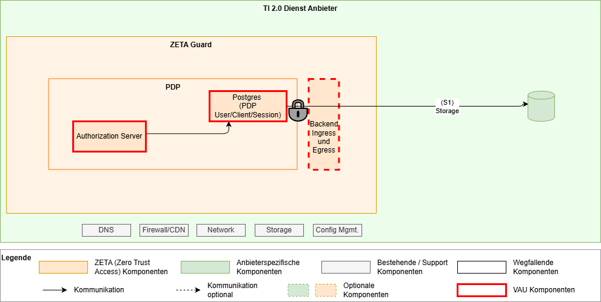
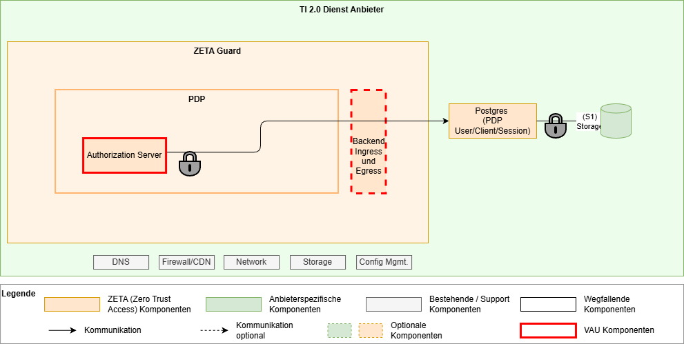
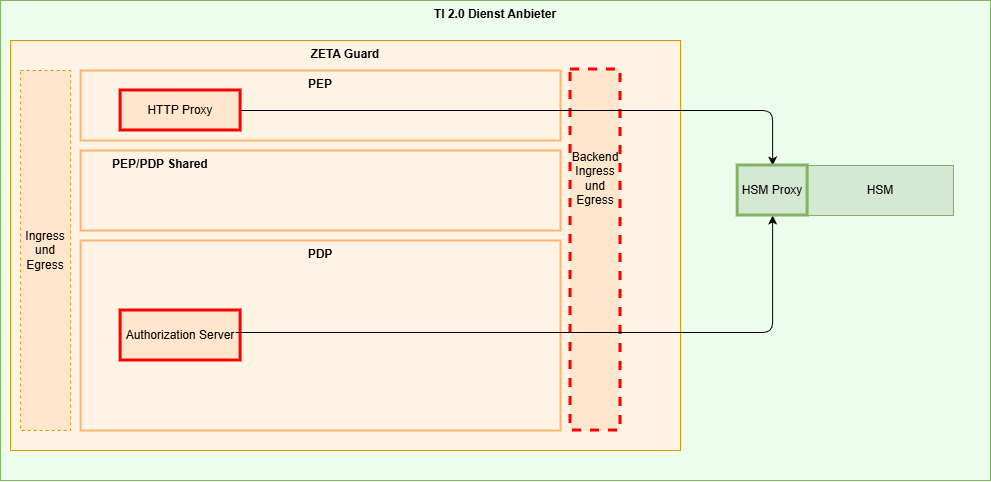

# ZETA Guard Deployment Szenarien

Das Deployment der ZETA-Komponenten kann in verschiedenen Kontexten geschehen.
So können Test-Setups aus einzelnen Knoten bestehen, große Installationen können
hin zu Active/Active oder Multi-Cluster setups gehen. In einer weiteren
Dimension muss die jeweilige Ausgestaltung hinsichtlich der Nutzung eines
Ingress, eines Service Meshes und der VAU und HSMs betrachtet werden.

Im Folgenden werden daher zuerst die beiden Dimensionen definiert, und dann in
einer Tabelle die Einsatzmöglichkeiten und unterstützten Szenarien daraus
entwickelt.

Dieses Dokument beschreibt, wie verschiedene Szenarien mit dem ZETA-Guard
umgesetzt werden können. Die eigentliche Umsetzung und Ausgestaltung obliegt
weiterhin den Betreibern der jeweiligen Fachdienste.

## Inhaltsverzeichnis

[[_TOC_]]

## Logisches Deployment-Modell

Das folgende Diagramm zeigt die logischen Komponenten des ZETA-Guard und wie sie
miteinander verbunden sind. Das Diagramm dient als Grundlage für die weitere
Diskussion bezüglich Skalierung, Failover und anderen Aspekten.

In diesem Diagram sind im Vergleich zum reinen Architekturüberblick insbesondere
die Datenbanken explizit aufgeführt, sowie die HSM-Anbindung detailliert worden.
Die nicht unmittelbar dem ZETA-Guard zugehörigen Komponenten wurden weggelassen.

Zur Anbindung HSM siehe auch weiter unten.

## Skalierung

In diesem Abschnitt beschreiben wir die Skalierungsszenarien und die
Anforderungen an die jeweiligen Skalierungen.

| Skalierungs-Szenario | Setup                                                                                                                                                                                                | Andere NB                                            | Kommentare                                                                                                                                                                                                                                                                    |
|----------------------|------------------------------------------------------------------------------------------------------------------------------------------------------------------------------------------------------|------------------------------------------------------|-------------------------------------------------------------------------------------------------------------------------------------------------------------------------------------------------------------------------------------------------------------------------------|
| Test                 | Single node                                                                                                                                                                                          | <ul><li>TLS am HTTP Proxy terminiert</li></ul>       | ohne Ingress                                                                                                                                                                                                                                                                  |
| Klein                | Dual node oder Triple node, single cluster                                                                                                                                                           | <ul><li>Failoverfähig</li><li>Canary-fähig</li></ul> | <ul><li>Minimal Produktionsfähig</li><li>Lastaussagen möglich</li></ul>                                                                                                                                                                                                       |
| Mittel               | 3+ nodes in mehreren Clustern in regionaler Nähe                                                                                                                                                     | <ul><li>Failoverfähig</li><li>Canary-fähig</li></ul> | <ul><li>z.B. ePA</li><li>Skalierungsaussage möglich</li></ul>                                                                                                                                                                                                                 |
| Groß                 | Multi-Cluster, Geo-Redundanz angestrebt <ul><li>postgres sync active/passive</li><li>Infinispan ist active/active, geringere Distanzen, ggf. Ausfallrisiko bewerten )</li></ul> 2+ nodes per cluster | <ul><li>Failoverfähig</li><li>Canary-fähig</li></ul> | <ul><li>z.B. eRezept, PoPP</li><li>Verfügbarkeit 99,9%+</li><li>Aussagen zu DB Zugriffslatenzen</li><li>Betriebsaspekte bei geo-Entfernung</li><li>Infinispan a/a → Mitigations<ul><li>Sharding</li><li>Ausfallrisiko bewerten</li><li>Sticky connections</li></ul></li></ul> |

## Variabilitäten

In diesem Kapitel werden die Aspekte beschrieben, die von Betreibern in eigenem
Ermessen – unter Einhaltung der Spezifikation – angepasst werden können.

### Ingress und Egress

Der definierte Ingress bzw. Egress aus der ZETA Architektur kann durch die
mitgelieferte Komponente umgesetzt werden, aber auch durch einen durch den
Betreiber bereitgestellten Ingress bzw. Egress umgesetzt werden.

Die inhaltliche Variabilität ist dabei die Terminierung des TLS am Ingress vs.
am PDP bzw. PEP.

### Service-Mesh

Auch das Service-Mesh kann entweder durch die mitgelieferte Komponente umgesetzt
werden, kann aber auch durch ein durch den Betreiber bereitgestelltes
Service-Mesh umgesetzt werden.

### VAU- und HSM-Nutzung

Die Nutzung der VAU bedeutet eine wesentliche Anpassung des Operationalen
Modells, da hier der ZETA-Guard bzw. Komponenten des ZETA Guard in geschütztem
Speicher laufen müssen. Insbesondere die ZETA-Guard Datenbank ist hier zu
betrachten, siehe den nächsten Punkt.

Zusätzlich ist dann gefordert, dass die Instanz-Schlüssel des PEP und PDP aus
einer HSM heraus zu nutzen sind.

### Datenbank-Setup in der VAU

Aktuell sieht das Modell vor, die ZETA-Guard Datenbank innerhalb der VAU zu
betreiben. Ein PoC ist in Arbeit, um eine für den Betrieb der Datenbank
außerhalb der VAU notwendige anwendungsseitige Verschlüsselung umzusetzen.

| VAU-Szenario                 | Kommentare                              |
|------------------------------|-----------------------------------------|
| Keine VAU benötigt           | z.B. VSDM                               |
| VAU mit Datenbank in der VAU | PoPP, DiPag, …                          |
| VAU mit separater Datenbank  | In Prüfung durch einen Proof-of-Concept |

### ZETA-Guard und Datenbank-Skalierung

Aus technischer Sicht spricht nichts dagegen, die Datenbank und die eigentlichen
ZETA-Guard-Instanzen unterschiedlich zu skalieren. Also z.B. zwei
PEP/PDP-Teilinstanzen mit einem Datenbankknoten zu betreiben.

Grundsätzlich sind PEP wie PDP horizontal skalierbar, also in mehreren
parallelen Containern betreibbar.

So spricht aus technischer Sicht nichts dagegen, horizontale Skalierung der PEP
Instanzen (für den gleichen Resource-Endpunkt) an einem PDP zu nutzen.

Bei horizontaler Skalierung des PEP ist allerdings eine „Sticky Session“ zu
beachten, da die ASL Schlüssel nicht über die PEP Instanzen hinweg ausgetauscht
werden.

TODO: Spezifikationskonform?

### Einbindung in Infrastruktur und Anbindung des Fachdienstes

Die Zerotrust Architektur nimmt an, dass alle Akteure potenziell gefährlich sind
und fordert daher – regelbasierte Prüfung aller Zugriffe. Der Fachdienst ist
daher prinzipiell co-located zum ZETA-Guard und alle Zugriffe von diesem
geschützt.

Ein Betreiber hat hier aber auch die Flexibilität, den Fachdienst z.B. in einem
eigenen Kubernetes-Cluster zu betreiben. Auch zusätzliche Sicherheitsmaßnahmen
sind denkbar.

Im folgenden Diagram sind zwei Optionen dargestellt, wobei die grau hinterlegten
Komponenten optional sind.

Falls der Fachdienst in einer eigenen Infrastruktur separat vom ZETA-Guard
betrieben wird, muss eine sichere Verbindung zwischen ZETA-Guard und Fachdienst
aufgespannt werden. Dies kann mTLS oder ein abgesichertes Netz sein, und ist in
die jeweiligen Sicherheitsbetrachtungen des Fachdienstes anhand dessen
Sicherheitsanforderungen nachzuweisen.

Die Nutzung der Web Application Firewall (WAF) vor dem ZETA-Guard kann bei einem
ASL Szenario nicht auf die Payload, d.h. die gekapselten Requests an den
Fachdienst zugreifen. In einem ASL Szenario ist diese vordere WAF daher auf die
Angriffe auf das ASL-Protokoll und den PDP beschränkt.

## Weitere Annahmen

* Ein ZETA-Guard hat genau eine logische PEP- und eine logische PDP-Instanz
    * D.h. ein ZETA-Guard pro Resource
    * Mehrere physische Instanzen können zur Skalierung genutzt werden
    * Ggf. kann in MS>4 ein Deployment-Szenario mit mehreren PEP/Resourcen zu
      einem PDP entwickelt werden

## Beschreibung der Deployment-Szenarien

### Test

Das Deployment-Szenario „Test“ fokussiert sich auf die Anbindung eines Clients
an einen Fachdienst und lässt einige Punkte, die in einem produktiven Betrieb
notwendig sind, weg, um den Aufwand und die Komplexität zu reduzieren.

Dieses Setup kann mithilfe einer lokalen Installation in einem „kind“
Kubernetes Setup aufgebaut werden. Dort ist auch noch der Proxy Test-Client
enthalten, der es ermöglicht, einen fachlichen Ende-zu-Ende-Test von einem
Nicht-ZETA Testclient, über den Proxy, über den ZETA-Guard, auf einem Fachdienst
durchzuführen.

Die wesentlichen Punkte sind hier:

* Single Node setup im Kubernetes, sogar als lokale Installation auf einem
  Entwicklungsrechner
* Kein Ingress/Egress
* Keine OPA Policy Engine für den Testbetrieb
* Das TLS kann am PEP HTTP Proxy terminiert werden
* Die Datenbank wird im Container betrieben. Storage über kubernetes
  bereitgestellt.
* Andere optionale Komponente entfallen:
    * Notification Service
    * Management Service
    * Telemetriedatenservice

### Klein

Das Szenario „Klein“ betrachtet die Installation eines ZETA-Guards innerhalb
eines (ggf. stretched) Kubernetes Clusters.

Die Komponenten werden grundsätzlich zweimal deployed und mit Affinity bzw.
Anti-Affinity auf unterschiedliche Kubernetes Nodes verteilt, um eine Kongruenz
der beiden Teil-Instanzen herzustellen, diese aber auf unterschiedlichen Nodes
zu betreiben, um Verfügbarkeiten zu erhöhen.

Der Management-Service muss dabei nur einmal installiert werden, da nur ein
Cluster betrieben wird.

#### Active-Active vs. Active-Passive

Grundsätzlich ist die Architektur des ZETA-Guard für einen Active-Active Betrieb
ausgelegt. Die Komponenten PEP und PDP synchronisieren sich rein über die
Infinispan- und Postgres Datenbanken. Das jeweils gewählte Datenbank-Setup muss
das gewählte Setup unterstützen.

Die Infinispan und Postgres Datenbanken müssen in einem Cluster-Setup betrieben
werden und sich innerhalb des Clusters synchronisieren (zum Thema Postgres
Datenbank siehe auch weiter unten). Die Datenbanken können in einem
Leader-Follower Setup genutzt werden, auch wenn der ZETA-Guard als Active-Active
betrieben wird, solange beide PDP-Instanzen auf den Leader zugreifen können,
auch wenn er in der anderen Teilinstanz liegt.

Zur Herstellung eines Quorums für den Datenbank-Failover wird empfohlen einen
dritten ZETA-Guard, oder mindestens einen dritten Datenbankknoten, ggf. auch nur
als Witness-Node einzusetzen.

#### Client-Failover

In einem Active-Active setup können die beiden ZETA-Guard Teilinstanzen jeweils
einen eigenen Endpunkt im Internet haben, der unter dem gleichen DNS Eintrag
erreichbar ist. Alternativ kann hier auch ein Anycast mit einer einzelnen
IP-Adresse unter dem DNS-Eintrag genutzt werden. Dies liegt in der Verantwortung
des jeweiligen Betreibers.

Der Client sucht sich einen der beiden Endpunkte (IP-Adresse) des ZETA-Guard aus
und nutzt diese dann im Sinne einer Sticky Session. Dies dient der
Aufrechterhaltung der ASL-Session, die an die jeweilige PEP-Instanz gebunden
ist. Sollte die PEP-Instanz ausfallen bzw. ein sonstiger Failover auf die andere
Instanz stattfinden, wird die ASL Session neu ausgehandelt. Diese „Stickyness“
ist bei Anycast- (oder anderen) Ansätzen zu beachten.

Falls eine ZETA-Instanz ausfällt, so nutzt der Client dann – bei mehreren
Endpunkten im DNS - automatisch den (bzw. einen der) anderen Endpunkte und
implementiert damit ein automatisches Failover (TODO: hier sind ggf.
Connect-Timeouts abzustimmen).

#### Service-Mesh

Service-Mesh: Das Service-Mesh ist hier zu nutzen. Es sorgt dafür, dass sich die
Komponenten innerhalb des Clusters authentifizieren können (via mTLS), sowie die
Verschlüsselung des Datenverkehrs, insbesondere auf der Netzwerkstrecke zwischen
den Kubernetes Nodes (Datenbank-Synchronisation)

#### Session-Invalidierung

Session-Invalidierung erfolgt über einen PDP, der sich darüber mit den anderen
PDPen austauscht.

### Mittel

Das Szenario „Mittel“ basiert auf dem Szenario „Klein“ und unterscheidet sich
von diesem dahingehend, dass es mindestens drei Knoten annimmt, die auch in
unterschiedlichen Clustern installiert sind. Diese sind in regionaler Nähe
aufgesetzt.

Bei unterschiedlichen Clustern ist der Management-Service pro Cluster zu
installieren.

Die Netzwerkverbindung zwischen den Clustern, die für die Synchronisation der
Datenbanken verwendet wird, ist dabei zusätzlich zur mTLS-Authentifizierung und
-Verschlüsselung abzusichern. Dies kann z.B. erfolgen über:

* Dediziertes Netzwerk zwischen den Standorten / Racks
* VPN-Netzwerk über öffentliche Netze

Die genaue Ausgestaltung, insbesondere auch im Hinblick auf Performance der
Datenbanksynchronisation obliegt dem Anbieter und ist in den jeweiligen
Konzepten des Fachdienstes nachzuweisen.

#### Offene Punkte

* Ausgestaltung der Etablierung des Vertrauensraums zwischen den Service-Meshes
  der verschiedenen Cluster, sodass die Synchronisation der Datenbank etabliert
  werden kann.

### Groß

Das Szenario „Groß“ unterscheidet sich vom Szenario „Mittel“ dadurch, dass die
ZETA-Guard Instanzen mit Geo-Redundanz aufgesetzt sind.

Bei Geo-Redundanz ist zu prüfen, wieweit die Datenbank-Synchronisation
performant genug umgesetzt werden kann. Hierbei wurden in anderen Szenarien
bereits Entfernungen von über 100km für eine synchrone Replikation der Postgres
Datenbank erreicht.

Grundsätzlich kann hier auch ein Active-Passive Setup genutzt werden, mit einem
Set von Regionalen ZETA-Guard Instanzen im Sinne des Szenarios „Mittel“ und
einer asynchronen Replikation in ein Geo-redundantes Fallback-Rechenzentrum. Ein
Schwenk in das Geo-Redundante Rechenzentrum müsste dann über DNS-Schwenk direkt
oder indirekt über CDN-Netzwerke umgesetzt werden.

#### Offene Punkte

* Eine Bewertung, was potenziell verlorene Updates bei einem Schwenk in diesem
  Szenario für Auswirkungen auf die ZETA-Guard Funktionalität haben, ist noch zu
  prüfen.

## Sonderthemen

### VAU-Betrieb

Es werden aktuell zwei typische VAU-Typen unterschieden. Die eine Technologie
nutzt Kubernetes als umgebende Technologie und lässt einzelne Prozesse
innerhalb einer Trusted Computing Zone des Prozessors laufen. Ein Beispiel davon
ist Intels SGX. Die andere Technologie etabliert eine komplette Art von
virtueller Maschine (VM) innerhalb von einer Trusted Computing Zone. Ein
Beispiel ist AMDs Secure Encrypted Virtualization (SEV) or Intels Trusted Domain
Extensions (TDX).

TODO: weitere Ausarbeitung

#### VM-Type VAUs

#### Prozess-Type VAUs

### Datenbank-Betrieb

Der Datenbankbetrieb kann flexibel gestaltet werden.

Grundsätzlich wird in Test- und kleinen Setups ohne VAU von einer Datenbank im
Container innerhalb des ZETA Guards ausgegangen.

In größeren Setups bzw. in einer VAU ist das Zielbild, die Datenbank außerhalb
des Containers als Dienst zu nutzen und die Daten anwendungsseitig zu
verschlüsseln.

#### Ohne VAU, Datenbank im Container

* Storage encryption innerhalb des Containers
* Encryption keys als kubernetes secrets

#### Mit VAU, Datenbank in der VAU

* Storage encryption innerhalb des Containers
* Encryption keys als KMS-verwaltete secrets (storage encryption is nur
  effizient genug bei symmetrischer Verschlüsselung, da muss/kann der Schlüssel
  im Prozess als vorhanden sein und kann sowieso nicht in ein HSM ausgelagert
  werden)

#### Mit VAU, Datenbank außerhalb der VAU

Hinweise:

* Zielzustand für das Deployment
* Umsetzung abhängig von weiterer Untersuchung der Umsetzbarkeit

* Anwendungsspezifische Verschlüsselung im PDP Auth Server Prozess; damit
  Möglichkeit, die Datenbank außerhalb der VAU zu betreiben
* Storage-Verschlüsselung für die Postgres Daten?

#### Datenbank-Skalierung

Die Postgres Datenbank wird grundsätzlich im leader-follower Setup betrieben.
D.h. es gibt eine Instanz, auf der alle Schreibzugriffe passieren, die dann auf
die anderen Instanzen per Replikation verteilt werden. Alle Instanzen können zum
Lesen verwendet werden.

Grundsätzlich können für die Skalierung der Datenbank die notwendigen
zusätzlichen Komponenten und Pattern genutzt werden:

* HAProxy / PgPool-II als Load Balancer für Zugriffe auf die Datenbank
* Patroni oder analoge Lösungen zur Überwachung der Datenbank-Instanzen (eine
  ungerade Anzahl an Instanzen ist zu bevorzugen, um Quorum zu ermöglichen)
* Streaming und/oder WAL Replication

Die genaue Umsetzung und die Sicherstellung der Skalierung, Performance und
Ausfallsicherheit obliegt dem Betreiber.

### HSM-Anbindung

Für die Nutzung von Instanz-Keys in einem VAU-basierten Setup wird nach
Spezifikation verlangt, dass diese Keys in einem HSM residieren, und dieses
nicht verlassen dürfen.

Da die Container Images für die Komponenten des ZETA-Guard signiert sind, können
keine anbieterspezifischen Bibliotheken oder Schnittstellen für die Nutzung
einer HSM eingebunden werden. Es ist daher auf Standard-APIs zurückzugreifen,
die mehrere HSM-Hersteller unterstützen.

In der Untersuchung wurden unter anderem

* PKCS11
* openssl-basierte APIs
* Custom ZETA-HSM-API

betrachtet. Am Ende wurde aufgrund der jeweiligen Eigenschaften vorerst
entschieden, ein Custom ZETA-HSM-API Protokoll zu entwerfen. Hierbei soll auf
die Erfahrungen mit der API der Custom Firmware aus dem ePA Umfeld
zurückgegriffen werden.

#### Als eigener Service

* Draft: Authentifizierung des HTTP Proxy und des Authorization Servers durch
  Einbringen der Hardware-Attestierungsinformationen in das HSM, wo es durch den
  HSM Proxy geprüft werden kann.
* Authentifizierung des HSM Proxy am HSM durch Einbringen der
  Hardware-Attestierungsinformationen des HSM Proxy Containers in das HSM

#### Als Sidecar

Der Vorteil des Aufsetzens als Sidecar-Container innerhalb des Kubernetes Pods
einmal des HTTP Proxy und auch des Authorization Servers ist die schnelle
Anbindung zwischen den Containern innerhalb eines Pods. Ein Nachteil ist, dass
mehrere Container aufzusetzen mit entsprechenden Infrastrukturanforderungen
sind.

* TODO Draft: Authentifizierung des HTTP Proxy und des Authorization Servers
  durch Einbringen der Hardware-Attestierungsinformationen in das HSM, wo es
  durch den HSM Proxy geprüft werden kann.
* Authentifizierung des HSM Proxy am HSM durch Einbringen der
  Hardware-Attestierungsinformationen des HSM Proxy Containers in das HSM

#### Als HSM-Firmware

* Authentifizierung des HSM Proxy am HSM durch Einbringen der
  Hardware-Attestierungsinformationen des HSM Proxy Containers in das HSM

#### Hardware-Aktualisierung, Skalierung

Für die Ausfallsicherheit sollten mehrere HSMs parallel bereitgestellt werden
können, die auch dieselben Schlüssel enthalten. Dazu müssen Schlüssel zwischen
HSMs ausgetauscht werden können.

Ebenso müssen für Hardware-Aktualisierungen Schlüssel zwischen HSMs ausgetauscht
werden.

Für diese Szenarien existieren HSM-spezifische Prozeduren, um dies sicher
durchführen zu können. Diese liegen in der Verantwortung der Betreiber.

#### Offene Punkte:

* Genaues Verfahren der Authentifizierung der HTTP Proxy und Authentication
  Server am HSM Proxy
* Load Balancing zwischen HTTP Proxy / Authorization Server und HSM Proxy / HSM?
