# ZETA-Guard-Deployment-Szenarien

Die ZETA-Komponenten lassen sich in sehr unterschiedlichen Umgebungen
betreiben: Ein Test-Setup kommt mit einem einzelnen Knoten aus, große
Installationen reichen bis zu Active/Active- oder Multi-Cluster-Setups. Eine
zweite Dimension ist die Ausgestaltung im Einzelnen — Ingress, Service Mesh, VAU
und HSM.

Dieses Dokument definiert daher zunächst beide Dimensionen und leitet daraus in
einer Tabelle die Einsatzmöglichkeiten und unterstützten Szenarien ab. Es zeigt,
wie sich die Szenarien mit dem ZETA-Guard umsetzen lassen; die konkrete
Umsetzung verantworten weiterhin die Betreiber der jeweiligen Fachdienste.

## Inhaltsverzeichnis

- [Logisches Deployment-Modell](#logisches-deployment-modell)
- [Skalierung](#skalierung)
- [Variabilitäten](#variabilitäten)
  - [Ingress und Egress](#ingress-und-egress)
  - [Service-Mesh](#service-mesh)
  - [VAU- und HSM-Nutzung](#vau--und-hsm-nutzung)
  - [Datenbank-Setup in der VAU](#datenbank-setup-in-der-vau)
  - [ZETA-Guard und Datenbank-Skalierung](#zeta-guard-und-datenbank-skalierung)
  - [Notification Service (Vorschau)](#notification-service-vorschau)
  - [Einbindung in Infrastruktur und Anbindung des Fachdienstes](#einbindung-in-infrastruktur-und-anbindung-des-fachdienstes)
- [Weitere Annahmen](#weitere-annahmen)
- [Beschreibung der Deployment-Szenarien](#beschreibung-der-deployment-szenarien)
  - [Test](#test)
  - [Klein](#klein)
  - [Mittel](#mittel)
  - [Groß](#groß)
- [Sonderthemen](#sonderthemen)
  - [VAU-Betrieb](#vau-betrieb)
  - [Datenbank-Betrieb](#datenbank-betrieb)
  - [HSM-Anbindung](#hsm-anbindung)

## Logisches Deployment-Modell

Das folgende Diagramm zeigt die logischen Komponenten des ZETA-Guard und ihre
Verbindungen. Es ist die Grundlage für die weiteren Abschnitte zu Skalierung,
Failover und verwandten Themen.

Gegenüber dem reinen Architekturüberblick führt das Diagramm die Datenbanken
explizit auf und stellt die HSM-Anbindung genauer dar. Komponenten, die nicht
unmittelbar zum ZETA-Guard gehören, bleiben weg.

Zur HSM-Anbindung siehe auch weiter unten.

## Skalierung

Dieser Abschnitt beschreibt die Skalierungsszenarien und ihre Anforderungen.

| Skalierungs-Szenario | Setup                                                                                                                                                                                              | Andere NB                                            | Kommentare                                                                                                                                                                                                                                                                     |
|----------------------|----------------------------------------------------------------------------------------------------------------------------------------------------------------------------------------------------|------------------------------------------------------|--------------------------------------------------------------------------------------------------------------------------------------------------------------------------------------------------------------------------------------------------------------------------------|
| Test                 | Single node                                                                                                                                                                                        | <ul><li>TLS am HTTP Proxy terminiert</li></ul>       | ohne Ingress                                                                                                                                                                                                                                                                   |
| Klein                | Dual Node oder Triple Node, Single Cluster                                                                                                                                                         | <ul><li>Failoverfähig</li><li>Canary-fähig</li></ul> | <ul><li>minimal produktionsfähig</li><li>Lastaussagen möglich</li></ul>                                                                                                                                                                                                        |
| Mittel               | 3+ nodes in mehreren Clustern in regionaler Nähe                                                                                                                                                   | <ul><li>Failoverfähig</li><li>Canary-fähig</li></ul> | <ul><li>z. B. ePA</li><li>Skalierungsaussage möglich</li></ul>                                                                                                                                                                                                                 |
| Groß                 | Multi-Cluster, Geo-Redundanz angestrebt <ul><li>Postgres sync active/passive</li><li>Infinispan ist active/active, geringere Distanzen, ggf. Ausfallrisiko bewerten</li></ul> 2+ Nodes pro Cluster | <ul><li>Failoverfähig</li><li>Canary-fähig</li></ul> | <ul><li>z. B. eRezept, PoPP</li><li>Verfügbarkeit 99,9%+</li><li>Aussagen zu DB-Zugriffslatenzen</li><li>Betriebsaspekte bei Geo-Entfernung</li><li>Infinispan a/a → Mitigations<ul><li>Sharding</li><li>Ausfallrisiko bewerten</li><li>Sticky connections</li></ul></li></ul> |

## Variabilitäten

In diesem Kapitel werden die Aspekte beschrieben, die von Betreibern in eigenem
Ermessen – unter Einhaltung der Spezifikation – angepasst werden können.

### Ingress und Egress

Für Ingress und Egress der ZETA-Architektur können Sie die mitgelieferten
Komponenten verwenden oder einen selbst bereitgestellten Ingress bzw. Egress.

Inhaltlich unterscheiden sich die Varianten darin, wo TLS terminiert wird: am
Ingress oder am PDP bzw. PEP.

### Service-Mesh

Auch beim Service-Mesh haben Betreiber die Wahl zwischen der mitgelieferten
Komponente und einem eigenen Service-Mesh.

### VAU- und HSM-Nutzung

Eine VAU verändert das Betriebsmodell erheblich: Der ZETA-Guard oder einzelne
seiner Komponenten müssen dann in geschütztem Speicher laufen. Besonderes
Augenmerk verlangt die ZETA-Guard-Datenbank (siehe nächster Punkt).

Zusätzlich müssen die Instanz-Schlüssel von PEP und PDP aus einem HSM stammen.

### Datenbank-Setup in der VAU

Derzeit sieht das Modell die ZETA-Guard-Datenbank innerhalb der VAU vor. Ein
Proof of Concept für die anwendungsseitige Verschlüsselung läuft; sie ist die
Voraussetzung dafür, die Datenbank außerhalb der VAU zu betreiben.

| VAU-Szenario                 | Kommentare                              |
|------------------------------|-----------------------------------------|
| Keine VAU benötigt           | z. B. VSDM                              |
| VAU mit Datenbank in der VAU | PoPP, DiPag, …                          |
| VAU mit separater Datenbank  | In Prüfung durch einen Proof-of-Concept |

### ZETA-Guard und Datenbank-Skalierung

Datenbank und ZETA-Guard-Instanzen lassen sich technisch unterschiedlich
skalieren — etwa zwei PEP-/PDP-Teilinstanzen an einem Datenbankknoten.

PEP und PDP sind beide horizontal skalierbar, laufen also in mehreren parallelen
Containern. Auch mehrere PEP-Instanzen für denselben Resource-Endpunkt an einem
PDP sind möglich.

Bei horizontaler Skalierung des PEP ist allerdings eine „Sticky Session“ zu
beachten, da die ASL-Schlüssel nicht über die PEP-Instanzen hinweg ausgetauscht
werden. Das mitgelieferte ZETA-Guard-Helm-Chart implementiert dies automatisch
über den NGINX Ingress Controller (Cookie `zeta_route`, Consistent Hashing per
Ketama). Bei alternativen Ingress-Controllern muss der Betreiber dies selbst
sicherstellen.

### Notification Service (Vorschau)

Der Notification Service ist eine optionale Vorschau-Komponente und im
Helm-Chart standardmäßig deaktiviert (`notificationService.enabled: false`). Bei
Aktivierung wird er als Split-Deployment ausgerollt — eine Variante für die
Resource-Server-API (clusterintern) und eine für die Client-API hinter dem
PEP — und erhält eine eigene, von der PDP-Datenbank getrennte
CNPG-PostgreSQL-Datenbank. Details siehe
[Konfiguration des Notification Service](Konfiguration_des_Notification_Service.md).

### Einbindung in Infrastruktur und Anbindung des Fachdienstes

Die Zero-Trust-Architektur nimmt an, dass alle Akteure potenziell gefährlich
sind, und fordert daher eine regelbasierte Prüfung aller Zugriffe. Der
Fachdienst liegt deshalb grundsätzlich beim ZETA-Guard, der alle Zugriffe darauf
schützt.

Betreiber können den Fachdienst aber auch anders aufstellen, etwa in einem
eigenen Kubernetes-Cluster, und zusätzliche Sicherheitsmaßnahmen ergänzen.

Im folgenden Diagramm sind zwei Optionen dargestellt, wobei die grau
hinterlegten Komponenten optional sind.

Läuft der Fachdienst in einer eigenen Infrastruktur getrennt vom ZETA-Guard,
braucht es eine sichere Verbindung zwischen beiden — etwa mTLS oder ein
abgesichertes Netz. Den Nachweis führt der Fachdienst in seinen
Sicherheitsbetrachtungen anhand seiner Sicherheitsanforderungen.

Eine Web Application Firewall (WAF) vor dem ZETA-Guard kann bei einem
ASL-Szenario nicht auf die Payload, d. h. die gekapselten Requests an den
Fachdienst, zugreifen. In einem ASL-Szenario ist diese vordere WAF daher auf
Angriffe auf das ASL-Protokoll und den PDP beschränkt.

## Weitere Annahmen

* Ein ZETA-Guard hat genau eine logische PEP- und eine logische PDP-Instanz
    * D. h. ein ZETA-Guard pro Resource
    * Mehrere physische Instanzen können zur Skalierung genutzt werden
    * Ggf. kann in MS>4 ein Deployment-Szenario mit mehreren PEP/Resourcen zu
      einem PDP entwickelt werden

## Beschreibung der Deployment-Szenarien

### Test

Das Deployment-Szenario „Test“ konzentriert sich auf die Anbindung eines Clients
an einen Fachdienst. Es lässt einiges weg, was im produktiven Betrieb nötig ist,
und senkt so Aufwand und Komplexität.

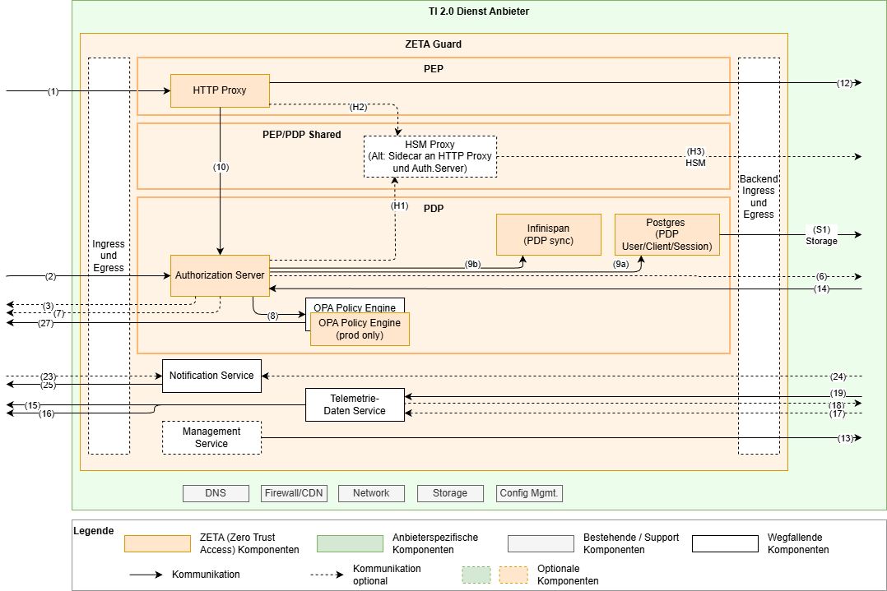

Dieses Setup lässt sich lokal in einem „kind“-Kubernetes-Setup aufbauen. Es
enthält auch den Proxy-Test-Client; damit führen Sie einen fachlichen
Ende-zu-Ende-Test von einem Nicht-ZETA-Testclient über Proxy und ZETA-Guard bis
zum Fachdienst durch.

Die wesentlichen Punkte sind hier:

* Single-Node-Setup in Kubernetes, sogar als lokale Installation auf einem
  Entwicklungsrechner
* Kein Ingress/Egress
* Keine OPA-Policy-Engine für den Testbetrieb
* Das TLS kann am PEP HTTP Proxy terminiert werden
* Die Datenbank wird im Container betrieben. Storage wird über Kubernetes
  bereitgestellt.
* Andere optionale Komponenten entfallen:
    * Notification Service
    * Management Service
    * Telemetriedaten-Service

### Klein

Das Szenario „Klein“ betrachtet die Installation eines ZETA-Guards innerhalb
eines (ggf. stretched) Kubernetes-Clusters.

Alle Komponenten laufen doppelt und werden über Affinity bzw. Anti-Affinity auf
unterschiedliche Kubernetes-Nodes verteilt: Beide Teil-Instanzen sind identisch
aufgebaut, liegen aber auf verschiedenen Nodes — das erhöht die Verfügbarkeit.

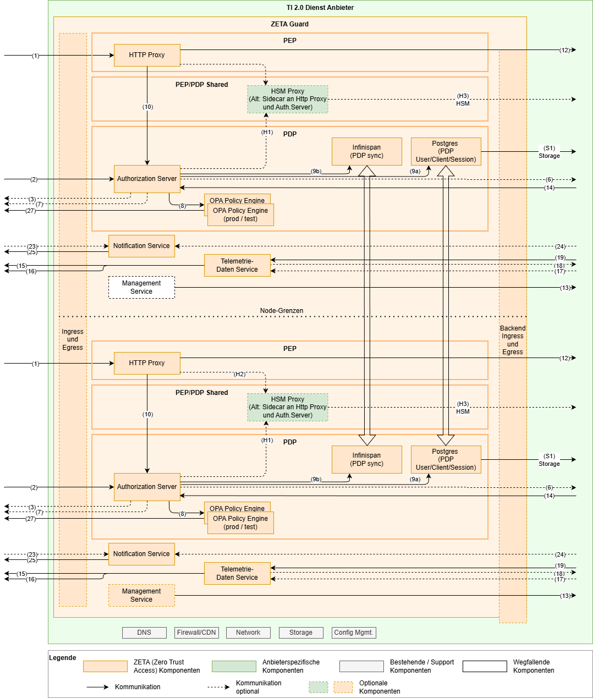

Der Management-Service muss dabei nur einmal installiert werden, da nur ein
Cluster betrieben wird.

#### Active-Active vs. Active-Passive

Die Architektur des ZETA-Guard ist auf Active-Active-Betrieb ausgelegt. PEP und
PDP synchronisieren sich ausschließlich über die Infinispan- und
Postgres-Datenbanken; das gewählte Datenbank-Setup muss diesen Betrieb
unterstützen.

Die Infinispan- und Postgres-Datenbanken laufen im Cluster-Setup und
synchronisieren sich innerhalb des Clusters (zur Postgres-Datenbank siehe auch
weiter unten). Ein Leader-Follower-Setup ist auch bei Active-Active-Betrieb des
ZETA-Guard möglich, solange beide PDP-Instanzen den Leader erreichen — selbst
wenn er in der anderen Teilinstanz liegt.

Zur Herstellung eines Quorums für den Datenbank-Failover wird empfohlen, einen
dritten ZETA-Guard oder mindestens einen dritten Datenbankknoten, ggf. auch nur
als Witness-Node, einzusetzen.

#### Client-Failover

In einem Active-Active-Setup können die beiden ZETA-Guard-Teilinstanzen jeweils
einen eigenen Endpunkt im Internet haben, der unter dem gleichen DNS-Eintrag
erreichbar ist. Alternativ kann hier auch ein Anycast mit einer einzelnen
IP-Adresse unter dem DNS-Eintrag genutzt werden. Dies liegt in der Verantwortung
des jeweiligen Betreibers.

Der Client wählt einen der beiden Endpunkte des ZETA-Guard und bleibt dann im
Sinne einer Sticky Session dabei. So bleibt die ASL-Session erhalten, die an die
jeweilige PEP-Instanz gebunden ist. Fällt die PEP-Instanz aus oder findet ein
sonstiger Failover auf die andere Instanz statt, wird die ASL-Session neu
ausgehandelt. Diese „Stickiness“ ist bei Anycast- und anderen Ansätzen zu
beachten. Innerhalb eines Clusters bindet das Helm-Chart einen Client über ein
`zeta_route`-Cookie auf Ingress-Ebene (F5 NIC) an eine PEP-Instanz.

Fällt eine ZETA-Instanz aus, wechselt der Client bei mehreren DNS-Endpunkten
automatisch auf einen der übrigen; das Failover läuft damit von selbst. Die
Timeouts konfiguriert der Client und stimmt sie bei Bedarf mit den Fachdiensten
ab.

#### Service-Mesh

Das Service-Mesh ist hier zu nutzen. Es sorgt dafür, dass sich die
Komponenten innerhalb des Clusters authentifizieren können (via mTLS), sowie für
die Verschlüsselung des Datenverkehrs, insbesondere auf der Netzwerkstrecke
zwischen den Kubernetes-Nodes (Datenbank-Synchronisation).

#### Session-Invalidierung

Session-Invalidierung erfolgt über einen PDP, der sich darüber mit den anderen
PDPs austauscht.

### Mittel

Das Szenario „Mittel“ baut auf „Klein“ auf, setzt aber mindestens drei Knoten
voraus, die auch in unterschiedlichen Clustern liegen. Diese Cluster stehen in
regionaler Nähe zueinander.

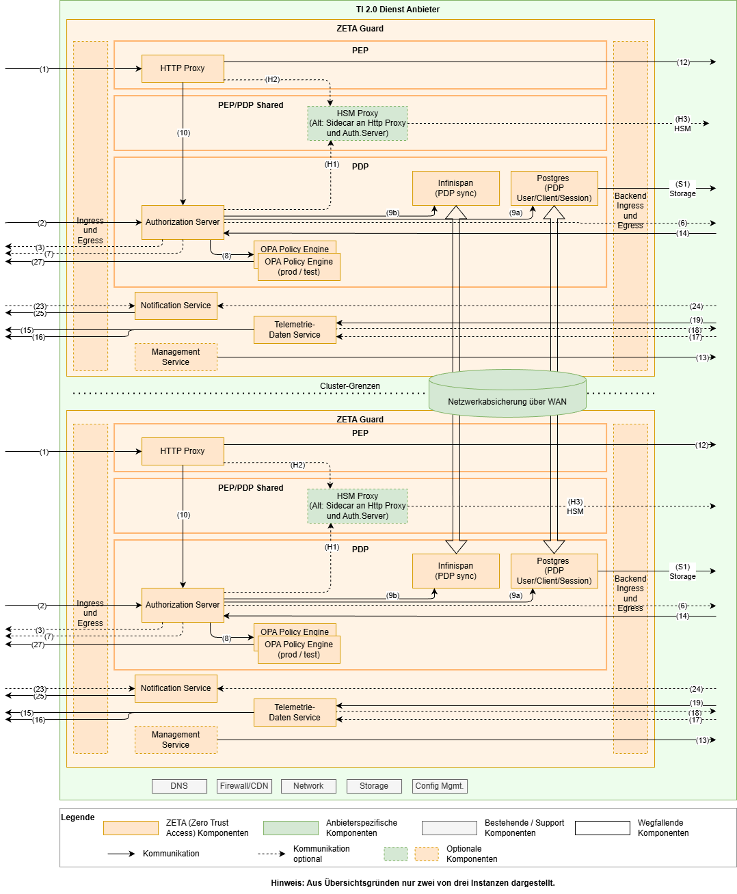

Bei unterschiedlichen Clustern ist der Management-Service pro Cluster zu
installieren.

Die Netzwerkverbindung zwischen den Clustern trägt die Datenbank-Synchronisation
und ist zusätzlich zur mTLS-Authentifizierung und -Verschlüsselung abzusichern,
etwa über:

* Dediziertes Netzwerk zwischen den Standorten / Racks
* VPN-Netzwerk über öffentliche Netze

Die genaue Ausgestaltung — besonders im Hinblick auf die Performance der
Datenbanksynchronisation — verantwortet der Anbieter und weist sie in den
Konzepten des Fachdienstes nach.

#### Offene Punkte

* Ausgestaltung der Etablierung des Vertrauensraums zwischen den Service-Meshes
  der verschiedenen Cluster, sodass die Synchronisation der Datenbank etabliert
  werden kann.

### Groß

Das Szenario „Groß“ unterscheidet sich vom Szenario „Mittel“ dadurch, dass die
ZETA-Guard-Instanzen mit Geo-Redundanz aufgesetzt sind.

Bei Geo-Redundanz ist zu prüfen, ob die Datenbank-Synchronisation noch
performant genug läuft. In anderen Szenarien wurden für eine synchrone
Replikation der Postgres-Datenbank bereits über 100 km erreicht.

Grundsätzlich kann hier auch ein Active-Passive-Setup genutzt werden, mit einem
Set regionaler ZETA-Guard-Instanzen im Sinne des Szenarios „Mittel“ und
einer asynchronen Replikation in ein geo-redundantes Fallback-Rechenzentrum. Ein
Schwenk in das geo-redundante Rechenzentrum müsste dann über DNS-Schwenk direkt
oder indirekt über CDN-Netzwerke umgesetzt werden.

#### Offene Punkte

* Eine Bewertung, was potenziell verlorene Updates bei einem Schwenk in diesem
  Szenario für Auswirkungen auf die ZETA-Guard-Funktionalität haben, ist noch zu
  prüfen.

## Sonderthemen

### VAU-Betrieb

Es werden aktuell zwei typische VAU-Typen unterschieden. Die eine Technologie
nutzt Kubernetes als umgebende Technologie und lässt einzelne Prozesse in einer
Trusted Computing Zone des Prozessors laufen; ein Beispiel ist Intel SGX. Die
andere stellt eine komplette virtuelle Maschine (VM) in eine Trusted Computing
Zone — etwa AMDs Secure Encrypted Virtualization (SEV) oder Intels Trusted
Domain Extensions (TDX).

#### VM-Type VAUs

In diesen VAUs laufen komplette VMs in einer sicheren Umgebung — der gesamte
ZETA-Guard kann also in einer einzigen VM liegen. Das folgende Diagramm zeigt
ein solches Beispiel.

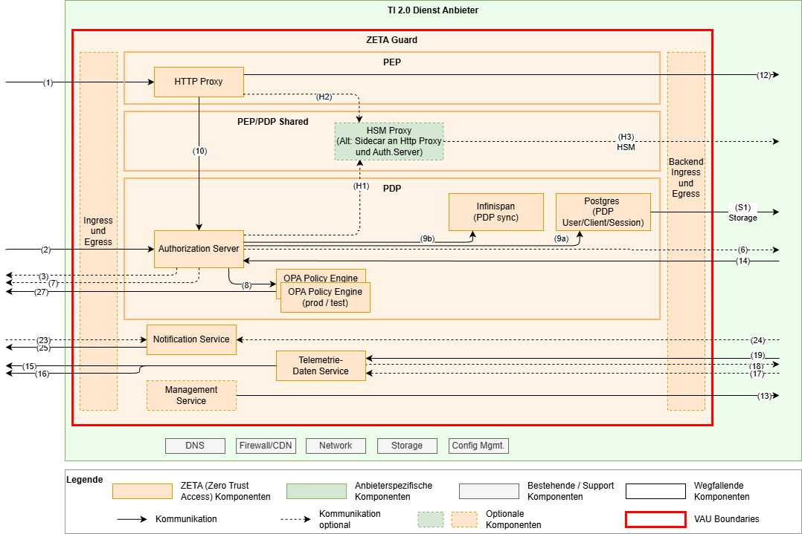

Die Vertrauensbeziehung zwischen den ZETA-Guard-Komponenten muss dann innerhalb
der VAU sichergestellt sein.

Die Skalierung verlangt hier eine eigene Betrachtung: Eine komplette VM zu
skalieren dürfte einfacher sein, als einzelne Komponenten innerhalb der VAU zu
skalieren.

Allerdings kann hier auch ein Hybrid-Ansatz genutzt werden,
bei dem Teile des ZETA-Guard in einer VM und andere Komponenten
in einer anderen VM ausgeführt werden. Dabei sind aber
Vertrauensbeziehungen entsprechend zwischen den VMs herzustellen.

#### Prozess-Type VAUs

In diesen VAUs werden die einzelnen Komponenten in separaten
VAUs ausgeführt. Das folgende Diagramm zeigt ein solches Beispiel.

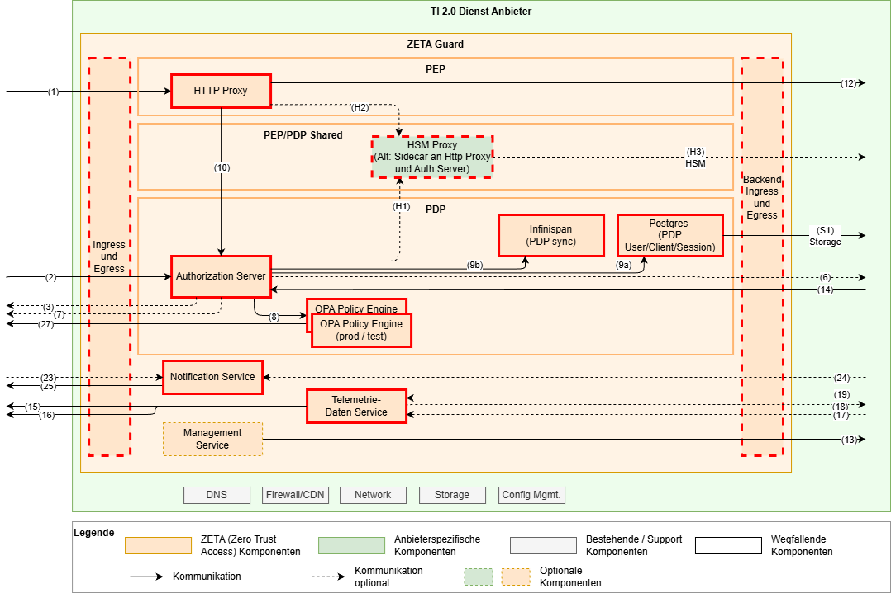

Die Vertrauensbeziehung zwischen den VAUs eines ZETA-Guard stellen hier etwa ein
Service-Mesh oder vergleichbare Mittel sicher.

Skalieren lässt sich in diesem Fall jede Komponente einzeln — die Skalierung
passt damit besser zur jeweiligen Last.

#### Kommunikation zwischen den VAUs

Dieser Abschnitt fasst die Anforderungen an die Kommunikation zwischen den VAUs
zusammen. Er betrachtet nur skalierte bzw. redundante Installationen, denn nur
dort arbeiten mehrere ZETA-Guards zusammen.

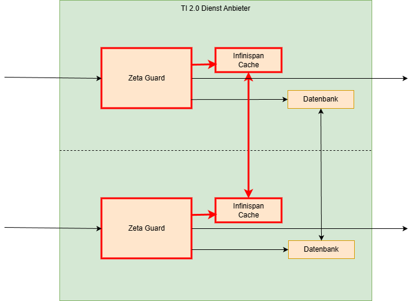

### Datenbank-Betrieb

Der Datenbankbetrieb kann flexibel gestaltet werden.

Grundsätzlich wird in Test- und kleinen Setups ohne VAU von einer Datenbank im
Container innerhalb des ZETA-Guards ausgegangen.

In größeren Setups bzw. in einer VAU ist das Zielbild, die Datenbank außerhalb
des Containers als Dienst zu nutzen und die Daten anwendungsseitig zu
verschlüsseln.

#### Ohne VAU, Datenbank im Container

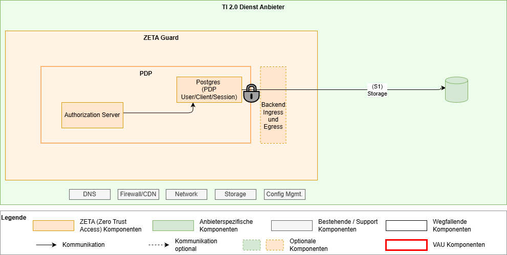

* Storage-Verschlüsselung innerhalb des Containers
* Verschlüsselungsschlüssel als Kubernetes-Secrets

#### Mit VAU, Datenbank in der VAU

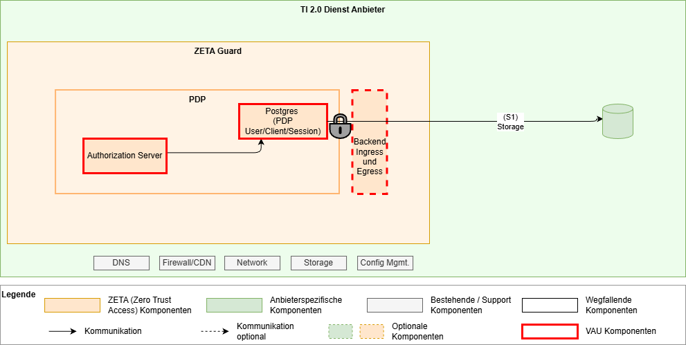

* Storage-Verschlüsselung innerhalb des Containers
* Verschlüsselungsschlüssel als KMS-verwaltete Secrets (Storage-Verschlüsselung
  ist nur bei symmetrischer Verschlüsselung effizient genug; der Schlüssel muss
  daher im Prozess vorhanden sein und kann ohnehin nicht in ein HSM ausgelagert
  werden)

#### Mit VAU, Datenbank außerhalb der VAU

Hinweise:

* Zielzustand für das Deployment
* Umsetzung abhängig von weiterer Untersuchung der Umsetzbarkeit

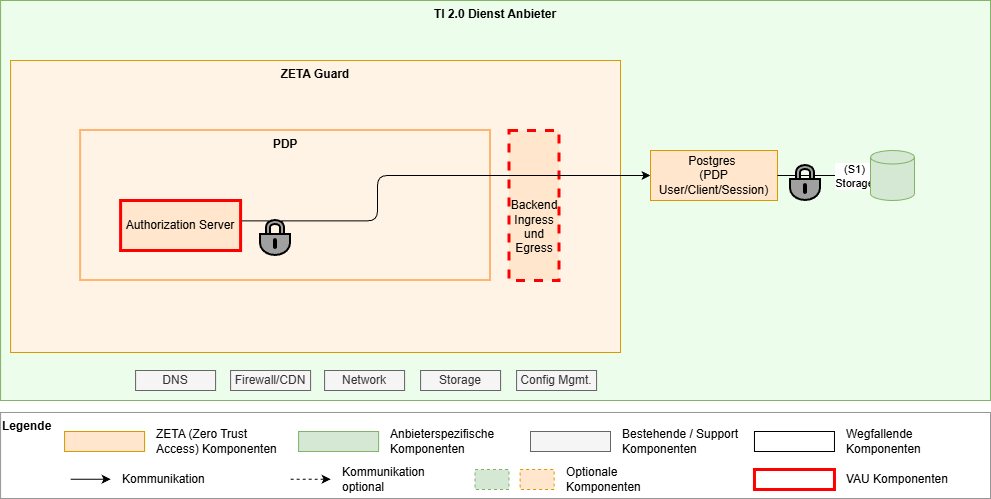

* Anwendungsspezifische Verschlüsselung im PDP-Auth-Server-Prozess; damit
  Möglichkeit, die Datenbank außerhalb der VAU zu betreiben
* Storage-Verschlüsselung für die Postgres-Daten?

#### Datenbank-Skalierung

Die Postgres-Datenbank wird grundsätzlich im Leader-Follower-Setup betrieben. D.
h., es gibt eine Instanz, auf der alle Schreibzugriffe passieren, die dann auf
die anderen Instanzen per Replikation verteilt werden. Alle Instanzen können zum
Lesen verwendet werden.

Grundsätzlich können für die Skalierung der Datenbank die notwendigen
zusätzlichen Komponenten und Patterns genutzt werden:

* HAProxy / PgPool-II als Load Balancer für Zugriffe auf die Datenbank
* Patroni oder analoge Lösungen zur Überwachung der Datenbank-Instanzen (eine
  ungerade Anzahl an Instanzen ist zu bevorzugen, um Quorum zu ermöglichen)
* Streaming- und/oder WAL-Replication

Die genaue Umsetzung und die Sicherstellung der Skalierung, Performance und
Ausfallsicherheit obliegt dem Betreiber.

### HSM-Anbindung

In einem VAU-basierten Setup verlangt die Spezifikation, dass die Instanz-Keys
in einem HSM liegen und es nicht verlassen.

Weil die Container-Images der ZETA-Guard-Komponenten signiert sind, lassen sich
keine anbieterspezifischen Bibliotheken oder Schnittstellen für ein HSM
einbinden. Es bleiben daher nur Standard-APIs, die mehrere HSM-Hersteller
unterstützen.

In der Untersuchung wurden unter anderem

* PKCS11
* openssl-basierte APIs
* Custom ZETA-HSM-API

betrachtet. Aufgrund ihrer jeweiligen Eigenschaften fiel die Entscheidung
vorerst auf ein eigenes ZETA-HSM-API-Protokoll. Es soll auf den Erfahrungen mit
der API der Custom Firmware aus dem ePA-Umfeld aufbauen.

#### Als eigener Service

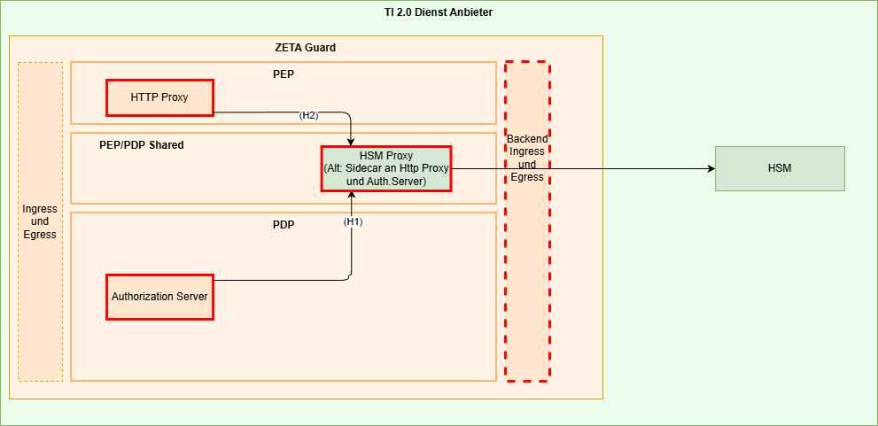

Hier sind mögliche Ansätze, die Vertrauensbeziehung zwischen den Komponenten herzustellen.
Diese dienen als Denkansätze und müssen im konkreten Fall ausgearbeitet und durch
die Zertifizierung des jeweiligen Fachdienstes bewertet werden.

* Die Authentifizierung des HTTP Proxy und des Authorization Servers durch
  Einbringen der Hardware-Attestierungsinformationen in das HSM, wo sie durch
  den HSM-Proxy geprüft werden können.
* Authentifizierung des HSM-Proxy am HSM durch Einbringen der
  Hardware-Attestierungsinformationen des HSM-Proxy Containers in das HSM

#### Als Sidecar

Als Sidecar im selben Pod wie HTTP Proxy und Authorization Server ist die
Anbindung zwischen den Containern besonders schnell. Nachteilig ist, dass
mehrere Container mit entsprechenden Infrastrukturanforderungen aufzusetzen
sind.

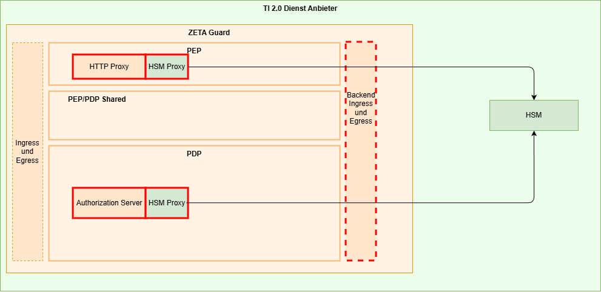

Hier sind mögliche Ansätze, die Vertrauensbeziehung zwischen den Komponenten herzustellen.
Diese dienen als Denkansätze und müssen im konkreten Fall ausgearbeitet und durch
die Zertifizierung des jeweiligen Fachdienstes bewertet werden.

* Vertrauensbeziehung zwischen HTTP Proxy und Authorization Server und dem Sidecar
  muss durch die VAU-Funktionalität hergestellt werden.
* Authentifizierung des HSM-Proxy am HSM durch Einbringen der
  Hardware-Attestierungsinformationen des HSM-Proxy Sidecars in das HSM

#### Als HSM-Firmware

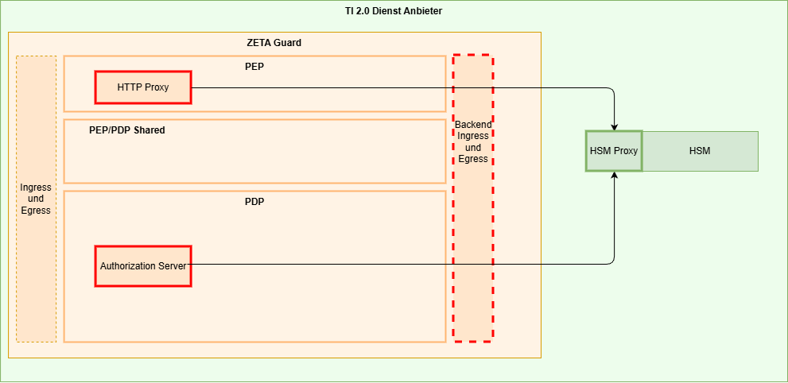

Hier sind mögliche Ansätze, die Vertrauensbeziehung zwischen den Komponenten herzustellen.
Diese dienen als Denkansätze und müssen im konkreten Fall ausgearbeitet und durch
die Zertifizierung des jeweiligen Fachdienstes bewertet werden.

* Authentifizierung des HTTP Proxy und des Authorization Servers am HSM durch Einbringen der
  Hardware-Attestierungsinformationen des jeweiligen Containers in das HSM

#### Hardware-Aktualisierung, Skalierung

Für die Ausfallsicherheit sollten mehrere HSMs parallel bereitgestellt werden
können, die auch dieselben Schlüssel enthalten. Dazu müssen Schlüssel zwischen
HSMs ausgetauscht werden können.

Ebenso müssen für Hardware-Aktualisierungen Schlüssel zwischen HSMs ausgetauscht
werden.

Für diese Szenarien existieren HSM-spezifische Prozeduren, um dies sicher
durchführen zu können. Diese liegen in der Verantwortung der Betreiber.

#### Offene Punkte

* Genaues Verfahren der Authentifizierung des HTTP Proxy und des Authentication
  Servers am HSM-Proxy
* Load Balancing zwischen HTTP Proxy / Authorization Server und HSM-Proxy / HSM?
