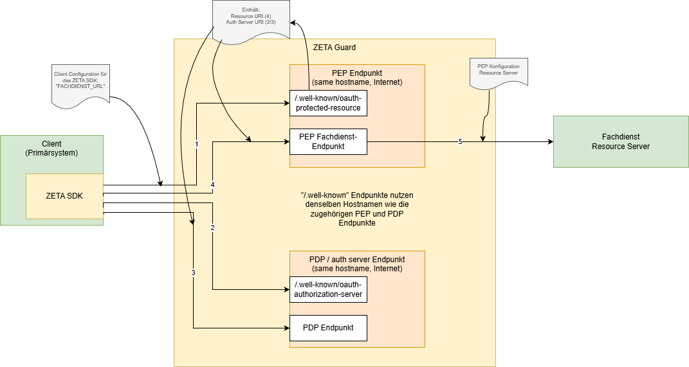
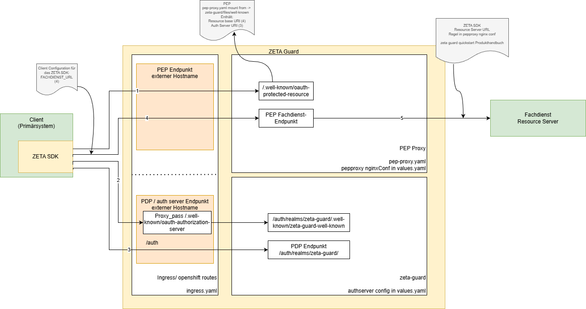
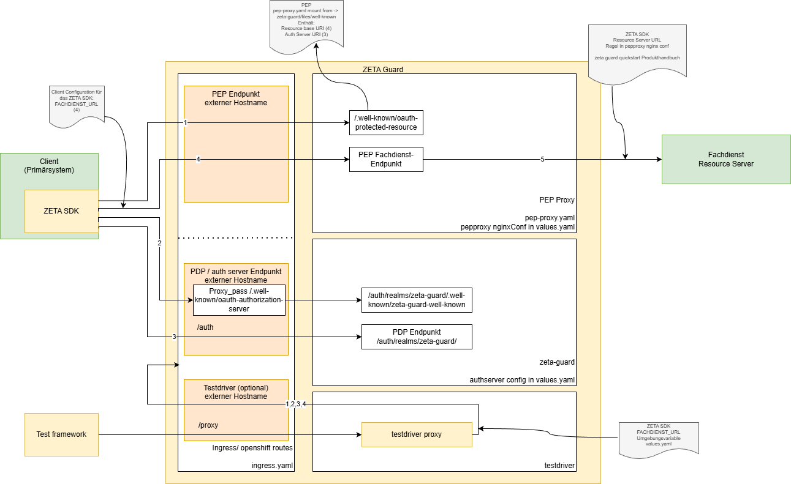
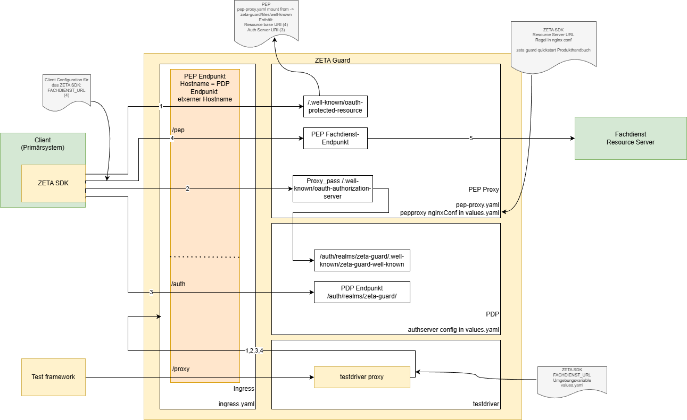

# Konfigurationshinweise

Die Konfiguration des ZETA-Guard umfasst eine Vielzahl von Punkten, die wir hier übergreifend
darstellen, um das Verständnis der Umsetzung zu erleichtern.

## Request-Routing

Der Client nutzt grundsätzlich vier Endpunkte am ZETA-Guard, die sich auf
zwei Hostnamen verteilen.

Die Hinweise hier dienen dazu die Abhängigkeiten zwischen den verschiedenen
Konfigurationen darzustellen und eine korrekte Konfiguration zu unterstützen.

### Abstrakte Sicht

Die Vier Endpunkte sind:

1. Well-known-Datei des PEP
2. PEP Endpunkt für Zugriffe auf den Fachdienst (inkl. `/ASL`Pfad)
3. Well-known-Datei des PDP
4. PDP Endpunkte für Nonce, Token, Registrierung etc.

Das folgende Diagram zeigt eine Übersicht.

Hierbei ist zu beachten, dass der Client (das SDK) mit einer einzigen
URL beginnen, der Fachdienst-URL.
Durch Ersatz des Pfades der Fachdienst-URL durch den Pfad der Well-Known-Datei wird
diese gefunden.

In der Well-Known-Datei des PEP steht dann wiederum die URL des Authorization
Servers. Dessen Well-Known-Datei wird gefunden, in dem der Hostname der URL
des Authorization Servers mit dem Well-known-Pfad ergänzt wird.
Dort finden sich dann die URLs der verschiedenen Endpunkte (nonce, token, ...)

### Konkrete Konfiguration

Das folgende Diagram zeigt, wie die die Konfiguration des ZETA-Guard
umgesetzt werden kann, um in Produktion mit den beiden Hostnamen die vier
Endpunkte aufzubauen.

Das folgende Diagram zeigt einen Ingress, der die beiden Hostnamen abbildet,
und die verschiedenen Pfade auf die Endpunkte des PEP und PDP routet.
Die weißen Boxen sind dabei konkrete Komponenten bzw. Deployments im kubernetes, die hell-orangen Boxen
fassen die beiden (externen) Hostnamen zusammen, die geroutet werden müssen. In den Komponenten sind dabei
die wesentlichen Konfigurationsdateien genannt, mit denen die Konfiguration
durchgeführt wird.

In einem OpenShift-Umfeld wird der Ingress mit TLS-Konfiguration verwendet;
der OpenShift-Ingress-to-Route-Controller erzeugt daraus automatisch
edge-terminated Routes (siehe [OpenShift-Kompatibilität](../Anleitungen/ZETA_OpenShift_Kompatibilität.md)).

Für ein Testsystem kann zusätzlich der testdriver mit genutzt werden, der nur für
Testsysteme (optional) vorgesehen ist. In Produktion darf dieser nicht installiert werden.

Die Komplikation die sich hier ergibt, ist dass die Well-known-Datei des
keycloak (PDP) nicht unter dem Root-Pfad zu finden ist, sondern in einem
Unterpfad, welcher durch den Ingress umgesetzt wird.

### Auslieferungsstand

In der aktuellen Version sieht die Installation die Nutzung des ZETA-Guard
unter einem einzigen Hostnamen vor.

Hierbei ist zu beachten, dass der Ingress

- die Pfade unter `/proxy` auf den testdriver routet; dieser schneidet den Pfad `/proxy`
  bei der Weiterleitung an den PEP ab.
- die Pfade unter `/auth` auf den keycloak routet
- alle anderen Pfade auf das PEP Modul routet, welcher diese dann entsprechend
  der Konfiguration zum Fachdienst weiterleitet. Hinweis: In den
  Konfigurationsbeispielen, auf die auch der testdriver abgestimmt ist, betrifft
  dies insb. die Pfade unter `/pep`. Diese werden zum Fachdienst durch das PEP
  Modul geroutet; bei der Weiterleitung wird dort der Pfad `/pep` abgeschnitten.
- der PEP http-proxy dann die Pfad-Umsetzung für die Well-Known-Datei des Auth-Servers vornimmt.
  Dies wird sich in späteren Releases noch ändern und in den Ingress wandern.

Ein Aufruf durch den Test erfolgt dann wie folgt (anhand des VSDM als Beispiel):

1. Client ruft `https://<testdriver-host>/proxy/vsdservice....`. Dadurch wird der Testdriver,
  angesprochen. Dieser ruft dann in dieser Reihenfolge (unter der Annahme, dass kein Access Token
  vorhanden ist) die folgenden URLs auf, wobei der `pep-host`aus der Konfiguration `FACHDIENST_URL` stammt:
2. Testdriver ruft `https://<pep-host>/.well-known/oauth-protected-resource` zum Lesen der oauth-protected-resource Well-Known auf.
  Diese Datei enthält die URL des Authorization Servers (des PDP). Daraus wird der `pdp-host` genommen, der
  im Folgenden genutzt wird:
3. Testdriver ruft `https://<pdp-host>/.well-known/oauth-authorization-server` zum Lesen der PDP well-known Datei.
4. Testdriver ruft mehrere Endpunkte unter `https://<pdp-host>/realm/...` (nonce, registration, authentication, endpunkte siehe PEP .well-known Datei)
5. Testdriver ruft `<FACHDIENST_URL>/vsdservice....` wobei die `FACHDIENST_URL` durch den Pfad des ursprünglichen
  Requests ergänzt wird. In dem hier gezeigten Fall besteht die `FACHDIENST_URL`aus `https://<pep-host>/pep/`, so dass am Ende
  der PEP-Endpunkt aufgerufen wird
6. PEP ruft den Fachdienst mit `<fachdienst-url>/vsdservice...`, da der Pfad-Prefix `/pep` vom Ingress entfernt wird.
  Die `fachdienst-url` wird dabei in der Konfiguration des pepproxy in den helm charts konfiguriert.
