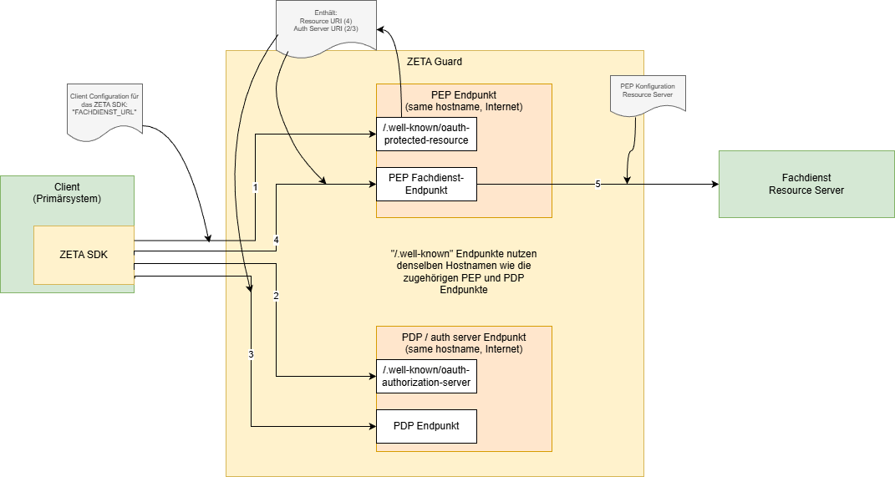
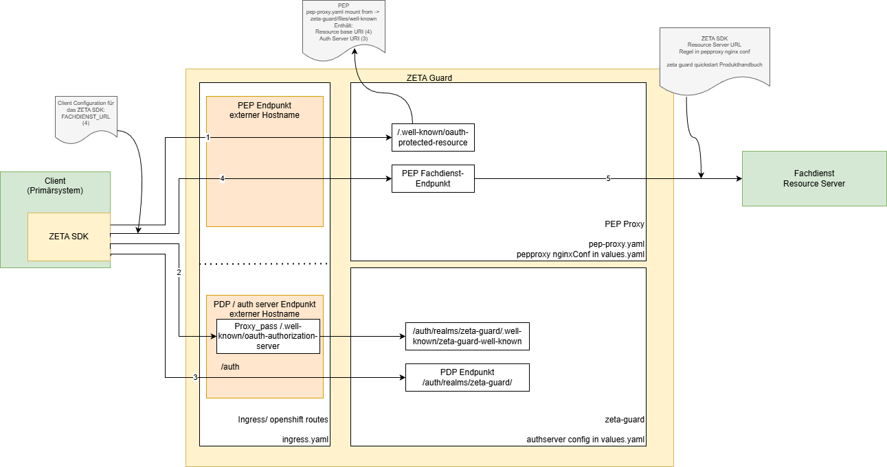
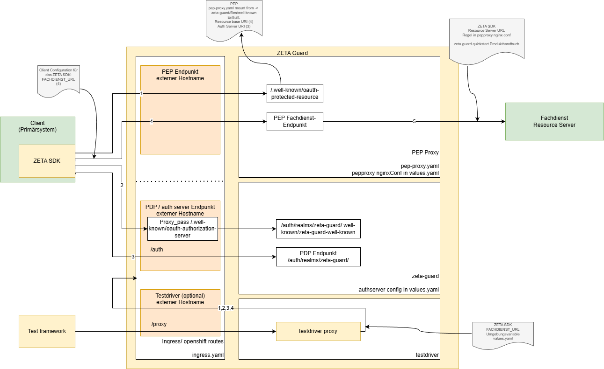
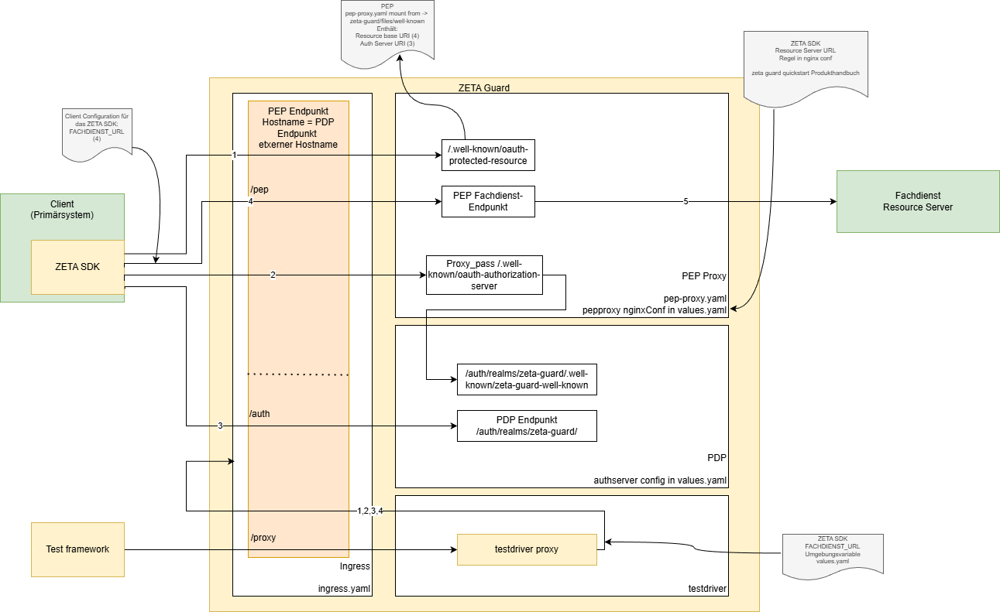
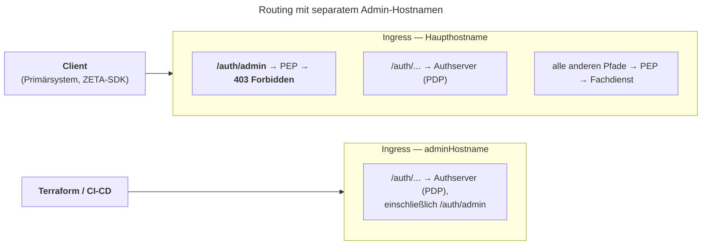

# Konfigurationshinweise

Die Konfiguration des ZETA-Guard umfasst viele Einzelpunkte. Dieses Dokument
stellt sie übergreifend dar, damit die Umsetzung verständlich bleibt.

## Inhaltsverzeichnis

- [Request-Routing](#request-routing)
  - [Abstrakte Sicht](#abstrakte-sicht)
  - [Konkrete Konfiguration](#konkrete-konfiguration)
  - [Auslieferungsstand](#auslieferungsstand)
    - [Variante mit separatem Admin-Hostnamen](#variante-mit-separatem-admin-hostnamen)

## Request-Routing

Der Client nutzt grundsätzlich vier Endpunkte am ZETA-Guard, die sich auf
zwei Hostnamen verteilen.

Die folgenden Hinweise zeigen die Abhängigkeiten zwischen den einzelnen
Konfigurationen und helfen so, sie korrekt zu setzen.

### Abstrakte Sicht

Die vier Endpunkte sind:

1. Well-Known-Datei des PEP
2. PEP-Endpunkt für Zugriffe auf den Fachdienst (inkl. `/ASL`-Pfad)
3. Well-Known-Datei des PDP
4. PDP-Endpunkte für Nonce, Token, Registrierung etc.

Das folgende Diagramm zeigt eine Übersicht.

Hierbei ist zu beachten, dass der Client (das SDK) mit einer einzigen
URL beginnt, der Fachdienst-URL. Er ersetzt deren Pfad durch den Pfad der
Well-Known-Datei und findet so die Datei.

In der Well-Known-Datei des PEP steht wiederum die URL des Authorization
Servers. Deren Hostname plus Well-Known-Pfad ergibt die Well-Known-Datei des
Authorization Servers. Dort stehen schließlich die URLs der einzelnen Endpunkte
(Nonce, Token, …).

### Konkrete Konfiguration

Das folgende Diagramm zeigt, wie die Konfiguration des ZETA-Guard
umgesetzt werden kann, um in Produktion mit den beiden Hostnamen die vier
Endpunkte aufzubauen.

Das folgende Diagramm zeigt einen Ingress, der die beiden Hostnamen abbildet und
die verschiedenen Pfade auf die Endpunkte von PEP und PDP routet. Die weißen
Boxen stehen für konkrete Komponenten bzw. Deployments in Kubernetes, die
hellorangen für die beiden externen Hostnamen, die geroutet werden müssen. In
den Komponenten stehen jeweils die wesentlichen Konfigurationsdateien.

In einem OpenShift-Umfeld wird der Ingress mit TLS-Konfiguration verwendet;
der OpenShift-Ingress-to-Route-Controller erzeugt daraus automatisch
edge-terminated Routes
(siehe [OpenShift-Kompatibilität](../Anleitungen/ZETA_OpenShift_Kompatibilität.md)).

Für ein Testsystem kann zusätzlich der Testdriver mit genutzt werden, der nur
für Testsysteme (optional) vorgesehen ist. In Produktion darf dieser nicht
installiert werden.

Schwierig ist dabei, dass die Well-Known-Datei von Keycloak (PDP) nicht unter
dem Root-Pfad liegt, sondern in einem Unterpfad, den der Ingress umsetzt.

### Auslieferungsstand

In der aktuellen Version sieht die Installation die Nutzung des ZETA-Guard
unter einem einzigen Hostnamen vor.

> **Die folgende Abbildung zeigt die Variante *ohne* `authserver.adminHostname`.**
> Wird ein separater Admin-Hostname konfiguriert, kommt ein zweiter Hostname
> hinzu und der Pfad `/auth/admin` wird auf dem Haupthostnamen gesperrt — siehe
> [Variante mit separatem Admin-Hostnamen](#variante-mit-separatem-admin-hostnamen).

Hierbei ist zu beachten, dass der Ingress

- die Pfade unter `/proxy` auf den Testdriver routet; dieser schneidet den Pfad
  `/proxy` bei der Weiterleitung an den PEP ab.
- die Pfade unter `/auth` auf Keycloak routet,
- alle anderen Pfade auf das PEP-Modul routet, das diese dann entsprechend
  der Konfiguration zum Fachdienst weiterleitet. Hinweis: In den
  Konfigurationsbeispielen, auf die auch der Testdriver abgestimmt ist, betrifft
  dies insbesondere die Pfade unter `/pep`. Diese werden zum Fachdienst durch
  das PEP-Modul geroutet; bei der Weiterleitung wird dort der Pfad `/pep`
  abgeschnitten.
- der PEP HTTP Proxy die Pfad-Umsetzung für die Well-Known-Datei des
  Auth-Servers übernimmt. Das ändert sich in späteren Releases: Die Umsetzung
  wandert in den Ingress.

Ein Aufruf durch den Test erfolgt dann wie folgt (anhand des VSDM als Beispiel):

1. Client ruft `https://<testdriver-host>/proxy/vsdservice....`. Dadurch wird
   der Testdriver angesprochen. Dieser ruft dann in dieser Reihenfolge (unter
   der Annahme, dass kein Access-Token vorhanden ist) die folgenden URLs auf,
   wobei der `pep-host` aus der Konfiguration `FACHDIENST_URL` stammt:
2. Testdriver ruft `https://<pep-host>/.well-known/oauth-protected-resource` zum
   Lesen der Well-Known-Datei `oauth-protected-resource` auf.
   Diese Datei enthält die URL des Authorization Servers (des PDP); daraus
   stammt der `pdp-host` für die folgenden Aufrufe.
3. Testdriver ruft `https://<pdp-host>/.well-known/oauth-authorization-server`
   zum Lesen der Well-Known-Datei des PDP.
4. Testdriver ruft mehrere Endpunkte unter `https://<pdp-host>/realms/...` auf
   (Nonce, Registration, Authentication; Endpunkte siehe Well-Known-Datei des
   PEP)
5. Testdriver ruft `<FACHDIENST_URL>/vsdservice....`, wobei die `FACHDIENST_URL`
   um den Pfad des ursprünglichen Requests ergänzt wird. Hier lautet sie
   `https://<pep-host>/pep/`, sodass am Ende der PEP-Endpunkt aufgerufen wird.
6. PEP ruft den Fachdienst mit `<fachdienst-url>/vsdservice...` auf, da der
   Ingress das Pfad-Präfix `/pep` entfernt. Die `fachdienst-url` stammt aus der
   pepproxy-Konfiguration in den Helm-Charts.

#### Variante mit separatem Admin-Hostnamen

Wird `authserver.adminHostname` gesetzt, verteilt sich die Installation auf zwei
Hostnamen. Das Routing der fachlichen Pfade bleibt dabei **unverändert** — die
oben beschriebene Abbildung gilt weiter. Es kommen genau zwei Dinge hinzu: der
Pfad `/auth/admin` wird auf dem Haupthostnamen gesperrt und die Admin-API wird
über einen zweiten Hostnamen erreichbar.

```mermaid
---
title: Routing mit separatem Admin-Hostnamen
---
flowchart LR
    Client["`**Client**
    (Primärsystem, ZETA-SDK)`"]
    Runner["`**Terraform / CI-CD**`"]

    subgraph Pub["`Ingress — Haupthostname`"]
        direction TB
        pa["`**/auth/admin** → PEP → **403 Forbidden**`"]
        pb["`/auth/... → Authserver (PDP)`"]
        pc["`alle anderen Pfade → PEP → Fachdienst`"]
    end

    subgraph Adm["`Ingress — adminHostname`"]
        aa["`/auth/... → Authserver (PDP),
        einschließlich /auth/admin`"]
    end

    Client --> Pub
    Runner --> Adm
```

Im Vergleich zum Auslieferungsstand:

|                                 | ohne `adminHostname`       | mit `adminHostname`                                |
|---------------------------------|----------------------------|----------------------------------------------------|
| `/auth/**` am Haupthostnamen    | Ingress → Authserver       | Ingress → Authserver (unverändert)                 |
| `/auth/admin` am Haupthostnamen | erreichbar                 | Ingress → PEP → `403`                              |
| Zweiter Hostname                | nein                       | ja, mit eigenem Ingress und eigenem TLS-Zertifikat |
| Zugang zur Admin-API            | über den Haupthostnamen    | ausschließlich über `adminHostname`                |
| Alle übrigen Pfade              | Ingress → PEP → Fachdienst | unverändert                                        |

Wichtig für das Verständnis: Der Discovery-Flow des Clients funktioniert in
beiden Varianten identisch und immer über den Haupthostnamen. Die
client-relevanten PDP-Endpunkte (Well-Known, Nonce, Token, Registration, JWKS)
müssen unter der öffentlichen FQDN von außen erreichbar bleiben — ein
vollständig internes Deployment des Authservers ist nicht möglich. Trennen lässt
sich ausschließlich die Admin-API.

Die Konfiguration, die Wirkungsweise der Sperre und ihre Grenzen beschreibt die
[Helm-Chart-Referenz – Admin-API-Absicherung](Referenz_des_Helm_Charts.md#admin-api-absicherung).
Für die Well-Known-Pfade in dieser Variante siehe
[Konfiguration der Well-Known-Endpunkte](Konfiguration_der_Well-Known_Endpunkte.md).

<!-- Quelle der Abbildung oben: ../drawio/zeta-guard-config-impl.drawio -->
