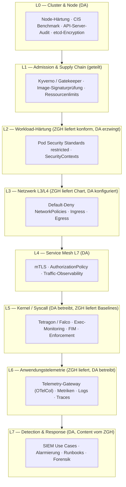
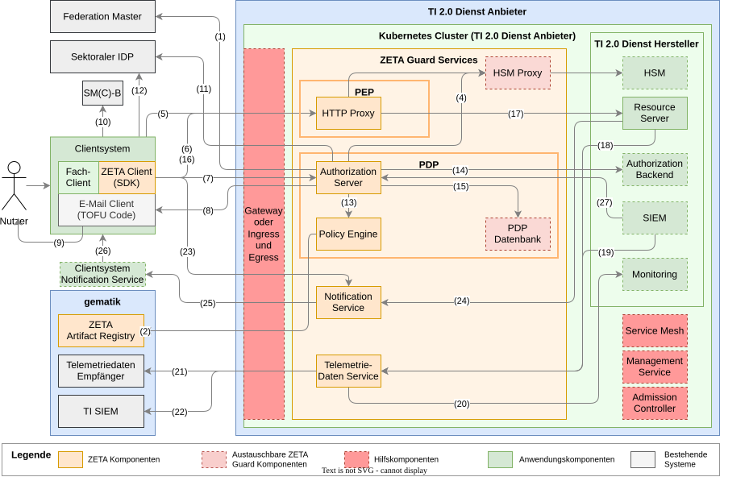
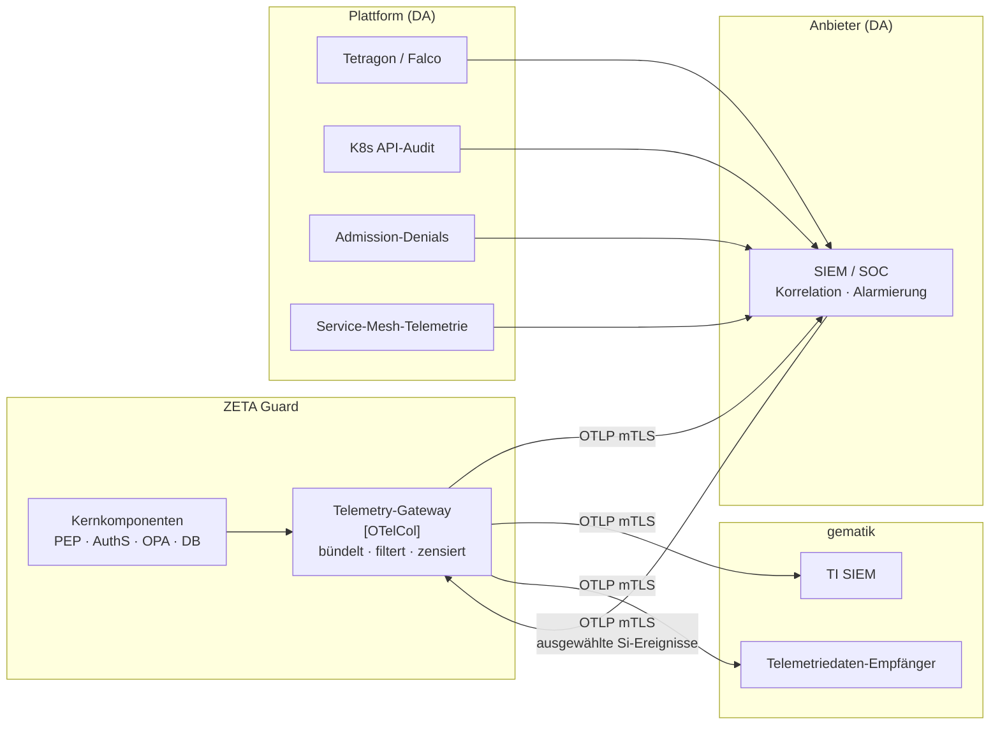

# Konzept: Laufzeitüberwachung für TI 2.0 Dienste mit ZETA Guard

## 1. Ziel und Abgrenzung

Dieses Konzept beschreibt, wie die **Integrität, Vertraulichkeit und Verfügbarkeit
der ZETA Guard Microservices zur Laufzeit** in einer Kubernetes-Infrastruktur
überwacht und durchgesetzt werden. Es ergänzt die Härtungsmaßnahmen des Deployments
um **Erkennung (Detection)** und **Reaktion (Response)** und ordnet jede Maßnahme
einer verantwortlichen Rolle zu.

Laufzeitüberwachung wird hier in vier Wirkstufen verstanden:

| Stufe | Frage | Beispiel |
| --- | --- | --- |
| **Prävention** | Was darf gar nicht erst starten? | Pod Security Standards, Admission Control |
| **Isolation** | Was darf mit wem sprechen? | NetworkPolicies, Service Mesh, RBAC |
| **Detektion** | Was passiert gerade wirklich? | Tetragon/Falco, K8s-Audit, Telemetrie |
| **Reaktion** | Was tun wir damit? | SIEM-Use-Cases, Alarmierung, Runbooks, Quarantäne |

Eine Maßnahme ohne Detektion ist unvollständig, und eine Detektion ohne definierte
Reaktion erzeugt lediglich Log-Volumen.

### 1.1 Scope

**Im Scope** (ZETA Guard Kernkomponenten, siehe
[Komponentenübersicht](Komponentenuebersicht.md)):

* PEP — HTTP Proxy (nginx)
* PDP — Authorization Server (Keycloak), Policy Engine (OPA), PDP Datenbank
  (PostgreSQL), PDP Cache (Infinispan)
* Telemetriedaten Service / Telemetry-Gateway (OpenTelemetry Collector)
* Notification Service
* Provisioning Processor (Init-Container der Kernkomponenten)

**Im Scope als Hilfskomponenten** (austauschbar, siehe
[Prüfliste Optionale Komponenten](Pruefliste_Optionale_Komponenten.md)):
Ingress Controller, Service Mesh, Management Service (Argo CD), Local Artifact
Registry Cache, Egress Gateway.

**Außerhalb des ZETA Guard, aber im selben Cluster und damit im
Überwachungsscope des Betreibers:**

* **HSM Proxy** — wird vom **Hersteller des TI 2.0 Dienstes** bereitgestellt
* Resource Server und Application Authorization Backend des Fachdienstes

**Nicht im Scope:** ZETA Client / ZETA SDK (siehe
[Sicherheitsanforderungen Client-Hersteller](../SicherheitsanforderungenClientHersteller.md)),
Netzwerkinfrastruktur unterhalb des Clusters.

### 1.2 Verhältnis zu bestehenden Dokumenten

Dieses Konzept konsolidiert und erweitert:

* [Sicherheitsanforderungen an den Betreiber des ZETA-Guard](../SicherheitsanforderungenZETAGuardBetreiber.md)
  (OWASP Top 10 Kubernetes, A_28961)
* [Wie Sie Egress-NetworkPolicies konfigurieren](../Anleitungen/Wie_Sie_Egress_NetworkPolicies_konfigurieren.md)
* [Wie Sie ein Observability-Backend anschließen](../Anleitungen/Wie_Sie_ein_Observability-Backend_an_ZETA-Guard_anschließen.md)
* [Referenz des Helm Charts](Referenz_des_Helm_Charts.md) (Security Contexts, ServiceAccounts, Cosign-Vertrauenskette)

## 2. Rollenmodell und Grundprinzip der Aufgabenteilung

| Kürzel | Rolle | Liefergegenstand |
| --- | --- | --- |
| **ZGH** | **ZETA Guard Hersteller** (gematik) | Helm Chart, Container-Images, OPA-Policies, Terraform-Templates, Telemetrie-Semantik, Referenz-Policies, Runbooks, Nachweisdokumente |
| **DH** | **TI 2.0 Dienst-Hersteller** | Resource Server, Application Authorization Backend, **HSM Proxy**, Integration in den ZETA Guard |
| **DA** | **TI 2.0 Dienst-Anbieter / Betreiber** | Kubernetes-Plattform, Betrieb, Konfiguration, SIEM/SOC, Incident Response, Zulassungsnachweise |

### 2.1 Trennlinie

Die Aufgabenteilung folgt einem einzigen Prinzip:

> **Der Hersteller liefert das Wissen darüber, was normal ist.
> Der Betreiber liefert die Plattform, die Abweichungen erkennt und darauf reagiert.**

Konkret bedeutet das:

* **Der ZGH kann und muss liefern**, was ohne Kenntnis des Anwendungsinnenlebens
  nicht erstellbar ist: konforme Manifeste, die **Kommunikationsmatrix**, die
  **Prozess- und Dateipfad-Baselines** je Container, die **Telemetrie-Semantik**
  (welches Event bedeutet was), signierte Artefakte und Referenz-Policies.
* **Der DA kann und muss liefern**, was ohne Kenntnis der Betriebsumgebung nicht
  erstellbar ist: Cluster-Härtung, Enforcement-Werkzeuge, IP-Adressen und
  Netzsegmente, SIEM-Anbindung, Alarmierungswege, Bereitschaft und Reaktion.
* **Der DH liefert dasselbe wie der ZGH — für seine eigenen Komponenten**,
  insbesondere für den **HSM Proxy** und den Resource Server. Andernfalls entsteht
  im selben Cluster eine nicht überwachte Zone neben einem hochgradig überwachten
  ZETA Guard.

Eine häufige Fehlannahme ist, Laufzeitüberwachung sei reine Betreiberaufgabe. Das
trifft für die *Werkzeuge* zu, nicht für die *Regeln*: Nur der Hersteller weiß, dass
im PEP-Container niemals eine Shell startet und dass `/etc/nginx` zur Laufzeit
niemals beschrieben wird. Ohne diese Baselines betreibt der DA ein Werkzeug ohne
Regelwerk und erzeugt entweder Blindheit oder Fehlalarme.

## 3. Schichtenmodell



Die Schichten sind **kumulativ, nicht alternativ**. Insbesondere ersetzt ein
Service Mesh keine NetworkPolicies (ein kompromittierter Sidecar-Bypass umgeht L4,
nicht L3), und Tetragon ersetzt keine Pod Security Standards (Detektion nach dem
Start ist teurer als Verhinderung des Starts).

## 4. Maßnahmen im Detail

### 4.1 Pod Security Standards (PSS)

**Ziel:** Erzwingen minimaler Workload-Privilegien auf Namespace-Ebene.

Für alle ZETA Guard Namespaces wird die Stufe **`restricted`** per Namespace-Label
durchgesetzt:

```yaml
apiVersion: v1
kind: Namespace
metadata:
  name: zeta-guard
  labels:
    pod-security.kubernetes.io/enforce: restricted
    pod-security.kubernetes.io/enforce-version: latest
    pod-security.kubernetes.io/audit: restricted
    pod-security.kubernetes.io/warn: restricted
```

Damit werden erzwungen: `runAsNonRoot: true`, `privileged: false`,
`allowPrivilegeEscalation: false`, `capabilities.drop: ["ALL"]`,
`seccompProfile.type: RuntimeDefault`, kein `hostNetwork`/`hostPID`/`hostIPC`,
keine `hostPath`-Volumes.

**Stand im ZETA Guard:** Das Helm Chart setzt diese Werte bereits als Defaults
(siehe [Security Contexts](Referenz_des_Helm_Charts.md#security-contexts)). Die
Aktivierung per Namespace-Label ist im
[KIND-Setup](../Anleitungen/Wie_Sie_den_Cluster_lokal_mit_KIND_aufsetzen.md)
dokumentiert.

**Präzisierung zu `readOnlyRootFilesystem`:** Dieses Feld ist nicht Bestandteil
des PSS-Profils `restricted`, sondern eine darüber hinausgehende Härtung. Im ZETA
Guard ist es für Authserver und dessen Init-Container auf `true` gesetzt, für
Infinispan und den Provisioning Processor derzeit auf `false`. Es muss daher per
**Admission Policy** (Abschnitt 4.2) erzwungen und für die verbleibenden Workloads
gezielt nachgezogen werden — die pauschale Aussage „PSS erzwingt
`readOnlyRootFilesystem`" ist technisch unzutreffend.

**OpenShift:** Dort gilt statt PSS die `restricted-v2` Security Context Constraint.
`runAsUser` darf nicht gesetzt werden, siehe
[ZETA OpenShift-Kompatibilität](../Anleitungen/ZETA_OpenShift_Kompatibilität.md).

| Rolle | Aufgabe |
| --- | --- |
| **ZGH** | Liefert `restricted`-konforme Manifeste und Defaults; hält `readOnlyRootFilesystem: true` als Zielzustand für alle Container; dokumentiert notwendige `emptyDir`-Schreibpfade |
| **DH** | Liefert HSM Proxy und Resource Server ebenfalls `restricted`-konform; begründet und dokumentiert jede Ausnahme (z. B. Device-Zugriff des HSM Proxy) |
| **DA** | Setzt Namespace-Labels; verweigert Ausnahmen ohne dokumentierte Begründung; prüft die Wirksamkeit periodisch |

### 4.2 Admission Control

**Ziel:** Nicht-konforme Ressourcen erreichen die Cluster-Datenbank gar nicht erst.

Als Policy-Engine wird **Kyverno** oder **OPA Gatekeeper** eingesetzt. Kyverno wird
empfohlen, weil es Image-Signaturverifikation (`verifyImages`) nativ beherrscht und
keine zweite Policy-Sprache neben Rego einführt — Rego bleibt im ZETA Guard für die
fachliche Autorisierung in der Policy Engine reserviert.

**Mindest-Policy-Set:**

| Policy | Wirkung | Priorität |
| --- | --- | --- |
| `verify-image-signatures` | Nur Images mit gültiger gematik-cosign-Signatur | MUSS |
| `require-resources` | `resources.requests` und `resources.limits` vorhanden | MUSS |
| `disallow-default-serviceaccount` | Kein Pod mit `default`-ServiceAccount | MUSS |
| `require-readonly-rootfs` | `readOnlyRootFilesystem: true` | MUSS |
| `disallow-latest-tag` / `require-digest` | Images per Digest referenziert, nicht per mutablem Tag | MUSS |
| `restrict-image-registries` | Nur Anbieter-Registry-Cache und gematik-Registry als Quelle | MUSS |
| `disable-automount-sa-token` | `automountServiceAccountToken: false`, außer bei Bedarf | SOLL |
| `require-probes` | Liveness-/Readiness-Probes vorhanden | SOLL |
| `require-pdb` | PodDisruptionBudget für HA-Komponenten | SOLL |
| `restrict-nodeport-loadbalancer` | Keine Umgehung des Ingress via NodePort | SOLL |

**Zur Image-Signaturprüfung:** Im ZETA Guard wird die cosign-Vertrauenskette der
gematik bereits als Secret (`imageTrustCertchainSecretRef`) bereitgestellt und vom
Provisioning Processor genutzt, um das **Provisioning-Daten-Image** beim Pod-Start
zu verifizieren. Dieselbe Vertrauenskette ist der Anker für die
Admission-Verifikation der **Komponenten-Images**. Wichtig ist der Hinweis in
[Wie Sie eine eigene OCI Registry verwenden](../Anleitungen/Wie_Sie_eine_eigene_OCI_Registry_verwenden.md):
beim Spiegeln in den Registry-Cache muss `cosign save`/`load` verwendet werden,
sonst gehen die `.sig`-Artefakte verloren und die Admission-Policy blockiert das
gesamte Deployment.

**Rollout-Reihenfolge (verbindlich):** Jede neue Policy durchläuft
`Audit` → `Warn` → `Enforce`. Eine Policy direkt im Enforce-Modus einzuführen ist
der häufigste Weg, einen produktiven Dienst durch eine Sicherheitsmaßnahme
auszufallen zu lassen.

**Verfügbarkeitsrisiko:** Ein Validating Webhook mit `failurePolicy: Fail` macht die
Policy-Engine zur Verfügbarkeitsabhängigkeit des gesamten Clusters. Die Engine
selbst MUSS daher hochverfügbar betrieben werden, und ihr eigener Namespace MUSS
über `namespaceSelector` von der Prüfung ausgenommen sein.

| Rolle | Aufgabe |
| --- | --- |
| **ZGH** | Liefert Referenz-Policies als YAML im Repository; liefert signierte Images inkl. SBOM; stellt Trust-Anchor und Signatur-Identität bereit; dokumentiert, welche Policies mit dem Chart kompatibel sind |
| **DH** | Signiert eigene Images (HSM Proxy, Resource Server) mit nachweisbarer Identität; passt Policies auf eigene Registry an |
| **DA** | Betreibt die Policy-Engine HA; führt Policies nach Audit→Warn→Enforce ein; überwacht Admission-Denials als Sicherheitsereignis; verantwortet die Ausnahmeverwaltung |

### 4.3 Kommunikationsmatrix und Network Policies (L3/L4)

**Ziel:** Default-Deny in jedem Namespace, explizite Freigabe nur für
nachgewiesene Kommunikationsbeziehungen. Grundlage dafür ist eine normative
Kommunikationsmatrix — ohne sie entstehen entweder zu weite Policies
(wirkungslos) oder zu enge (Ausfall).

#### 4.3.1 Normative Kommunikationsmatrix

Die folgende Matrix ist aus der ZETA-Architekturübersicht abgeleitet. Die Spalte
**Nr.** verweist auf die Kantennummerierung der Abbildung; die Matrix ist damit
zugleich deren Legende.



Lesart der Matrix:

* **Quelle** ist immer der **Initiator des Verbindungsaufbaus**, nicht die Richtung
  des Datenflusses. Für NetworkPolicies und `AuthorizationPolicy` ist ausschließlich
  der Verbindungsaufbau maßgeblich.
* **Ports** sind die Zielports der Zielkomponente in der Chart-Standardkonfiguration.
  Weichen Werte in der Betriebsumgebung ab, sind sie beim Ableiten der Policies
  anzupassen. Der DA MUSS die Ports gegen das ausgerollte Chart verifizieren.
* **n. i. B.** = notwendige Beziehung, die in der Abbildung nicht dargestellt ist
  (siehe Hinweis am Ende des Abschnitts).
* **o. Nr.** = in der Abbildung dargestellt, aber unnummeriert.
* Jede Zeile ist eine **Freigabe**. Was nicht in der Matrix steht, DARF NICHT
  möglich sein — das ist der Prüfgegenstand des Negativtests (Abschnitt 4.3.3).

##### A — Eingehend von außen (über Gateway / Ingress Controller)

Alle Zeilen dieser Gruppe MÜSSEN über den Ingress Controller bzw. das Gateway
laufen. Ein direkter Zugriff von außen auf einen Pod des ZETA Guard unter Umgehung
des Gateways DARF NICHT möglich sein.

| Nr. | Quelle | Ziel | Protokoll / Port | Zweck |
| --- | --- | --- | --- | --- |
| (5) | Clientsystem (Fach-Client) | PEP HTTP Proxy | HTTPS 443 → 8080 | Fachlicher Ressourcenaufruf, durch den ZETA Client vermittelt |
| (6) | ZETA Client (SDK) | PEP HTTP Proxy | HTTPS 443 → 8080 | Service Discovery: `GET /.well-known/oauth-protected-resource` (RFC 9728) |
| (16) | ZETA Client (SDK) | PEP HTTP Proxy | HTTPS 443 → 8080 | Ressourcenanfrage mit DPoP-gebundenem Access Token |
| (7) | ZETA Client (SDK) | Authorization Server | HTTPS 443 → 8443 | OAuth 2.0: Discovery, DCR, Nonce, PAR, Token Exchange, JWKS |
| (23) | ZETA Client (SDK) | Notification Service | HTTPS 443 | Registrierung und Abruf von Benachrichtigungen (TI-M) |

##### B — Innerhalb des Clusters (Ost-West)

| Nr. | Quelle | Ziel | Protokoll / Port | Zweck |
| --- | --- | --- | --- | --- |
| (17) | PEP HTTP Proxy | Resource Server | HTTPS, Port fachdienstspezifisch | Weiterleitung der autorisierten Anfrage (`proxy_pass`) |
| (4) | PEP HTTP Proxy | HSM Proxy | gRPC 50051 | Schlüsseloperationen (TLS-Terminierung, Signaturprüfung) |
| o. Nr. | Authorization Server | HSM Proxy | gRPC 50051 | Token-Signatur (`HSM_PROXY_TOKEN_KEY_ID`) und Pod-TLS-Schlüssel |
| (13) | Authorization Server | Policy Engine (OPA) | HTTP 8181 | Policy-Auswertung bei Tokenausstellung (`POST /v1/data/policies/zeta/authz/decision`) |
| (15) | Authorization Server | PDP Datenbank (PostgreSQL) | TCP 5432 | Persistenz von Realm-, Client- und Sitzungsdaten |
| (14) | Authorization Server | Authorization Backend | HTTPS, Port dienstspezifisch | Abruf fachlicher Autorisierungsattribute |
| (24) | Resource Server | Notification Service | HTTPS | Auslösen fachlicher Benachrichtigungen |
| n. i. B. | Resource Server (z. B. DiPag) | Authorization Server, dedizierter mTLS-Endpunkt | HTTPS mit Client-Zertifikat (mTLS) | Abfrage der bei der TOFU-Registrierung hinterlegten E-Mail-Adresse des Nutzers |
| (18) | Resource Server | Telemetriedaten Service | OTLP/gRPC 4317, OTLP/HTTP 4318 | Telemetrie des Fachdienstes |
| (20) | Telemetriedaten Service | Monitoring (Anbieter) | OTLP bzw. Prometheus-Scrape | Metriken, Logs, Traces an das Anbieter-Backend |
| (27) | SIEM (Anbieter) | Authorization Server | HTTPS 8443 | Rückführung von Risiko- und Anomaliesignalen in die Autorisierungsentscheidung |
| (19) | SIEM (Anbieter) | Telemetriedaten Service | OTLP/gRPC 4317, mTLS | Einspeisung ausgewählter, im Anbieter-SIEM erkannter Sicherheitsereignisse zur Weiterleitung an das TI SIEM (22) — siehe Hinweis 1 |
| n. i. B. | Telemetriedaten Service | SIEM (Anbieter) | OTLP/gRPC 4317, mTLS | Ausleitung der ZETA-Guard-Telemetrie an das SIEM des Anbieters (Abschnitt 6) |
| (3) | Policy Engine (OPA) | Local Artifact Registry Cache | HTTPS 443 | Abruf signierter OPA-Policy-Bundles |
| n. i. B. | PEP, Authorization Server, OPA, OPA-Simulation, Notification Service | Telemetriedaten Service | OTLP/gRPC 4317, OTLP/HTTP 4318 | Telemetrie der Kernkomponenten; das Gateway ist laut Abschnitt 6 der **einzige** Ausleitungspunkt |
| n. i. B. | Authorization Server | PDP Cache (Infinispan) | TCP 11222, Cluster-Discovery 7800 | Verteilter Sitzungscache des Authorization Servers |
| n. i. B. | Provisioning Processor (Init-Container von Authserver, PEP-Proxy, OPA, OPA-Simulation) | Local Artifact Registry Cache | HTTPS 443 | Abruf des signierten Provisioning-Images bei jedem Pod-Start |
| n. i. B. | alle Pods | `kube-dns` / CoreDNS | UDP 53, TCP 53 | Namensauflösung |

##### C — Ausgehend aus dem Cluster (Egress)

Die Spalte **Egress-Kategorie** verweist auf die Konfigurationsschlüssel des Helm
Charts, siehe
[Wie Sie Egress-NetworkPolicies konfigurieren](../Anleitungen/Wie_Sie_Egress_NetworkPolicies_konfigurieren.md).

| Nr. | Quelle | Ziel | Protokoll / Port | Zweck | Egress-Kategorie |
| --- | --- | --- | --- | --- | --- |
| (1) | Authorization Server | Federation Master (gematik) | HTTPS 443 | Entity Statements, Validierung der Trust Chain der OIDC-Föderation | *(fehlt, siehe Abschnitt 4.3.3)* |
| (11) | Authorization Server | Sektoraler IDP | HTTPS 443 | OIDC: Entity Statement, PAR, Token-Endpunkt, JWKS | *(fehlt, siehe Abschnitt 4.3.3)* |
| (8) | Authorization Server | Mail Relay (Zustellung an den E-Mail Client des Nutzers) | SMTPS 465 bzw. STARTTLS 587 | Versand des TOFU-OTP | *(fehlt, siehe Abschnitt 4.3.3)* |
| (2) | Local Artifact Registry Cache | ZETA Artifact Registry (gematik) | HTTPS 443 | OCI-Images, OPA-Bundles, cosign-Signaturartefakte | `artifactRegistry` |
| (21) | Telemetriedaten Service | Telemetriedaten-Empfänger (gematik) | OTLP/gRPC 4317, mTLS | Telemetrieausleitung an die gematik | `telemetry` |
| (22) | Telemetriedaten Service | TI SIEM (gematik) | OTLP/gRPC 4317, mTLS | Sicherheitsereignisse des ZETA Guard **und** die über (19) eingespeisten Ereignisse des Anbieter-SIEM | `siem` |
| (25) | Notification Service | Clientsystem Notification Service | HTTPS 443 | Push-Benachrichtigung an das Clientsystem | *(fehlt, siehe Abschnitt 4.3.3)* |
| o. Nr. | HSM Proxy | HSM | herstellerspezifisch (PKCS#11 über TCP) | Schlüsseloperationen; Freigabe verantwortet der **DH** | — |
| n. i. B. | Policy Engine (OPA), OPA-Simulation | PIP | HTTPS 443 | Quelle der OPA-Policy-Bundles | `pip` |
| n. i. B. | PEP HTTP Proxy | PoPP-Dienst | HTTPS 443 | Proof of Patient Presence | `popp` |
| n. i. B. | Authorization Server | OCSP-Responder **aller zugelassenen SMC-B-TSP** | HTTP 80, HTTPS 443 | Statusprüfung des SMC-B-Zertifikats bei der Validierung der SMC-B-Signatur | `ocspSmcbTsp` |
| n. i. B. | PEP HTTP Proxy | OCSP-/CRL-Responder | HTTP 80, HTTPS 443 | Zertifikatsstatusprüfung für TLS-Client-Zertifikate, TI-Komponenten-PKI und SMC-B | `ocspCabForum`, `ocspTiPki`, `ocspSmcbTsp` |
| n. i. B. | PEP HTTP Proxy | Anbieter-interne Resource Server | HTTPS | Fachdienst außerhalb des Clusters | `providerInternal.resourceServers` |
| n. i. B. | Telemetriedaten Service | Anbieter-internes Telemetriesystem | OTLP | Observability-Backend des Anbieters | `providerInternal.telemetrySystems` |
| n. i. B. | alle Kernkomponenten (Init-Container) | Anbieter-interne Artifact Registry | HTTPS 443 | gespiegelte Images und Bundles | `providerArtifactRegistry` |

> **SMC-B wird von mehreren TSP ausgegeben.** Der Authorization Server prüft bei
> der Validierung der SMC-B-Signatur den Status des Karten-Zertifikats per OCSP.
> Maßgeblich ist die OCSP-URL aus der AIA-Extension des jeweils vorgelegten
> Zertifikats — und die unterscheidet sich je ausgebendem TSP. `ocspSmcbTsp.ipBlocks`
> MUSS daher die Responder **aller** TSP enthalten, deren SMC-B der Dienst
> akzeptiert; eine einzelne `/32`-Adresse genügt nicht. Ein fehlender TSP
> äußert sich nicht als Netzwerkfehler, sondern als Autorisierungsablehnung für
> genau die Leistungserbringer dieses einen TSP — ein Fehlerbild, das im Betrieb
> schwer zu diagnostizieren ist. Die Liste der TSP ist bei jeder Änderung des
> TSP-Bestands nachzuziehen; Erreichbarkeit und Antwortverhalten jedes Responders
> sind zu überwachen (Abschnitt 5.4).

##### D — Clientseitig, außerhalb des Betreiber-Scopes (informativ)

Diese Beziehungen sind für die Vollständigkeit der Abbildung aufgeführt. Sie sind
**nicht** durch NetworkPolicies des Betreibers durchsetzbar; die Anforderungen
stehen in den
[Sicherheitsanforderungen Client-Hersteller](../SicherheitsanforderungenClientHersteller.md).

| Nr. | Quelle | Ziel | Zweck |
| --- | --- | --- | --- |
| o. Nr. | Nutzer | Clientsystem | Bedienung der Fachanwendung |
| (10) | Clientsystem | SM(C)-B | Karten- und Signaturoperationen (lokal, PC/SC) |
| (12) | Clientsystem | Sektoraler IDP | Authentisierung des Nutzers |
| (9) | E-Mail Client | Nutzer | Anzeige des TOFU-OTP |
| (26) | Clientsystem Notification Service | Clientsystem | Zustellung der Benachrichtigung |

##### E — Explizit unzulässige Beziehungen (Negativliste)

Diese Liste ist das Gegenstück zur Freigabeliste und der Prüfgegenstand des
Wirksamkeitsnachweises. Jede Zeile MUSS im Negativtest nachweislich scheitern.

| # | Unzulässige Beziehung | Begründung |
| --- | --- | --- |
| N1 | Beliebiger Pod oder externer Aufrufer → Authorization Server, außer über den Ingress Controller (7) und außer (27) | Umgehung von Rate Limiting, TLS-Terminierung und Gateway-Kontrollen |
| N2 | Beliebiger Pod → Policy Engine (OPA), außer Authorization Server (13) | OPA ist nicht authentifiziert; direkter Zugriff erlaubt beliebige Policy-Auswertung und -Auskunft |
| N3 | Beliebiger Pod → PDP Datenbank oder PDP Cache, außer Authorization Server (15) | Direkter Zugriff auf Sitzungs- und Realm-Daten |
| N4 | Beliebiger Pod → Resource Server, außer PEP HTTP Proxy (17) | **Umgehung des Policy Enforcement Point** — die sicherheitsrelevanteste Beziehung der gesamten Matrix |
| N5 | Beliebiger Pod → HSM Proxy, außer PEP HTTP Proxy (4) und Authorization Server (o. Nr.) | Unkontrollierte Nutzung von Schlüsselmaterial |
| N6 | Resource Server oder Authorization Backend → PEP, Authorization Server, OPA, PDP Datenbank | Es gibt keine Rückrichtung aus dem Fachdienst in den ZETA Guard außer (24), (18) und dem dedizierten mTLS-Endpunkt für die TOFU-E-Mail-Abfrage. Insbesondere DÜRFEN die übrigen Endpunkte des Authorization Servers vom Resource Server NICHT erreichbar sein |
| N7 | Kernkomponenten → SIEM, Monitoring oder Telemetriedaten-Empfänger unter Umgehung des Telemetriedaten Service | Abschnitt 6: das Gateway ist der einzige Ausleitungspunkt für Telemetrie |
| N8 | Egress aus dem ZETA-Guard-Namespace zu einem Ziel außerhalb der Kategorien der Gruppe C | Exfiltrationspfad; erzeugt Use-Case 3 aus Abschnitt 7 |
| N9 | Zugriff auf die Kubernetes-API aus einem Kernkomponenten-Pod | Kein Kernkomponenten-Pod benötigt API-Zugriff, siehe Abschnitt 4.7 |
| N10 | Beliebiger Pod oder externes System → Annahme-Endpunkt des Telemetriedaten Service für eingespeiste Sicherheitsereignisse, außer dem SIEM des Anbieters (19) | Der Endpunkt leitet nach außen an das TI SIEM weiter; wer ihn erreicht, kann Ereignisse in gematik-Systeme einschleusen |

##### Hinweise zur Ableitung aus der Abbildung

Zwei Punkte verdienen beim Lesen der Matrix besondere Beachtung:

1. **Kante (19) ist ein Weiterleitungspfad, kein Telemetrieexport.** Der Anbieter
   speist ausgewählte, in seinem eigenen SIEM erkannte Sicherheitsereignisse in
   den Telemetriedaten Service ein; von dort werden sie über den ohnehin
   bestehenden, mTLS-authentisierten Pfad (22) an das TI SIEM weitergegeben. Der
   Zweck ist, dem Anbieter-SIEM eine eigene Authentisierung und Autorisierung am
   zentralen SIEM zu ersparen. Der Telemetriedaten Service ist damit **nicht nur
   Ausleitungspunkt, sondern auch Annahmestelle** — die einzige Beziehung der
   Matrix, in der ein anbietereigenes System Daten in den ZETA Guard einliefert.
   Daraus folgen drei Festlegungen: der Annahme-Endpunkt MUSS auf einem eigenen
   Port liegen und mTLS mit Client-Zertifikat erzwingen; er DARF ausschließlich
   vom SIEM des Anbieters erreichbar sein (N10); und eingespeiste Ereignisse
   MÜSSEN als anbieterseitig erzeugt gekennzeichnet bleiben, damit sie im TI SIEM
   nicht als Ereignisse des ZETA Guard erscheinen.
   Da der Weiterleitungspfad über eine überwachte Komponente führt, ist er kein
   Ersatz für den direkten Weg des Anbieters in sein eigenes SOC (Abschnitt 6):
   die Erkennung bleibt anbieterseitig und unabhängig vom Gateway, nur die
   Meldung an die gematik nutzt diesen Pfad.
2. **In der Abbildung fehlende Beziehungen.** PDP Cache (Infinispan), DNS, der
   Telemetriepfad der Kernkomponenten, die OCSP-, PIP- und PoPP-Aufrufe sowie der
   Provisioning Processor sind betrieblich notwendig, in der Übersicht aber nicht
   dargestellt. Sie sind oben als `n. i. B.` geführt. Eine Kommunikationsmatrix, die
   nur die gezeichneten Kanten enthält, führt zu einem nicht startfähigen Deployment.

#### 4.3.2 Ableitung der NetworkPolicies

Aus der Matrix folgen die Manifeste mechanisch: jede Zeile der Gruppen A bis C wird
zu **zwei** Regeln — einer `egress`-Regel beim Initiator und einer `ingress`-Regel
beim Ziel. Bei Default-Deny in beide Richtungen genügt eine Seite nicht.

Die Beispiele verwenden den Namespace `zeta-guard` für die ZETA Guard Services, den
Namespace `fachdienst` für Resource Server, Authorization Backend und HSM Proxy sowie
die Label-Konvention `app: <workload>` des Charts. Namespace-Namen, Labels und Ports
sind gegen das ausgerollte Chart zu verifizieren.

##### Baustein 1 — Default-Deny in beide Richtungen und DNS

```yaml
apiVersion: networking.k8s.io/v1
kind: NetworkPolicy
metadata:
  name: default-deny-all
  namespace: zeta-guard
spec:
  podSelector: {}
  policyTypes: [Ingress, Egress]
---
apiVersion: networking.k8s.io/v1
kind: NetworkPolicy
metadata:
  name: allow-dns-egress            # Matrix B, "alle Pods -> CoreDNS"
  namespace: zeta-guard
spec:
  podSelector: {}
  policyTypes: [Egress]
  egress:
    - to:
        - namespaceSelector:
            matchLabels:
              kubernetes.io/metadata.name: kube-system
          podSelector:
            matchLabels:
              k8s-app: kube-dns
      ports:
        - protocol: UDP
          port: 53
        - protocol: TCP
          port: 53
```

##### Baustein 2 — PEP HTTP Proxy (Matrix A5, A6, A16 · B17, B4 · N4)

```yaml
apiVersion: networking.k8s.io/v1
kind: NetworkPolicy
metadata:
  name: pep-proxy
  namespace: zeta-guard
spec:
  podSelector:
    matchLabels:
      app: pep-proxy
  policyTypes: [Ingress, Egress]
  ingress:
    # (5) (6) (16) - ausschliesslich ueber den Ingress Controller, nicht per CIDR
    - from:
        - namespaceSelector:
            matchLabels:
              kubernetes.io/metadata.name: ingress-nginx
          podSelector:
            matchLabels:
              app.kubernetes.io/name: ingress-nginx
      ports:
        - protocol: TCP
          port: 8080
  egress:
    # (17) einziger erlaubter Pfad in den Fachdienst-Namespace
    - to:
        - namespaceSelector:
            matchLabels:
              kubernetes.io/metadata.name: fachdienst
          podSelector:
            matchLabels:
              app: resource-server
      ports:
        - protocol: TCP
          port: 8443
    # (4) HSM Proxy
    - to:
        - namespaceSelector:
            matchLabels:
              kubernetes.io/metadata.name: fachdienst
          podSelector:
            matchLabels:
              app: hsm-proxy
      ports:
        - protocol: TCP
          port: 50051
    # Telemetrie (n. i. B.) - Abschnitt 6: einziger Ausleitungspunkt
    - to:
        - podSelector:
            matchLabels:
              app: telemetry-gateway
      ports:
        - protocol: TCP
          port: 4317
        - protocol: TCP
          port: 4318
    # Egress-Kategorien popp, ocsp*, providerInternal.resourceServers,
    # artifactRegistry, providerArtifactRegistry: ipBlocks aus den Chart-Values
```

##### Baustein 3 — Authorization Server (Matrix A7 · B13, B15, B14, B27, B-TOFU-Abfrage, B-o.Nr. · C1, C11, C8)

```yaml
apiVersion: networking.k8s.io/v1
kind: NetworkPolicy
metadata:
  name: authserver
  namespace: zeta-guard
spec:
  podSelector:
    matchLabels:
      app: authserver
  policyTypes: [Ingress, Egress]
  ingress:
    # (7)
    - from:
        - namespaceSelector:
            matchLabels:
              kubernetes.io/metadata.name: ingress-nginx
          podSelector:
            matchLabels:
              app.kubernetes.io/name: ingress-nginx
      ports:
        - protocol: TCP
          port: 8443
    # (27) Risikosignale des Anbieter-SIEM
    - from:
        - namespaceSelector:
            matchLabels:
              kubernetes.io/metadata.name: fachdienst
          podSelector:
            matchLabels:
              app: siem
      ports:
        - protocol: TCP
          port: 8443
    # TOFU-E-Mail-Abfrage durch den Resource Server (z. B. DiPag) - eigener
    # mTLS-Endpunkt auf eigenem Port; der Port ist gegen das Chart zu pruefen
    - from:
        - namespaceSelector:
            matchLabels:
              kubernetes.io/metadata.name: fachdienst
          podSelector:
            matchLabels:
              app: resource-server
      ports:
        - protocol: TCP
          port: 8444
  egress:
    # (13) Policy Engine
    - to:
        - podSelector:
            matchLabels:
              app: opa
      ports:
        - protocol: TCP
          port: 8181
    # (15) PDP Datenbank
    - to:
        - podSelector:
            matchLabels:
              cnpg.io/cluster: keycloak-db
      ports:
        - protocol: TCP
          port: 5432
    # PDP Cache (n. i. B.) - Pod-zu-Pod innerhalb des Authserver-Clusters
    - to:
        - podSelector:
            matchLabels:
              app: authserver
      ports:
        - protocol: TCP
          port: 7800
        - protocol: TCP
          port: 11222
    # (14) Authorization Backend, (o. Nr.) HSM Proxy
    - to:
        - namespaceSelector:
            matchLabels:
              kubernetes.io/metadata.name: fachdienst
          podSelector:
            matchLabels:
              app: authorization-backend
      ports:
        - protocol: TCP
          port: 8443
    - to:
        - namespaceSelector:
            matchLabels:
              kubernetes.io/metadata.name: fachdienst
          podSelector:
            matchLabels:
              app: hsm-proxy
      ports:
        - protocol: TCP
          port: 50051
    - to:
        - podSelector:
            matchLabels:
              app: telemetry-gateway
      ports:
        - protocol: TCP
          port: 4317
    # (1) Federation Master, (11) Sektoraler IDP, (8) Mail Relay sowie
    # ocspSmcbTsp (Responder ALLER zugelassenen SMC-B-TSP, siehe Hinweis in
    # Abschnitt 4.3.1), artifactRegistry, providerArtifactRegistry: ipBlocks
```

> **Der TOFU-E-Mail-Endpunkt ist die einzige Stelle, an der ein Fachdienst
> personenbezogene Registrierungsdaten aus dem PDP abruft.** Er MUSS deshalb auf
> einem eigenen Port liegen, mTLS mit Client-Zertifikat erzwingen und darf
> ausschließlich vom Resource Server erreichbar sein — die NetworkPolicy ist
> hier die zweite Verteidigungslinie hinter der Zertifikatsprüfung, nicht deren
> Ersatz. Die Abfrage ist als fachliches Ereignis zu protokollieren und in
> Abschnitt 7 als Use-Case zu führen: ein Anstieg der Abfragerate ist ein
> Auskundschaftungssignal.

##### Baustein 4 — Ziele ohne eigenen Ingress von außen (Matrix N2, N3)

Policy Engine und PDP Datenbank sind die Komponenten, bei denen eine fehlende
Ingress-Regel am teuersten ist: Beide sind nicht eigenständig authentifiziert.

```yaml
apiVersion: networking.k8s.io/v1
kind: NetworkPolicy
metadata:
  name: opa
  namespace: zeta-guard
spec:
  podSelector:
    matchLabels:
      app: opa
  policyTypes: [Ingress]
  ingress:
    # (13) - ausschliesslich der Authorization Server, sonst niemand
    - from:
        - podSelector:
            matchLabels:
              app: authserver
      ports:
        - protocol: TCP
          port: 8181
---
apiVersion: networking.k8s.io/v1
kind: NetworkPolicy
metadata:
  name: pdp-datenbank
  namespace: zeta-guard
spec:
  podSelector:
    matchLabels:
      cnpg.io/cluster: keycloak-db
  policyTypes: [Ingress]
  ingress:
    # (15)
    - from:
        - podSelector:
            matchLabels:
              app: authserver
      ports:
        - protocol: TCP
          port: 5432
```

##### Baustein 5 — Telemetriedaten Service (Matrix B18, B19, B20 · C21, C22 · N7, N10)

Der Telemetriedaten Service ist die einzige Komponente mit Verkehr in beide
Richtungen zum Anbieter: er liefert Telemetrie an dessen Monitoring und SIEM und
nimmt zugleich über einen eigenen Port die vom Anbieter-SIEM eingespeisten
Sicherheitsereignisse für die Weiterleitung an das TI SIEM entgegen (19).

```yaml
apiVersion: networking.k8s.io/v1
kind: NetworkPolicy
metadata:
  name: telemetry-gateway
  namespace: zeta-guard
spec:
  podSelector:
    matchLabels:
      app: telemetry-gateway
  policyTypes: [Ingress, Egress]
  ingress:
    # Kernkomponenten (n. i. B.)
    - from:
        - podSelector: {}
      ports:
        - protocol: TCP
          port: 4317
        - protocol: TCP
          port: 4318
    # (18) Resource Server des Fachdienstes
    - from:
        - namespaceSelector:
            matchLabels:
              kubernetes.io/metadata.name: fachdienst
          podSelector:
            matchLabels:
              app: resource-server
      ports:
        - protocol: TCP
          port: 4317
    # (19) Annahme von Sicherheitsereignissen des Anbieter-SIEM zur Weiterleitung
    # an das TI SIEM. Eigener Receiver auf eigenem Port, mTLS mit Client-Zertifikat;
    # Port gegen das Chart pruefen. Ausschliesslich das SIEM darf ihn erreichen (N10).
    - from:
        - namespaceSelector:
            matchLabels:
              kubernetes.io/metadata.name: fachdienst
          podSelector:
            matchLabels:
              app: siem
      ports:
        - protocol: TCP
          port: 4319
  egress:
    # (20) Monitoring des Anbieters
    - to:
        - namespaceSelector:
            matchLabels:
              kubernetes.io/metadata.name: fachdienst
          podSelector:
            matchLabels:
              app: monitoring
      ports:
        - protocol: TCP
          port: 4317
    # Telemetrieausleitung an das SIEM des Anbieters (n. i. B., Abschnitt 6)
    - to:
        - namespaceSelector:
            matchLabels:
              kubernetes.io/metadata.name: fachdienst
          podSelector:
            matchLabels:
              app: siem
      ports:
        - protocol: TCP
          port: 4317
    # (21) telemetry, (22) siem, providerInternal.telemetrySystems: ipBlocks
```

> **Der Annahme-Port ist ein Weiterleitungspfad nach außen.** Wer ihn erreicht,
> kann Ereignisse in das TI SIEM einschleusen, ohne sich dort selbst authentisieren
> zu müssen — genau die Authentisierung, die dieser Pfad einsparen soll. Ein
> `podSelector: {}` oder eine namespace-weite Freigabe wäre hier ein Fehler mit
> Außenwirkung. Der Receiver MUSS zusätzlich zur NetworkPolicy mTLS mit
> Client-Zertifikat erzwingen und die eingespeisten Ereignisse als
> anbieterseitig erzeugt kennzeichnen.

##### Baustein 6 — Fachdienst-Namespace (Matrix N4, N6)

Der Fachdienst-Namespace wird vom **DH** und **DA** verantwortet. Ohne Default-Deny
auch dort ist N4 nicht durchsetzbar: Eine Ingress-Regel am Resource Server nützt
nichts, solange ein beliebiger anderer Pod desselben Namespace ihn erreichen kann.

```yaml
apiVersion: networking.k8s.io/v1
kind: NetworkPolicy
metadata:
  name: resource-server
  namespace: fachdienst
spec:
  podSelector:
    matchLabels:
      app: resource-server
  policyTypes: [Ingress]
  ingress:
    # (17) - ausschliesslich der PEP. Dies ist die Regel, die den ZETA Guard
    # ueberhaupt erst unumgehbar macht.
    - from:
        - namespaceSelector:
            matchLabels:
              kubernetes.io/metadata.name: zeta-guard
          podSelector:
            matchLabels:
              app: pep-proxy
      ports:
        - protocol: TCP
          port: 8443
```

##### Abbildung der Matrix auf die Chart-Konfiguration

| Matrixgruppe | Durchsetzung |
| --- | --- |
| A — Ingress von außen | Ingress-NetworkPolicies mit `namespaceSelector` + `podSelector` auf den Ingress Controller, **nicht** per `ipBlock` |
| B — Ost-West | Ingress- und Egress-Regeln mit Pod-Selektoren; keine IP-Konfiguration durch den DA erforderlich |
| C — Egress | `networkPolicy.egress.<kategorie>.ipBlocks` des Charts; IP-Pflege durch den DA |
| D — clientseitig | nicht durch NetworkPolicies durchsetzbar |
| E — Negativliste | ergibt sich aus Default-Deny; Prüfgegenstand des Wirksamkeitsnachweises |

#### 4.3.3 Stand im ZETA Guard und verbleibende Lücken

**Stand im ZETA Guard:** Das Helm Chart liefert **Egress**-NetworkPolicies mit
kategorisierten IP-Blöcken (`telemetry`, `siem`, `artifactRegistry`, `pip`, `popp`,
`ocsp*`, `providerInternal.*`), Default `enabled: false`. Siehe
[Wie Sie Egress-NetworkPolicies konfigurieren](../Anleitungen/Wie_Sie_Egress_NetworkPolicies_konfigurieren.md).

**Lücken, die geschlossen werden müssen:**

1. **Ingress-Richtung fehlt.** Ohne Default-Deny-Ingress kann jeder Pod im Cluster
   den Authorization Server oder OPA direkt ansprechen und den PEP umgehen. Das ist
   die sicherheitsrelevantere Richtung, weil sie den Policy Enforcement Point selbst
   umgeht. Konkret sind heute N1 bis N6 der Negativliste nicht durchsetzbar.
2. **Default `enabled: false`.** Eine Sicherheitsmaßnahme, die standardmäßig
   deaktiviert ist, wird in der Praxis vergessen. Zielzustand ist `enabled: true`
   mit einem klaren Fehlerbild bei fehlender Konfiguration.
3. **IP-basierte Egress-Regeln sind fragil.** Der Betreiber muss CIDRs für
   Google Artifact Registry und OCSP-Responder pflegen, die sich ohne Ankündigung
   ändern. Das ist im Chart korrekt dokumentiert, aber betrieblich fehleranfällig:
   **Ablauf und Erreichbarkeit dieser Ziele MÜSSEN überwacht werden**, sonst
   äußert sich eine veraltete IP als schwer diagnostizierbarer Autorisierungsfehler.
   Mittelfristig ist ein Egress-Gateway mit FQDN-Allowlist (Abschnitt 4.5) die
   robustere Lösung.
   Verschärfend kommt hinzu, dass `ocspSmcbTsp` keine einzelne Adresse ist,
   sondern die Responder aller zugelassenen SMC-B-TSP umfasst — eine Liste, die
   sich mit dem TSP-Bestand ändert und nicht aus dem Chart ableitbar ist.
4. **Egress-Kategorien fehlen für vier Matrixzeilen.** Für Federation Master (1),
   Sektoraler IDP (11), Mail Relay (8) und Clientsystem Notification Service (25)
   existiert heute kein Konfigurationsschlüssel. Bei aktivem Default-Deny-Egress
   scheitern damit Föderation, Nutzerauthentisierung, TOFU-Registrierung und
   Benachrichtigungen. Diese Kategorien sind im Chart zu ergänzen.

**Wirksamkeitsnachweis:** Der DA MUSS für jede Zeile der Negativliste E einen
Konnektivitätstest durchführen und protokollieren — Positivtests allein weisen
nichts nach. Native NetworkPolicies sind L3/L4-Konstrukte auf IP-Adressen und Ports;
für L7-Kontrolle siehe Abschnitt 4.4. Voraussetzung ist ein CNI-Plugin mit
NetworkPolicy-Unterstützung (Calico, Cilium) — bei einem CNI ohne diese Fähigkeit
werden die Ressourcen **stillschweigend ignoriert**. Der DA MUSS die Wirksamkeit
daher aktiv testen, nicht annehmen.

| Rolle | Aufgabe |
| --- | --- |
| **ZGH** | Pflegt die Kommunikationsmatrix aus Abschnitt 4.3.1 als normatives Artefakt; liefert Default-Deny-, Ingress- und Egress-Policies im Chart; liefert einen Konnektivitätstest, der Freigabe- und Negativliste prüft |
| **DH** | Benennt die Kommunikationsbeziehungen von HSM Proxy, Resource Server und Authorization Backend vollständig und meldet Abweichungen von der Matrix; setzt Default-Deny im Fachdienst-Namespace um |
| **DA** | Konfiguriert IP-Blöcke der Gruppe C; stellt CNI mit NetworkPolicy-Support sicher; **testet die Wirksamkeit** gegen die Negativliste E; überwacht Policy-Drops |

### 4.4 Service Mesh (L7 und mTLS)

**Ziel:** Transparente mTLS-Verschlüsselung, dienstspezifische L7-Autorisierung und
Traffic-Observability zwischen den ZETA Guard Komponenten.

Das Service Mesh (Istio, Linkerd oder Cilium) übernimmt:

* **Mutual TLS:** Alle Verbindungen zwischen ZETA Guard Komponenten werden
  verschlüsselt und wechselseitig authentisiert; Zertifikate werden automatisch
  rotiert. Der Modus MUSS `STRICT` sein — `PERMISSIVE` lässt unverschlüsselten
  Verkehr weiterhin zu und erzeugt eine Sicherheitsillusion.
* **Autorisierungsrichtlinien:** `AuthorizationPolicy` (Istio) bzw. `Server`/
  `AuthorizationPolicy` (Linkerd) schränken die Kommunikation auf L7 ein — z. B.
  darf nur der PEP den Resource Server aufrufen, und nur der Authorization Server
  die PDP Datenbank.
* **Traffic-Observability:** Latenz, Fehlerrate, Durchsatz und Traces je
  Dienstbeziehung fließen in das Monitoring.

**Grundlage:** Die L7-Policies leiten sich aus derselben
[Kommunikationsmatrix](#431-normative-kommunikationsmatrix) ab wie die
NetworkPolicies — sie verfeinern deren Zeilen um Methode und Pfad, statt eine
eigene Quelle zu bilden. Die Zeilen der Gruppe B werden zu
`AuthorizationPolicy`-Ressourcen mit `principals` auf dem ServiceAccount der Quelle;
die Negativliste E bleibt unverändert der Prüfgegenstand. In der
[Komponentenübersicht](Komponentenuebersicht.md) ist das Service Mesh derzeit mit
`TODO` als Basistechnologie geführt; die Referenz-`AuthorizationPolicy`-Ressourcen
sind daher noch zu liefern (Abschnitt 10).

Beispiel für Matrixzeile B(13) — nur der Authorization Server darf die Policy Engine
aufrufen, und nur den Entscheidungs-Endpunkt:

```yaml
apiVersion: security.istio.io/v1
kind: AuthorizationPolicy
metadata:
  name: opa-nur-authserver
  namespace: zeta-guard
spec:
  selector:
    matchLabels:
      app: opa
  action: ALLOW
  rules:
    - from:
        - source:
            principals: ["cluster.local/ns/zeta-guard/sa/authserver"]
      to:
        - operation:
            methods: ["POST"]
            paths: ["/v1/data/policies/zeta/authz/decision"]
```

**Abgrenzung:** Wird das ZETA-eigene Service Mesh durch eine anbietereigene Lösung
ersetzt, geht die Verantwortung für Betrieb, Sicherheit und Zulassungsnachweise
vollständig auf den Anbieter über. Die Prüfkriterien stehen in der
[Prüfliste Optionale Komponenten](Pruefliste_Optionale_Komponenten.md#4-prüfliste-service-mesh-eigene-lösung).

**Wenn kein Service Mesh eingesetzt wird**, MUSS die TLS-Absicherung der
Komponentenkommunikation auf andere Weise sichergestellt werden — dies ist bereits
als optionale Voraussetzung in
[Wie Sie ZETA Guard in Kubernetes konfigurieren](../Anleitungen/Wie_Sie_ZETA_Guard_in_Kubernetes_konfigurieren.md)
festgehalten. Für die Telemetrie ist die mTLS-Konfiguration des Exporters
dokumentiert.

| Rolle | Aufgabe |
| --- | --- |
| **ZGH** | Verfeinert die Kommunikationsmatrix aus Abschnitt 4.3.1 auf L7 und liefert Referenz-`AuthorizationPolicy`-Ressourcen; stellt konsistente Workload-Labels bereit; validiert die Kompatibilität der Komponenten mit Sidecar-Injection (Init-Container-Reihenfolge!) |
| **DH** | Bindet HSM Proxy und Resource Server in das Mesh ein; benennt zulässige L7-Aufrufer |
| **DA** | Betreibt das Mesh; erzwingt mTLS `STRICT`; verantwortet CA- und Zertifikatsrotation; überwacht mTLS-Abdeckung als Metrik |

> **Betriebshinweis:** Der Provisioning Processor läuft als Init-Container von
> Authserver, PEP-Proxy, OPA und OPA-Simulation und benötigt Netzwerkzugriff auf die
> Registry. Bei Istio ohne CNI-Plugin ist der Sidecar zu diesem Zeitpunkt noch nicht
> bereit, und der Init-Container schlägt fehl. Das ist ein bekanntes Muster und MUSS
> beim Mesh-Rollout berücksichtigt werden (`istio-cni` oder `holdApplicationUntilProxyStarts`).

### 4.5 Ingress und Egress / Gateway

**Ingress Controller:** Externer eingehender Verkehr wird über einen Ingress
Controller (NGINX oder Envoy-basiert) terminiert. Aufgaben: TLS-Terminierung,
Rate Limiting, optional WAF. Es wird ausschließlich HTTPS mit **TLS 1.2 oder höher**
akzeptiert, und die Ingress-Kommunikation wird für **IPv4 und IPv6** bereitgestellt.

Das Rate-Limit MUSS entsprechend den erwarteten Nutzungsszenarien konfiguriert
werden — dies ist bereits als
[Betreiberanforderung](../SicherheitsanforderungenZETAGuardBetreiber.md) gegen
DoS-Angriffe festgehalten. **Ergänzend gehört das Erreichen des Rate-Limits in die
Überwachung**: ein dauerhaft greifendes Limit ist entweder ein Angriff oder eine
Fehlkonfiguration, und beides erfordert eine Reaktion.

**Egress Gateway:** Ausgehender Verkehr (PIP/PAP-Registry, Telemetriedaten-Service,
Identity Provider, OCSP) wird über ein dediziertes Egress Gateway mit gepflegter
Allowlist geleitet, sodass kein unkontrollierter Datenabfluss stattfindet.

> **Umsetzungsstand:** Zunächst verwendet ZETA Guard ausschließlich
> NetworkPolicies als Egress-Funktion. Ein Egress Gateway mit FQDN-Allowlist ist
> Ausbaustufe 3 (Abschnitt 8) und löst zugleich das in 4.3 beschriebene
> Fragilitätsproblem IP-basierter Regeln.

| Rolle | Aufgabe |
| --- | --- |
| **ZGH** | Liefert PEP-seitige Rate-Limit-Defaults und die zugehörigen Metriken; dokumentiert die vollständige Liste externer Ziele inkl. Zweck |
| **DH** | Benennt zusätzliche externe Ziele des Fachdienstes |
| **DA** | Betreibt Ingress und Egress Gateway; stellt TLS-Zertifikate bereit; pflegt die Allowlist; überwacht Rate-Limit-Treffer, TLS-Handshake-Fehler und blockierte Egress-Versuche |

### 4.6 Pod-Überwachung auf Syscall-Ebene (Cilium Tetragon)

**Ziel:** Erkennung und Blockade von Post-Exploitation-Aktivitäten innerhalb
laufender Pods — dort, wo alle vorgelagerten Schichten bereits umgangen wurden.

Cilium Tetragon ist ein eBPF-basiertes Security-Observability- und
Enforcement-Framework. Im Unterschied zu netzwerkorientierten Schutzmechanismen
operiert es im Linux-Kernel und ermöglicht Laufzeitüberwachung auf
Systemaufruf-Ebene innerhalb von Pods und Containern.

> **Berechtigungshinweis:** Da Tetragon über eBPF tief in den Linux-Kernel eingreift
> und clusterweite Ressourcen erstellt, benötigt das installierende Service-Konto
> `cluster-admin`-Rechte. Für den laufenden Betrieb und das Erstellen von Regeln
> genügt ein dediziertes RBAC-Profil für die Cilium-CRDs.

**Fähigkeiten und ihre Anwendung im ZETA Guard:**

* **Process Execution Monitoring:** Jede Prozessausführung innerhalb eines ZETA
  Guard Pods wird erfasst. Unerwartete Prozesse — eine Shell im nginx-Container,
  `curl`/`wget`/`nc` im OPA-Container, ein Paketmanager im Keycloak-Container —
  lösen eine Warnung aus und können im Enforcement Mode direkt blockiert werden.
  Genau dies erkennt Post-Exploitation nach einer Kompromittierung.
* **File Integrity Monitoring (FIM):** Schreibzugriffe auf kritische Pfade —
  nginx-Konfiguration, Keycloak-Konfiguration, gemountete Zertifikate und Schlüssel,
  OPA-Bundle-Verzeichnis, Binary-Pfade — werden überwacht und im Enforcement Mode
  unterbunden.
* **Network Observability auf Syscall-Ebene:** Verbindungen werden anhand der
  tatsächlichen Syscalls (`connect`, `accept`, `sendmsg`) beobachtet. Damit ist jede
  Netzwerkverbindung dem **auslösenden Prozess und Container** zuordenbar — eine
  Attribution, die auf Paketebene nicht möglich ist und die forensische
  Auswertung entscheidend verkürzt.
* **TracingPolicy und Enforcement:** Deklarative Regeln als Custom Resources, die
  der Kernel durchsetzt. Unzulässige Aktionen werden blockiert, **bevor** eine
  Reaktion auf Anwendungsebene möglich wäre.

**Die entscheidende Herstellerleistung:** Eine `TracingPolicy` ist nur so gut wie
die zugrunde liegende Baseline. Der ZGH MUSS je Komponente liefern:

| Komponente | Erwartete Prozesse | Kritische Schreibpfade (FIM) |
| --- | --- | --- |
| PEP (nginx) | `nginx` (Master + Worker) | `/etc/nginx/**`, TLS-Secret-Mounts, ASL-Schlüssel |
| Authorization Server (Keycloak) | `java` | `/opt/keycloak/conf/**`, Truststore, HSM-Konfiguration |
| Policy Engine (OPA) | `opa` | Bundle-Verzeichnis, Signaturschlüssel |
| PDP Datenbank (PostgreSQL) | `postgres` | `PGDATA`, Konfigurationsdateien |
| Telemetry-Gateway (OTelCol) | `otelcol*` | Collector-Konfiguration, mTLS-Material |
| Notification Service | (herstellerspezifisch) | Konfiguration, Schlüsselmaterial |
| Provisioning Processor | Init-Prozess, cosign-Verifikation | Trust-Certchain-Mount |

**Alternative/Ergänzung Falco:** Falco deckt einen vergleichbaren Anwendungsfall ab,
bringt ein umfangreiches vorgefertigtes Regelwerk mit und ist in vielen
Betriebsumgebungen bereits etabliert. Wo der DA Falco betreibt, ist das Ziel
identisch — der ZGH liefert die Baselines werkzeugneutral, damit sie in beide
Regelsprachen übersetzbar sind. Der Betrieb **beider** Werkzeuge parallel ist wegen
des Kernel-Overheads nicht zu empfehlen.

**Enforcement-Vorsicht:** Enforcement auf Syscall-Ebene kann einen Dienst
zuverlässiger unterbrechen als jeder Angreifer. Der Rollout MUSS über
Observe-Modus → Alarmierung → selektives Enforcement erfolgen, und Enforcement
zuerst für die eindeutigsten Fälle (Shell-Exec in Applikationscontainern) und
nicht für breite Dateipfad-Regeln.

| Rolle | Aufgabe |
| --- | --- |
| **ZGH** | Liefert Prozess- und FIM-Baselines je Komponente und pflegt sie über Releases; liefert `TracingPolicy`-Referenzressourcen; **meldet Baseline-Änderungen im Release Note**, damit der DA Regeln vor dem Upgrade anpasst |
| **DH** | Liefert dieselben Baselines für **HSM Proxy** und Resource Server |
| **DA** | Installiert und betreibt Tetragon/Falco; führt Enforcement gestuft ein; leitet Events ins SIEM; verantwortet die Reaktion |

### 4.7 RBAC-Härtung

**Ziel:** Least Privilege für alle Subjekte, die auf die Kubernetes-API zugreifen.

* Jeder ZETA Guard Microservice erhält einen **dedizierten ServiceAccount** mit
  minimalen Berechtigungen. Dies ist im Helm Chart bereits umgesetzt (siehe
  [ServiceAccount](Referenz_des_Helm_Charts.md#serviceaccount)); über
  `create: false` kann ein bestehender ServiceAccount verwendet werden.
* Die Verwendung des `default`-ServiceAccounts in Pods wird per Admission Policy
  verboten (Abschnitt 4.2).
* `automountServiceAccountToken: false` überall dort, wo kein API-Zugriff nötig ist
  — für die meisten ZETA Guard Komponenten ist das der Regelfall. Ein gemountetes,
  ungenutztes Token ist bei einer Container-Kompromittierung ein direkter
  Eskalationspfad.
* `ClusterRole`- und `ClusterRoleBinding`-Zuweisungen werden auf das absolute
  Minimum reduziert und **periodisch überprüft** (mindestens quartalsweise, sowie
  nach jedem Cluster-Upgrade).
* API-Server-Zugriff auf das Produktivsystem ist auf dedizierte
  Operator-Identitäten beschränkt; interaktive Zugriffe erfordern **MFA** und werden
  auditiert.
* **Break-Glass-Zugänge** sind benannt, technisch getrennt, zeitlich begrenzt und
  lösen bei Nutzung **automatisch** einen Alarm aus.

| Rolle | Aufgabe |
| --- | --- |
| **ZGH** | Liefert dedizierte ServiceAccounts mit dokumentierten Mindestrechten; setzt `automountServiceAccountToken: false` als Default, wo möglich |
| **DH** | Analog für eigene Komponenten |
| **DA** | Härtet Cluster-RBAC; erzwingt MFA; auditiert privilegierte Zugriffe; führt periodische Rechte-Reviews durch |

## 5. Ergänzende Maßnahmen aus dem Betrieb sicherer Dienste

Die folgenden Maßnahmen sind in den ursprünglichen Überlegungen nicht enthalten,
haben sich im Betrieb sicherheitskritischer Kubernetes-Dienste aber als notwendig
erwiesen.

### 5.1 Kubernetes API-Server-Audit-Logging

Ohne API-Server-Audit-Log ist nach einem Vorfall nicht rekonstruierbar, **wer** was
im Cluster geändert hat. Das ist die wichtigste forensische Quelle überhaupt und
fehlt in vielen Betriebsumgebungen.

Mindestens auf `Metadata`-Level für alle Ressourcen, auf `RequestResponse`-Level für
`secrets`, `configmaps`, `rolebindings`, `clusterrolebindings`, `serviceaccounts`
sowie `pods/exec`, `pods/attach` und `pods/portforward`. Die Logs werden **außerhalb
des Clusters** manipulationssicher (append-only/WORM) gespeichert.

**Verantwortung: DA** (vollständig — der ZGH hat keinen Zugriff auf diese Ebene).

### 5.2 Supply-Chain-Sicherheit über die Signatur hinaus

* **SBOM je Image** (SPDX oder CycloneDX), damit bei einer neuen CVE innerhalb von
  Minuten beantwortbar ist, ob der Dienst betroffen ist.
* **Provenance-Attestierung** (SLSA) für die Build-Kette.
* **Kontinuierliches Vulnerability-Scanning der Images im Registry-Cache** — nicht
  nur zum Build-Zeitpunkt. Ein Image, das vor drei Monaten sauber war, ist es heute
  nicht mehr.
* **Digest-Pinning** statt mutabler Tags. Das Chart verwendet für den Provisioning
  Container derzeit u. a. `latest`-Tags und `imagePullPolicy: Always` — im
  Produktivbetrieb ist das durch Digests zu ersetzen, weil sich sonst der laufende
  Dienst bei jedem Pod-Neustart unbemerkt ändern kann.
* **Der lokale Registry-Cache ist Pflicht** (bereits im Integrationsleitfaden
  festgehalten) und damit selbst eine sicherheitskritische Komponente: Er MUSS
  gehärtet, überwacht und in das Backup einbezogen werden.

| Rolle | Aufgabe |
| --- | --- |
| **ZGH** | Signierte Images, SBOM, Provenance, Digest-Referenzen; **CVE-Meldungen und Patch-Releases mit definierter Reaktionszeit** |
| **DH** | Analog für eigene Images |
| **DA** | Registry-Cache betreiben und härten; Laufzeit-Scanning; Patch-Einspielung nach SLA |

### 5.3 Secrets-Management

* **Encryption at Rest für etcd** mit externem KMS — ohne dies liegen alle
  Kubernetes Secrets faktisch im Klartext auf den Control-Plane-Nodes.
* Secrets ausschließlich als Volume, **nicht als Umgebungsvariable** (Env-Variablen
  landen in Crash-Dumps, `/proc` und Debug-Ausgaben).
* **Rotation ohne Downtime** muss für alle Secrets möglich und getestet sein:
  Datenbank-Credentials, mTLS-Material des Telemetry-Gateways, TLS-Zertifikate,
  ASL-Schlüssel, `imageTrustCertchainSecretRef`, Registry-Credentials.
* **Kein Schlüsselmaterial in Logs** — insbesondere nicht in Traces des
  Telemetry-Gateways.
* Anbindung des Authorization Servers an ein **HSM** über den vom **DH**
  bereitgestellten HSM Proxy schützt das Token-Signaturmaterial. Der HSM Proxy ist
  damit selbst hochkritisch und MUSS die gleiche Überwachungstiefe erhalten wie die
  ZETA Guard Kernkomponenten.

| Rolle | Aufgabe |
| --- | --- |
| **ZGH** | Secret-Referenzen statt Inline-Werte; Rotationsfähigkeit; keine Secrets in Logs/Traces |
| **DH** | HSM Proxy: Härtung, Telemetrie, Verfügbarkeit, Schlüsselzugriffs-Audit |
| **DA** | etcd-Encryption mit KMS; Secret-Store-Betrieb; Rotationsprozesse und deren Test |

### 5.4 Zertifikats-, Schlüssel- und Vertrauensanker-Monitoring

Abgelaufene Zertifikate sind in TI-Umgebungen eine der häufigsten Ausfallursachen
und wirken wie ein Sicherheitsvorfall. Zu überwachen sind mindestens:

| Objekt | Alarm bei |
| --- | --- |
| Ingress-TLS-Zertifikat | Restlaufzeit < 30 Tage |
| mTLS-Material Telemetry-Gateway | Restlaufzeit < 30 Tage |
| Token-Signaturschlüssel (AuthS/HSM) | Restlaufzeit < 30 Tage, Rotation fehlgeschlagen |
| cosign-Trust-Certchain | Restlaufzeit < 60 Tage |
| C.FD.AUT-Signaturzertifikat | Restlaufzeit < 60 Tage |
| TSL (Trust Service Status List) | Aktualisierung älter als erwartetes Intervall |
| OCSP-Responder (CAB Forum, TI-PKI) | Nicht erreichbar / Fehlerrate erhöht |
| OCSP-Responder **je SMC-B-TSP einzeln** | Nicht erreichbar / Fehlerrate erhöht |
| Service-Mesh-CA | Rotation fehlgeschlagen |

Die SMC-B-Responder MÜSSEN **je TSP getrennt** überwacht werden. Eine
aggregierte Metrik über alle Responder verdeckt genau den Fall, der im Betrieb
auftritt: ein einzelner TSP ist nicht erreichbar, und nur dessen
Leistungserbringer werden abgelehnt, während die Gesamtfehlerrate unauffällig
bleibt.

Die OCSP-Erreichbarkeit ist hier doppelt relevant, weil sie zugleich anzeigt, ob die
in Abschnitt 4.3 beschriebenen IP-basierten Egress-Regeln noch aktuell sind.

**Verantwortung:** ZGH liefert die Metriken, DA alarmiert und reagiert.

### 5.5 Integrität und Aktualität der Policy-Bundles

Die Policy Engine bezieht ihre OPA-Bundles vom PIP. Zwei Ereignisse sind
sicherheitsrelevant:

* **Signaturprüfung fehlgeschlagen** → sofortiger Alarm, das Bundle wird verworfen.
  Siehe [Wie Sie OPA in ZETA Guard konfigurieren](../Anleitungen/Wie_Sie_OPA_in_ZETA_Guard_konfigurieren.md).
* **Bundle veraltet (staleness)** → der PDP entscheidet auf Basis überholter
  Regeln, ohne dass ein Fehler sichtbar wird. Das Alter des zuletzt erfolgreich
  geladenen Bundles MUSS als Metrik vorliegen und ab einem definierten Schwellwert
  alarmieren.

Ein stiller Rückfall auf ein altes Policy-Bundle ist gefährlicher als ein
Ladefehler, weil er nicht auffällt.

**Verantwortung:** ZGH liefert Metrik und Schwellwertempfehlung, DA alarmiert.

### 5.6 Verfügbarkeit als Sicherheitssignal

Verfügbarkeitsmonitoring gehört in dieses Konzept, weil ein Angriff sich zuerst als
Verfügbarkeitsanomalie zeigt:

* **Golden Signals** je Komponente: Latenz, Traffic, Fehlerrate, Sättigung
* Pod-Restart-Schleifen, `OOMKilled`, `CrashLoopBackOff`
* Erschöpfung des Connection Pools der PDP Datenbank
* Sättigung des ASL-Session-Cache im PEP (pro Pod im nginx Shared Memory, siehe
  [Komponentenübersicht](Komponentenuebersicht.md))
* Auslastung gegen `resources.limits` (siehe
  [Wie Sie Ressourcen für ZETA Guard Pods verwalten](../Anleitungen/Wie_Sie_Ressourcen_für_ZETA_Guard_Pods_verwalten.md))

### 5.7 Autorisierungs-Anomalien (fachliche Laufzeitüberwachung)

Diese Ebene ist ZETA-spezifisch und in generischen Kubernetes-Sicherheitskonzepten
nicht enthalten. Sie ist zugleich die einzige, die einen Angriff **auf die
Zero-Trust-Logik selbst** erkennt:

* Sprunghafter Anstieg von 401/403 am PEP (Credential Stuffing, Token-Raten)
* Gehäufte DPoP-Fehler oder Nonce-Replays
* Token-Ausstellung ohne vorausgegangene erfolgreiche Client-Attestierung
* Auffällige Häufung von Client-Registrierungen
* Ungewöhnliche Verteilung von SMC-B-Identitäten oder Zugriffsmustern über die Zeit
* PoPP-Prüfungen mit erhöhter Fehlerrate
* OPA-Entscheidungen mit auffälligem `deny`-Anteil für einzelne Clients

**Verantwortung:** Der **ZGH** liefert diese Signale als strukturierte Telemetrie
**und deren Interpretation**; der **DA** implementiert Schwellwerte und Alarme im
SIEM. Ohne die Interpretationshilfe des Herstellers kann kein SOC entscheiden, ob
eine erhöhte `deny`-Rate ein Angriff oder eine Policy-Änderung ist.

### 5.8 GitOps-Drift als Sicherheitssignal

Wird der ZETA Guard über Argo CD (Management Service) deployt, ist jeder
`OutOfSync`-Zustand eine nicht durch den Deployment-Prozess autorisierte Änderung am
Cluster — also entweder ein Prozessverstoß oder eine Manipulation. `OutOfSync` MUSS
daher alarmieren, nicht nur im Dashboard sichtbar sein.

**Verantwortung: DA.**

### 5.9 Zeitsynchronisation und Log-Integrität

* NTP/chrony auf allen Nodes, Abweichung überwacht — ohne synchrone Zeit ist keine
  Korrelation über Komponenten hinweg und keine gerichtsfeste Forensik möglich.
* Logs append-only/WORM außerhalb des Clusters, mit definierter Aufbewahrungsfrist
  gemäß gematik-Vorgaben.
* Der Ausfall der Telemetrie-Pipeline selbst MUSS alarmieren — „keine Events" darf
  niemals als „keine Vorfälle" interpretiert werden.

**Verantwortung: DA**, Ausfallmetrik der Pipeline vom **ZGH**.

### 5.10 Backup, Wiederanlauf und Übung

* Backup der PDP Datenbank inkl. **getestetem** Restore
* Dokumentierter Wiederanlauf nach Totalausfall
* Regelmäßige Übungen: Restore-Test, Incident-Response-Drill, Generalprobe nach
  jeder Produktionsänderung (bereits im Integrationsleitfaden gefordert)

**Verantwortung: DA.**

## 6. Telemetrie- und Meldewege



**Wesentliche Festlegungen:**

* Der **Telemetriedaten Service (Telemetry-Gateway)** ist der einzige
  Ausleitungspunkt für Telemetrie aus dem ZETA Guard. Exporte an gematik-Systeme
  sind vorkonfiguriert, Exporte an Anbieter-Backends werden ergänzt (siehe
  [Wie Sie ein Observability-Backend anschließen](../Anleitungen/Wie_Sie_ein_Observability-Backend_an_ZETA-Guard_anschließen.md)).
* **Plattform-Sicherheitsereignisse** (Tetragon/Falco, K8s-Audit,
  Admission-Denials) gehen **nicht** über das Telemetry-Gateway, sondern direkt in
  das SIEM des Anbieters. Das Gateway ist Teil des überwachten Systems und daher
  kein vertrauenswürdiger Transportweg für Ereignisse, die eine Kompromittierung
  ebendieses Systems anzeigen.
* **Rückweg für Meldungen an die gematik:** Ausgewählte Sicherheitsereignisse,
  die der Anbieter in seinem eigenen SIEM erkannt hat, werden **über** das
  Telemetry-Gateway an das TI SIEM weitergeleitet (Kante (19) der
  Kommunikationsmatrix). Damit muss sich das Anbieter-SIEM nicht zusätzlich am
  zentralen SIEM authentisieren und autorisieren — es nutzt den bereits
  bestehenden, mTLS-gesicherten Pfad des Gateways. Dieser Weg ergänzt den
  vorstehenden Punkt, er ersetzt ihn nicht: die **Erkennung** bleibt
  anbieterseitig und unabhängig vom Gateway; nur die **Meldung** an die gematik
  nimmt diesen Umweg. Der Annahme-Endpunkt MUSS auf einem eigenen Port liegen,
  mTLS mit Client-Zertifikat erzwingen und ausschließlich für das SIEM des
  Anbieters erreichbar sein (Negativliste N10). Eingespeiste Ereignisse MÜSSEN
  als anbieterseitig erzeugt gekennzeichnet bleiben und dürfen im TI SIEM nicht
  als Ereignisse des ZETA Guard erscheinen.
* **Datenminimierung:** Es werden keine medizinischen oder personenbezogenen
  Fachdaten in die Telemetrie ausgeleitet. Identitäten werden pseudonymisiert. Das
  Gateway filtert und zensiert entsprechend — diese Filterregeln sind
  Herstellerleistung und Prüfgegenstand.
* Alle Verbindungen zu ZETA-Guard-externen Zielen werden per **mTLS** abgesichert.
  Ohne Service Mesh müssen Receiver und Exporter des Gateways selbst für mTLS
  konfiguriert werden.
* Meldepflichten gegenüber der gematik bei sicherheitsrelevanten Vorfällen bleiben
  unberührt und liegen beim **DA**.

## 7. Detektions-Use-Cases

Der folgende Katalog ist der Mindestumfang. Der **ZGH** liefert ihn als
SIEM-tauglichen Content (Signalquelle, Feldnamen, Schwellwert, Interpretation), der
**DA** implementiert und pflegt ihn.

| # | Signal | Quelle | Schwere | Reaktion |
| --- | --- | --- | --- | --- |
| 1 | `execve` einer Shell oder eines Netzwerktools in PEP/AuthS/OPA/DB | Tetragon | **kritisch** | Pod isolieren (nicht löschen), Forensik, IR |
| 2 | Schreibzugriff auf nginx-/Keycloak-Konfiguration oder Zertifikatsmounts | Tetragon FIM | **kritisch** | Pod isolieren, Integritätsprüfung |
| 3 | Ausgehende Verbindung zu nicht freigegebener IP aus ZETA-Namespace | NetworkPolicy-Drop, Tetragon | **hoch** | Prüfen: Exfiltration oder veraltete Allowlist |
| 4 | Admission-Denial wegen fehlender/ungültiger Image-Signatur | Kyverno/Gatekeeper | **hoch** | Deployment-Kette prüfen, Registry-Spiegelung prüfen |
| 5 | `pods/exec`, `pods/attach`, `pods/portforward` auf ZETA-Namespace | K8s-Audit | **hoch** | Immer alarmieren, gegen Change-Ticket abgleichen |
| 6 | Änderung an `ClusterRoleBinding`, `Role`, `ServiceAccount` | K8s-Audit | **hoch** | Gegen GitOps-Änderung abgleichen |
| 7 | Zugriff auf `secrets` durch unerwartetes Subjekt | K8s-Audit | **hoch** | IR |
| 8 | Nutzung eines Break-Glass-Zugangs | K8s-Audit / IdP | **hoch** | Immer alarmieren, nachträgliche Genehmigung |
| 9 | Argo CD `OutOfSync` in ZETA-Namespace | Management Service | **hoch** | Manuelle Cluster-Änderung untersuchen |
| 10 | OPA-Bundle-Signaturprüfung fehlgeschlagen | Policy Engine | **hoch** | PIP-Kette prüfen, Bundle verwerfen |
| 11 | OPA-Bundle-Alter über Schwellwert | Policy Engine | **mittel** | PIP-Erreichbarkeit prüfen |
| 12 | Sprunghafter Anstieg 401/403 am PEP | PEP-Metriken | **mittel** | Credential Stuffing prüfen, Rate-Limit nachziehen |
| 13 | Gehäufte DPoP-/Nonce-Fehler | AuthS | **mittel** | Replay-Versuch prüfen |
| 14 | Token-Ausstellung ohne vorherige Attestierung | AuthS | **hoch** | Flow-Integrität prüfen, IR |
| 15 | Rate-Limit dauerhaft erreicht | Ingress/PEP | **mittel** | DoS oder Fehlkonfiguration |
| 16 | Zertifikat/Trust-Anchor läuft ab | Metriken | **mittel** | Rotation auslösen |
| 17 | OCSP-Responder nicht erreichbar | PEP/AuthS | **mittel** | Egress-Allowlist und TSP-Status prüfen |
| 18 | `CrashLoopBackOff` / `OOMKilled` in ZETA-Namespace | K8s-Events | **mittel** | Ursache klären, Ressourcen prüfen |
| 19 | mTLS-Abdeckung unter 100 % | Service Mesh | **hoch** | Unverschlüsselten Pfad identifizieren |
| 20 | Telemetrie-Pipeline liefert keine Daten mehr | Gateway-Metriken | **hoch** | Blindflug beenden — höchste Priorität |
| 21 | Neue kritische CVE in eingesetztem Image | Registry-Scanning | **abhängig** | Patch nach SLA |
| 22 | Zeitabweichung eines Nodes über Schwellwert | Node-Monitoring | **mittel** | NTP korrigieren |
| 23 | Abfragerate am TOFU-E-Mail-Endpunkt des AuthS über Schwellwert oder Abfrage ohne zugehörige Fachtransaktion | AuthS | **hoch** | Auskundschaftung von Registrierungsdaten prüfen; Client-Zertifikat des Resource Servers verifizieren |
| 24 | Annahme-Endpunkt (19) liefert keine Ereignisse mehr an das TI SIEM weiter, während das Gateway im Übrigen exportiert | Gateway-Metriken je Receiver und Exporter | **hoch** | Meldeweg an die gematik ist unterbrochen, ohne dass die übrige Telemetrie auffällt |
| 25 | Eingespeistes Ereignis am Annahme-Endpunkt ohne gültiges Client-Zertifikat des Anbieter-SIEM | Gateway / mTLS-Logs | **hoch** | Einschleusversuch in gematik-Systeme; Quelle und NetworkPolicy prüfen |

**Zur Reaktion auf 1, 2 und 7:** Der Reflex, einen verdächtigen Pod zu löschen, ist
falsch. Er vernichtet den Hauptspeicher und damit den Großteil der forensischen
Evidenz. Richtig ist **Isolation**: Netzwerk per NetworkPolicy kappen, Pod aus dem
Service-Endpunkt nehmen, laufen lassen, Evidenz sichern, danach ersetzen. Der
entsprechende Runbook-Schritt gehört in die Betriebsdokumentation des DA.

## 8. Ausbaustufen

Eine gleichzeitige Einführung aller Maßnahmen ist weder machbar noch sinnvoll. Die
folgende Staffelung priorisiert nach Wirkung pro Aufwand.

### Stufe 1 — MUSS (Voraussetzung für den Produktivbetrieb)

* Pod Security Standards `restricted` per Namespace-Label
* Dedizierte ServiceAccounts, kein `default`-SA, RBAC Least Privilege
* Default-Deny NetworkPolicies **in beiden Richtungen**, abgeleitet aus der
  Kommunikationsmatrix (Abschnitt 4.3.1), inkl. Negativtest gegen Liste E
* TLS ≥ 1.2 am Ingress, IPv4 und IPv6, konfiguriertes Rate-Limit
* Kubernetes API-Server-Audit-Logging außerhalb des Clusters
* Image-Signaturprüfung per Admission Control
* Ressourcen-Requests und -Limits erzwungen
* Telemetrie an SIEM (Anbieter und gematik) inkl. Pipeline-Ausfallalarm
* etcd-Encryption at Rest
* Backup der PDP Datenbank mit getestetem Restore
* Zertifikats-Ablaufüberwachung
* Definierte Alarmierungswege und Bereitschaft

### Stufe 2 — SOLL (innerhalb von 6 Monaten nach Inbetriebnahme)

* Vollständiges Admission-Policy-Set im Enforce-Modus
* Service Mesh mit mTLS `STRICT` und L7-`AuthorizationPolicy`
* Tetragon oder Falco im **Observe-Modus** mit herstellergelieferten Baselines
* Kontinuierliches Vulnerability-Scanning im Registry-Cache, Patch-SLA
* SIEM-Use-Cases 1–20 implementiert
* GitOps-Drift-Alarmierung
* Bundle-Staleness- und Autorisierungs-Anomalie-Erkennung
* Runbooks je Use-Case, Incident-Response-Drill durchgeführt

### Stufe 3 — KANN (Ausbau)

* Tetragon-Enforcement für eindeutige Fälle (Shell-Exec, kritische Schreibpfade)
* Egress Gateway mit FQDN-basierter Allowlist statt IP-Blöcken
* Automatisierte Pod-Quarantäne bei kritischen Runtime-Events
* Verhaltensbasierte Anomalieerkennung auf Autorisierungsdaten
* Purple-Team-Übungen gegen den ZETA Guard
* Confidential Computing / VAU-Technologie nach Wahl des Anbieters

## 9. Verantwortungsmatrix (Übersicht)

`V` = verantwortlich · `M` = mitwirkend · `–` = nicht beteiligt

| # | Maßnahme | ZGH | DH | DA |
| --- | --- | :---: | :---: | :---: |
| 4.1 | `restricted`-konforme Manifeste | **V** | M | M |
| 4.1 | Namespace-Labels PSS durchsetzen | – | – | **V** |
| 4.2 | Referenz-Admission-Policies liefern | **V** | M | M |
| 4.2 | Policy-Engine betreiben und erzwingen | – | – | **V** |
| 4.2 | Images signieren, SBOM, Provenance | **V** | **V** | – |
| 4.3 | NetworkPolicies im Chart (Ingress + Egress) | **V** | M | M |
| 4.3 | IP-Blöcke pflegen, Wirksamkeit testen | M | M | **V** |
| 4.3 | Kommunikationsmatrix (Abschnitt 4.3.1) pflegen und fortschreiben | **V** | **V** | – |
| 4.3 | Negativliste E im Konnektivitätstest nachweisen | M | M | **V** |
| 4.4 | Verfeinerung der Matrix auf L7, Referenz-`AuthorizationPolicy` | **V** | **V** | – |
| 4.4 | Service Mesh betreiben, mTLS STRICT | M | – | **V** |
| 4.5 | Ingress/Egress Gateway betreiben, TLS-Zertifikate | M | – | **V** |
| 4.5 | Rate-Limit-Defaults und -Metriken | **V** | – | M |
| 4.6 | Prozess-/FIM-Baselines je Komponente | **V** | **V** | M |
| 4.6 | Tetragon/Falco betreiben, Enforcement stufen | – | – | **V** |
| 4.7 | Dedizierte ServiceAccounts, Mindestrechte | **V** | **V** | M |
| 4.7 | Cluster-RBAC, MFA, Break-Glass | – | – | **V** |
| 5.1 | API-Server-Audit-Logging | – | – | **V** |
| 5.2 | CVE-Meldung und Patch-Release | **V** | **V** | M |
| 5.2 | Registry-Cache betreiben, Laufzeit-Scanning | M | – | **V** |
| 5.3 | Secret-Referenzen, Rotationsfähigkeit | **V** | **V** | M |
| 5.3 | etcd-Encryption, Secret-Store, Rotation | – | – | **V** |
| 5.3 | HSM Proxy: Härtung, Telemetrie, Audit | M | **V** | M |
| 5.4 | Zertifikats-/TSL-/OCSP-Metriken | **V** | M | M |
| 5.4 | Ablaufalarmierung und Rotation | – | – | **V** |
| 5.5 | Bundle-Signaturprüfung und Staleness-Metrik | **V** | – | M |
| 5.6 | Golden Signals je Komponente | **V** | M | M |
| 5.7 | Autorisierungs-Anomaliesignale + Interpretation | **V** | – | M |
| 5.7 | SIEM-Regeln und Schwellwerte | M | – | **V** |
| 5.8 | GitOps-Drift-Alarmierung | – | – | **V** |
| 5.9 | Zeitsynchronisation, WORM-Logs, Retention | – | – | **V** |
| 5.10 | Backup, Restore-Test, Wiederanlauf | M | M | **V** |
| 7 | SIEM-Use-Case-Content liefern | **V** | M | M |
| 7 | SIEM-Use-Cases betreiben, IR, Runbooks | M | M | **V** |

**Ablesbares Muster:** Der ZGH ist überall dort verantwortlich, wo **Wissen über das
Produkt** benötigt wird; der DA überall dort, wo **Zugriff auf die Plattform**
benötigt wird. Der DH übernimmt für HSM Proxy und Resource Server exakt die Rolle,
die der ZGH für die ZETA Guard Kernkomponenten hat — dieser Punkt wird in der
Praxis regelmäßig übersehen und führt zu einer unüberwachten Zone neben einem gut
überwachten ZETA Guard.

## 10. Offene Punkte und Empfehlungen an den ZETA Guard Hersteller

Aus dem Abgleich dieses Konzepts mit dem aktuellen Stand des Repositories ergeben
sich konkrete Liefergegenstände, die heute noch fehlen:

| # | Lücke | Empfehlung | Priorität |
| --- | --- | --- | --- |
| 1 | NetworkPolicies decken nur die **Egress**-Richtung ab | Default-Deny-Ingress und Ingress-Allowlist ins Chart aufnehmen | **hoch** |
| 2 | `networkPolicy.enabled` ist standardmäßig `false` | Default auf `true`, mit sprechendem Fehler bei fehlenden IP-Blöcken | **hoch** |
| 3 | Kommunikationsmatrix liegt seit Abschnitt 4.3.1 vor, ist aber noch nicht auf L7 verfeinert; Service Mesh in der Komponentenübersicht als `TODO` | Referenz-`AuthorizationPolicy`-Ressourcen je Matrixzeile der Gruppe B liefern; Basistechnologie festlegen | **hoch** |
| 4 | Keine Prozess-/FIM-Baselines je Container | Baselines werkzeugneutral dokumentieren, `TracingPolicy`-Referenzen liefern | **hoch** |
| 5 | Keine Referenz-Admission-Policies im Repository | Kyverno-Policy-Set als YAML mitliefern und gegen das Chart testen | **hoch** |
| 6 | cosign-Verifikation nur für das Provisioning-Daten-Image | Signaturen für alle Komponenten-Images nachziehen (Meilenstein bereits vorgesehen) | **hoch** |
| 7 | Kein SIEM-Use-Case-Katalog mit Feldsemantik | Katalog aus Abschnitt 7 als Herstellerartefakt bereitstellen | **mittel** |
| 8 | `readOnlyRootFilesystem: false` bei Infinispan und Provisioning Processor | Auf `true` umstellen oder Ausnahme dokumentiert begründen | **mittel** |
| 9 | `automountServiceAccountToken` nicht durchgängig deaktiviert | Prüfen und als Default deaktivieren, wo kein API-Zugriff nötig | **mittel** |
| 10 | `latest`-Tags beim Provisioning Container | Digest-Pinning für Produktivumgebungen empfehlen und dokumentieren | **mittel** |
| 11 | Keine Metrik für OPA-Bundle-Alter | Staleness-Metrik und Schwellwertempfehlung ergänzen | **mittel** |
| 12 | Kein Runbook je Komponente für Sicherheitsvorfälle | Runbooks inkl. Pod-Isolationsverfahren statt Löschen liefern | **mittel** |
| 13 | Egress-Kategorien fehlen für Federation Master (1), Sektoraler IDP (11), Mail Relay (8) und Clientsystem Notification Service (25) | Kategorien im Chart ergänzen, sonst scheitern Föderation, Authentisierung, TOFU und Benachrichtigung bei Default-Deny-Egress | **hoch** |
| 14 | Die Architekturübersicht zeigt die als `n. i. B.` geführten Beziehungen nicht (PDP Cache, DNS, Telemetriepfad der Kernkomponenten, OCSP/PIP/PoPP, Provisioning Processor, TOFU-E-Mail-Endpunkt, Telemetrieausleitung an das Anbieter-SIEM) | Abbildung ergänzen, damit sie als Legende der Matrix vollständig ist | **mittel** |
| 15 | Für den mTLS-Endpunkt zur TOFU-E-Mail-Abfrage (DiPag) existiert kein Chart-Schlüssel für Port, Client-CA und zulässige Aufrufer-Zertifikate | Konfigurationsschlüssel und Referenz-NetworkPolicy ergänzen; Endpunkt auf eigenem Port führen | **hoch** |
| 16 | Für den Annahme-Endpunkt des Telemetriedaten Service (Kante 19) existiert kein Chart-Schlüssel für Receiver-Port, Client-CA und Kennzeichnung eingespeister Ereignisse | Eigenen OTLP-Receiver mit mTLS-Client-Authentisierung und Quellkennzeichnung im Chart vorsehen; Referenz-NetworkPolicy mitliefern | **hoch** |

## 11. Nachweise für die Zulassung

Für die Zulassungsdokumentation des TI 2.0 Dienstes sind je Maßnahme vorzuhalten:

* Manifeste und Helm-Values der produktiven Konfiguration
* Nachweis der PSS-Durchsetzung (Namespace-Labels, Negativtest)
* Policy-Set der Admission-Engine inkl. Ausnahmeliste mit Begründung
* NetworkPolicy-Wirksamkeitsnachweis (Konnektivitäts-Negativtest)
* Kommunikationsmatrix (Abschnitt 4.3.1) im Abgleich mit der ausgerollten Konfiguration, inkl. Protokoll des Negativtests je Zeile der Liste E
* mTLS-Abdeckungsnachweis des Service Mesh
* `TracingPolicy`-/Falco-Regelwerk und Nachweis der Alarmzustellung ins SIEM
* RBAC-Review-Protokoll und MFA-Nachweis für privilegierte Zugriffe
* Restore-Testprotokoll der PDP Datenbank
* Incident-Response-Runbooks und Protokoll einer durchgeführten Übung
* Nachweis der Telemetrie-Ausleitung an gematik und Anbieter-SIEM

Die Prüfkriterien für ersetzte optionale Komponenten stehen in der
[Prüfliste Optionale Komponenten](Pruefliste_Optionale_Komponenten.md). Zu beachten
ist: Wird eine mitgelieferte Komponente durch eine eigene Lösung ersetzt, geht die
Verantwortung für Betrieb, Sicherheit und Nachweise **vollständig** auf den Anbieter
über.

## Verwandte Dokumentation

* [Sicherheitsanforderungen an den Betreiber des ZETA-Guard](../SicherheitsanforderungenZETAGuardBetreiber.md)
* [Komponentenübersicht](Komponentenuebersicht.md)
* [Prüfliste Optionale Komponenten](Pruefliste_Optionale_Komponenten.md)
* [Referenz des Helm Charts](Referenz_des_Helm_Charts.md)
* [Wie Sie Egress-NetworkPolicies konfigurieren](../Anleitungen/Wie_Sie_Egress_NetworkPolicies_konfigurieren.md)
* [Wie Sie ein Observability-Backend anschließen](../Anleitungen/Wie_Sie_ein_Observability-Backend_an_ZETA-Guard_anschließen.md)
* [Wie Sie ZETA Guard in Kubernetes konfigurieren](../Anleitungen/Wie_Sie_ZETA_Guard_in_Kubernetes_konfigurieren.md)
* [Wie Sie eine eigene OCI Registry verwenden](../Anleitungen/Wie_Sie_eine_eigene_OCI_Registry_verwenden.md)
