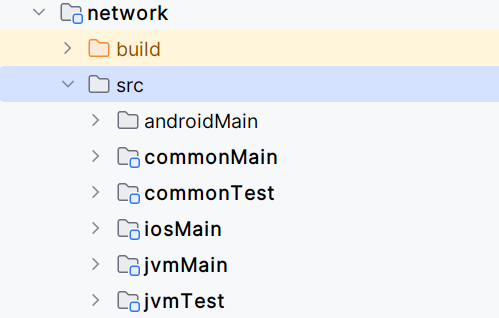

# Beschreibung des SDK Repository Inhalts

Dieses Dokument beschreibt die Inhalte des zeta-sdk repositories.

Es enthält neben dem eigentlichen SDK, d.h. der Kernfunktionalität des ZETA-Clients, auch verschiedene Test-Clients,
im Sinne eines Monorepos.

[[_TOC_]]

## Verzeichnisse

Die folgenden Verzeichnisse sind in dem Repository vorhanden:

### Fachliche Verzeichnisse

Kern-Verzeichnisse

| Verzeichnis         | Beschreibung                       |
|---------------------|------------------------------------|
| zeta-sdk            | Core SDK Modul                     |
| zeta-client         | Code für die Test-Clients          |
| zeta-testdriver     | Code für den Proxy-Client          |
| docs                | weitere Code-nahe Dokumentation    |

Hier sind die verschiedenen Module abgelegt.

| Verzeichnis         | Beschreibung                                                        |
|---------------------|---------------------------------------------------------------------|
| common              | Gemeinsam genutzter Code - Plattform Logging und Modulkonfiguration |
| authentication      | Authentication Modul                                                |
| client-registration | Modul für die Client-Registrierung                                  |
| configuration       | Laufzeit-Configuration API                                          |
| flow-controller     | Core SDK controller logic                                           |
| network             | Netzwerk-Modul (z.B. HttpClient)                                    |
| storage             | Speichermodul                                                       |

### Technische Verzeichnisse

| Verzeichnis    | Beschreibung                                   |
|----------------|------------------------------------------------|
| build-logic    | Gradle/Kotlin Code um die Komponenten zu bauen |
| gradle         | Gradle Installation                            |

### Strukture der Module

In den verschiedenen Modulen sind, abhängig von den jeweiligen Gegebenheiten,
plattformspezifische Unterverzeichnisse vorhanden.

Hier ein Beispiel für das Netzwerk-Modul:

Die verschiedenen Verzeichnisse beinhalten gemeinsamen Code - mindestens die API des Moduls,
sowie die ggf. plattformspezifischen Implementierungen der Module.

| Verzeichnis | Beschreibung                                    |
|-------------|-------------------------------------------------|
| common      | gemeinsame API                                  |
| jvm         | Code spezifisch für JVM-Implementierung         |
| android     | Code spezifisch für die Android-Implementierung |
| ios         | Code spezifisch für die iOS-Implementierung     |

## Module

### zeta-sdk

Das ZETA SDK Modul enthält die API, die das ZETA SDK an den eigentlichen Client exportiert.

### network

Das network Modul enthält den plattformspezifisch gekapselten HttpClient code,
der im Rest des ZETA SDKs verwendet wird.

### Konfiguration

Die Konfigurationen sind im package com.ey.zeta.network.http.client.config zu finden.

## Build

