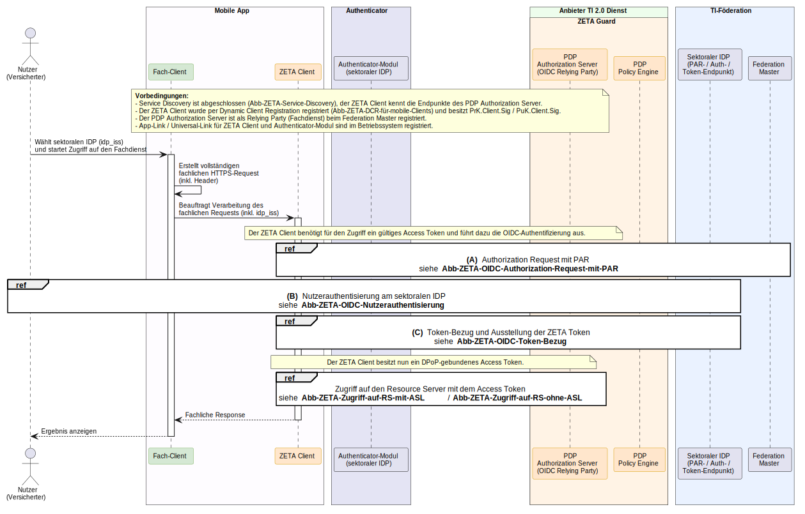
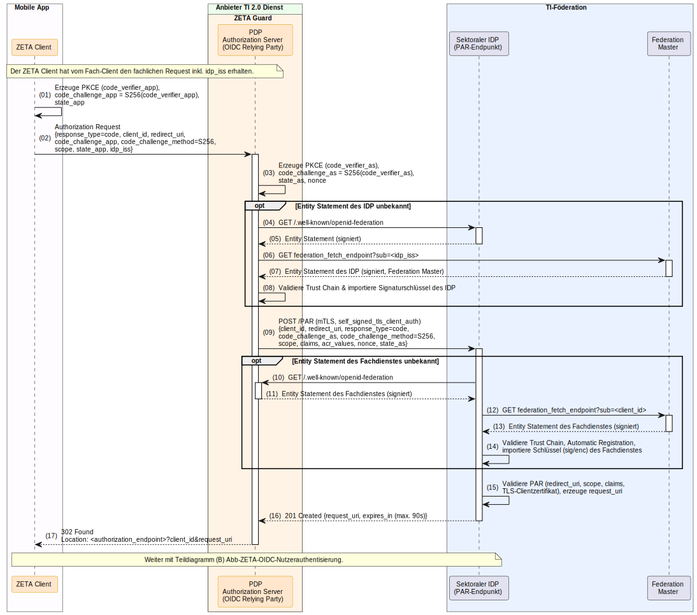
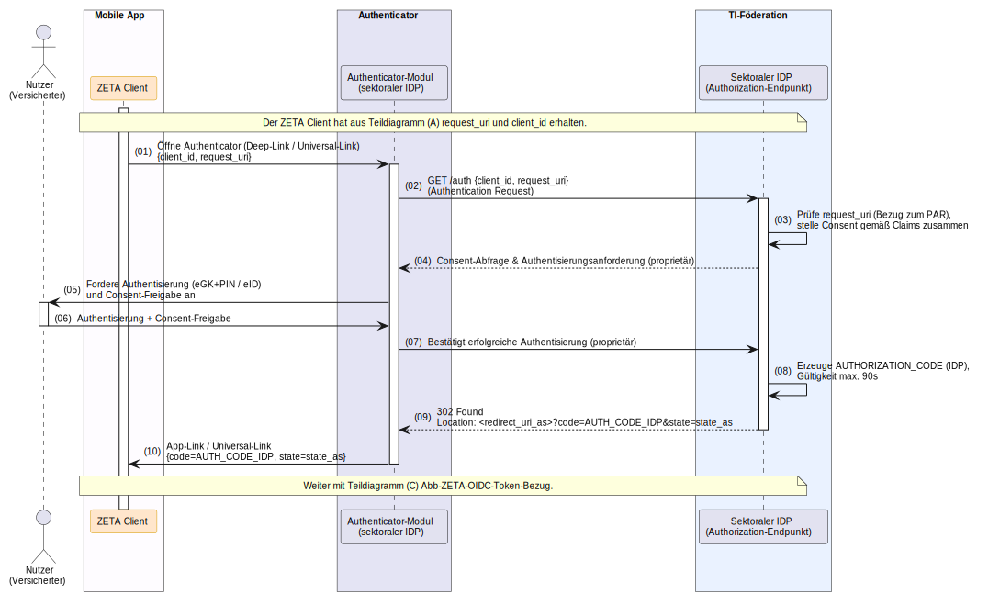
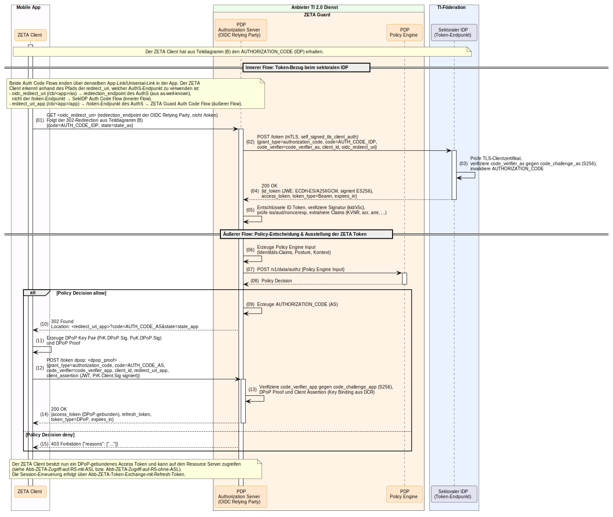

# Authentifizierung mobiler Clients (OIDC Authorization Code Flow mit PAR und PKCE)

> Dieser Abschnitt ist im Stil von [docs/api/v1/index.md](./index.md) verfasst und kann dort als
> eigenes Kapitel (z. B. als Kapitel "Authentifizierung mobiler Clients") übernommen werden. Er
> beschreibt die API-Interaktion eines mobilen ZETA Clients (Android / iOS) mit dem ZETA Guard und
> dem sektoralen IDP der TI-Föderation.

## Einführung

Mobile ZETA Clients authentisieren den Nutzer nicht über ein SM(C)-B-signiertes Subject Token,
sondern interaktiv über einen sektoralen Identity Provider (IDP) der TI-Föderation. Hierzu wird ein
OpenID Connect (OIDC) **Authorization Code Flow** mit **Pushed Authorization Request** (PAR,
RFC 9126) und **Proof Key for Code Exchange** (PKCE, RFC 7636) ausgeführt.

### Rollen von Fach-Client und ZETA Client

Auf dem mobilen Endgerät wirken zwei Komponenten zusammen:

- Der **Fach-Client** enthält die fachliche Logik für die Arbeit mit dem Resource Server. Er wählt
  bzw. lässt den Nutzer den zuständigen sektoralen IDP wählen (`idp_iss`), erstellt den vollständigen
  fachlichen HTTPS-Request inklusive aller Header und übergibt ihn an den ZETA Client.
- Der **ZETA Client** kümmert sich um Client-Registrierung, Session-, Schlüssel- und
  Token-Verwaltung sowie die Authentifizierung. Er verarbeitet den Request, beschafft bei Bedarf ein
  gültiges Access Token und gibt die Response an den Fach-Client zurück.

Diese Aufgabenteilung entspricht dem Zusammenspiel von Fach-Client und ZETA Client beim Zugriff auf
den Resource Server (siehe [Kapitel 7](./index.md#7-zugriff-auf-den-resource-server)).

### Rolle des PDP Authorization Server

Der **PDP Authorization Server** des ZETA Guard übernimmt zwei Rollen:

- Gegenüber dem mobilen ZETA Client agiert er als der für den Fachdienst zuständige
  **Authorization Server** (äußerer Flow, `code_challenge_app`).
- Gegenüber dem sektoralen IDP agiert er als **OpenID-Connect-Relying-Party** (Fachdienst, innerer
  Flow, `code_challenge_as`). Die Client-Authentifizierung am IDP erfolgt per mTLS
  (`self_signed_tls_client_auth`), die Vertrauensbeziehung über OpenID Federation 1.0.

Das vom PDP Authorization Server ausgestellte Access Token ist über **DPoP** an die Sitzung gebunden.

**Voraussetzungen:**

1. **Service Discovery abgeschlossen**: Der Client kennt die Endpunkte des PDP Authorization Server
   (`authorization_endpoint`, `token_endpoint`) — siehe [Kapitel 3](./index.md#3-discovery-und-konfiguration).
2. **Dynamic Client Registration abgeschlossen**: Der Client besitzt eine `client_id` sowie das
   Schlüsselpaar `PrK.Client.Sig` / `PuK.Client.Sig`.
3. **App-Link / Universal-Link** für ZETA Client und Authenticator-Modul sind im Betriebssystem
   registriert.
4. **Sektoraler IDP** wird vom Fach-Client ausgewählt und als `idp_iss` an den ZETA Client übergeben.

## Übersicht

Der Ablauf besteht aus einem äußeren Authorization-Code-Flow (ZETA Client ↔ PDP Authorization
Server) und einem inneren Authorization-Code-Flow (PDP Authorization Server ↔ sektoraler IDP) und ist
in drei Teilabläufe **(A)**, **(B)** und **(C)** zerlegt:

- **(A) Authorization Request mit PAR**: Der ZETA Client startet den Authorization Request; der PDP
  Authorization Server stellt einen Pushed Authorization Request (PAR) am IDP und erhält eine
  `request_uri`.
- **(B) Nutzerauthentisierung**: Der ZETA Client öffnet das Authenticator-Modul; der Nutzer
  authentisiert sich (eGK+PIN / eID) und gibt den Consent frei; der IDP stellt einen
  `AUTHORIZATION_CODE (IDP)` aus.
- **(C) Token-Bezug und Ausstellung der ZETA Token**: Der PDP Authorization Server löst den Code am
  IDP ein, entscheidet über die Policy Engine und stellt dem ZETA Client ein DPoP-gebundenes Access
  Token und ein Refresh Token aus.



### Teilablauf (A): Authorization Request mit PAR



### Teilablauf (B): Nutzerauthentisierung



### Teilablauf (C): Token-Bezug und Ausstellung der ZETA Token



## Endpunkt-Spezifikationen

> Hinweis: Die Endpunkte `authorization_endpoint` und `token_endpoint` des PDP Authorization Server
> werden über die Authorization Server Metadaten ermittelt
> (siehe [as-well-known.yaml](../../../src/schemas/as-well-known.yaml)).

### 1. Authorization Request (ZETA Client → PDP Authorization Server) — Teilablauf (A)

Startet den äußeren Authorization Code Flow. Der Client übergibt seine PKCE `code_challenge_app`
sowie den vom Fach-Client gewählten sektoralen IDP (`idp_iss`).

**Anfrage-Beispiel:**
*Request-Schema: Keines (Query-Parameter)*

```http
GET /authorize?response_type=code&client_id=zeta-mobile-client-123&redirect_uri=https%3A%2F%2Fapp.example.com%2Fcallback&scope=openid%20urn%3Atelematik%3Aversicherter%20urn%3Atelematik%3Adisplay_name&code_challenge=E9Melhoa2OwvFrEMTJguCHaoeK1t8URWbuGJSstw-cM&code_challenge_method=S256&state=af0ifjsldkj&idp_iss=https%3A%2F%2Fidp.krankenkasse.example HTTP/1.1
Host: pdp.example.com
Accept: application/json
```

**Antwort-Beispiel (302 Found):**

```http
HTTP/1.1 302 Found
Location: https://idp.krankenkasse.example/auth?client_id=fachdienst-rp-001&request_uri=urn%3Aietf%3Aparams%3Aoauth%3Arequest_uri%3A6esc_11ACC5bwc014ltc14eY22c
```

### 2. Pushed Authorization Request – PAR (PDP Authorization Server → sektoraler IDP) — Teilablauf (A)

Der PDP Authorization Server (als Relying Party) stellt den PAR am sektoralen IDP. Die
Authentifizierung erfolgt per mTLS (`self_signed_tls_client_auth`).

**Anfrage-Beispiel:**

```http
POST /PAR HTTP/1.1
Host: idp.krankenkasse.example
Content-Type: application/x-www-form-urlencoded

response_type=code
&client_id=fachdienst-rp-001
&redirect_uri=https%3A%2F%2Fpdp.example.com%2Foidc%2Fcallback
&code_challenge=Qn3Kywp0OiU4NK_AFzGPlmrcYJDJ13Abj_jdL08Etyo
&code_challenge_method=S256
&scope=openid%20urn%3Atelematik%3Aversicherter
&acr_values=gematik-ehealth-loa-high
&nonce=8f9a1c2b3d4e5f60
&state=72b4c1de
```

**Antwort-Beispiel (201 Created):**

```http
HTTP/1.1 201 Created
Content-Type: application/json

{
  "request_uri": "urn:ietf:params:oauth:request_uri:6esc_11ACC5bwc014ltc14eY22c",
  "expires_in": 90
}
```

### 3. Token Request am sektoralen IDP (PDP Authorization Server → sektoraler IDP) — Teilablauf (C)

Der PDP Authorization Server löst den `AUTHORIZATION_CODE (IDP)` am Token-Endpunkt des IDP ein
(per mTLS) und erhält ein verschlüsseltes, signiertes ID Token.

**Anfrage-Beispiel:**

```http
POST /token HTTP/1.1
Host: idp.krankenkasse.example
Content-Type: application/x-www-form-urlencoded

grant_type=authorization_code
&code=SplxlOBeZQQYbYS6WxSbIA
&code_verifier=dBjftJeZ4CVP-mB92K27uhbUJU1p1r_wW1gFWFOEjXk
&client_id=fachdienst-rp-001
&redirect_uri=https%3A%2F%2Fpdp.example.com%2Foidc%2Fcallback
```

**Antwort-Beispiel (200 OK):**

```http
HTTP/1.1 200 OK
Content-Type: application/json

{
  "id_token": "eyJhbGciOiJFQ0RILUVTIiwiZW5jIjoiQTI1NkdDTSIsImN0eSI6IkpXVCJ9...",
  "access_token": "eyJhbGciOiJFUzI1NiIsInR5cCI6ImF0K2p3dCJ9...",
  "token_type": "Bearer",
  "expires_in": 300
}
```

> Das `id_token` ist als JWE (ECDH-ES / A256GCM) verschlüsselt und im Inneren mit ES256 signiert.
> Der PDP Authorization Server entschlüsselt es, verifiziert die Signatur und prüft `iss`, `aud`,
> `nonce` und `exp`.

### 4. Token Request am PDP Authorization Server (ZETA Client → PDP Authorization Server) — Teilablauf (C)

Nach erfolgreicher Policy-Entscheidung löst der ZETA Client den `AUTHORIZATION_CODE (AS)` des
äußeren Flows ein. Der Request enthält den DPoP-Proof im `DPoP`-Header sowie eine mit
`PrK.Client.Sig` signierte `client_assertion`.

**Anfrage-Beispiel:**

```http
POST /token HTTP/1.1
Host: pdp.example.com
Content-Type: application/x-www-form-urlencoded
DPoP: eyJ0eXAiOiJkcG9wK2p3dCIsImFsZyI6IkVTMjU2IiwiandrIjp7Li4ufX0...

grant_type=authorization_code
&code=eyJ0eXAiOiJjb2RlIn0.AS-authorization-code
&code_verifier=dBjftJeZ4CVP-mB92K27uhbUJU1p1r_wW1gFWFOEjXk
&client_id=zeta-mobile-client-123
&redirect_uri=https%3A%2F%2Fapp.example.com%2Fcallback
&client_assertion_type=urn%3Aietf%3Aparams%3Aoauth%3Aclient-assertion-type%3Ajwt-bearer
&client_assertion=eyJhbGciOiJFUzI1NiIsInR5cCI6IkpXVCJ9...
```

**Antwort-Beispiel (200 OK):**
*Response-Schema: [access-token.yaml](../../../src/schemas/access-token.yaml), [dpop-token.yaml](../../../src/schemas/dpop-token.yaml)*

```http
HTTP/1.1 200 OK
Content-Type: application/json
Cache-Control: no-store

{
  "access_token": "eyJhbGciOiJFUzI1NiIsInR5cCI6ImF0K2p3dCJ9...",
  "token_type": "DPoP",
  "expires_in": 300,
  "refresh_token": "eyJhbGciOiJFUzI1NiIsInR5cCI6InJ0K2p3dCJ9..."
}
```

**Fehler-Antwort (403 Forbidden):**
*Response-Schema: [zeta-error.yaml](../../../src/schemas/zeta-error.yaml)*

```http
HTTP/1.1 403 Forbidden
Content-Type: application/json

{
  "error": "access_denied",
  "error_description": "Policy decision denied access.",
  "reasons": ["acr below required level"]
}
```

## Verwendete Token und Schlüssel

| Artefakt                        | Erzeugt von              | Zweck                                                            |
| ------------------------------- | ------------------------ | ---------------------------------------------------------------- |
| `code_verifier_app` (PKCE)      | ZETA Client              | Schutz des äußeren Authorization Code Flow                       |
| `code_verifier_as` (PKCE)       | PDP Authorization Server | Schutz des inneren Authorization Code Flow (gegen IDP)           |
| `AUTHORIZATION_CODE (IDP)`      | Sektoraler IDP           | Einmal-Code zum Bezug des ID Token (Gültigkeit max. 90 s)        |
| `AUTHORIZATION_CODE (AS)`       | PDP Authorization Server | Einmal-Code zum Bezug des ZETA Access Token                      |
| `id_token` (JWE/JWS)            | Sektoraler IDP           | Nutzer-Identität (verschlüsselt ECDH-ES/A256GCM, signiert ES256) |
| `PrK.DPoP.Sig` / `PuK.DPoP.Sig` | ZETA Client              | DPoP-Bindung des Access Token an die Sitzung                     |
| `PrK.Client.Sig`                | ZETA Client (aus DCR)    | Signatur der `client_assertion`                                  |
| `access_token` (DPoP)           | PDP Authorization Server | DPoP-gebundener Zugriff auf den Resource Server                  |
| `refresh_token`                 | PDP Authorization Server | Session-Erneuerung                                               |

## Empfehlungen für eine gute User Experience

Die folgenden Empfehlungen betreffen das Zusammenspiel von Fach-Client, ZETA Client und
Authenticator-Modul in der mobilen App. Sie sind nicht normativ.

- **Ein einziger Einstiegspunkt**: Der Nutzer interagiert ausschließlich mit dem Fach-Client. Der
  ZETA Client sollte als Bibliothek ohne eigene sichtbare Oberfläche eingebunden sein, damit der
  Wechsel zwischen den Komponenten unsichtbar bleibt.
- **IDP-Vorauswahl**: Die zuletzt gewählte Krankenkasse (`idp_iss`) sollte gespeichert und
  vorausgewählt werden, sodass die Auswahl nur einmalig bzw. bei Änderung notwendig ist.
- **Sichere App-Sprünge**: Für den Wechsel zum Authenticator-Modul und zurück ausschließlich
  **Universal Links (iOS)** bzw. **App Links (Android)** verwenden (keine Custom-URL-Schemes), um
  App-Hijacking zu verhindern und einen verlässlichen Rücksprung zu garantieren.
- **Fehlendes Authenticator-Modul**: Ist das Authenticator-Modul nicht installiert, sollte der
  Fach-Client dies erkennen und den Nutzer mit einer verständlichen Meldung sowie einem direkten Link
  zum App-Store führen.
- **Zustandserhalt**: Der Rücksprung aus dem Authenticator soll den Nutzer über `state` exakt an die
  Stelle im Fach-Client zurückführen, an der er den Vorgang gestartet hat.
- **Transparente Wartezeiten**: Während der ZETA Client im Hintergrund arbeitet (PAR, Token-Bezug,
  Policy-Entscheidung), einen nicht-blockierenden Fortschrittshinweis anzeigen (z. B. "Sie werden
  sicher angemeldet …").
- **Kurze Gültigkeiten beachten**: `request_uri` und `AUTHORIZATION_CODE` sind nur max. 90 s gültig.
  Die Nutzerführung sollte zügig sein; bei Ablauf transparent und automatisch neu starten.
- **Verständliche Fehlerbehandlung**: Abbruch/Consent-Verweigerung im Authenticator sauber
  zurücksetzen und einen erneuten Versuch anbieten. Eine `403 Forbidden` mit einer fachlich
  verständlichen Begründung (aus `reasons`) übersetzen, statt rohe Fehlercodes anzuzeigen.
- **Stille Session-Erneuerung**: Access- und Refresh-Token sicher (Keystore/Secure Enclave) verwalten
  und die Session über den Refresh-Token-Flow erneuern, damit die interaktive Authentisierung über
  den Authenticator nur dann erforderlich ist, wenn sie unvermeidbar ist.
- **Barrierefreiheit und Vertrauen**: Hinweise zum App-Wechsel barrierefrei gestalten und den Nutzer
  vor dem ersten Sprung darüber informieren, dass die Anmeldung bei seiner Krankenkasse erfolgt.
